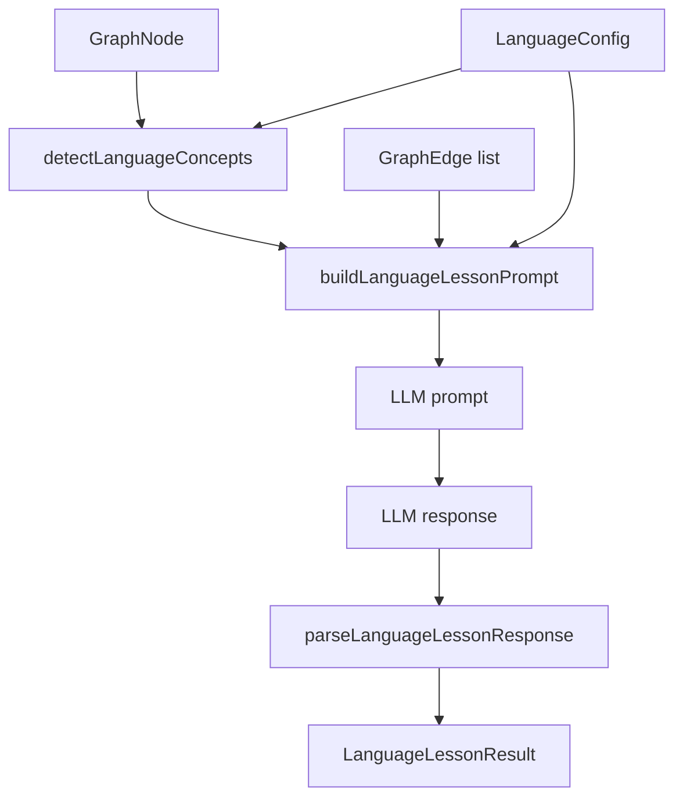
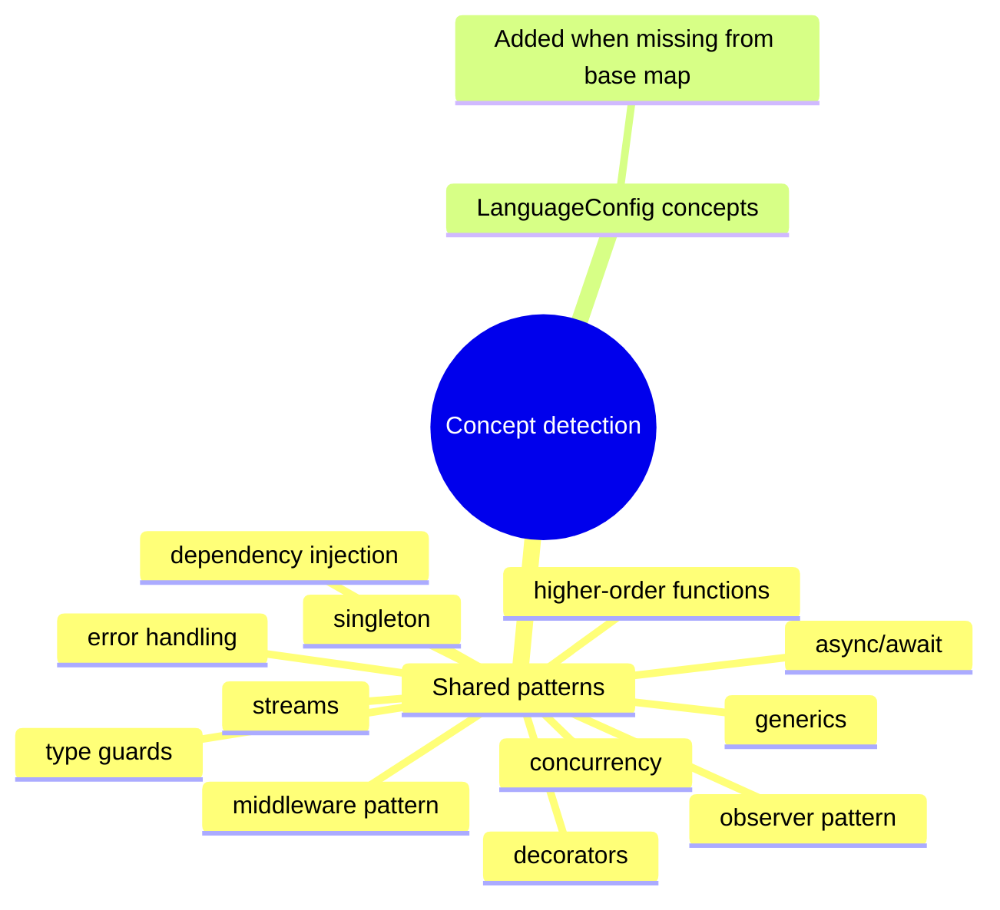
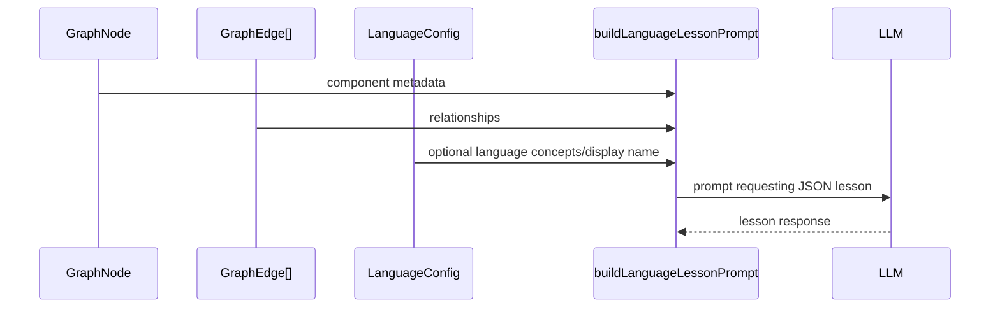
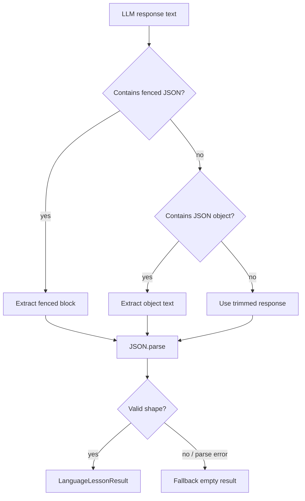
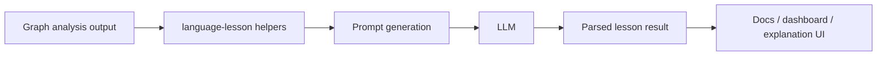
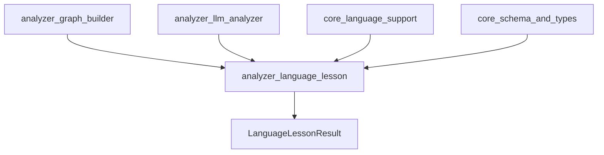

# analyzer_language_lesson

The `analyzer_language_lesson` module generates language-focused teaching material for a code component. It inspects a graph node, its relationships, and optional language metadata to produce a concise lesson summary plus a list of concepts that should be explained to the reader.

This module is intentionally small, but it sits at an important point in the analysis pipeline: it turns structural code analysis into educational output that can be shown in documentation, dashboards, or guided explanations.

## Purpose

`language-lesson.ts` provides helpers to:

- detect language-specific concepts from a node’s text and metadata
- build an LLM prompt for generating a lesson
- parse the LLM response into a safe, structured result
- normalize language display names for user-facing output

## Core API

### `LanguageLessonResult`

```ts
export interface LanguageLessonResult {
  languageNotes: string;
  concepts: Array<{ name: string; explanation: string }>;
}
```

This is the output shape returned after parsing an LLM response. It contains:

- `languageNotes`: a short narrative about language-specific patterns in the component
- `concepts`: a list of concept/explanation pairs for beginner-friendly teaching

## Dependencies and inputs

The module depends on core graph types and language configuration:

- [`GraphNode`](core_schema_and_types.md) — the component being analyzed
- [`GraphEdge`](core_schema_and_types.md) — relationships used to contextualize the lesson prompt
- `LanguageConfig` — optional language metadata, including display name and concept list

> See also: [`core_schema_and_types`](core_schema_and_types.md) and [`core_language_support`](core_language_support.md)

## Architecture

The module is organized around a simple pipeline:

1. detect concepts from node text and language config
2. build a prompt that asks an LLM for a lesson
3. parse the response into a stable result object



## Component relationships

### 1) Concept detection

`detectLanguageConcepts(node, language, langConfig?)` scans:

- `node.tags`
- `node.summary`
- `node.languageNotes`

It compares the combined text against a base concept dictionary and any concepts declared in `LanguageConfig`.

#### Base concept patterns

The module ships with a shared set of cross-language concepts such as:

- async/await
- middleware pattern
- generics
- decorators
- dependency injection
- observer pattern
- singleton
- type guards
- higher-order functions
- error handling
- streams
- concurrency

These are broad patterns that can appear in many languages. If `LanguageConfig.concepts` includes additional concepts, they are added to the detection map automatically.



### 2) Language display name resolution

`getLanguageDisplayName(language, langConfig?)` determines the label used in prompts and explanations.

Priority:

1. `langConfig.displayName`
2. capitalized raw language string

This keeps prompts readable even when no language metadata is available.

### 3) Prompt generation

`buildLanguageLessonPrompt(node, edges, language, langConfig?)` creates a strict instruction prompt for an LLM.

The prompt includes:

- component name, type, file path, summary, and tags
- relationship lines derived from `GraphEdge[]`
- detected concepts, if any
- a JSON-only response contract

#### Relationship formatting

Each edge is rendered as a compact line:

- `-> type target` for forward edges
- `<- type source` for backward edges

This gives the LLM enough context to explain how the component fits into the surrounding graph.



### 4) Response parsing

`parseLanguageLessonResponse(response)` extracts JSON from an LLM response and converts it into a safe `LanguageLessonResult`.

It is defensive in two ways:

- accepts raw JSON or JSON wrapped in markdown fences
- returns an empty fallback result if parsing fails

#### Parsing behavior

- `languageNotes` must be a string, otherwise it becomes `""`
- `concepts` must be an array of objects with string `name` and `explanation`
- invalid entries are filtered out
- malformed responses do not throw; they return `{ languageNotes: "", concepts: [] }`



## Data flow

The typical runtime flow is:

1. a graph node is selected for explanation
2. related edges are gathered
3. language metadata is optionally loaded
4. concept detection identifies likely teaching topics
5. a prompt is built and sent to an LLM
6. the response is parsed into `LanguageLessonResult`
7. the result is rendered in documentation or UI



## How this module fits into the system

`analyzer_language_lesson` is part of the broader analysis layer in `core_analysis`. It complements structural analyzers by translating graph data into educational language.

It does not build the graph itself, nor does it perform language extraction. Instead, it consumes outputs from other modules:

- graph construction from [`analyzer_graph_builder`](analyzer_graph_builder.md)
- language metadata from [`core_language_support`](core_language_support.md)
- graph schema from [`core_schema_and_types`](core_schema_and_types.md)
- LLM-backed analysis patterns from [`analyzer_llm_analyzer`](analyzer_llm_analyzer.md)

### Relationship to neighboring analyzers



## Implementation notes

### Why concept detection exists before the LLM call

Pre-detecting concepts helps the prompt in two ways:

- it nudges the model toward relevant topics
- it provides a fallback list of likely concepts even when the model is uncertain

### Why parsing is strict

The parser only accepts the fields needed by the UI and downstream consumers. This prevents malformed or overly verbose model output from leaking into the application.

### Why the module uses simple keyword matching

The detection logic is intentionally lightweight:

- fast to run
- easy to extend
- language-agnostic by default
- compatible with custom language concept lists

This is not a semantic classifier; it is a prompt-shaping and hinting mechanism.

## Extensibility

To support a new language or framework:

1. add concepts to `LanguageConfig.concepts`
2. optionally provide `LanguageConfig.displayName`
3. ensure node summaries/tags include relevant terminology
4. keep the LLM prompt JSON contract unchanged

Because `buildConceptPatterns()` merges custom concepts into the base map, new language-specific topics can be introduced without changing the module code.

## Error handling and resilience

The module is designed to fail safely:

- missing language config is allowed
- missing detected concepts is allowed
- malformed LLM output returns an empty result instead of throwing
- unknown fields in the response are ignored

This makes the module suitable for production use where LLM output may vary.

## Related documentation

- [`core_schema_and_types`](core_schema_and_types.md) — shared graph and analysis types
- [`core_language_support`](core_language_support.md) — language registries and extractors
- [`analyzer_llm_analyzer`](analyzer_llm_analyzer.md) — LLM-backed analysis pipeline
- [`analyzer_graph_builder`](analyzer_graph_builder.md) — graph construction and metadata generation

## Summary

`analyzer_language_lesson` is the bridge between structural code analysis and educational explanation. It identifies likely language concepts, asks an LLM to explain them in context, and safely parses the result into a compact lesson object that can be consumed by the rest of the system.
