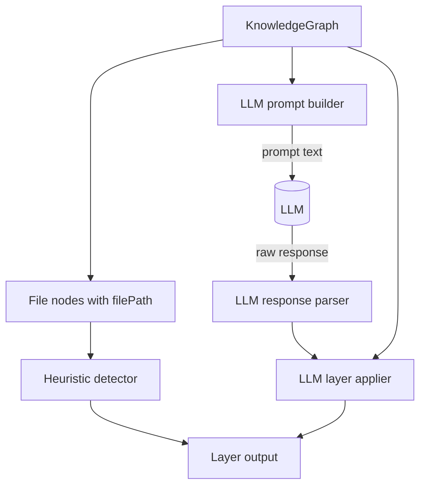
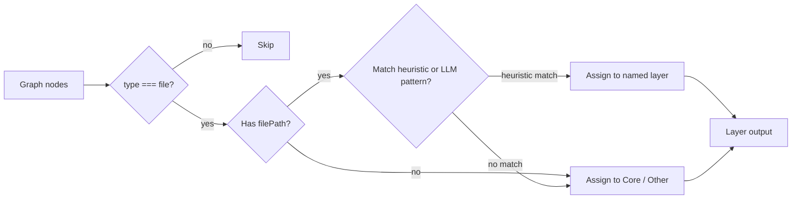
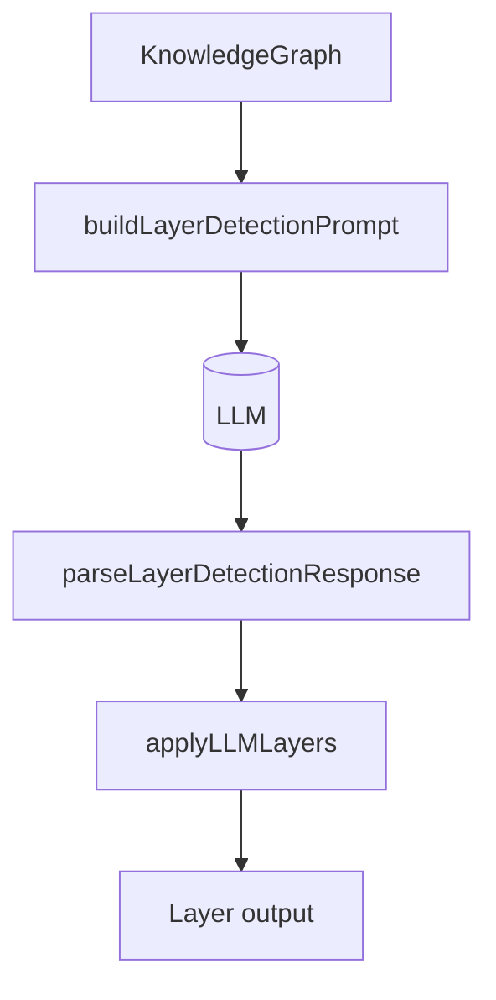
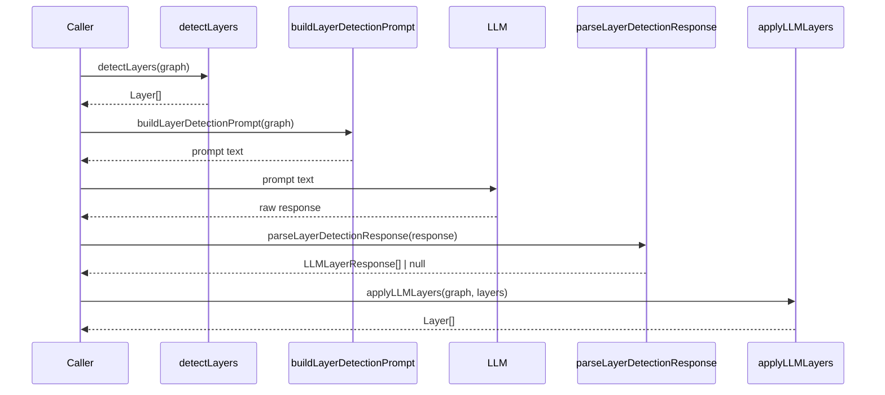
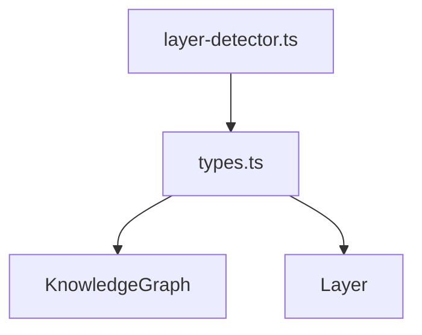

# analyzer_layer_detector

The `analyzer_layer_detector` module groups files in a `KnowledgeGraph` into architectural layers. It provides two complementary strategies:

1. **Heuristic layer detection** based on file-path keywords and directory names.
2. **LLM-assisted layer detection** based on model-generated layer definitions and file-pattern mappings.

This module is used by the analysis pipeline to turn a flat set of file nodes into a higher-level architectural view that can be rendered in the dashboard and consumed by downstream analysis steps.

---

## Purpose

Layer detection helps answer a simple but important question: *what role does each file play in the system architecture?*

Instead of treating all files equally, the module assigns file nodes to logical groups such as:

- API Layer
- Service Layer
- Data Layer
- UI Layer
- Middleware Layer
- External Services
- Background Tasks
- Utility Layer
- Test Layer
- Configuration Layer
- Core / Other

These layers are represented using the shared `Layer` type from [`core_schema_and_types`](core_schema_and_types.md), and they are attached to the `KnowledgeGraph` defined in the same module family.

---

## Core types

### `LLMLayerResponse`

Defined in `layer-detector.ts`, this interface describes the shape of a layer returned by an LLM:

- `name`: short layer name
- `description`: one-sentence responsibility summary
- `filePatterns`: path prefixes or path fragments used to assign files to the layer

This type is intentionally minimal so the parser can normalize imperfect model output into a predictable structure.

### Related shared types

- [`KnowledgeGraph`](core_schema_and_types.md) — the graph being analyzed
- [`Layer`](core_schema_and_types.md) — the output structure used to store layer assignments

---

## Module architecture



The module exposes a small set of functions that can be used independently or as part of a larger analysis workflow.

---

## Components and responsibilities

### 1. Heuristic layer detection

#### `detectLayers(graph: KnowledgeGraph): Layer[]`

This is the default, deterministic layer classifier.

It scans all nodes in the graph and assigns **file-type nodes** to layers based on directory and path-segment keywords.

#### Behavior

- Only nodes with `type === "file"` are considered.
- Files with a `filePath` are matched against a fixed ordered list of patterns.
- Files without a matching pattern are assigned to `Core`.
- File nodes missing `filePath` are also assigned to `Core`.
- The result is a list of `Layer` objects, each containing the layer name, description, and node IDs.

#### Matching strategy

The module uses `LAYER_PATTERNS`, an ordered list of keyword groups. The first match wins.

Examples:

- `routes`, `controller`, `handler`, `endpoint`, `api` → `API Layer`
- `service`, `usecase`, `business` → `Service Layer`
- `model`, `entity`, `schema`, `database`, `repository` → `Data Layer`
- `component`, `view`, `page`, `screen`, `layout`, `widget`, `ui` → `UI Layer`

#### Notes

- Matching is performed on normalized path segments, not arbitrary substring search.
- Plural forms are handled by checking both `pattern` and `pattern + "s"`.
- The order of `LAYER_PATTERNS` matters because the first match is returned immediately.

---

### 2. LLM prompt generation

#### `buildLayerDetectionPrompt(graph: KnowledgeGraph): string`

This function prepares a prompt for an LLM to infer architectural layers from file paths.

It extracts all file paths from file nodes and asks the model to return a JSON array of 3–7 layers.

#### Prompt contract

Each returned layer must include:

- `name`
- `description`
- `filePatterns`

The prompt also instructs the model that:

- every file must belong to exactly one layer
- patterns should be as specific as possible
- the response must contain only JSON

#### Why this exists

Heuristics are fast and deterministic, but they may miss domain-specific architecture. The prompt builder enables a more flexible, semantic layer discovery workflow.

---

### 3. LLM response parsing

#### `parseLayerDetectionResponse(response: string): LLMLayerResponse[] | null`

This function normalizes raw LLM output into a validated array of `LLMLayerResponse` objects.

#### Supported input forms

- raw JSON array
- JSON wrapped in markdown code fences
- responses containing extra text, as long as a JSON array can be extracted

#### Validation rules

- response must not be empty
- parsed content must be an array
- each item must be an object with a string `name`
- `description` is optional and defaults to `""`
- `filePatterns` must be an array of strings, otherwise it becomes `[]`

#### Failure behavior

Returns `null` if parsing fails or no valid layer entries are found.

This makes the function safe to use in pipelines where LLM output may be malformed or partially structured.

---

### 4. Applying LLM-defined layers

#### `applyLLMLayers(graph: KnowledgeGraph, llmLayers: LLMLayerResponse[]): Layer[]`

This function maps file nodes to the layer definitions returned by an LLM.

#### Matching rules

For each file node:

- if `filePath` is missing, the node is assigned to `Other`
- otherwise, the path is normalized to use `/`
- a file is assigned to the first layer whose pattern matches:
  - `normalizedPath.startsWith(pattern)`
  - or `normalizedPath.includes("/" + pattern)`
- if no layer matches, the file is assigned to `Other`

#### Output behavior

- empty layers are skipped
- layer descriptions come from the LLM response when available
- fallback description is `"Uncategorized files"`
- layer IDs are generated using `toLayerId(name)`

#### Important detail

Unlike the heuristic detector, this function initializes all LLM layers first, then fills them. This preserves the model’s intended layer set even if some layers end up empty, though empty layers are omitted from the final output.

---

## Internal helper logic

### `toLayerId(name: string): string`

Converts a layer name into a stable ID format:

- lowercases the name
- replaces whitespace with hyphens
- prefixes with `layer:`

Example:

- `API Layer` → `layer:api-layer`
- `Background Tasks` → `layer:background-tasks`

### `matchFileToLayer(filePath: string): string | null`

Performs heuristic matching against path segments.

#### Steps

1. Normalize path separators (`\\` → `/`)
2. Lowercase the path
3. Split into segments
4. Compare each segment against each pattern group
5. Return the first matching layer name

If no match is found, returns `null`.

---

## Data flow



For LLM-based analysis, the flow is slightly different:



---

## Process flow comparison



---

## Dependencies and relationships



### Direct dependencies

- [`core_schema_and_types`](core_schema_and_types.md) for `KnowledgeGraph` and `Layer`

### Related analyzer modules

- [`analyzer_graph_builder`](analyzer_graph_builder.md) — builds the graph that layer detection consumes
- [`analyzer_llm_analyzer`](analyzer_llm_analyzer.md) — produces LLM-based file/project analysis that may feed architectural reasoning
- [`analyzer_normalize_graph`](analyzer_normalize_graph.md) — normalizes graph structure before higher-level analysis
- [`analyzer_language_lesson`](analyzer_language_lesson.md) — complementary analysis focused on language-specific insights

---

## How it fits into the system

Layer detection sits in the analysis pipeline after graph construction and normalization.

1. The graph builder creates a `KnowledgeGraph` from source files.
2. Normalization may clean up or simplify graph edges.
3. Layer detection groups file nodes into architectural layers.
4. The dashboard can render these layers as clusters or summaries.


This module is especially useful when the system needs a coarse architectural map rather than a detailed call graph.

---

## Design characteristics

### Deterministic heuristic mode

Pros:
- fast
- predictable
- easy to debug
- no external dependency

Cons:
- limited to naming conventions
- may misclassify domain-specific structures

### LLM-assisted mode

Pros:
- can infer architecture from project-specific naming
- more flexible across codebases
- can produce richer layer semantics

Cons:
- depends on model quality
- requires parsing and validation
- may produce inconsistent patterns

### Shared tradeoff

Both modes ultimately produce the same `Layer[]` shape, which keeps downstream consumers simple.

---

## Edge cases and implementation notes

- Files without `filePath` are not discarded; they are grouped into `Core` or `Other`.
- Heuristic matching is segment-based, so a path like `src/services/payment` matches `service` via the `services` segment.
- LLM pattern matching is prefix-oriented and slightly more permissive than the heuristic matcher.
- Empty LLM layers are omitted from the final result.
- Parsing is intentionally tolerant of markdown fences and extra text.

---

## Example usage

### Heuristic detection

```ts
import { detectLayers } from "./analyzer/layer-detector.js";

const layers = detectLayers(graph);
```

### LLM-assisted detection

```ts
import {
  buildLayerDetectionPrompt,
  parseLayerDetectionResponse,
  applyLLMLayers,
} from "./analyzer/layer-detector.js";

const prompt = buildLayerDetectionPrompt(graph);
const raw = await callModel(prompt);
const parsed = parseLayerDetectionResponse(raw);

if (parsed) {
  const layers = applyLLMLayers(graph, parsed);
}
```

---

## Related documentation

- [`core_schema_and_types`](core_schema_and_types.md)
- [`analyzer_graph_builder`](analyzer_graph_builder.md)
- [`analyzer_llm_analyzer`](analyzer_llm_analyzer.md)
- [`analyzer_normalize_graph`](analyzer_normalize_graph.md)
- [`analyzer_language_lesson`](analyzer_language_lesson.md)

---

## Summary

`analyzer_layer_detector` is the architectural grouping layer of the analysis stack. It converts file nodes in a `KnowledgeGraph` into meaningful `Layer` clusters using either deterministic path heuristics or LLM-generated layer definitions. Its output is a compact, reusable abstraction that supports visualization, summarization, and higher-level reasoning about the codebase structure.
