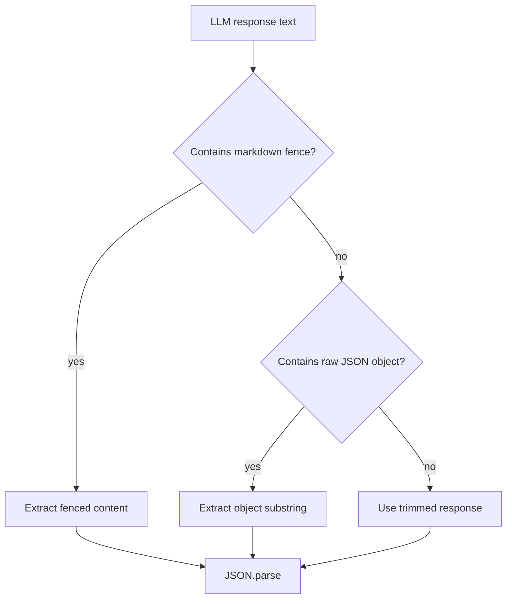
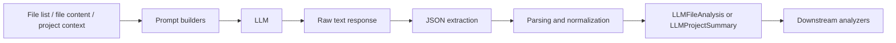
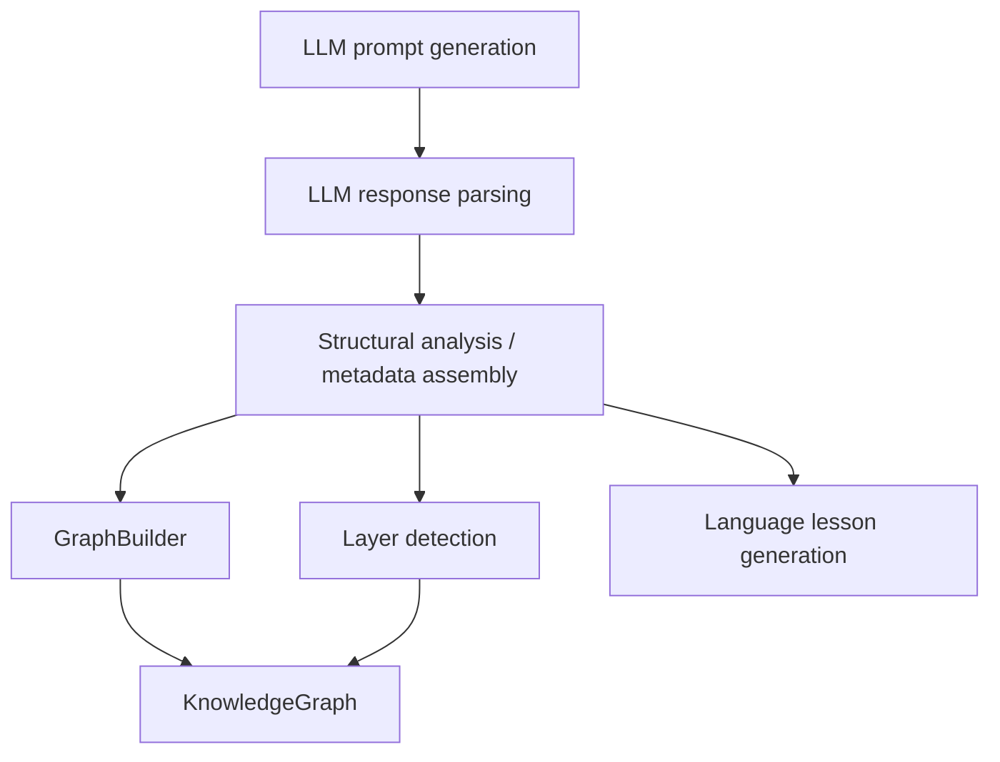
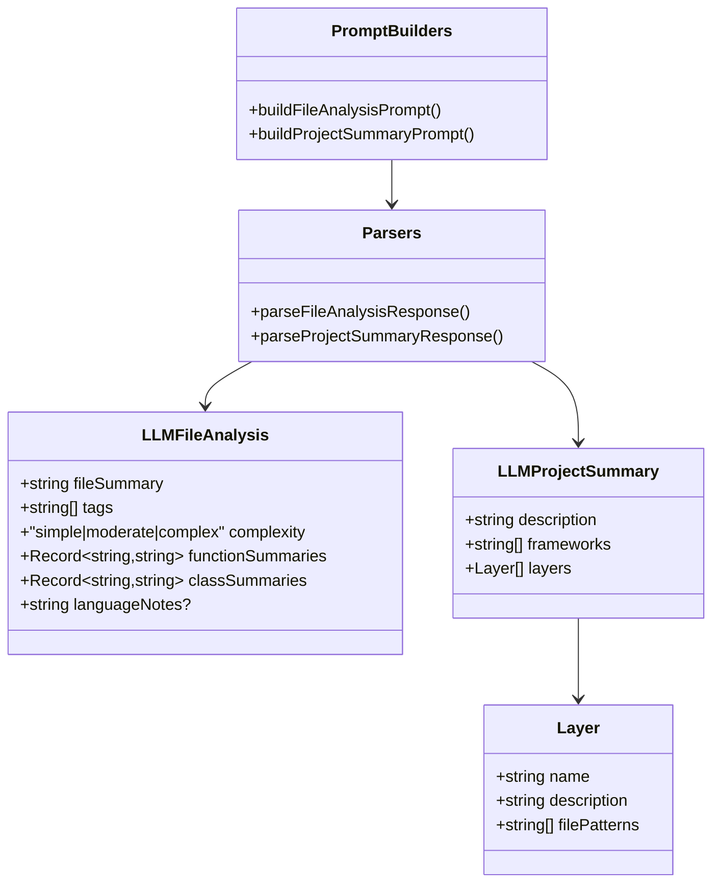
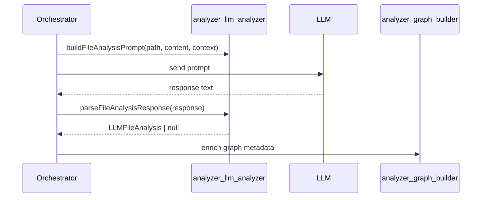

# analyzer_llm_analyzer

The `analyzer_llm_analyzer` module provides the prompt-building and response-parsing layer for LLM-assisted code analysis. It turns project/file inputs into strict JSON-oriented prompts and normalizes LLM output into typed analysis objects that can be consumed by the rest of the analysis pipeline.

This module is intentionally small and focused: it does not inspect source code itself, build graphs, or decide layers. Instead, it acts as the contract boundary between raw LLM text and structured analyzer data.

## Purpose and responsibilities

The module is responsible for:

- generating prompts for file-level analysis
- generating prompts for project-level summaries
- extracting JSON from LLM responses, including fenced markdown responses
- validating and normalizing parsed output into stable TypeScript interfaces
- providing typed shapes for downstream consumers

It is commonly used by higher-level analysis orchestration code that prepares project context, sends prompts to an LLM, and then feeds parsed results into graph construction and project summarization.

## Core types

### `LLMFileAnalysis`
Represents the structured result of analyzing a single source file.

Fields:

- `fileSummary`: short natural-language summary of the file
- `tags`: list of topical or functional tags
- `complexity`: one of `simple`, `moderate`, or `complex`
- `functionSummaries`: map of function name to one-line summary
- `classSummaries`: map of class name to one-line summary
- `languageNotes?`: optional language-specific observations

### `LLMProjectSummary`
Represents the structured result of analyzing a project as a whole.

Fields:

- `description`: concise project description
- `frameworks`: detected frameworks and major libraries
- `layers`: logical layers with names, descriptions, and file patterns

For how project layers are later represented in the knowledge graph, see [analyzer_layer_detector.md](analyzer_layer_detector.md) and [analyzer_graph_builder.md](analyzer_graph_builder.md).

## Public API

### `buildFileAnalysisPrompt(filePath, content, projectContext)`
Builds a prompt instructing the LLM to analyze a single source file and return JSON.

Inputs:

- `filePath`: path of the file being analyzed
- `content`: raw file contents
- `projectContext`: surrounding project context to improve interpretation

Output:

- a prompt string that requests a JSON object with file summary, tags, complexity, function summaries, class summaries, and optional language notes

Design notes:

- the prompt explicitly asks for JSON-only output
- the prompt includes project context to help the model infer role and semantics
- the prompt is generic enough to support multiple languages and file types

### `buildProjectSummaryPrompt(fileList, sampleFiles)`
Builds a prompt for project-wide summarization.

Inputs:

- `fileList`: list of project file paths
- `sampleFiles`: optional representative file samples with path and content

Output:

- a prompt string that requests a JSON object containing project description, frameworks, and logical layers

Design notes:

- file list provides structural coverage
- sample files provide semantic grounding without requiring the entire repository to be embedded
- the prompt asks for layer definitions that can later be mapped into graph or dashboard concepts

### `parseFileAnalysisResponse(response)`
Parses an LLM response into `LLMFileAnalysis`.

Behavior:

- extracts JSON from markdown fences or raw text
- parses the JSON
- validates and normalizes fields
- returns `null` if parsing fails

Normalization rules:

- `complexity` defaults to `moderate` if missing or invalid
- `tags` are filtered to strings only
- `functionSummaries` and `classSummaries` must be objects; otherwise they become empty objects
- `languageNotes` is included only when it is a string

### `parseProjectSummaryResponse(response)`
Parses an LLM response into `LLMProjectSummary`.

Behavior:

- extracts JSON from markdown fences or raw text
- parses the JSON
- validates and normalizes fields
- returns `null` if parsing fails

Normalization rules:

- `description` defaults to an empty string if missing or invalid
- `frameworks` are filtered to strings only
- `layers` are filtered to objects with a string `name`
- each layer’s `description` defaults to an empty string if invalid
- each layer’s `filePatterns` is filtered to strings only

## Internal parsing strategy

The module uses a small helper, `extractJson`, to make LLM output more tolerant of formatting differences.

### JSON extraction flow



This allows the parser to handle responses such as:

- plain JSON
- JSON wrapped in ```json fences
- JSON embedded in a larger markdown response

## Data flow



## Component interaction with the broader analyzer pipeline



### Relationship to graph construction

`LLMFileAnalysis` is especially useful when enriching nodes created by [analyzer_graph_builder.md](analyzer_graph_builder.md):

- `fileSummary` can populate file node summaries
- `tags` can become node metadata
- `complexity` can influence visualization or prioritization
- `functionSummaries` and `classSummaries` can annotate child nodes

The graph builder itself is responsible for turning structural analysis into nodes and edges; this module only supplies the LLM-derived text metadata.

### Relationship to layer detection

`LLMProjectSummary.layers` mirrors the shape of `LLMLayerResponse` from [analyzer_layer_detector.md](analyzer_layer_detector.md). Both represent layer-like concepts, but this module focuses on project summary output while the layer detector is typically used for more specialized layer inference workflows.

### Relationship to language lessons

The optional `languageNotes` field complements [analyzer_language_lesson.md](analyzer_language_lesson.md) by capturing language-specific observations directly from file analysis. The language lesson module is better suited for curated educational output, while this module stores lightweight notes attached to file analysis.

## Architecture overview



## Error handling and resilience

The parsers are intentionally forgiving:

- malformed responses return `null` instead of throwing
- invalid fields are replaced with safe defaults where possible
- unexpected array/object contents are filtered rather than trusted

This design makes the module suitable for production LLM workflows where output can vary in formatting or completeness.

## Implementation characteristics

- **No external side effects**: the module is pure string processing and JSON parsing
- **Deterministic normalization**: the same response always yields the same parsed result
- **Loose input, strict output**: prompts are flexible, parsed objects are normalized
- **LLM-agnostic**: the module does not depend on a specific provider or SDK

## Typical usage pattern



## Related modules

- [analyzer_graph_builder.md](analyzer_graph_builder.md) — builds the knowledge graph from file and structural metadata
- [analyzer_normalize_graph.md](analyzer_normalize_graph.md) — normalizes graph output after construction
- [analyzer_layer_detector.md](analyzer_layer_detector.md) — detects or represents logical layers
- [analyzer_language_lesson.md](analyzer_language_lesson.md) — produces language-focused explanatory output
- [core_schema_and_types.md](core_schema_and_types.md) — shared graph and analysis types

## Summary

`analyzer_llm_analyzer` is the LLM contract layer for analysis workflows. It defines the structured outputs expected from the model, generates prompts that request those outputs, and safely parses responses into typed objects that downstream analyzers can trust.
