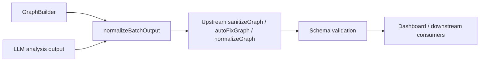
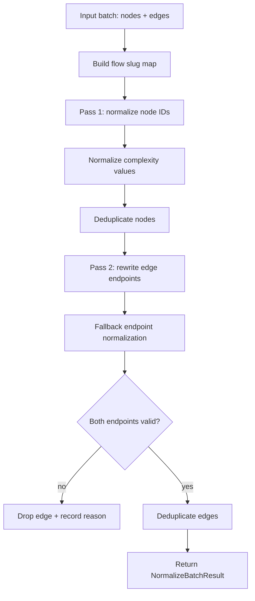
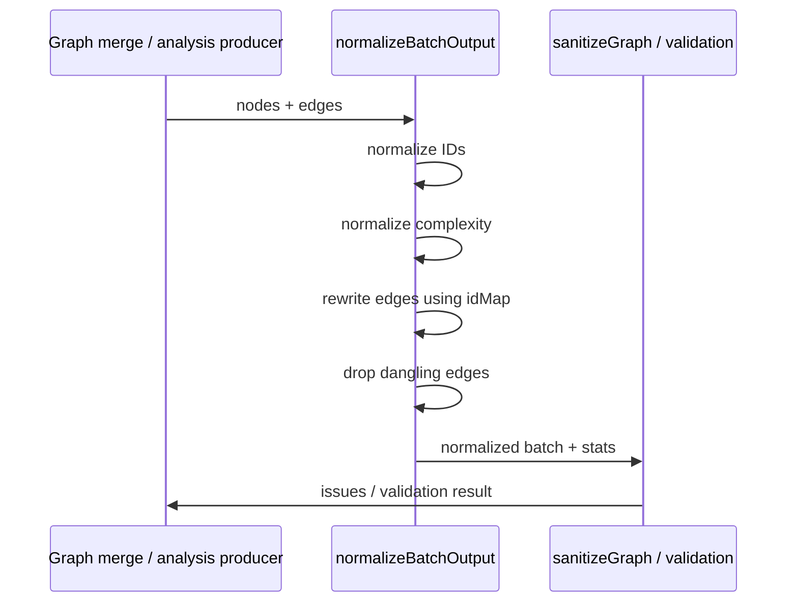
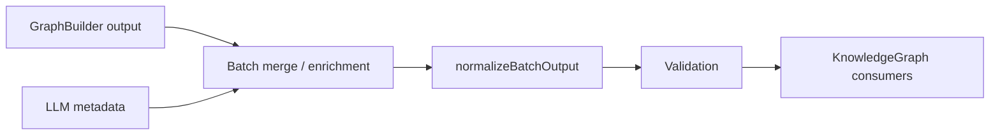

# analyzer_normalize_graph

`analyzer_normalize_graph` is the pre-validation cleanup layer for graph data produced by the analysis pipeline. It repairs malformed node IDs, normalizes complexity values, rewrites edge references after ID fixes, deduplicates nodes and edges, and drops dangling edges that no longer point to valid nodes.

This module is intentionally narrow in scope: it does not build the graph or validate the final schema. Instead, it prepares merged batch output so downstream sanitization and validation can operate on a consistent, canonical graph shape.

## Purpose

The module exists to solve problems that commonly appear in merged analysis output:

- inconsistent node ID prefixes
- double-prefixed or project-prefixed IDs
- bare-path IDs that need canonical reconstruction
- non-canonical complexity values such as `trivial`, `advanced`, or numeric scales
- edge references that still point to old IDs after node normalization
- duplicate edges created during batch merging
- dangling edges whose endpoints no longer exist

## Core exports

### `normalizeNodeId(id, node)`
Normalizes a single node ID into canonical `type:path` form.

Supported behaviors:

- strips invalid leading prefixes until a valid prefix is found
- handles double-prefixed IDs such as `file:file:src/foo.ts`
- handles project-name-prefixed IDs by removing the extra segment
- reconstructs function/class IDs from `filePath` + `name` when needed
- reconstructs step IDs using flow context when available

### `normalizeComplexity(value)`
Normalizes complexity values to one of:

- `simple`
- `moderate`
- `complex`

It accepts:

- canonical strings
- common aliases such as `low`, `easy`, `medium`, `high`, `advanced`
- numeric scales, mapping low numbers to `simple` and higher numbers to `complex`

### `normalizeBatchOutput(data)`
Normalizes a merged batch graph payload:

- fixes node IDs
- normalizes complexity values
- rewrites edge endpoints to match corrected IDs
- deduplicates nodes and edges
- drops edges whose endpoints cannot be resolved
- returns normalization statistics and an old-to-new ID map

## Data model

The module works on a lightweight batch payload:

- `nodes: Record<string, unknown>[]`
- `edges: Record<string, unknown>[]`

It returns a `NormalizeBatchResult` containing:

- normalized `nodes`
- normalized `edges`
- `idMap` from original IDs to normalized IDs
- `stats` describing what was fixed or dropped

### Statistics

`NormalizationStats` tracks:

- `idsFixed`
- `complexityFixed`
- `edgesRewritten`
- `danglingEdgesDropped`
- `droppedEdges`

Each dropped edge is recorded as a `DroppedEdge` with a reason:

- `missing-source`
- `missing-target`
- `missing-both`

## Architecture and relationships

The module sits between graph generation and graph validation.



### How it fits the system

- `graph-builder.ts` creates graph nodes and edges from file and structural analysis.
- `llm-analyzer.ts` contributes summaries, tags, and complexity values that may be merged into graph batches.
- `normalize-graph.ts` cleans the merged batch before the broader graph sanitation pipeline runs.
- `schema.ts` defines validation results and issue reporting used after normalization.
- `types.ts` defines the canonical node and edge shapes that the normalized output is expected to resemble.

For the graph construction side, see [analyzer_graph_builder.md](analyzer_graph_builder.md).
For validation and issue reporting, see [core_schema_and_types.md](core_schema_and_types.md).
For LLM-derived metadata, see [analyzer_llm_analyzer.md](analyzer_llm_analyzer.md).

## Canonical ID normalization

The module recognizes a fixed set of valid prefixes:

- `file`
- `func`
- `class`
- `module`
- `concept`
- `config`
- `document`
- `service`
- `table`
- `endpoint`
- `pipeline`
- `schema`
- `resource`
- `domain`
- `flow`
- `step`

These prefixes are mapped from node types using `TYPE_TO_PREFIX` and `PREFIX_TO_TYPE`.

### ID normalization strategy

`normalizeNodeId` uses a two-stage approach:

1. strip invalid leading segments until a valid prefix is found
2. reconstruct a canonical ID when no valid prefix exists

#### Examples

| Input | Node context | Output |
|---|---|---|
| `project:file:src/a.ts` | `{ type: "file" }` | `file:src/a.ts` |
| `file:file:src/a.ts` | `{ type: "file" }` | `file:src/a.ts` |
| `src/a.ts` | `{ type: "file" }` | `file:src/a.ts` |
| `src/a.ts` | `{ type: "function", filePath: "src/a.ts", name: "run" }` | `func:src/a.ts:run` |
| `Build Step` | `{ type: "step", filePath: "Makefile" }` | `step:Makefile:build-step` |

### Step ID special handling

Step nodes are treated specially because they may collide across flows. When a flow slug is available, the module preserves it in the normalized ID:

```text
step:<flowSlug>:<filePath>:<stepSlug>
```

This prevents collisions when two flows define the same step name in the same file.

## Complexity normalization

`normalizeComplexity` accepts both strings and numbers.

### String aliases

Examples of aliases mapped to canonical values:

- `low`, `easy`, `trivial`, `basic` → `simple`
- `medium`, `intermediate`, `mid`, `average` → `moderate`
- `high`, `hard`, `difficult`, `advanced` → `complex`

### Numeric mapping

Numeric values are interpreted as a rough scale:

- `1` to `3` → `simple`
- `4` to `6` → `moderate`
- `7+` → `complex`

Invalid or missing values default to `moderate`.

## Batch normalization pipeline



### Pass 1: node normalization

The first pass performs two tasks:

- normalize each node ID
- normalize each node's complexity value

It also builds an `idMap` from original IDs to normalized IDs.

### Flow slug lookup for steps

Before node normalization, the module scans:

- nodes of type `flow`
- edges of type `flow_step`

This creates a `stepToFlowSlug` map so bare step IDs can be reconstructed with the correct flow discriminator.

### Deduplicating nodes

After normalization, nodes are deduplicated by ID.

The implementation keeps the last occurrence of each ID, which is useful when later merged data should override earlier entries.

### Pass 2: edge rewriting

Edges are rewritten using the `idMap`.

If an endpoint is still invalid after the direct mapping, the module attempts a fallback normalization based on the endpoint's inferred type.

### Edge deduplication

Edges are deduplicated using a composite key:

```text
source | target | type
```

This prevents duplicate semantic relationships from surviving batch merges.

### Dangling edge handling

If either endpoint cannot be resolved to a valid node ID, the edge is dropped and recorded in `droppedEdges`.

This is important because downstream graph validation expects edges to reference existing nodes.

## Component interaction



## Dependencies

### Internal dependencies

This module depends conceptually on:

- `types.ts` for canonical graph node and edge shapes
- `schema.ts` for downstream validation and issue reporting
- `graph-builder.ts` for the upstream source of many node IDs
- `llm-analyzer.ts` for complexity and summary metadata that may be merged into batches

### External behavior assumptions

The module assumes that:

- node IDs may be malformed before normalization
- edges may still reference pre-normalized IDs
- merged batches may contain duplicates
- downstream validation will reject dangling references

## Relationship to graph building

`GraphBuilder` emits canonical-ish IDs for files, functions, classes, and non-code artifacts, but merged data can still become inconsistent after enrichment or batch combination.



Typical sources of normalization issues include:

- mixed ID conventions across producers
- duplicate prefixes introduced during merging
- step IDs lacking flow context
- complexity values coming from different scoring systems

## Output contract

The normalized result preserves the original payload shape while making it safer for downstream processing.

### `NormalizeBatchResult.nodes`

A deduplicated array of normalized node objects.

### `NormalizeBatchResult.edges`

A deduplicated array of edges whose endpoints both resolve to valid nodes.

### `NormalizeBatchResult.idMap`

A map from original node IDs to normalized node IDs.

This is especially useful when other structures need to be rewritten consistently.

### `NormalizeBatchResult.stats`

A summary of normalization work performed, suitable for logging, telemetry, or validation diagnostics.

## Operational notes

- The module is idempotent for already-canonical IDs and canonical complexity values.
- It is conservative about edge retention: unresolved edges are dropped rather than guessed.
- It is designed to run before broader sanitization so that later stages see cleaner input.
- It does not mutate the original input arrays; it returns new node and edge objects.

## When to use this module

Use `normalizeBatchOutput` when:

- combining multiple analysis batches
- ingesting partially trusted graph data
- reconciling IDs after LLM-assisted enrichment
- preparing graph data for validation or persistence

Do not use it as a substitute for schema validation. It cleans data, but it does not guarantee semantic correctness.

## Related documentation

- [analyzer_graph_builder.md](analyzer_graph_builder.md)
- [analyzer_llm_analyzer.md](analyzer_llm_analyzer.md)
- [core_schema_and_types.md](core_schema_and_types.md)
- [core_change_tracking.md](core_change_tracking.md)
