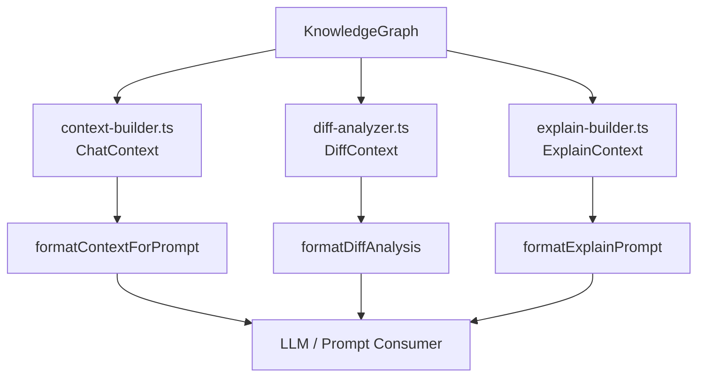
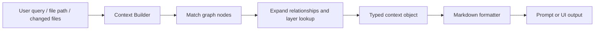
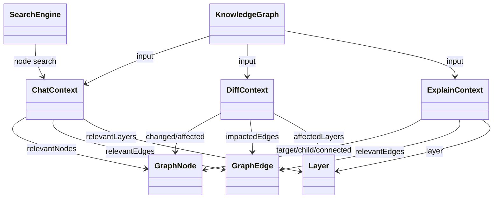

# app_context_builders

## Purpose

The `app_context_builders` module assembles structured, LLM-friendly context objects from a `KnowledgeGraph` for three primary application workflows:

- **Chat assistance**: build a focused context around a user query
- **Diff analysis**: map changed files to graph entities and estimate impact
- **Explain mode**: deep-dive into a specific file or symbol

These builders do not analyze source code directly. Instead, they transform the already-built knowledge graph into task-specific views that downstream prompt formatting and UI layers can consume.

## Architecture Overview

The module is intentionally small and orchestration-focused. Each builder follows the same pattern:

1. Accept a `KnowledgeGraph` plus task-specific input
2. Resolve relevant nodes, edges, and layers
3. Return a typed context object
4. Format that context into readable markdown for LLM consumption

## Data Flow

## Sub-modules

### 1. `context_builder`
Builds a query-centric chat context.

- Documentation: [context_builder.md](context_builder.md)
- Core responsibilities:
  - Search graph nodes using `SearchEngine`
  - Expand to directly connected nodes
  - Collect relevant edges and layers
  - Format the result for chat prompts

### 2. `diff_analyzer`
Builds a change-impact context from a list of modified files.

- Documentation: [diff_analyzer.md](diff_analyzer.md)
- Core responsibilities:
  - Map changed file paths to graph nodes
  - Include contained child nodes for changed containers/files
  - Identify impacted neighbors, edges, and layers
  - Produce a risk-oriented markdown summary

### 3. `explain_builder`
Builds a focused explanation context for a file or symbol.

- Documentation: [explain_builder.md](explain_builder.md)
- Core responsibilities:
  - Resolve a target node by file path or `path:function`
  - Collect child nodes and connected neighbors
  - Identify the owning architectural layer
  - Produce a structured explanation prompt

## Relationship to Other Modules

This module depends on the graph and search primitives defined in the core package:

- `core_schema_and_types` for `KnowledgeGraph`, `GraphNode`, `GraphEdge`, and `Layer`
- `core_search` for `SearchEngine` used by chat context building

For details on those shared types and search behavior, see:

- [shared_graph_and_analysis_types.md](shared_graph_and_analysis_types.md)
- [lexical_search.md](lexical_search.md)
- [context_builder.md](context_builder.md)
- [diff_analyzer.md](diff_analyzer.md)
- [explain_builder.md](explain_builder.md)

## Component Interaction Summary

## Notes for Maintainers

- The builders are deliberately conservative: they use simple graph traversal rules rather than deep inference.
- Each formatter is designed for prompt readability, not for machine parsing.
- If graph semantics change upstream, these builders may need updates to keep context selection aligned with the new model.
- If additional context-building workflows are added, they should follow the same pattern: typed context + formatter + dedicated sub-module documentation.
