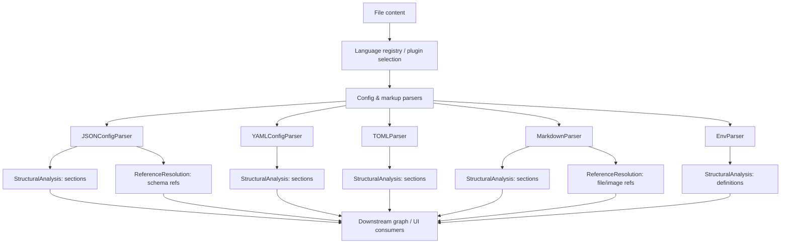
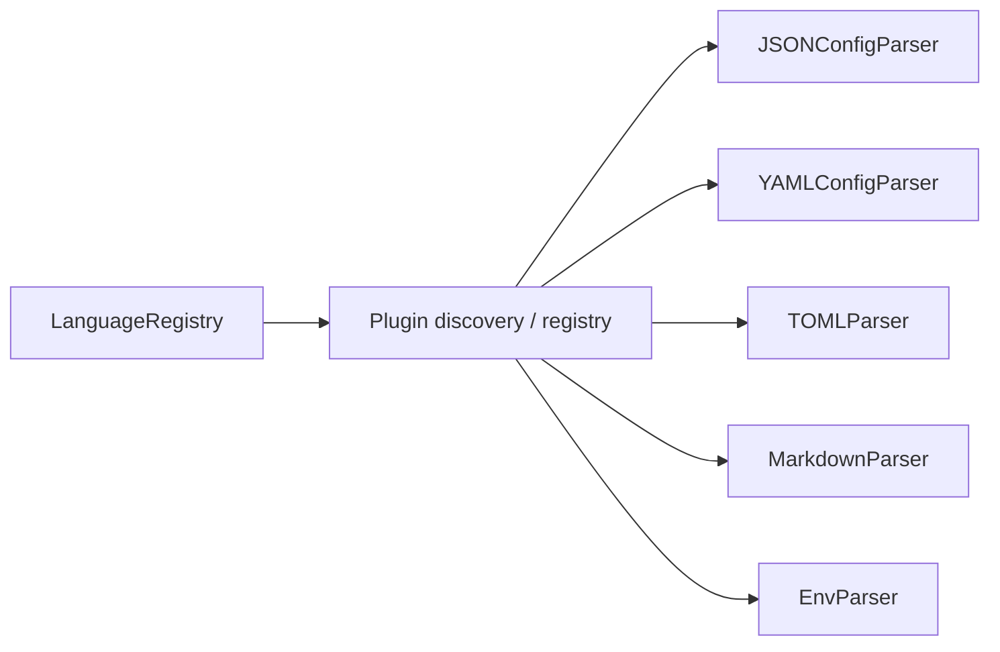
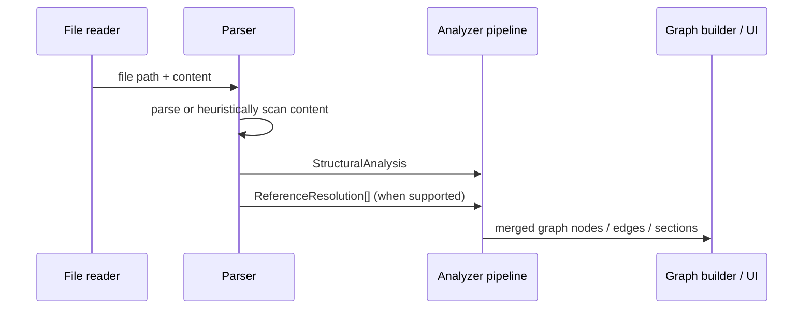
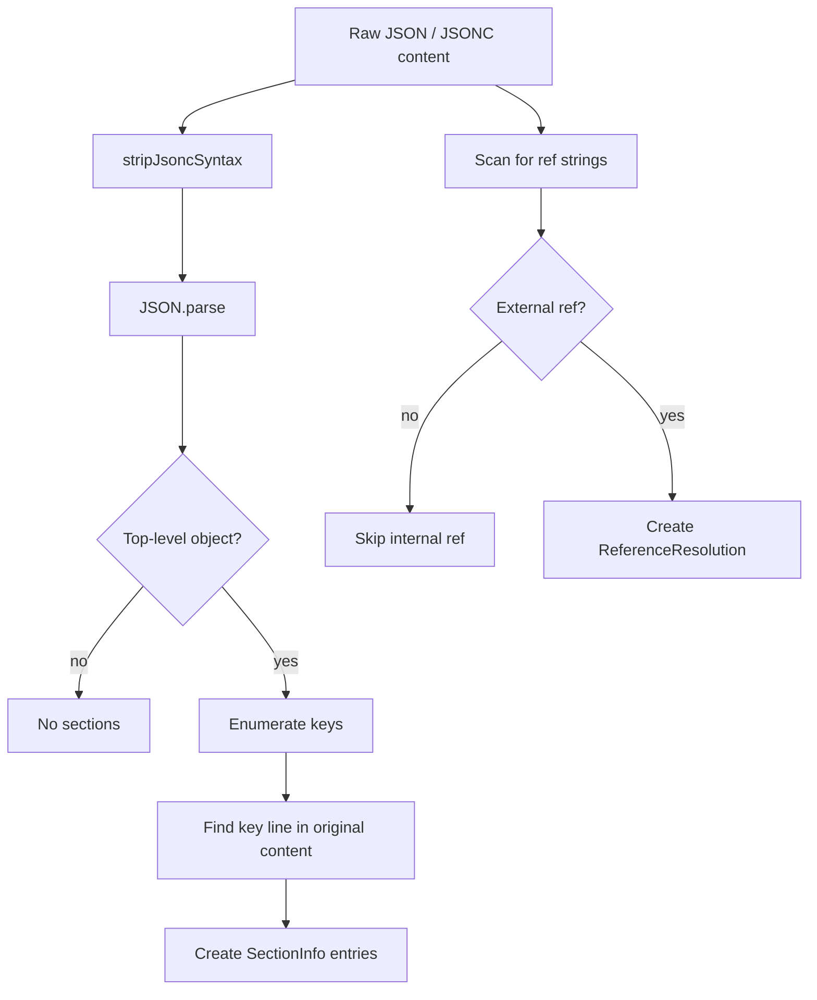
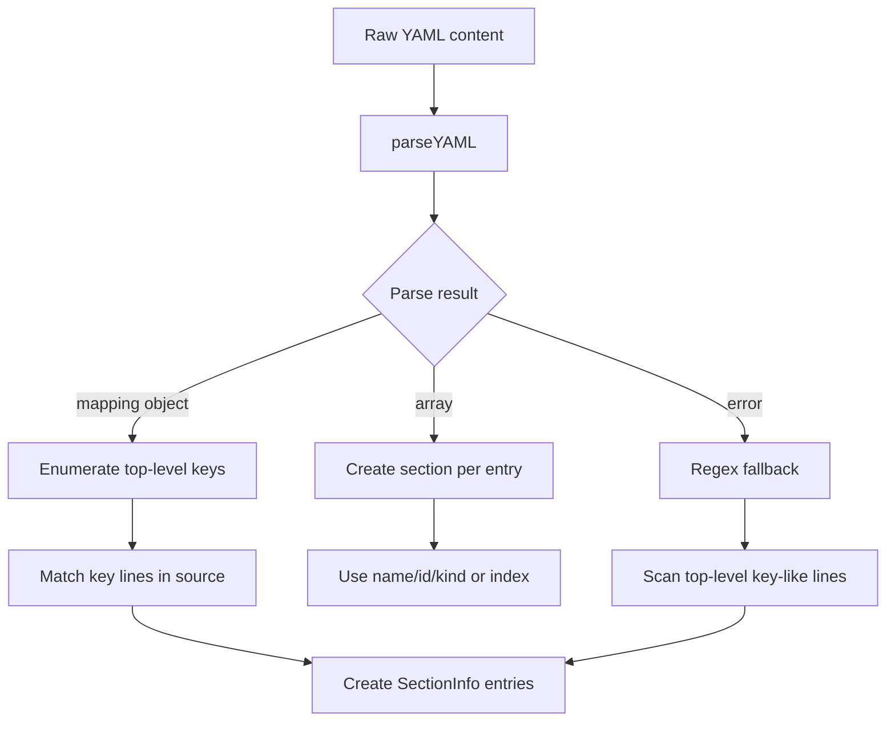
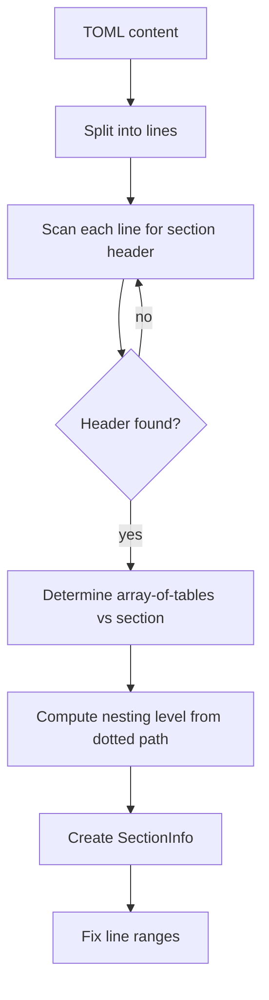
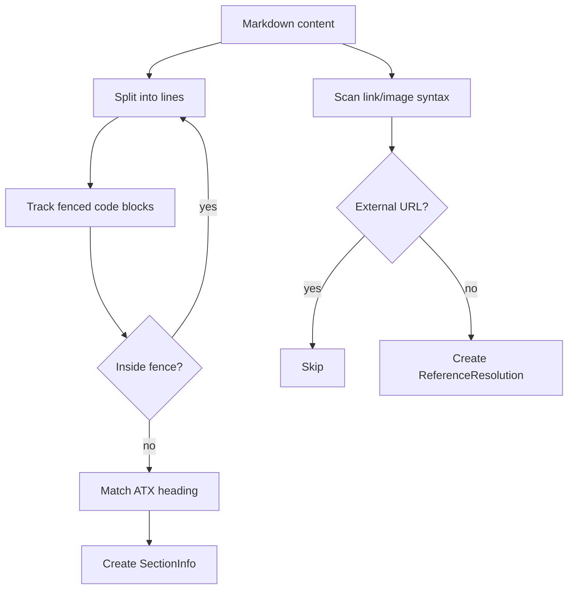
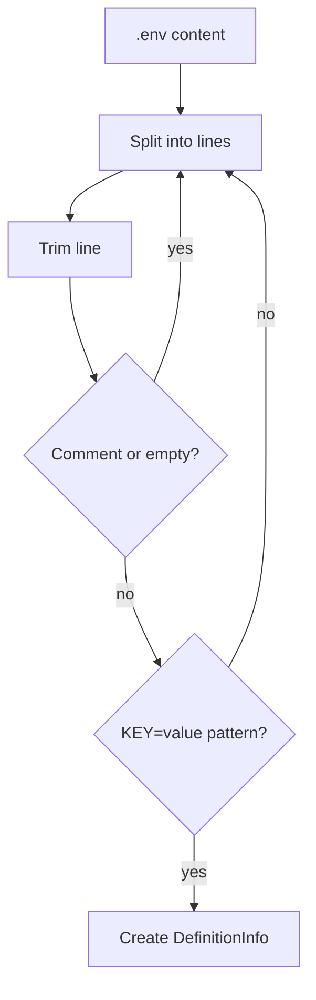
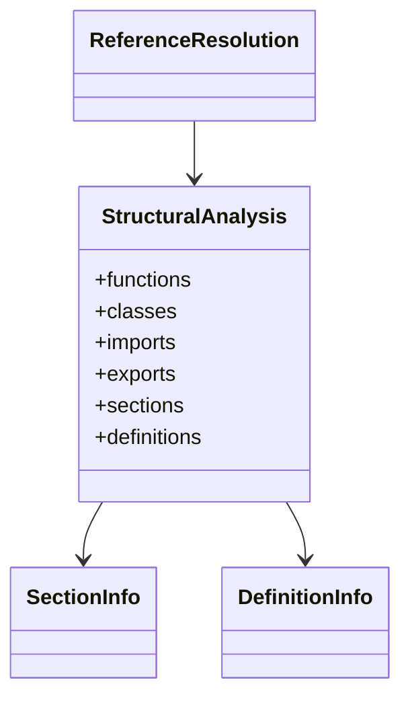

# Config and Markup Parsers

This module contains the lightweight parsers used to extract structure from configuration and markup files. Unlike language parsers that focus on functions, classes, and imports, these parsers primarily identify top-level sections, definitions, and references so the rest of the system can build useful navigation, dependency, and documentation views from non-code assets.

The module currently covers:
- JSON / JSONC configuration files
- YAML configuration files and YAML-flavored formats
- TOML configuration files
- Markdown documents
- `.env` files

These parsers implement the shared `AnalyzerPlugin` interface from [`core_schema_and_types`](core_schema_and_types.md), returning `StructuralAnalysis` objects and, where relevant, `ReferenceResolution` entries.

---

## Module responsibilities

The parsers in this module are intentionally shallow and fast:

- detect top-level structure rather than deeply parsing nested content
- preserve source line numbers for UI highlighting and graph linking
- extract references that can be turned into graph edges
- tolerate malformed input where possible, especially for human-edited config files

They are used by the broader analysis pipeline described in [`core_analysis`](core_analysis.md) and feed into graph construction and documentation features.

---

## Component overview

| Parser | File | Primary output | Notes |
|---|---|---|---|
| `JSONConfigParser` | `json-parser.ts` | `sections`, `ReferenceResolution` | Handles JSON and JSONC, including `$ref` extraction |
| `YAMLConfigParser` | `yaml-parser.ts` | `sections` | Supports YAML plus YAML-flavored formats and regex fallback |
| `TOMLParser` | `toml-parser.ts` | `sections` | Extracts `[section]` and `[[array-of-tables]]` headers |
| `MarkdownParser` | `markdown-parser.ts` | `sections`, `ReferenceResolution` | Extracts headings and local file/image links |
| `EnvParser` | `env-parser.ts` | `definitions` | Extracts environment variable declarations |

---

## Architecture

### Relationship to the plugin system

All parsers implement the shared plugin contract from [`core_plugin_system`](core_plugin_system.md). The language registry maps file types to parser plugins, and these parsers are selected when the file is recognized as a configuration or markup asset.

---

## Data flow

The parsers do not build the graph themselves. They provide normalized structural hints that are later merged with code analysis and other metadata in the broader system.

---

## Parser details

## JSONConfigParser

**File:** [`json-parser.ts`](understand-anything-plugin/packages/core/src/plugins/parsers/json-parser.ts)

### Purpose

Extracts top-level JSON object keys as sections and resolves external `$ref` entries in JSON Schema / OpenAPI documents.

### Supported formats

- `json`
- `jsonc`
- `json-schema`
- `openapi`

### Behavior

- Strips JSONC syntax before parsing:
  - line comments (`//`)
  - block comments (`/* ... */`)
  - trailing commas
- Preserves string contents verbatim while stripping comments
- Uses `JSON.parse` after normalization
- Extracts only top-level object keys as `SectionInfo`
- Does not descend into nested objects
- Extracts external `$ref` values as schema references
- Skips internal references beginning with `#`

### Notable implementation details

The parser computes section line ranges using the original source text so the UI can highlight the same lines the user sees in the file.

### Mermaid: JSON parsing flow

### Dependencies

- [`core_schema_and_types`](core_schema_and_types.md) for `AnalyzerPlugin`, `StructuralAnalysis`, `SectionInfo`, `ReferenceResolution`

---

## YAMLConfigParser

**File:** [`yaml-parser.ts`](understand-anything-plugin/packages/core/src/plugins/parsers/yaml-parser.ts)

### Purpose

Extracts top-level YAML keys as sections and supports a few YAML-flavored special formats that are commonly used as configuration documents.

### Supported formats

- `yaml`
- `kubernetes`
- `docker-compose`
- `github-actions`
- `openapi`

### Behavior

- Parses YAML using the `yaml` library
- Extracts only top-level keys from mapping documents
- Handles quoted keys such as `"on"` in GitHub Actions files
- Supports array-root YAML documents by emitting one section per array entry
- Falls back to regex-based extraction if parsing fails
- Does not descend into nested structures

### Mermaid: YAML parsing flow

### Dependencies

- [`core_schema_and_types`](core_schema_and_types.md) for `AnalyzerPlugin`, `StructuralAnalysis`, `SectionInfo`
- External `yaml` package for parsing

---

## TOMLParser

**File:** [`toml-parser.ts`](understand-anything-plugin/packages/core/src/plugins/parsers/toml-parser.ts)

### Purpose

Extracts TOML section headers and array-of-table headers as structural sections.

### Supported formats

- `toml`

### Behavior

- Detects `[section]` headers
- Detects `[[array-of-tables]]` headers
- Computes nesting level from dotted paths
  - for example, `[tool.poetry]` becomes level 2
- Does not parse key-value pairs inside sections

### Mermaid: TOML parsing flow

### Dependencies

- [`core_schema_and_types`](core_schema_and_types.md) for `AnalyzerPlugin`, `StructuralAnalysis`, `SectionInfo`

---

## MarkdownParser

**File:** [`markdown-parser.ts`](understand-anything-plugin/packages/core/src/plugins/parsers/markdown-parser.ts)

### Purpose

Extracts document headings and local references from Markdown files.

### Supported formats

- `markdown`

### Behavior

- Extracts ATX headings from `#` through `######`
- Ignores headings inside fenced code blocks
- Computes section line ranges from heading positions
- Extracts local file and image links
- Skips external URLs beginning with `http`
- Does not extract front matter, HTML blocks, or code block contents

### Reference extraction

Markdown links are converted into `ReferenceResolution` entries:

- `[text](path/to/file.md)` → file reference
- `` → image reference

### Mermaid: Markdown parsing flow

### Dependencies

- [`core_schema_and_types`](core_schema_and_types.md) for `AnalyzerPlugin`, `StructuralAnalysis`, `ReferenceResolution`, `SectionInfo`

---

## EnvParser

**File:** [`env-parser.ts`](understand-anything-plugin/packages/core/src/plugins/parsers/env-parser.ts)

### Purpose

Extracts environment variable declarations from `.env` files.

### Supported formats

- `env`

### Behavior

- Recognizes `KEY=value` assignments
- Skips blank lines and comment lines beginning with `#`
- Records each variable as a `DefinitionInfo`
- Does not support `export KEY=value`
- Does not support multi-line values

### Mermaid: `.env` parsing flow

### Dependencies

- [`core_schema_and_types`](core_schema_and_types.md) for `AnalyzerPlugin`, `StructuralAnalysis`, `DefinitionInfo`

---

## Shared output model

These parsers all return a `StructuralAnalysis` object, but they populate different fields depending on the file type:

- `sections` for hierarchical or document structure
- `definitions` for variable declarations
- `imports`, `exports`, `functions`, `classes` are returned as empty arrays in this module

This keeps the output compatible with the rest of the analysis pipeline while avoiding unnecessary parsing complexity.

---

## How this module fits into the system

The config and markup parsers sit between file discovery and higher-level analysis features:

1. The plugin system identifies the appropriate parser for a file.
2. The parser extracts lightweight structure and references.
3. The analysis pipeline merges these results with code analysis and graph-building logic.
4. The dashboard and documentation layers use the resulting structure for navigation and visualization.

For downstream graph construction details, see [`core_analysis`](core_analysis.md) and [`dashboard_graph_view`](dashboard_graph_view.md).

For plugin loading and registration, see [`core_plugin_system`](core_plugin_system.md).

For shared types and analysis contracts, see [`core_schema_and_types`](core_schema_and_types.md).

---

## Design trade-offs and limitations

### Strengths

- Fast and simple parsing
- Good resilience for hand-edited config files
- Preserves line numbers for UI integration
- Produces useful structure without requiring full semantic understanding

### Limitations

- Only top-level structure is extracted in most parsers
- Nested object semantics are intentionally ignored
- Markdown parsing is limited to ATX headings and basic links
- `.env` parsing is intentionally conservative
- YAML fallback parsing is heuristic and may miss edge cases

These trade-offs are appropriate for a structural analysis layer whose goal is to support navigation and graph generation rather than full validation.

---

## Related documentation

- [`core_schema_and_types`](core_schema_and_types.md)
- [`core_plugin_system`](core_plugin_system.md)
- [`core_analysis`](core_analysis.md)
- [`core_config_parsers`](core_config_parsers.md)
- [`dashboard_graph_view`](dashboard_graph_view.md)
