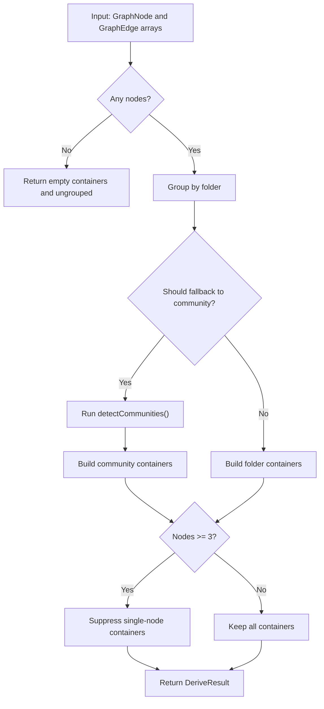
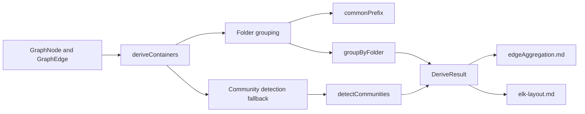
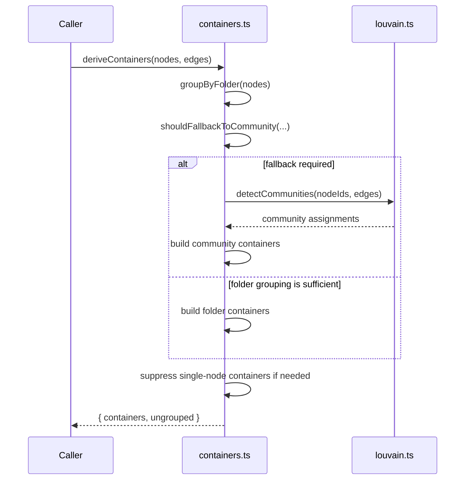

# Containers Module

The `containers` module derives lightweight grouping containers for dashboard graph nodes. It is used by the dashboard layout pipeline to cluster nodes either by filesystem structure or, when folder grouping is not meaningful, by graph community structure. The result is a set of visual containers plus a list of nodes that should remain ungrouped.

This module is intentionally small, but it plays an important role in the dashboard’s graph organization flow. It sits between raw graph data (`GraphNode`, `GraphEdge`) and higher-level layout/aggregation utilities such as [edgeAggregation.md](edgeAggregation.md) and [elk-layout.md](elk-layout.md).

## Purpose

`deriveContainers()` answers a simple question:

> “Given a graph of nodes and edges, what container groups should the dashboard render?”

It supports two grouping strategies:

- **Folder-based grouping**: group nodes by the first directory segment in their `filePath`
- **Community-based grouping**: fall back to graph clustering when folder grouping is too coarse or too concentrated

The module also suppresses trivial single-node containers in larger graphs so the UI stays readable.

---

## Core Types

### `DerivedContainer`

Represents one visual container derived from the graph.

```ts
interface DerivedContainer {
  id: string;
  name: string;
  nodeIds: string[];
  strategy: "folder" | "community";
}
```

#### Fields

- `id`: Stable container identifier used by downstream UI/layout code
- `name`: Human-readable label shown in the dashboard
- `nodeIds`: IDs of graph nodes assigned to the container
- `strategy`: Indicates whether the container came from folder grouping or community detection

### `DeriveResult`

Return value of `deriveContainers()`.

```ts
interface DeriveResult {
  containers: DerivedContainer[];
  ungrouped: string[];
}
```

#### Fields

- `containers`: The final set of containers to render
- `ungrouped`: Node IDs that were intentionally left outside containers, usually because their container was too small to keep

---

## Main API

### `deriveContainers(nodes, edges)`

Derives containers from graph nodes and edges.

#### Inputs

- `nodes: GraphNode[]`
- `edges: GraphEdge[]`

#### Output

- `DeriveResult`

#### High-level behavior

1. If there are no nodes, return an empty result.
2. Try to group nodes by folder structure.
3. Decide whether folder grouping is meaningful enough.
4. If not, fall back to community detection.
5. Remove single-node containers when the graph is large enough.

---

## Internal Grouping Logic

### Folder grouping

Folder grouping is based on the `filePath` field of each node.

The algorithm:

1. Collect nodes that have a `filePath`
2. Compute the longest common prefix of their directory portions
3. Strip that prefix from each path
4. Group nodes by the first remaining path segment
5. Nodes without a usable path become rooted/ungrouped candidates

This design avoids collapsing everything into a single bucket when all files live directly under the same folder.

### Community fallback

If folder grouping is too weak, the module uses `detectCommunities()` from [louvain.md](louvain.md) to cluster nodes by graph connectivity.

This fallback is triggered when:

- There are fewer than 2 buckets total
- Any bucket contains more than 70% of all nodes
- The rooted bucket contains more than 70% of all nodes

These thresholds prevent the UI from rendering containers that are too imbalanced to be useful.

---

## Process Flow



---

## Architecture and Relationships



### Module dependencies

- **Depends on**
  - `@understand-anything/core/types` for `GraphNode` and `GraphEdge`
  - `./louvain` for community detection
- **Consumed by**
  - Dashboard layout and graph rendering utilities
  - Container-aware edge aggregation in [edgeAggregation.md](edgeAggregation.md)
  - Layout preparation in [elk-layout.md](elk-layout.md)

---

## Data Flow



---

## Key Implementation Details

### `commonPrefix(paths)`

Computes the longest common prefix of the **directory portion** of paths, not the full file path.

Why this matters:

- If files are `auth/x.ts` and `auth/y.ts`, the directory LCP would otherwise consume `auth/`
- By operating on directory portions, the module still groups them under `auth`

### `groupByFolder(nodes)`

Returns:

- `groups`: map of folder segment → node IDs
- `rooted`: node IDs that cannot be grouped by folder

Nodes are considered rooted when:

- They have no `filePath`
- Their path has no remaining subdirectory after stripping the common prefix

### `shouldFallbackToCommunity(groups, rooted, totalNodes)`

Determines whether folder grouping is too coarse.

Fallback occurs when:

- There are fewer than 2 buckets
- Any folder bucket exceeds 70% of all nodes
- The rooted bucket exceeds 70% of all nodes

### Single-node suppression

For graphs with at least 3 nodes, containers with only one node are removed and their node IDs are added to `ungrouped`.

This keeps the dashboard from showing many tiny boxes that add visual noise.

---

## Constants and Their Meaning

```ts
const MIN_BUCKET_COUNT = 2;
const MAX_CONCENTRATION = 0.7;
const MIN_NODES_FOR_SUPPRESSION = 3;
const ROOT_BUCKET = "~";
```

- `MIN_BUCKET_COUNT`: minimum number of buckets required before folder grouping is considered meaningful
- `MAX_CONCENTRATION`: maximum allowed share of nodes in a single bucket before fallback is triggered
- `MIN_NODES_FOR_SUPPRESSION`: below this size, single-node containers are preserved for context
- `ROOT_BUCKET`: label used for nodes that do not fit into a folder bucket

---

## Output Semantics

### Folder strategy

When folder grouping is used:

- Container IDs are `container:<segment>`
- Container names are the folder segment
- Rooted nodes are placed into `container:~`

### Community strategy

When community detection is used:

- Container IDs are `container:cluster-<communityId>`
- Names are `Cluster A`, `Cluster B`, ... then `Cluster 27`, etc.
- The naming avoids ASCII wrapping after `Z`

---

## Example

### Input

- Nodes: `auth/login.ts`, `auth/logout.ts`, `billing/invoice.ts`, `README.md`
- Edges: graph connections between these nodes

### Possible output

- `auth` container with `login.ts` and `logout.ts`
- `billing` container with `invoice.ts`
- `~` container with `README.md`

If the graph is highly concentrated in one folder, the module may instead produce community containers.

---

## Integration Notes

- This module does not validate graph correctness; it only derives grouping candidates.
- It assumes node IDs are stable and unique.
- It does not mutate input arrays.
- It is safe to call repeatedly during interactive dashboard updates.

For graph validation and issue reporting, see [schema.md](schema.md).
For broader graph types used across the system, see [types.md](types.md).

---

## Related Modules

- [edgeAggregation.md](edgeAggregation.md) — aggregates edges between containers and layers
- [elk-layout.md](elk-layout.md) — performs layout and repair for containerized graphs
- [louvain.md](louvain.md) — community detection used as fallback grouping strategy
- [types.md](types.md) — shared graph node and edge types

---

## Summary

The `containers` module provides a pragmatic container-derivation layer for dashboard graphs. It prefers folder-based grouping when that structure is informative, falls back to community detection when it is not, and suppresses trivial containers to keep the UI clean.

Its output is a compact, layout-friendly representation that downstream dashboard utilities can use to build readable graph visualizations.
