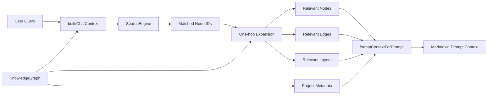
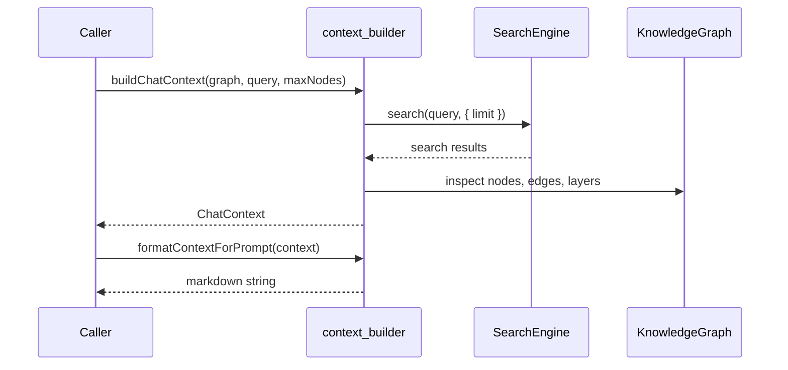
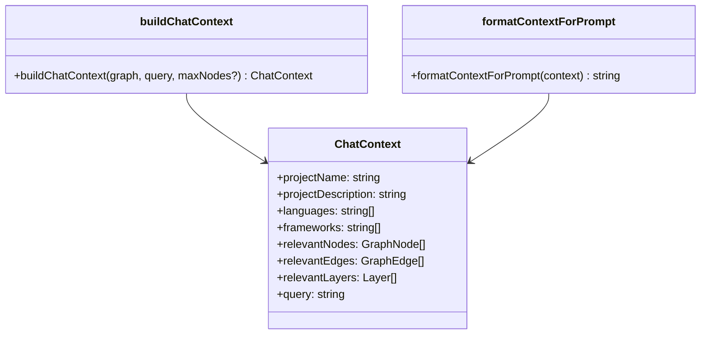
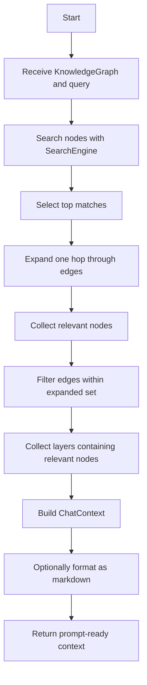

# context_builder Module

The `context_builder` module assembles a compact, LLM-friendly view of a project knowledge graph. It takes a full `KnowledgeGraph`, searches for nodes relevant to a user query, expands the result set by one hop through graph edges, and formats the resulting subgraph into a readable prompt context.

This module is the bridge between graph-based project analysis and downstream chat/explanation workflows. For related context assembly flows, see [diff_analyzer.md](diff_analyzer.md) and [explain_builder.md](explain_builder.md).

## Purpose

`context_builder` is responsible for:

- locating graph nodes relevant to a natural-language query
- expanding the result set to include directly connected neighbors
- collecting the layers that contain those nodes
- producing a markdown representation suitable for LLM prompts

It does **not** perform graph construction, schema validation, or semantic analysis itself. Those responsibilities live in the core analysis and schema modules, especially [core_analysis.md](core_analysis.md) and [core_schema_and_types.md](core_schema_and_types.md).

## Core API

### `ChatContext`

`ChatContext` is the structured payload returned by `buildChatContext` and consumed by `formatContextForPrompt`.

Fields:

- `projectName`: project title from the graph metadata
- `projectDescription`: project summary from the graph metadata
- `languages`: languages associated with the project
- `frameworks`: frameworks associated with the project
- `relevantNodes`: graph nodes selected for the query context
- `relevantEdges`: edges connecting the selected nodes
- `relevantLayers`: layers that contain at least one selected node
- `query`: the original user query

See the shared graph types in [core_schema_and_types.md](core_schema_and_types.md) for the definitions of `KnowledgeGraph`, `GraphNode`, `GraphEdge`, and `Layer`.

## Main Functions

### `buildChatContext(graph, query, maxNodes?)`

Builds a query-focused subgraph from the full knowledge graph.

#### Behavior

1. Creates a `SearchEngine` from `graph.nodes`
2. Searches for nodes matching the query
3. Limits the initial match set to `maxNodes` or `15` by default
4. Expands the match set by one hop across all edges
5. Collects the corresponding node objects
6. Filters edges so both endpoints are in the expanded set
7. Collects layers that reference any expanded node
8. Returns a `ChatContext`

#### Important characteristics

- Expansion is **undirected** at the selection stage: if a node is matched, both its outgoing and incoming neighbors are included.
- Edge inclusion is stricter than node inclusion: only edges whose **both** endpoints are in the expanded set are retained.
- Layer inclusion is broad: any layer containing at least one relevant node is included.

#### Default sizing

If `maxNodes` is omitted, the search is limited to 15 initial matches before expansion. The final context may contain more than 15 nodes because of the one-hop expansion.

#### Dependencies

- `SearchEngine` from `@understand-anything/core`
- `KnowledgeGraph`, `GraphNode`, `GraphEdge`, `Layer` from `@understand-anything/core`

#### Output shape

The returned context contains:

- project metadata copied from the graph
- the query string
- a relevant subgraph of nodes, edges, and layers

### `formatContextForPrompt(context)`

Converts a `ChatContext` into markdown text for LLM consumption.

#### Output structure

The generated markdown includes:

- project header
- project description
- languages and frameworks
- relevant layers
- code components
- relationships between components

#### Formatting rules

- Layers are rendered as `###` subsections under `## Relevant Layers`
- Nodes are rendered as `### {name} ({type})` under `## Code Components`
- Edges are rendered as bullet relationships under `## Relationships`
- Optional node fields are included only when present:
  - `filePath`
  - `tags`
  - `languageNotes`
- Optional edge descriptions are appended to the relationship line

## Architecture Overview

The module is intentionally small and linear. It sits at the boundary between graph search and prompt generation.

## Data Flow

## Component Interaction

## Process Flow

## Dependencies and Relationships

### External dependencies

- `@understand-anything/core`
  - `SearchEngine`
  - `KnowledgeGraph`
  - `GraphNode`
  - `GraphEdge`
  - `Layer`

### Internal module relationships

This module depends on the shared graph model defined in [core_schema_and_types.md](core_schema_and_types.md). It does not depend directly on the analyzer, plugin, or dashboard modules, but it consumes the graph output produced by the analysis pipeline described in [core_analysis.md](core_analysis.md).

For adjacent context-building workflows, refer to:

- [diff_analyzer.md](diff_analyzer.md) for change-oriented context assembly
- [explain_builder.md](explain_builder.md) for explanation-oriented context assembly

## Implementation Notes

- The search step is intentionally simple and uses the existing `SearchEngine` rather than custom ranking logic.
- The one-hop expansion makes the context more useful for LLMs by preserving immediate relationships around matched nodes.
- The markdown formatter is deterministic and human-readable, which helps with debugging prompt quality.
- The module does not deduplicate nodes beyond ID-based set membership, so output order follows set iteration and graph traversal order.

## When to Use This Module

Use `context_builder` when you need:

- a concise graph slice for chat or Q&A
- a prompt payload that includes both structure and relationships
- a lightweight way to turn graph analysis results into LLM input

Avoid using it when you need:

- full graph serialization
- schema validation
- deep multi-hop traversal
- semantic reranking beyond the built-in search engine

## Related Documentation

- [core_schema_and_types.md](core_schema_and_types.md)
- [core_analysis.md](core_analysis.md)
- [diff_analyzer.md](diff_analyzer.md)
- [explain_builder.md](explain_builder.md)
