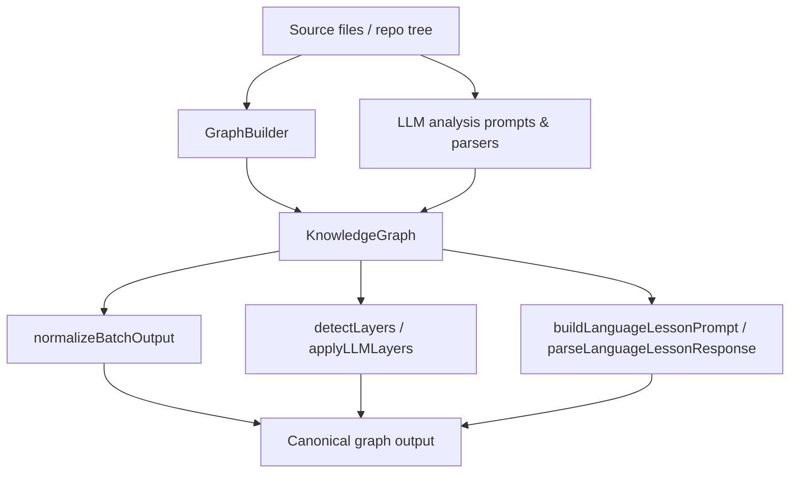
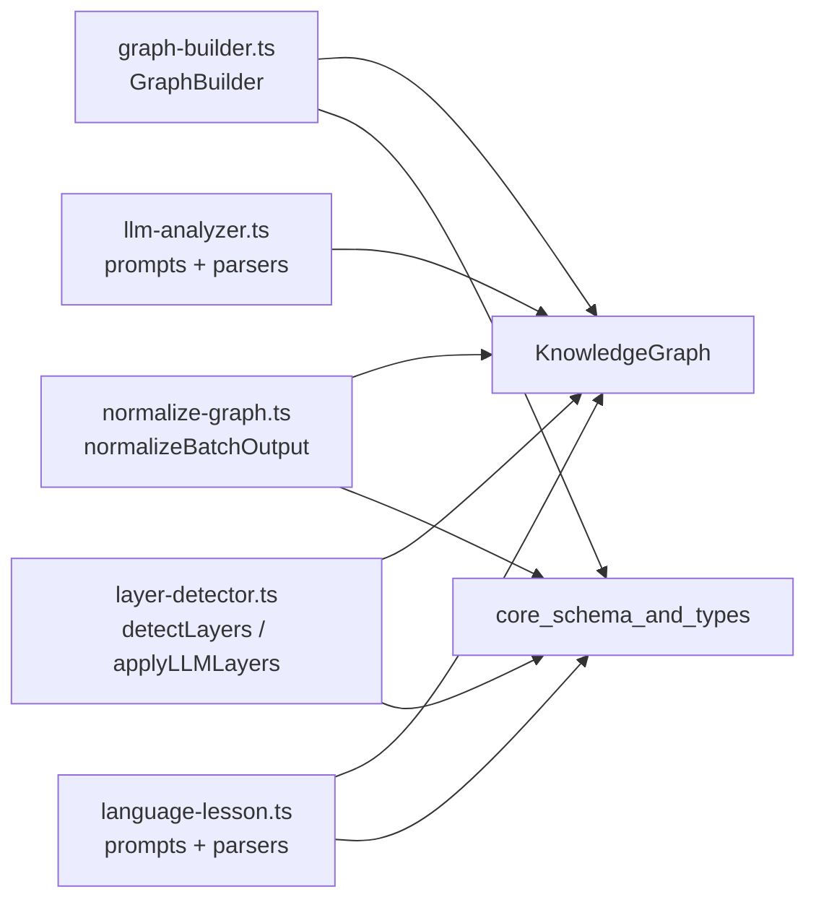
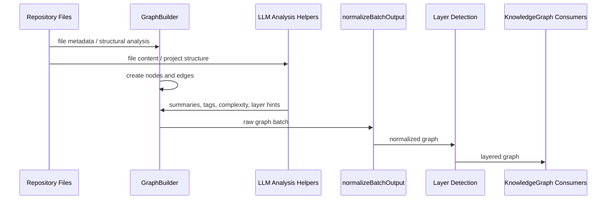

# core_analysis Module

## Purpose
The `core_analysis` module is responsible for turning raw repository content into a structured knowledge graph and enriching that graph with higher-level analysis. It covers:

- graph construction from files and extracted metadata
- LLM-assisted file, project, layer, and language analysis
- graph normalization and ID/edge cleanup
- heuristic layer detection and language concept extraction

This module is the analytical backbone of the system: it produces the graph and metadata that downstream modules such as search, change tracking, dashboard rendering, and app context builders consume.

## Architecture Overview

### Core responsibilities

- **GraphBuilder**: creates nodes and edges for files, functions, classes, and non-code artifacts.
- **LLM analysis helpers**: define prompt/response contracts for file summaries, project summaries, layer detection, and language lessons.
- **Normalization**: repairs malformed IDs, normalizes complexity values, rewrites edges, and drops dangling references.
- **Layer detection**: assigns file nodes to architectural layers using heuristics or LLM-provided patterns.
- **Language lesson generation**: detects concepts in a node and prepares a teaching-oriented prompt.

## Component Relationships

## Sub-module Documentation

Detailed documentation for complex sub-modules is available in the following files:

- [analyzer_graph_builder.md](analyzer_graph_builder.md)
- [analyzer_llm_analyzer.md](analyzer_llm_analyzer.md)
- [analyzer_normalize_graph.md](analyzer_normalize_graph.md)
- [analyzer_layer_detector.md](analyzer_layer_detector.md)
- [analyzer_language_lesson.md](analyzer_language_lesson.md)

These files contain the detailed responsibilities, internal flows, and implementation notes for each analyzer sub-module.

## High-Level Functionality by File

### `graph-builder.ts`
Builds the core `KnowledgeGraph` structure from file metadata and structural analysis. It creates:

- file nodes
- function and class nodes
- non-code nodes such as tables, services, endpoints, steps, and resources
- `contains`, `imports`, and `calls` edges

See: [analyzer_graph_builder.md](analyzer_graph_builder.md)

### `llm-analyzer.ts`
Defines the LLM-facing contracts for file and project analysis, including prompt builders and JSON response parsers.

See: [analyzer_llm_analyzer.md](analyzer_llm_analyzer.md)

### `normalize-graph.ts`
Normalizes node IDs and complexity values, rewrites edge references after ID correction, deduplicates graph elements, and records dropped edges.

See: [analyzer_normalize_graph.md](analyzer_normalize_graph.md)

### `layer-detector.ts`
Provides heuristic and LLM-driven layer detection for file nodes, mapping files into architectural layers.

See: [analyzer_layer_detector.md](analyzer_layer_detector.md)

### `language-lesson.ts`
Detects language concepts from graph nodes and builds/parses prompts for generating educational language-specific explanations.

See: [analyzer_language_lesson.md](analyzer_language_lesson.md)

## Dependencies and System Fit

This module depends heavily on the shared schema/types layer for graph structures and on the language registry for file-to-language detection. It also feeds outputs that are typically consumed by:

- **core_schema_and_types** for graph and node definitions
- **core_language_support** for language detection and concept metadata
- **dashboard_graph_view** for visualization of the resulting graph
- **app_context_builders** for assembling context from graph-derived analysis
- **core_search** and **core_change_tracking** for downstream indexing and change-aware workflows

## Data Flow Summary

## Notes for Maintainers

- Graph IDs are intentionally normalized around `type:path`-style prefixes to reduce collisions.
- Non-code artifacts are mapped into graph node types using a fixed kind-to-type table.
- LLM parsers are defensive: they accept fenced JSON, raw JSON, and partially malformed payloads.
- Layer detection supports both heuristic directory matching and LLM-provided file patterns.

## Related Modules

- [core_schema_and_types.md](core_schema_and_types.md)
- [core_language_support.md](core_language_support.md)
- [dashboard_graph_view.md](dashboard_graph_view.md)
- [app_context_builders.md](app_context_builders.md)
- [core_search.md](core_search.md)
- [core_change_tracking.md](core_change_tracking.md)
