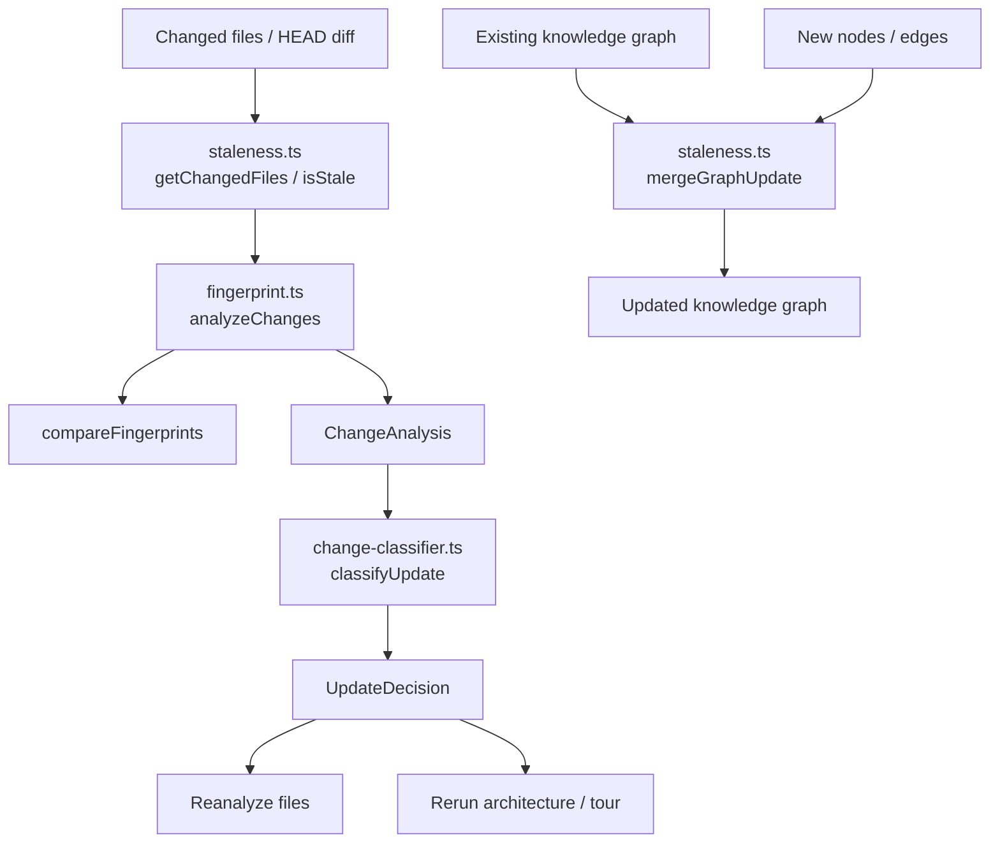
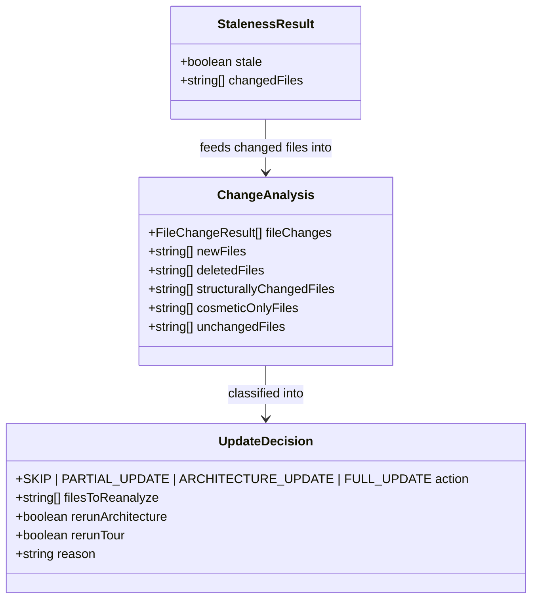
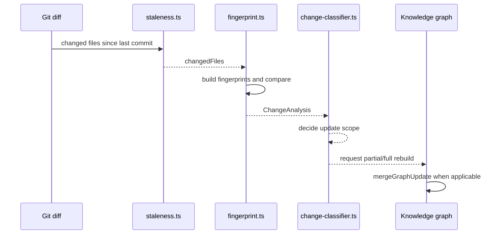

# core_change_tracking

## Purpose
The `core_change_tracking` module provides the change-detection and update-planning layer for the knowledge graph pipeline. It answers three related questions:

1. **What changed?** via file fingerprints and structural comparison.
2. **Is the graph stale?** via git-based change detection.
3. **What should be rebuilt?** via update classification.

This module is designed to minimize unnecessary re-analysis while still being conservative when structural certainty is low.

## Architecture Overview

## Component Relationships

## High-Level Flow

## Sub-modules

### 1. Fingerprint and change analysis
Detailed documentation: [fingerprint_and_change_analysis.md](fingerprint_and_change_analysis.md)

This sub-module is responsible for:
- building file fingerprints from structural analysis
- comparing old and new fingerprints
- classifying file-level changes as NONE, COSMETIC, or STRUCTURAL
- aggregating file-level results into a project-wide `ChangeAnalysis`
- converting `ChangeAnalysis` into an `UpdateDecision`

### 2. Staleness detection and graph merging
Detailed documentation: [staleness_and_graph_merging.md](staleness_and_graph_merging.md)

This sub-module is responsible for:
- checking whether the graph is stale relative to git HEAD
- collecting changed files from git
- merging new analysis results into an existing graph while removing stale nodes and edges

## Dependencies and Integration Points

- Depends on **core_schema_and_types** for graph and structural types used by the broader analysis pipeline.
- Depends on **core_plugin_system** for language-aware structural analysis during fingerprint generation.
- Produces inputs consumed by **core_analysis** when deciding whether to rerun architecture or project summaries.
- Can be used by higher-level orchestration code in **app_context_builders** to decide whether cached context needs refresh.

## Related Documentation

- [core_analysis.md](core_analysis.md)
- [core_schema_and_types.md](core_schema_and_types.md)
- [core_plugin_system.md](core_plugin_system.md)
- [app_context_builders.md](app_context_builders.md)
