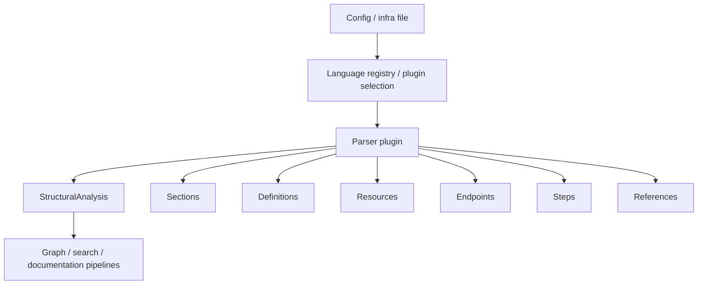
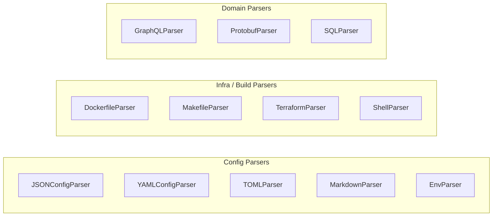
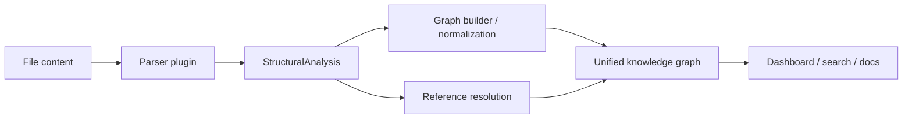
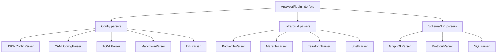

# core_config_parsers

## Purpose

The `core_config_parsers` module provides a set of lightweight structural parsers for common configuration and infrastructure file formats. These parsers convert non-code files into the shared analysis model used by the core system, enabling downstream features such as graph building, search, documentation generation, and dependency/reference tracking.

This module focuses on extracting high-value structural signals rather than performing full semantic parsing. In practice, it identifies sections, definitions, resources, endpoints, steps, and references from configuration files such as JSON, YAML, Terraform, Dockerfiles, SQL, Markdown, and more.

## Architecture overview

The module is organized as a collection of `AnalyzerPlugin` implementations. Each parser targets one or more file languages and returns a `StructuralAnalysis` object populated with the most relevant structural entities for that format.

### Parser family map

## High-level responsibilities by sub-module

This module is split into focused sub-modules so each parser can be documented and maintained independently.

- [config_and_markup_parsers](config_and_markup_parsers.md)
  - `JSONConfigParser`
  - `YAMLConfigParser`
  - `TOMLParser`
  - `MarkdownParser`
  - `EnvParser`

- [infrastructure_and_build_parsers](infrastructure_and_build_parsers.md)
  - `DockerfileParser`
  - `MakefileParser`
  - `TerraformParser`
  - `ShellParser`

- [schema_and_api_parsers](schema_and_api_parsers.md)
  - `GraphQLParser`
  - `ProtobufParser`
  - `SQLParser`

Each sub-module file contains detailed parser responsibilities, extraction rules, limitations, and component-level notes.

## How this module fits into the system

These parsers feed the shared core analysis pipeline defined in the broader core module set:

- Structural entities are represented using shared types from [core_schema_and_types](core_schema_and_types.md).
- Parsed output can be normalized and merged with graph analysis from [core_analysis](core_analysis.md).
- References extracted by parsers can contribute to graph edges and cross-file relationships.
- The resulting structural metadata is consumed by search and dashboard layers for navigation and visualization.

## Parser behavior summary

### JSONConfigParser
Extracts top-level sections from JSON and JSONC-like files and resolves external `$ref` references.

### YAMLConfigParser
Extracts top-level YAML keys, supports common YAML-flavored formats, and falls back to regex extraction for malformed input.

### TOMLParser
Extracts TOML section headers and computes nesting depth from dotted paths.

### MarkdownParser
Extracts heading hierarchy and local file/image references while ignoring fenced code blocks.

### EnvParser
Extracts environment variable definitions from `.env` files.

### DockerfileParser
Extracts build stages, exposed ports, and instruction steps from Dockerfiles.

### MakefileParser
Extracts build targets and their line ranges from Makefiles.

### TerraformParser
Extracts resources, data sources, modules, variables, and outputs from Terraform files.

### ShellParser
Extracts shell function definitions and `source`/`.` file references.

### GraphQLParser
Extracts schema definitions and query/mutation/subscription endpoints.

### ProtobufParser
Extracts messages, enums, service RPC methods, and field/value lists.

### SQLParser
Extracts tables, views, and indexes from SQL DDL.

## Visual dependency view

## Related documentation

- [core_schema_and_types](core_schema_and_types.md) — shared structural types used by all parsers
- [core_analysis](core_analysis.md) — graph and analysis pipeline that consumes parser output
- [core_search](core_search.md) — search layers that may use extracted structural metadata
- [dashboard_graph_view](dashboard_graph_view.md) — visualization layer for graph-derived structures
