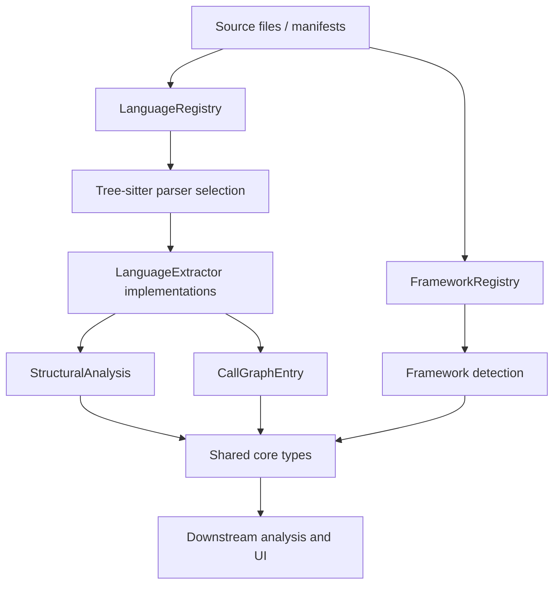
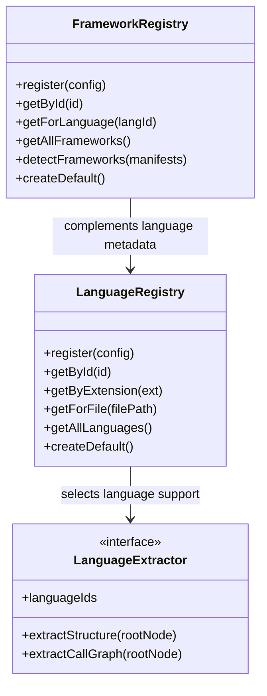
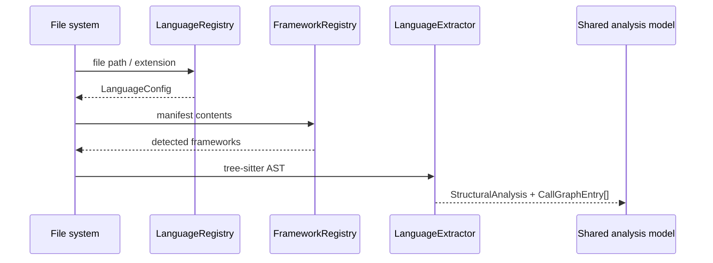

# core_language_support

## Purpose

The `core_language_support` module provides the language-aware foundation used by the core analysis pipeline. It is responsible for:

- resolving language metadata from file paths and extensions
- resolving framework metadata from manifest files
- extracting structural information from tree-sitter ASTs for supported languages
- producing normalized inputs for downstream analysis, search, graph building, and dashboard features

This module is a key bridge between raw source files and the shared analysis model used across the system.

## Architecture overview

### Component relationships

## High-level responsibilities

### 1. Language resolution

`LanguageRegistry` maps language ids, file extensions, and special filenames to `LanguageConfig` objects. It is used to determine which parser/extractor should handle a file.

See: [language_registries.md](language_registries.md)

### 2. Framework detection

`FrameworkRegistry` inspects manifest file contents and detects frameworks using registered `FrameworkConfig` definitions. This supports higher-level semantic analysis and project classification.

See: [language_registries.md](language_registries.md)

### 3. Language-specific extraction

`LanguageExtractor` defines the common contract for AST-to-analysis conversion. The concrete extractors implement language-specific logic for:

- functions and methods
- classes, structs, interfaces, traits, and modules
- imports and exports
- call graph edges

See: [language_extractors.md](language_extractors.md)

## Sub-module documentation index

- [language_registries.md](language_registries.md) — registry behavior, lookup rules, and framework detection
- [language_extractors.md](language_extractors.md) — extractor contract and per-language extraction strategies

## Data flow

## How this module fits into the system

This module sits between parsing and analysis. It does not perform graph normalization, search, or UI rendering directly. Instead, it supplies the language and framework metadata needed by:

- core analysis and graph-building pipelines
- change tracking and staleness logic
- search and semantic indexing
- dashboard graph visualization

For related core modules, see:

- [core_analysis](core_analysis.md)
- [core_change_tracking](core_change_tracking.md)
- [core_search](core_search.md)
- [core_schema_and_types](core_schema_and_types.md)
- [core_plugin_system](core_plugin_system.md)
