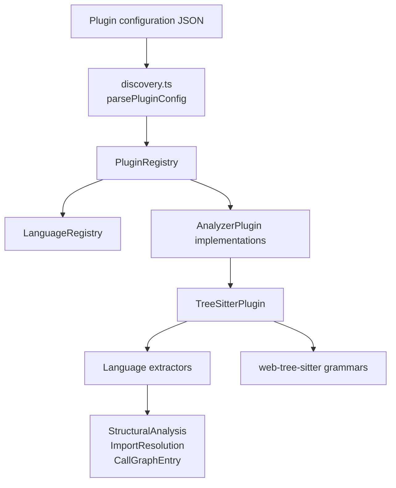
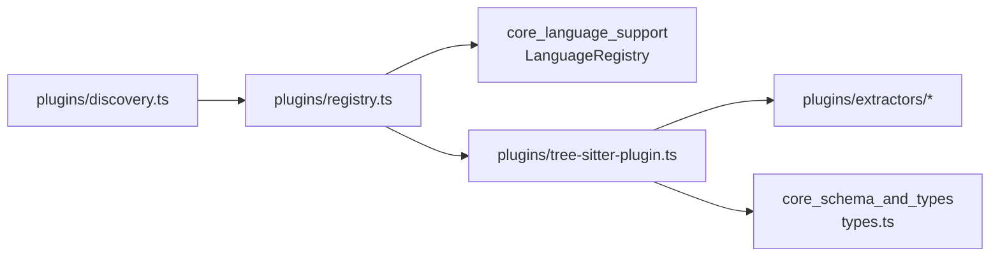
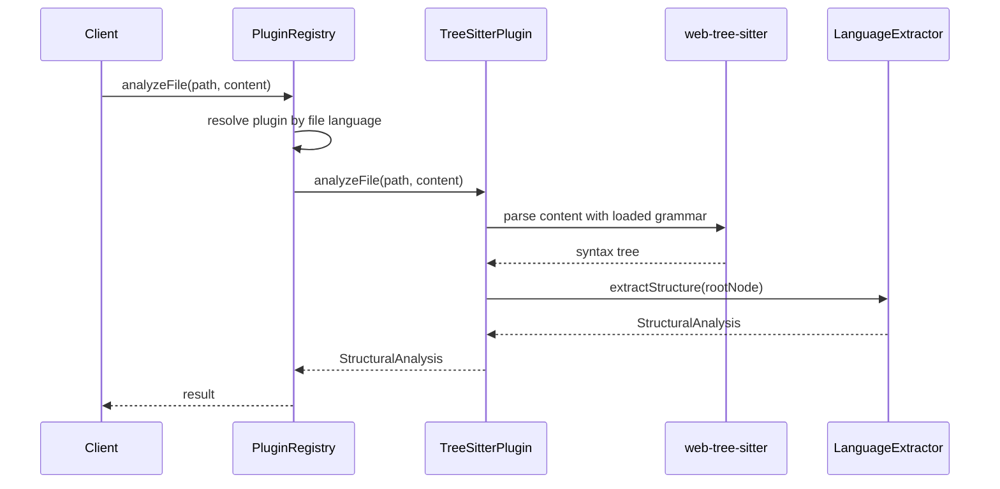

# core_plugin_system

## Purpose
The `core_plugin_system` module provides the plugin infrastructure used by the core analysis pipeline. It is responsible for:

- discovering and configuring analyzer plugins
- registering plugins by language support
- routing file analysis requests to the correct plugin
- providing a tree-sitter-based structural analysis implementation

This module is the bridge between language configuration and the analysis capabilities used elsewhere in the system.

## Architecture Overview

### Main responsibilities

- **Configuration discovery**: parse and serialize plugin configuration.
- **Plugin registry**: map languages to analyzer plugins and expose a unified analysis API.
- **Tree-sitter analysis**: load grammars, parse source files, and extract structure/import/call graph data.

## Component Relationships

## Sub-module documentation

- [plugin_discovery.md](plugin_discovery.md) — plugin configuration parsing and defaults.
- [plugin_registry.md](plugin_registry.md) — plugin registration and analysis routing.
- [tree_sitter_plugin.md](tree_sitter_plugin.md) — tree-sitter initialization and structural extraction.

## Related documentation

- [analyzer_graph_builder.md](analyzer_graph_builder.md) — graph construction and file metadata modeling.
- [analyzer_llm_analyzer.md](analyzer_llm_analyzer.md) — LLM-backed analysis outputs.
- [analyzer_normalize_graph.md](analyzer_normalize_graph.md) — graph normalization and edge cleanup.
- [analyzer_layer_detector.md](analyzer_layer_detector.md) — layer inference response types.
- [analyzer_language_lesson.md](analyzer_language_lesson.md) — language lesson result types.
- [fingerprint_and_change_analysis.md](fingerprint_and_change_analysis.md) — fingerprints, change analysis, and update decisions.
- [staleness_and_graph_merging.md](staleness_and_graph_merging.md) — staleness tracking and merge-related results.
- [lexical_search.md](lexical_search.md) — keyword and text search.
- [semantic_search.md](semantic_search.md) — embedding-based search.
- [schema_runtime_validation.md](schema_runtime_validation.md) — runtime validation results and graph issues.
- [shared_graph_and_analysis_types.md](shared_graph_and_analysis_types.md) — shared graph, analysis, and plugin interfaces.
- [core_language_support.md](core_language_support.md) — language registries, extractors, and parser support.
- [core_config_parsers.md](core_config_parsers.md) — configuration file parsers.

## High-level functionality

### `plugins/discovery.ts`
Defines the plugin configuration shape and provides helpers to parse and serialize plugin configuration JSON.

Key responsibilities:
- represent plugin entries and plugin config
- provide a default configuration with tree-sitter enabled for built-in tree-sitter-capable languages
- safely parse user-provided JSON with fallback to defaults
- serialize config back to JSON

### `plugins/registry.ts`
Provides the runtime registry that maps languages to analyzer plugins and exposes convenience methods for file analysis.

Key responsibilities:
- register and unregister plugins
- resolve a plugin by language or file path
- delegate structural analysis, import resolution, and call graph extraction
- expose supported languages and registered plugins

### `plugins/tree-sitter-plugin.ts`
Implements the default structural analyzer using tree-sitter grammars and language-specific extractors.

Key responsibilities:
- initialize tree-sitter and load grammars
- map file extensions to language IDs
- parse source files into syntax trees
- extract functions, classes, imports, exports, and call graphs
- resolve relative imports to filesystem paths
- degrade gracefully when a grammar is unavailable

## Data flow

## Integration notes

- `PluginRegistry` depends on `LanguageRegistry` for file extension to language resolution.
- `TreeSitterPlugin` depends on `AnalyzerPlugin` and shared analysis types from the core schema/types module.
- The tree-sitter plugin is designed to be optional and to fail gracefully when grammars are missing.

## Related modules

For the shared types used by this module, see:
- [shared_graph_and_analysis_types.md](shared_graph_and_analysis_types.md)
- [schema_runtime_validation.md](schema_runtime_validation.md)

For language support and extractors, see:
- [core_language_support.md](core_language_support.md)
