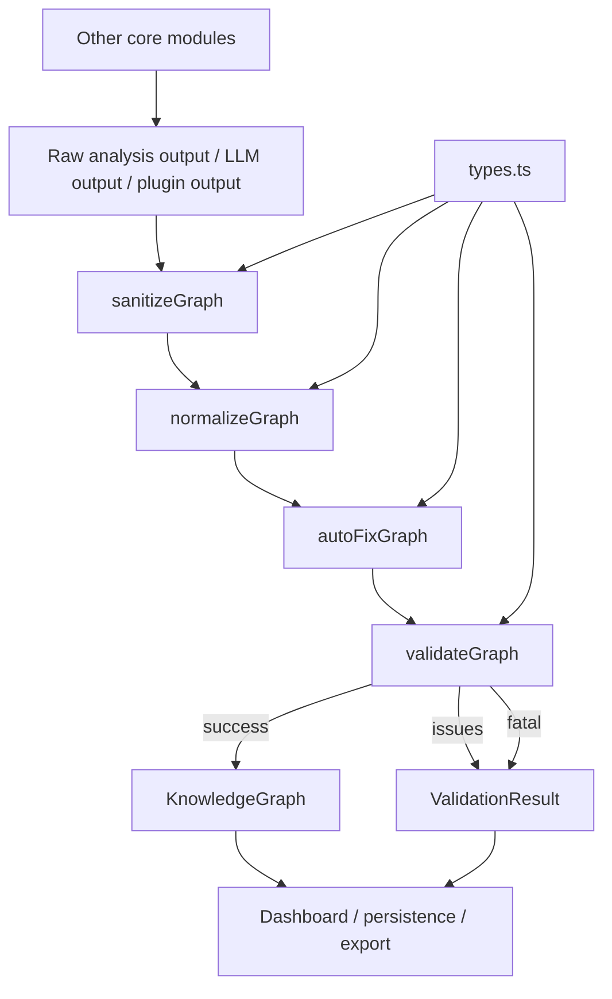
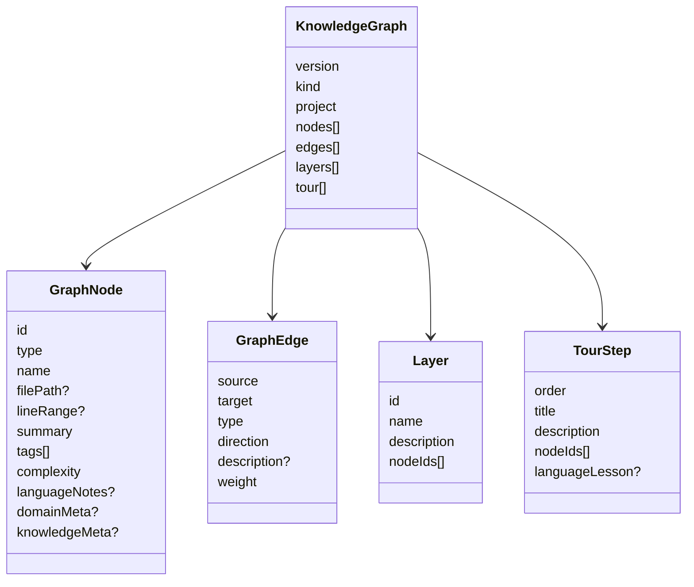

# core_schema_and_types

## Purpose

The `core_schema_and_types` module defines the canonical graph schema, validation pipeline, and shared TypeScript types used across the core analysis system and dashboard. It is the contract layer that keeps graph generation, normalization, validation, and rendering aligned.

This module is centered on two files:
- [`schema_runtime_validation.md`](schema_runtime_validation.md) — runtime schemas, normalization, sanitization, auto-fix, and validation
- [`shared_graph_and_analysis_types.md`](shared_graph_and_analysis_types.md) — shared compile-time interfaces and unions for graph data and analysis metadata

## Architecture Overview

### Validation pipeline

```mermaid
flowchart LR
  T1[Sanitize nulls / casing] --> T2[Alias normalization]
  T2 --> T3[Auto-fix defaults and coercions]
  T3 --> T4[Top-level collection checks]
  T4 --> T5[Project metadata validation]
  T5 --> T6[Node validation and dropping]
  T6 --> T7[Edge validation + referential integrity]
  T7 --> T8[Layer validation]
  T8 --> T9[Tour validation]
  T9 --> T10[Validated KnowledgeGraph]
```

## Core Responsibilities

### 1) Canonical graph model
The module defines the graph vocabulary used by the rest of the system:
- node types and edge types
- graph nodes, edges, layers, and tour steps
- project metadata
- domain and knowledge metadata extensions

### 2) Input normalization and repair
The schema layer accepts imperfect upstream data and repairs common issues:
- null-to-empty collection conversion
- alias mapping for node/edge/complexity/direction values
- defaulting missing fields
- coercing edge weights
- clamping invalid numeric ranges

### 3) Validation and issue reporting
Validation is intentionally tolerant where possible:
- malformed nodes, edges, layers, and tour steps can be dropped
- invalid references are removed
- fatal errors are reserved for unrecoverable graph states
- issues are returned in a structured form for UI and diagnostics

## Sub-module Documentation

- [`schema.ts`](schema.ts) — runtime schema, normalization, validation, and issue reporting
- [`types.ts`](types.ts) — shared graph and analysis types used by analyzers, plugins, and dashboard components

## Relationship to Other Modules

This module is consumed by several other core areas:
- [`core_analysis`](core_analysis.md) uses the graph schema to produce and validate analysis output
- [`core_change_tracking`](core_change_tracking.md) uses shared graph and project metadata concepts for staleness and update decisions
- [`core_search`](core_search.md) relies on node and graph shapes for search results and indexing
- [`core_plugin_system`](core_plugin_system.md) produces structural analysis data that is later mapped into graph entities
- [`dashboard_graph_view`](dashboard_graph_view.md) renders validated graph nodes and edges
- [`dashboard_state_and_ui`](dashboard_state_and_ui.md) uses theme and graph-related types for UI state
- [`dashboard_layout_utils`](dashboard_layout_utils.md) consumes graph node/edge structures for layout and aggregation
- [`app_context_builders`](app_context_builders.md) uses graph and analysis types to build chat, diff, and explanation contexts

## Key Data Model

## Notes for Maintainers

- Keep `types.ts` and `schema.ts` aligned when adding new node or edge categories.
- Update alias maps when LLM output patterns change.
- Preserve backward compatibility in `ValidationResult` because `errors` is still present for legacy consumers.
- Prefer adding new optional metadata fields over changing required graph fields.
