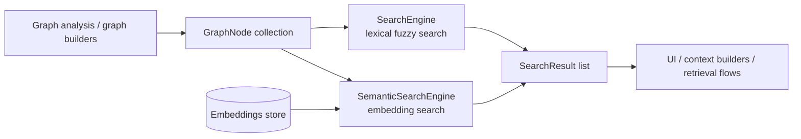
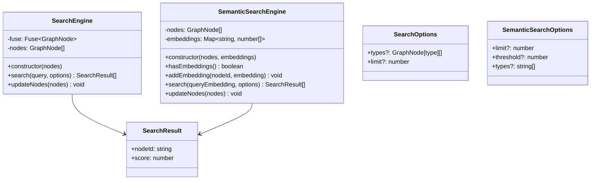
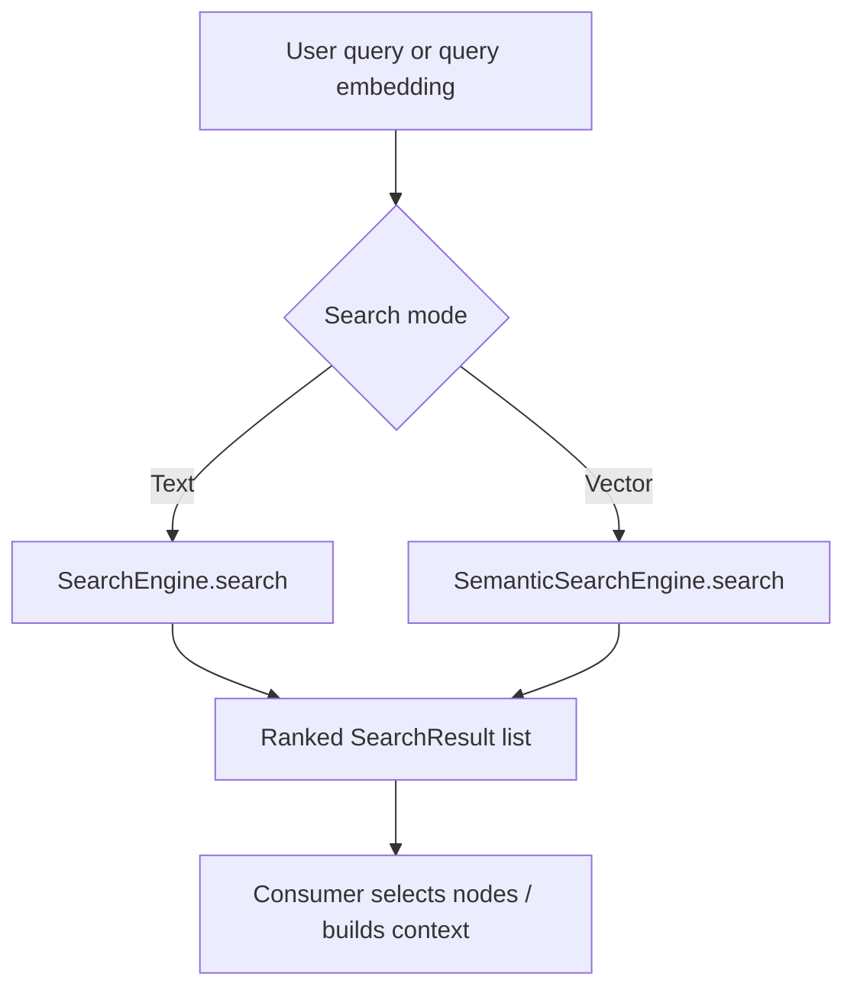

# core_search

## Purpose
The `core_search` module provides two complementary search strategies over the project knowledge graph:

- **Lexical / fuzzy search** via `SearchEngine` in `search.ts`
- **Semantic / embedding-based search** via `SemanticSearchEngine` in `embedding-search.ts`

Together, these components let the system find relevant `GraphNode` entries by name, tags, summaries, language notes, or vector similarity. The module is intentionally lightweight and depends primarily on the shared graph schema defined in `core_schema_and_types`.

## Where it fits in the system
`core_search` sits on top of the graph model produced by analysis and normalization pipelines. It does not build the graph itself; instead, it consumes `GraphNode` data and optional embeddings to support interactive lookup, ranking, and retrieval features used by higher-level application flows.

### Dependencies
- **Input graph model:** `core_schema_and_types` → [`core_schema_and_types.md`](core_schema_and_types.md)
- **Upstream graph producers:** `core_analysis` → [`core_analysis.md`](core_analysis.md)
- **Potential consumers:** dashboard and app context builders that need node lookup and retrieval behavior

## Architecture overview

### Component relationships

## High-level functionality

### `search.ts`
Provides fuzzy text search over graph nodes using `fuse.js`.

Key behavior:
- Searches across `name`, `tags`, `summary`, and `languageNotes`
- Supports optional filtering by node type
- Returns normalized results as `{ nodeId, score }`
- Rebuilds the Fuse index when nodes change

See: [`search.ts`](search.ts)

### `embedding-search.ts`
Provides semantic retrieval using cosine similarity between query embeddings and stored node embeddings.

Key behavior:
- Stores embeddings in a `Map<string, number[]>`
- Computes cosine similarity for each candidate node
- Supports thresholding, type filtering, and result limiting
- Returns results in the same `SearchResult` shape as lexical search

See: [`embedding-search.ts`](embedding-search.md)

## Search flow

## Notes on design
- The module keeps the result contract small and stable: both engines emit `SearchResult[]`.
- Lexical search is optimized for human-entered text and partial matches.
- Semantic search is optimized for embedding-driven retrieval when vector data is available.
- Both engines expose `updateNodes()` so they can be refreshed when the graph changes.

## Related documentation
- [`core_schema_and_types.md`](core_schema_and_types.md) — shared graph node and schema types
- [`core_analysis.md`](core_analysis.md) — graph construction and analysis pipeline
- [`core_change_tracking.md`](core_change_tracking.md) — change detection that may trigger search index refreshes
- [`dashboard_graph_view.md`](dashboard_graph_view.md) — graph visualization consumers
- [`app_context_builders`](app_context_builders.md) — context assembly flows that may use search results
