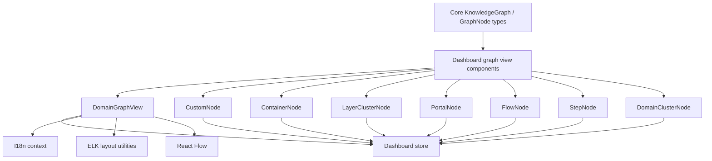
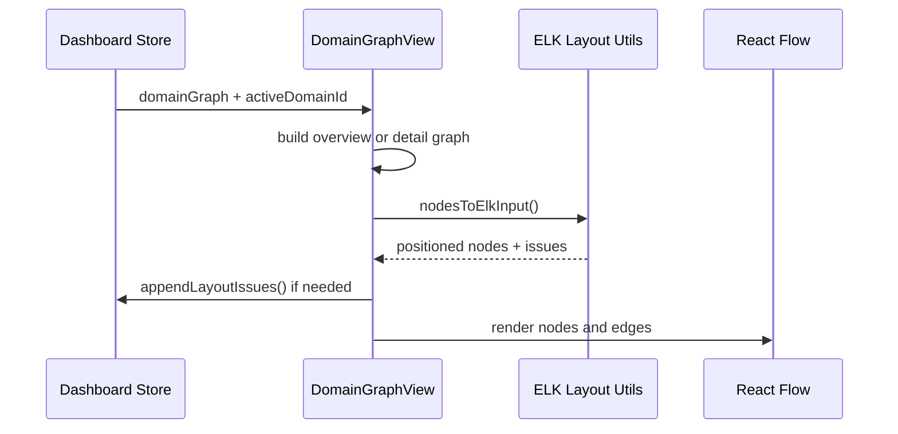
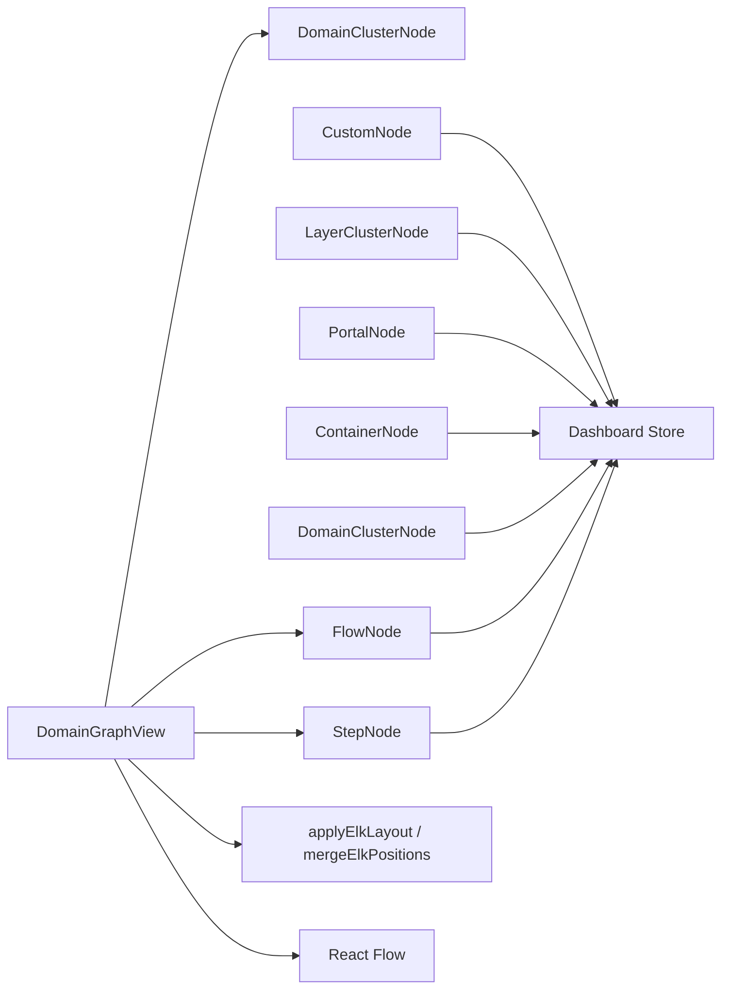

# dashboard_graph_view

## Purpose

`dashboard_graph_view` is the dashboard-side graph rendering module for the **Understand Anything** plugin. It turns graph data from the core analysis layer into interactive React Flow visualizations used to explore domains, flows, steps, generic knowledge nodes, and layout/navigation structures.

This module is primarily responsible for:
- Rendering graph views in the dashboard UI
- Mapping core graph data into React Flow node/edge models
- Applying layout and positioning via ELK-based utilities
- Connecting graph interactions to dashboard state and navigation

## Architecture Overview

The module is composed of several node-rendering components plus a top-level domain graph view. Together they form a presentation layer over the shared graph model defined in the core package.

### Rendering Pipeline

## High-Level Responsibilities

### 1) Domain graph visualization
The main entry point is `DomainGraphView`, which renders either:
- a **domain overview** showing domain clusters and cross-domain links, or
- a **domain detail view** showing flows and steps inside a selected domain.

See: [domain_graph_overview.md](domain_graph_overview.md)

### 2) Generic graph node rendering
`CustomNode` renders the dashboard’s general-purpose graph nodes with type-based styling, selection state, search highlighting, diff overlays, and optional metadata badges.

See: [generic_graph_nodes.md](generic_graph_nodes.md)

### 3) Layout/navigation-oriented nodes
`ContainerNode`, `LayerClusterNode`, and `PortalNode` support higher-level structural navigation views such as container grouping, layer drill-in, and portal transitions.

See: [layout_and_navigation_nodes.md](layout_and_navigation_nodes.md)

## Component Relationships

## Dependencies on Other Modules

This module depends on several other parts of the system:
- **Core schema and types** for `KnowledgeGraph` and `GraphNode`
- **Dashboard store** for active selection, domain navigation, and layout issue reporting
- **I18n context** for localized UI labels
- **Layout utilities** for ELK-based positioning
- **React Flow** for interactive graph rendering

For the underlying data model, refer to the core documentation for shared graph and analysis types.

## Sub-module Documentation

- [domain_graph_overview.md](domain_graph_overview.md) — domain overview/detail graph construction and rendering
- [generic_graph_nodes.md](generic_graph_nodes.md) — reusable custom graph node presentation
- [layout_and_navigation_nodes.md](layout_and_navigation_nodes.md) — container, layer, and portal navigation nodes

## Notes for Maintainers

- `DomainGraphView` intentionally separates structural graph building from async layout application.
- Node components are memoized to reduce unnecessary React Flow re-renders.
- Styling and interaction state are driven by dashboard store selectors, so changes to store shape may affect multiple node components.
- The module is presentation-focused; graph semantics are sourced from core analysis and shared types rather than computed here.
