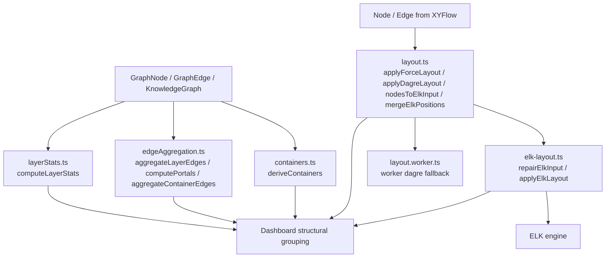
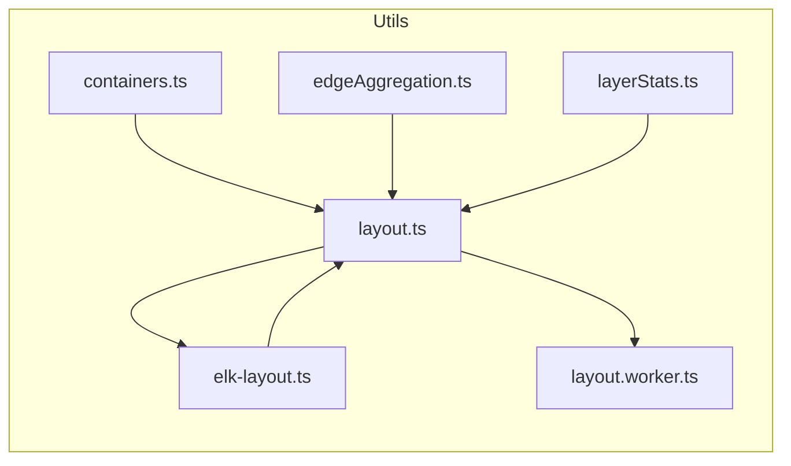
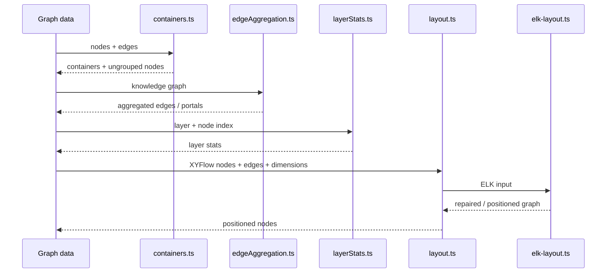

# dashboard_layout_utils

## Purpose

`dashboard_layout_utils` contains the dashboard’s graph layout and aggregation helpers. These utilities transform raw graph data into layout-ready structures, derive containers and portals, aggregate edges across structural boundaries, and repair/execute ELK layouts for rendering in the dashboard.

This module sits at the boundary between the core graph model (`@understand-anything/core/types`) and the dashboard UI. It is responsible for preparing graph data for visual presentation, not for rendering components themselves.

## Architecture overview

## Main responsibilities

### 1. Container derivation

`containers.ts` groups nodes into dashboard containers using either:
- folder structure, or
- community detection fallback when folder grouping is too sparse or too concentrated.

See: [containers.md](containers.md)

### 2. Edge aggregation and portal discovery

`edgeAggregation.ts` summarizes graph connectivity at the layer/container boundary level. It supports:
- layer-to-layer edge aggregation,
- portal computation for a selected layer,
- cross-layer file-node discovery,
- container edge bucketing into intra-container and inter-container groups.

See: [edgeAggregation.md](edgeAggregation.md)

### 3. Layer statistics

`layerStats.ts` computes a compact complexity summary for a layer, optimized for overview rendering.

See: [layerStats.md](layerStats.md)

### 4. Layout preparation and execution

`layout.ts`, `elk-layout.ts`, and `layout.worker.ts` provide the dashboard’s layout pipeline:
- convert XYFlow nodes/edges into ELK input,
- repair malformed ELK graphs before layout,
- run ELK layout and recover from failures,
- optionally use force-directed or dagre-based layout helpers.

See:
- [layout.md](layout.md)
- [elk-layout.md](elk-layout.md)
- [layout.worker.md](layout.worker.md)

## Sub-module documentation

- [containers.md](containers.md)
- [edgeAggregation.md](edgeAggregation.md)
- [elk-layout.md](elk-layout.md)
- [layerStats.md](layerStats.md)
- [layout.md](layout.md)
- [layout.worker.md](layout.worker.md)

## Component relationships

## Data flow

## Notes for maintainers

- The layout helpers intentionally share node dimension constants with ELK repair logic to keep collision behavior consistent.
- Container derivation prefers folder grouping, but falls back to community detection when folder buckets are not meaningful.
- Edge aggregation functions are designed to preserve useful intra-structure edges while compressing cross-boundary noise.

## Related documentation

- [containers.md](containers.md)
- [edgeAggregation.md](edgeAggregation.md)
- [layerStats.md](layerStats.md)
- [layout.md](layout.md)
- [elk-layout.md](elk-layout.md)
- [layout.worker.md](layout.worker.md)
