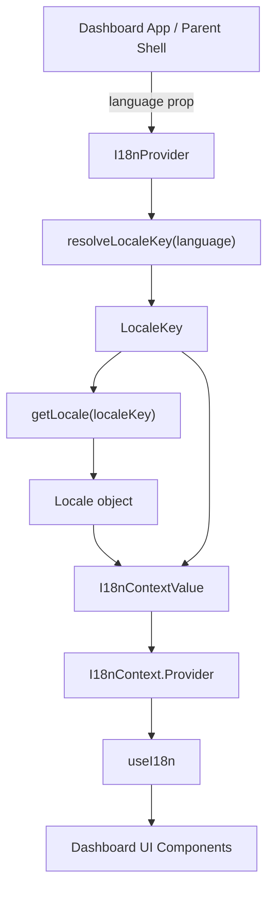
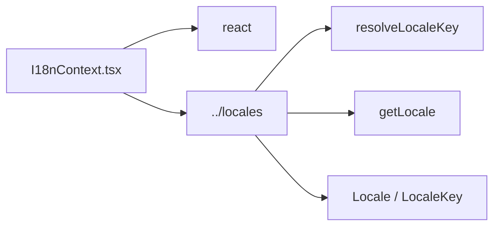
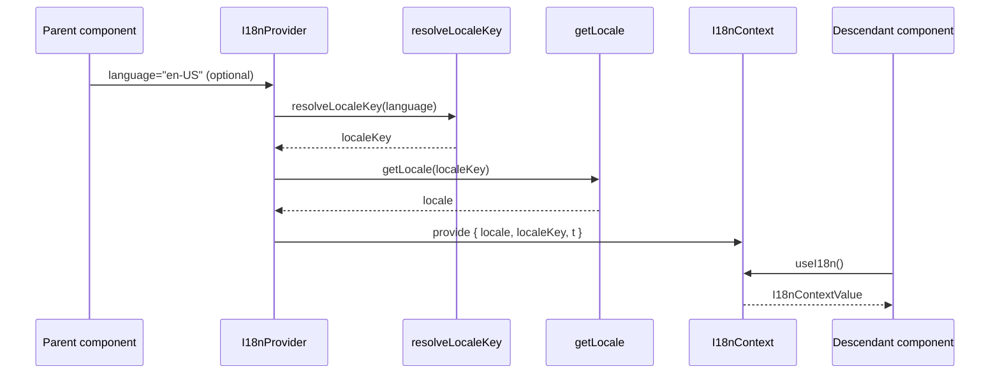
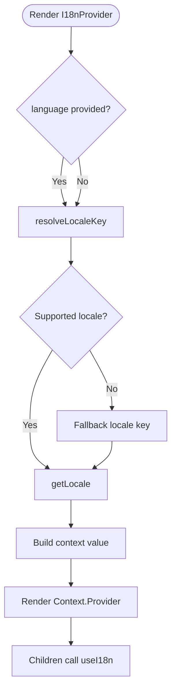
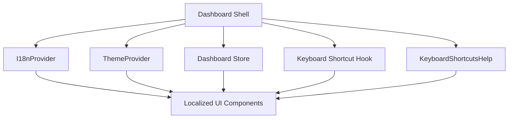

# dashboard_state_and_ui-i18n

## Introduction

The `dashboard_state_and_ui-i18n` module provides the dashboard’s internationalization (i18n) context layer. It is responsible for resolving the active language into a concrete locale, exposing translation data to React components, and enforcing correct usage through a dedicated hook.

This module is intentionally small, but it is a critical part of the dashboard UI composition: any component that renders user-facing text can consume the locale data from this context instead of hard-coding strings or manually threading language props through the tree.

For related dashboard concerns, see:
- [dashboard_state_and_ui-store](dashboard_state_and_ui-store.md) for global dashboard state and filters
- [dashboard_state_and_ui-theme](dashboard_state_and_ui-theme.md) for theme selection and styling context
- [dashboard_state_and_ui-keyboard-shortcuts](dashboard_state_and_ui-keyboard-shortcuts.md) for shortcut definitions and handling
- [dashboard_state_and_ui-shortcuts-help](dashboard_state_and_ui-shortcuts-help.md) for shortcut UI presentation

---

## Module purpose

`dashboard_state_and_ui-i18n` centralizes locale selection and translation lookup for the dashboard. Its responsibilities are:

1. Accept an optional language identifier from the application shell or parent provider.
2. Resolve that identifier into a supported locale key.
3. Load the corresponding locale object.
4. Provide the locale, locale key, and translation bundle to descendants via React context.
5. Offer a safe hook (`useI18n`) that throws when used outside the provider.

This design keeps localization concerns isolated from rendering logic and makes it easy to add or swap locales without changing individual components.

---

## Core component overview

### `I18nContextValue`

The context value exposed to consumers contains three fields:

- `locale`: the resolved locale object
- `localeKey`: the normalized locale identifier used to select the locale
- `t`: the translation bundle, aliased to the locale object for convenience

Although `t` is named like a translation function in many i18n systems, here it is a locale object that likely contains translated labels and strings.

### `I18nContext`

A React context initialized with `null`. It stores the current `I18nContextValue` for the subtree.

### `useI18n()`

A custom hook that reads the context and throws a descriptive error if the hook is used outside `I18nProvider`.

### `I18nProvider`

A provider component that:

- accepts an optional `language` string
- resolves it to a `LocaleKey`
- loads the locale via `getLocale`
- memoizes the computed values
- supplies the resulting context to all descendants

---

## Architecture



### Architectural notes

- The provider is the only place where language normalization occurs.
- Consumers do not need to know how locale selection works.
- The hook enforces provider presence, preventing silent fallback bugs.

---

## Dependency relationships



### Dependency summary

- **React**: `createContext`, `useContext`, and `useMemo` are used to implement the provider and hook.
- **Locales module**: supplies locale resolution and locale data.
- **Dashboard components**: consume the context through `useI18n()`.

> Note: the locale definitions themselves are not duplicated here; they are owned by the dashboard locales module.

---

## Data flow



### Flow explanation

1. The parent passes a language string into `I18nProvider`.
2. The provider normalizes it into a supported locale key.
3. The provider loads the locale bundle.
4. The provider memoizes and publishes the context value.
5. Any descendant can call `useI18n()` to access translations and locale metadata.

---

## Component interaction details

### `I18nProvider`

The provider uses `useMemo` twice:

- once to compute `localeKey` from `language`
- once to compute `locale` from `localeKey`

It then memoizes the final context object so that consumers only re-render when the locale or locale key changes.

This is a good fit for dashboard UI because locale changes are relatively infrequent, while the component tree may be large.

### `useI18n()`

The hook is defensive by design:

- if the context is missing, it throws `useI18n must be used within an I18nProvider`
- this makes integration errors obvious during development
- it avoids undefined checks in every consumer

### `t` alias

The `t` field mirrors `locale`. This suggests the dashboard codebase may use `t` as a shorthand for translation access in components. Keeping both `locale` and `t` available improves ergonomics while preserving explicit locale metadata.

---

## Process flow



### Behavioral expectations

The exact fallback behavior depends on the locale utilities in `../locales`, but the provider clearly assumes that `resolveLocaleKey` returns a valid key for `getLocale`.

---

## Usage pattern

```tsx
import { I18nProvider, useI18n } from "./contexts/I18nContext";

function AppShell() {
  return (
    <I18nProvider language="en">
      <Dashboard />
    </I18nProvider>
  );
}

function Dashboard() {
  const { localeKey, t } = useI18n();

  return <h1>{t.dashboardTitle}</h1>;
}
```

### Recommended usage rules

- Wrap the dashboard subtree in `I18nProvider` as early as possible.
- Use `useI18n()` only inside components rendered beneath the provider.
- Prefer locale-driven labels over hard-coded strings in UI components.

---

## Integration with the dashboard UI layer

This module is part of the dashboard’s shared UI state layer and complements other cross-cutting providers:

- **Theme context**: controls visual appearance and color presets
- **Store**: controls dashboard filters and stateful interactions
- **Keyboard shortcuts**: controls input handling and command discovery
- **Shortcuts help**: renders shortcut documentation in the UI

Together, these modules provide the dashboard with a consistent application shell architecture where concerns are separated but available globally through React context or shared state.



---

## Maintainability considerations

### Strengths

- Minimal API surface
- Clear separation of concerns
- Memoized context value reduces unnecessary renders
- Defensive hook usage improves developer experience

### Extension points

- Add more locale bundles in the locales module
- Expand the context value if components need additional i18n metadata
- Introduce locale-aware formatting helpers if the dashboard needs dates, numbers, or pluralization

### Risks

- If `resolveLocaleKey` and `getLocale` diverge in supported values, provider initialization may fail or fall back unexpectedly.
- Overloading `t` to mean a locale object may be confusing to new contributors if not documented consistently.

---

## Related documentation

- [dashboard_state_and_ui-theme](dashboard_state_and_ui-theme.md)
- [dashboard_state_and_ui-store](dashboard_state_and_ui-store.md)
- [dashboard_state_and_ui-keyboard-shortcuts](dashboard_state_and_ui-keyboard-shortcuts.md)
- [dashboard_state_and_ui-shortcuts-help](dashboard_state_and_ui-shortcuts-help.md)

If you need the locale definitions themselves, refer to the dashboard locales module documentation when available.
