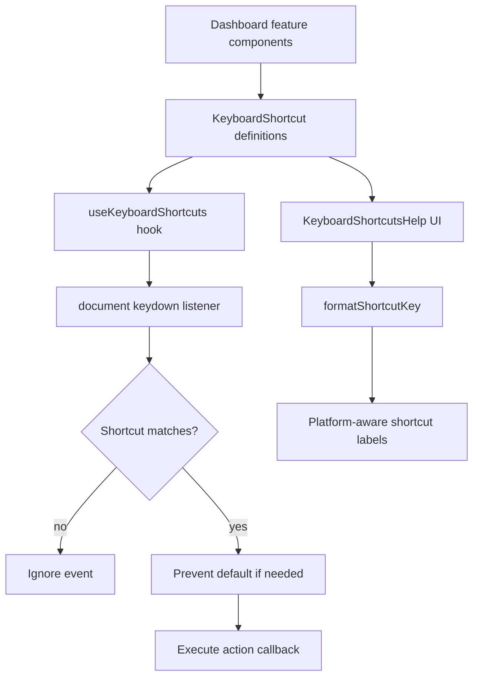
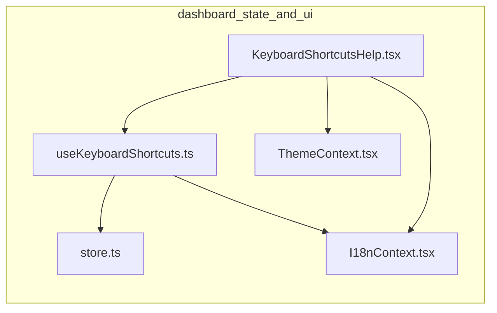
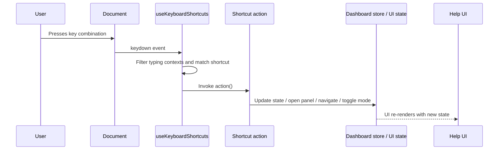
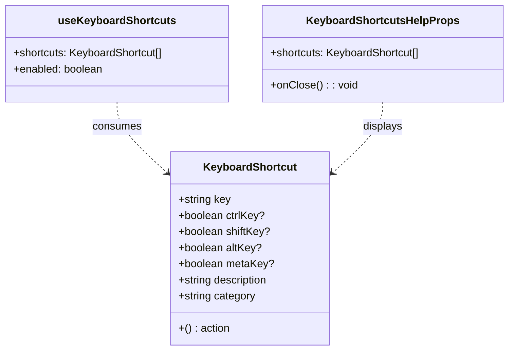
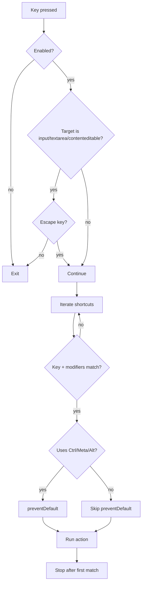

# dashboard_state_and_ui-keyboard-shortcuts

## Introduction

This module defines the dashboard’s keyboard shortcut contract and the React hook that binds shortcut definitions to global `keydown` handling. It is the interaction layer between dashboard state/actions and user input, enabling fast navigation, view toggles, overlays, and modal-style commands without requiring mouse interaction.

The module is intentionally small, but it is central to dashboard usability because it standardizes:

- how shortcuts are declared (`KeyboardShortcut`)
- how shortcuts are registered and cleaned up (`useKeyboardShortcuts`)
- how shortcuts are rendered for help UI (`formatShortcutKey`)
- how shortcut metadata is surfaced in the help dialog (`KeyboardShortcutsHelpProps`)

For broader context on the state that shortcuts typically manipulate, see:

- [dashboard_state_and_ui-store](dashboard_state_and_ui-store.md)
- [dashboard_state_and_ui-shortcuts-help](dashboard_state_and_ui-shortcuts-help.md)
- [dashboard_state_and_ui-theme](dashboard_state_and_ui-theme.md)
- [dashboard_state_and_ui-i18n](dashboard_state_and_ui-i18n.md)

---

## Module purpose

The dashboard uses keyboard shortcuts as a cross-cutting control surface for the UI. Rather than each component attaching its own listeners, the module provides a reusable hook that accepts a list of shortcut descriptors and dispatches the matching action when the user presses the corresponding key combination.

This design keeps shortcut logic:

- declarative: shortcuts are data, not scattered event handlers
- composable: multiple features can contribute shortcuts
- maintainable: cleanup is handled automatically by React lifecycle
- presentable: the same shortcut definitions can be shown in a help overlay

---

## Core components

### `KeyboardShortcut`

A shortcut descriptor used throughout the dashboard.

```ts
export interface KeyboardShortcut {
  key: string;
  ctrlKey?: boolean;
  shiftKey?: boolean;
  altKey?: boolean;
  metaKey?: boolean;
  description: string;
  action: () => void;
  category: string;
}
```

#### Fields

- `key`: the primary key to match, compared case-insensitively
- modifier flags: `ctrlKey`, `shiftKey`, `altKey`, `metaKey`
- `description`: human-readable label for help panels
- `action`: callback executed when the shortcut matches
- `category`: grouping label for help UI and organization

#### Design notes

- Modifier flags are optional, but matching is strict when provided.
- If a modifier is omitted, the hook expects that modifier to be absent.
- This makes shortcut definitions precise and avoids accidental collisions.

---

### `useKeyboardShortcuts(shortcuts, enabled = true)`

A React hook that installs a document-level `keydown` listener and dispatches the first matching shortcut.

#### Behavior

1. Registers a `keydown` listener on `document`.
2. Ignores all shortcuts when `enabled` is `false`.
3. Suppresses shortcut handling while the user is typing in:
   - `<input>`
   - `<textarea>`
   - contenteditable elements
4. Allows `Escape` to pass through even while typing, so modal dismissal remains available.
5. Matches the event against the provided shortcut list.
6. Prevents default browser behavior for shortcuts that use `Ctrl`, `Meta`, or `Alt`.
7. Executes the shortcut action and stops after the first match.
8. Removes the listener on cleanup.

#### Matching rules

The hook compares:

- `event.key` vs `shortcut.key` using lowercase comparison
- each modifier flag against the event state

A shortcut only matches when all specified modifiers align and unspecified modifiers are absent.

#### Input-field exception

The hook intentionally avoids interfering with text entry. This is important for dashboard features such as search, filters, and editable metadata fields. The only exception is `Escape`, which is commonly used to close dialogs or cancel transient UI.

#### Lifecycle and React integration

Because the listener is created inside `useEffect`, it is tied to the component lifecycle. When the shortcut list or enabled state changes, the effect re-runs and rebinds the listener.

---

### `formatShortcutKey(shortcut)`

Formats a shortcut descriptor into a platform-aware display string.

#### Output behavior

- Uses macOS symbols when the platform appears to be macOS:
  - `⌘` for command/control-equivalent shortcuts
  - `⌥` for alt/option
  - `⇧` for shift
- Uses text labels on non-macOS platforms:
  - `Ctrl`
  - `Alt`
- Uppercases normal keys for display
- Preserves punctuation keys that inherently require shift, such as `?`, `!`, or `@`

#### Why this matters

The dashboard’s shortcut help UI should reflect the user’s platform conventions. This function centralizes that formatting so the help overlay and any future shortcut listings remain consistent.

> Note: the source currently contains mojibake-like symbol text in the code comments/strings (`⌘`, `⇧`, `⌥`). The intended output is the standard macOS glyph set (`⌘`, `⇧`, `⌥`).

---

## Architecture overview



### Interpretation

- Feature components define shortcut metadata and actions.
- The hook binds those definitions to browser events.
- The help component renders the same definitions for discoverability.
- Formatting is shared so the displayed shortcut text matches the actual binding model.

---

## Dependency relationships



### Notes

- `useKeyboardShortcuts` is the core interaction primitive.
- `KeyboardShortcutsHelp` depends on the shortcut model and formatting conventions.
- The store is not imported directly by the hook in the provided code, but shortcut actions commonly call store methods such as navigation, toggles, and modal open/close operations.
- Theme and i18n contexts are typically used by the help UI to present localized labels and theme-aware styling.

---

## Data flow



### Typical state transitions triggered by shortcuts

Shortcuts often drive actions such as:

- selecting or navigating nodes
- opening and closing panels
- toggling filter/export/path-finder overlays
- switching view modes or detail levels
- controlling tours and focus mode
- opening code viewer or diff overlays

For the underlying state model, see [dashboard_state_and_ui-store](dashboard_state_and_ui-store.md).

---

## Component interaction model



### Practical implication

The same shortcut descriptor type is shared between runtime behavior and user-facing documentation. This reduces drift between what the app does and what the help overlay claims it does.

---

## Process flow: shortcut handling



---

## Integration with the dashboard state layer

The shortcut module is most useful when paired with the dashboard store. The store exposes many actions that are natural shortcut targets, including:

- navigation: `selectNode`, `navigateToNode`, `goBackNode`, `navigateToOverview`
- view control: `setViewMode`, `setDetailLevel`, `toggleShowFunctionsInClassView`
- overlays and panels: `toggleFilterPanel`, `toggleExportMenu`, `togglePathFinder`
- focus and inspection: `setFocusNode`, `openCodeViewer`, `closeCodeViewer`
- tours and guided flows: `startTour`, `nextTourStep`, `prevTourStep`
- diff and analysis: `toggleDiffMode`, `clearDiffOverlay`

This module does not define those actions itself; it provides the mechanism for invoking them from keyboard input.

See [dashboard_state_and_ui-store](dashboard_state_and_ui-store.md) for the full store contract.

---

## Integration with shortcut help UI

`KeyboardShortcutsHelp` consumes the shortcut list and displays it in a modal or overlay. The help component typically relies on:

- `KeyboardShortcut.description` for labels
- `KeyboardShortcut.category` for grouping
- `formatShortcutKey` for display text
- `onClose` for dismissing the overlay

This makes the help panel a direct reflection of the active shortcut configuration.

See [dashboard_state_and_ui-shortcuts-help](dashboard_state_and_ui-shortcuts-help.md).

---

## Integration with localization and theming

Although the hook itself is UI-agnostic, the surrounding dashboard experience often uses:

- [dashboard_state_and_ui-i18n](dashboard_state_and_ui-i18n.md) for localized shortcut descriptions and help text
- [dashboard_state_and_ui-theme](dashboard_state_and_ui-theme.md) for styling the help overlay and shortcut badges

This separation keeps the shortcut engine independent while allowing the presentation layer to adapt to locale and theme.

---

## Implementation characteristics

### Strengths

- Simple API surface
- Works with any feature that can expose an action callback
- Automatically cleans up event listeners
- Avoids interfering with text input
- Supports platform-aware shortcut display

### Constraints

- Matching is exact; there is no chord sequencing or multi-step shortcut support
- The hook processes shortcuts in array order and stops at the first match
- The current implementation assumes a browser environment with `document` and `navigator`
- Platform detection is heuristic and may vary across browsers

### Maintenance considerations

- Keep shortcut definitions centralized where possible
- Ensure help UI uses the same shortcut list as the runtime hook
- Prefer stable callback references when passing shortcut arrays to avoid unnecessary effect rebinds
- Validate that shortcuts do not conflict with browser-reserved combinations

---

## Recommended usage pattern

```ts
const shortcuts: KeyboardShortcut[] = [
  {
    key: "k",
    metaKey: true,
    description: "Open command palette",
    category: "Navigation",
    action: () => setCommandPaletteOpen(true),
  },
  {
    key: "Escape",
    description: "Close overlays",
    category: "General",
    action: () => closeAllPanels(),
  },
];

useKeyboardShortcuts(shortcuts, isDashboardReady);
```

### Guidance

- Use descriptive categories to improve help readability.
- Keep actions small and delegate state changes to the store or feature controller.
- Include `Escape` for dismissible UI.
- Avoid shortcuts that conflict with browser or OS defaults unless there is a strong UX reason.

---

## Related documentation

- [dashboard_state_and_ui-store](dashboard_state_and_ui-store.md)
- [dashboard_state_and_ui-shortcuts-help](dashboard_state_and_ui-shortcuts-help.md)
- [dashboard_state_and_ui-theme](dashboard_state_and_ui-theme.md)
- [dashboard_state_and_ui-i18n](dashboard_state_and_ui-i18n.md)
- [dashboard_graph_view](dashboard_graph_view.md)

---

## Summary

The `dashboard_state_and_ui-keyboard-shortcuts` module provides the dashboard’s reusable keyboard interaction layer. It defines a shared shortcut schema, binds shortcut actions to global keyboard events, and formats shortcut labels for display in help UI. In practice, it acts as the bridge between dashboard state/actions and efficient user input, making it a foundational utility for navigation and control across the dashboard experience.
