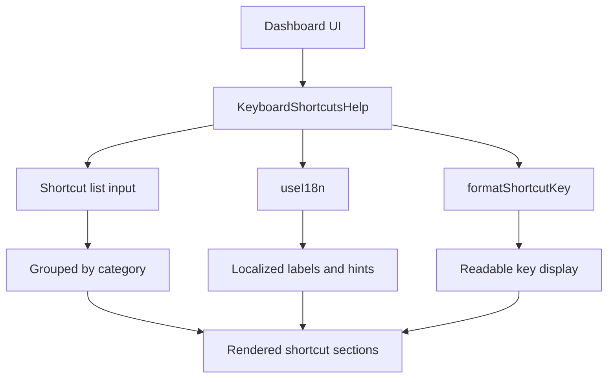
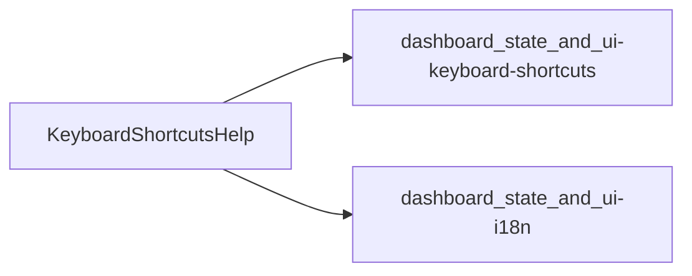
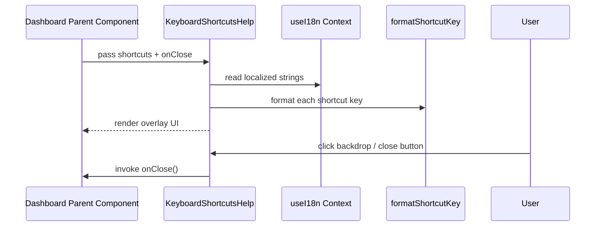
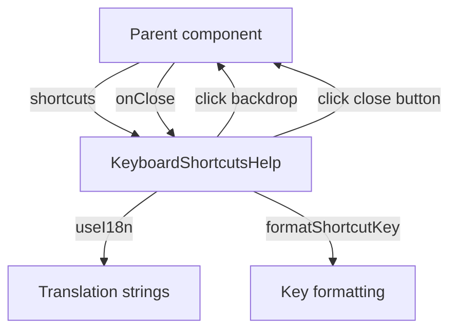
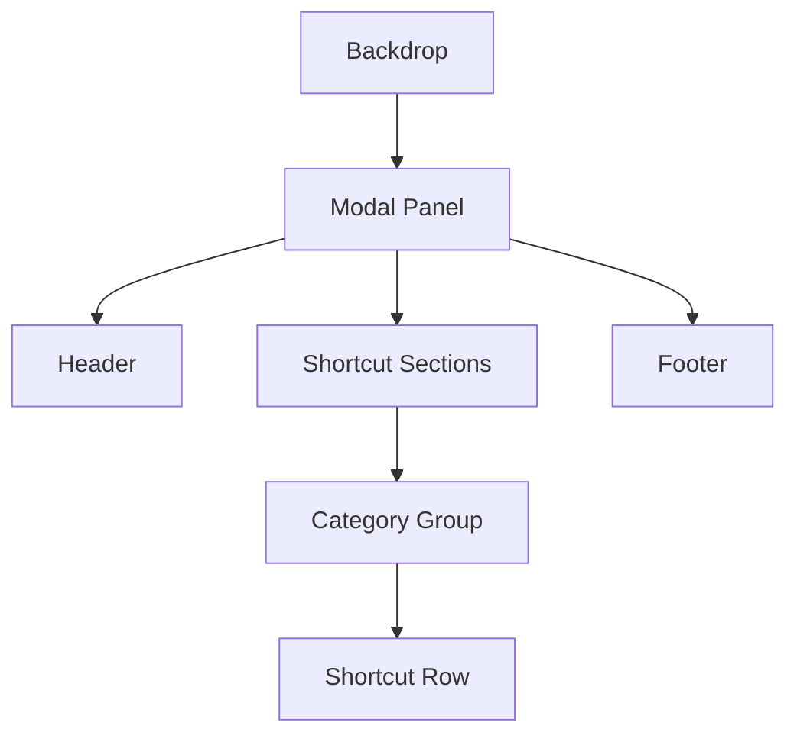
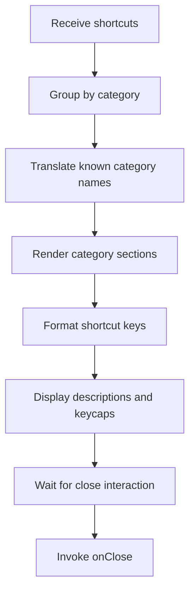

# dashboard_state_and_ui-shortcuts-help

## Introduction

The `dashboard_state_and_ui-shortcuts-help` module provides the dashboard’s keyboard shortcut help overlay. It is a focused presentation component that renders a modal-style panel listing available shortcuts, grouped by category and localized through the dashboard i18n layer.

This module is intentionally small, but it sits at an important UX boundary: it connects shortcut metadata produced elsewhere in the dashboard with the user-facing help UI. For the shortcut definitions and keyboard handling logic, see [dashboard_state_and_ui-keyboard-shortcuts](dashboard_state_and_ui-keyboard-shortcuts.md). For localization primitives and translation structure, see [dashboard_state_and_ui-i18n](dashboard_state_and_ui-i18n.md).

---

## Purpose and Responsibilities

`KeyboardShortcutsHelp` is responsible for:

- Rendering a full-screen overlay that visually separates shortcut help from the rest of the dashboard.
- Grouping shortcut definitions by category.
- Translating category labels and static help text via the i18n context.
- Formatting shortcut key combinations into a human-readable display.
- Providing close interactions through both backdrop click and explicit close button.

It does **not**:

- Define keyboard shortcuts.
- Register or listen for keyboard events.
- Manage global UI state.
- Own translation data.

Those concerns belong to the keyboard shortcut hook, dashboard store, and i18n module respectively.

---

## Core Component

### `KeyboardShortcutsHelpProps`

```ts
interface KeyboardShortcutsHelpProps {
  shortcuts: KeyboardShortcut[];
  onClose: () => void;
}
```

#### Props

- `shortcuts`: The list of shortcut definitions to display.
- `onClose`: Callback invoked when the overlay should be dismissed.

#### Dependencies

- `KeyboardShortcut` type from [dashboard_state_and_ui-keyboard-shortcuts](dashboard_state_and_ui-keyboard-shortcuts.md)
- `formatShortcutKey` helper from [dashboard_state_and_ui-keyboard-shortcuts](dashboard_state_and_ui-keyboard-shortcuts.md)
- `useI18n` from [dashboard_state_and_ui-i18n](dashboard_state_and_ui-i18n.md)

---

## Component Behavior

### 1. Shortcut grouping

The component groups incoming shortcuts by `shortcut.category` using a `reduce` operation.

This produces a structure like:

```ts
{
  General: [...],
  Navigation: [...],
  Tour: [...],
  View: [...]
}
```

This grouping is purely presentational and assumes the shortcut objects already contain category metadata.

### 2. Category translation

The component maps known category names to localized labels:

- `General`
- `Navigation`
- `Tour`
- `View`

If a category is not recognized, the raw category string is displayed as a fallback.

### 3. Modal overlay interaction

The overlay uses two close mechanisms:

- Clicking the backdrop closes the modal.
- Clicking the close button in the header closes the modal.

Clicks inside the modal content stop propagation so the overlay does not close accidentally.

### 4. Shortcut rendering

Each shortcut row displays:

- The shortcut description
- The formatted key combination in a `<kbd>` element

This keeps the help panel readable and consistent with keyboard-centric UX patterns.

---

## Architecture Overview



### Interpretation

- The dashboard passes shortcut metadata into the help component.
- The component relies on i18n for user-facing text.
- Shortcut formatting is delegated to the keyboard shortcut utility layer.
- The final output is a localized, grouped, modal help view.

---

## Dependency Map



### Dependency Notes

- **Keyboard shortcut module**: supplies the shortcut model and formatting helper.
- **i18n module**: supplies translated strings for titles, hints, and category labels.

For broader dashboard state management, see [dashboard_state_and_ui-store](dashboard_state_and_ui-store.md). For theme styling primitives used by the surrounding dashboard shell, see [dashboard_state_and_ui-theme](dashboard_state_and_ui-theme.md).

---

## Data Flow



### Data Flow Summary

1. A parent dashboard component decides when to show the help overlay.
2. It passes the current shortcut list and close handler into `KeyboardShortcutsHelp`.
3. The component reads localized labels from the i18n context.
4. It formats each shortcut key combination for display.
5. User interaction triggers `onClose`, allowing the parent to hide the overlay.

---

## Component Interaction Details



### Interaction Characteristics

- The component is **controlled** by its parent; it does not manage its own visibility.
- It is **stateless** with respect to shortcut data.
- It is **presentation-oriented**, with minimal logic limited to grouping and translation lookup.

---

## UI Structure

The rendered UI is composed of three major regions:

1. **Backdrop**
   - Full-screen dark overlay
   - Blur effect for focus

2. **Modal panel**
   - Centered container
   - Scrollable content area
   - Sticky header and footer

3. **Shortcut sections**
   - Category headings
   - Shortcut rows with descriptions and keycaps



---

## Process Flow



### Process Notes

- Grouping happens on every render, which is acceptable for the small data set typically used in shortcut help.
- Translation lookup is static and keyed by known category names.
- The component remains simple and predictable, making it easy to reuse in different dashboard entry points.

---

## Integration with the Dashboard System

This module is part of the dashboard UI layer and typically appears alongside:

- Global dashboard state from [dashboard_state_and_ui-store](dashboard_state_and_ui-store.md)
- Keyboard shortcut registration from [dashboard_state_and_ui-keyboard-shortcuts](dashboard_state_and_ui-keyboard-shortcuts.md)
- Theme styling from [dashboard_state_and_ui-theme](dashboard_state_and_ui-theme.md)
- Localization from [dashboard_state_and_ui-i18n](dashboard_state_and_ui-i18n.md)

In practice, a parent dashboard component may:

1. Read shortcut definitions from the keyboard shortcut hook.
2. Store a boolean flag in dashboard state to show/hide the help overlay.
3. Render `KeyboardShortcutsHelp` when the overlay is active.
4. Use theme and i18n providers to ensure consistent styling and language.

---

## Design Considerations

### Strengths

- Small and easy to reason about.
- Clear separation between shortcut definition and shortcut presentation.
- Localized labels improve accessibility and internationalization.
- Backdrop and close button support intuitive dismissal.

### Limitations

- Category translation is hard-coded to a fixed set of known categories.
- Shortcut grouping is recomputed during render.
- The component assumes shortcut objects are already normalized and valid.

### Extension Points

- Add more category translations if the shortcut taxonomy expands.
- Support richer shortcut metadata such as platform-specific labels.
- Add search/filtering if the shortcut list becomes large.

---

## Related Modules

- [dashboard_state_and_ui-keyboard-shortcuts](dashboard_state_and_ui-keyboard-shortcuts.md) — shortcut definitions, formatting, and keyboard handling.
- [dashboard_state_and_ui-i18n](dashboard_state_and_ui-i18n.md) — translation context and localized strings.
- [dashboard_state_and_ui-store](dashboard_state_and_ui-store.md) — dashboard state management.
- [dashboard_state_and_ui-theme](dashboard_state_and_ui-theme.md) — theme context and styling configuration.

---

## Summary

`dashboard_state_and_ui-shortcuts-help` is the dashboard’s shortcut reference overlay. It transforms shortcut metadata into a localized, grouped, modal help view and delegates all shortcut definition and translation concerns to adjacent modules. Its simplicity makes it a stable UI boundary between keyboard interaction logic and user-facing documentation.
