# dashboard_state_and_ui-store

This module defines the central client-side dashboard store used by the dashboard UI to coordinate graph loading, navigation, filtering, search, tours, domain switching, container expansion, layout caching, and UI overlays. It is implemented as a [Zustand](https://github.com/pmndrs/zustand) store and acts as the shared state backbone for most dashboard interactions.

For broader context, see also:
- [dashboard_state_and_ui-theme.md](dashboard_state_and_ui-theme.md)
- [dashboard_state_and_ui-i18n.md](dashboard_state_and_ui-i18n.md)
- [dashboard_state_and_ui-keyboard-shortcuts.md](dashboard_state_and_ui-keyboard-shortcuts.md)
- [dashboard_state_and_ui-shortcuts-help.md](dashboard_state_and_ui-shortcuts-help.md)
- [dashboard_graph_view.md](dashboard_graph_view.md)
- [core_schema_and_types.md](core_schema_and_types.md)
- [core_search.md](core_search.md)

## Purpose

`store.ts` provides a single source of truth for dashboard state. It keeps the graph model and all UI state in sync so that views can react consistently to:

- loaded knowledge graphs and derived indexes
- node selection and navigation history
- layer drill-down and overview navigation
- search queries and results
- tour playback and highlighted nodes
- diff overlays and focus mode
- filter panels, export menus, and path finder visibility
- container expansion and layout caches
- layout warnings and repair issues

The store also encodes several important invariants, such as:

- node-to-layer lookup is rebuilt whenever a graph is replaced
- navigation uses a canonical first-matching layer for a node
- filtering uses all layer memberships for a node
- layout caches are invalidated whenever visible node membership changes
- tour transitions can reset layer-scoped caches when the active layer changes

---

## Core types and constants

### State-shaping enums and unions

The module defines the primary dashboard state categories:

- `Persona`: `non-technical | junior | experienced`
- `NavigationLevel`: `overview | layer-detail`
- `NodeType`: broad node taxonomy used by filters and graph rendering
- `Complexity`: `simple | moderate | complex`
- `EdgeCategory`: semantic grouping of edge types
- `ViewMode`: `structural | domain | knowledge`
- `DetailLevel`: `file | class`
- `NodeCategory`: UI-facing node filter groups (`code`, `config`, `docs`, `infra`, `data`, `domain`, `knowledge`)

### Filter state

```ts
export interface FilterState {
  nodeTypes: Set<NodeType>;
  complexities: Set<Complexity>;
  layerIds: Set<string>;
  edgeCategories: Set<EdgeCategory>;
}
```

The store keeps filters as `Set`s so membership checks are efficient and updates can preserve semantic intent.

### Global filter constants

- `ALL_NODE_TYPES`
- `ALL_COMPLEXITIES`
- `ALL_EDGE_CATEGORIES`
- `EDGE_CATEGORY_MAP`
- `DOMAIN_EDGE_TYPES`

`EDGE_CATEGORY_MAP` is the canonical mapping from dashboard-facing edge categories to concrete graph edge labels. This mapping is used by the UI to group and toggle edge visibility without duplicating edge semantics elsewhere.

---

## Store architecture

### High-level responsibilities

The store combines several concerns that are tightly coupled in the dashboard:

1. **Graph state**
   - current `KnowledgeGraph`
   - node and layer lookup indexes
   - domain graph and active domain selection

2. **Navigation state**
   - selected node
   - navigation level
   - active layer
   - history stack
   - focus node

3. **Search state**
   - query text
   - search engine instance
   - search results
   - search mode

4. **UI state**
   - code viewer open/expanded state
   - filter panel and export menu visibility
   - path finder visibility
   - persona selection
   - detail level and function expansion toggle

5. **Tour state**
   - active tour flag
   - current step
   - highlighted nodes
   - tour-fit pending flag

6. **Graph layout state**
   - expanded containers
   - pending focus container
   - container layout cache
   - container size memory
   - stage 1 tick

7. **Diagnostics**
   - layout issues accumulated from repair or layout steps

### Store implementation

The store is created with Zustand:

```ts
export const useDashboardStore = create<DashboardStore>()((set, get) => ({ ... }))
```

The store uses `set` for state updates and `get` for reading current state inside actions.

---

## Dependency overview

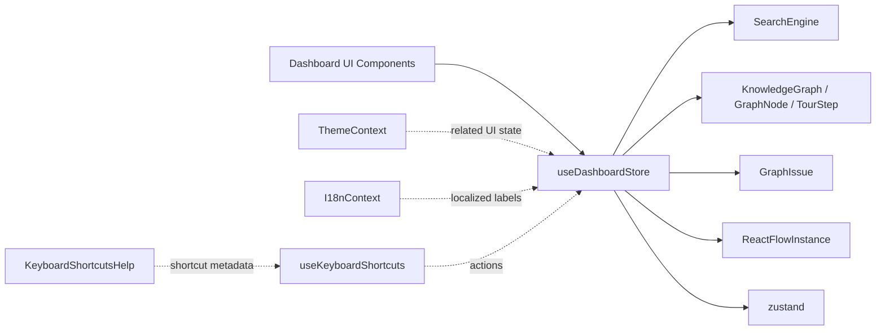

### External dependencies

- `zustand` for state management
- `@understand-anything/core/search` for fuzzy search
- `@understand-anything/core/schema` for layout issue reporting
- `@understand-anything/core/types` for graph and tour types
- `@xyflow/react` for the React Flow instance reference

### Internal dashboard dependencies

This store is consumed by graph views, sidebars, search controls, tour controls, and layout components. It is also coordinated with:

- [dashboard_graph_view.md](dashboard_graph_view.md) for graph rendering and container expansion
- [dashboard_state_and_ui-theme.md](dashboard_state_and_ui-theme.md) for theme selection
- [dashboard_state_and_ui-i18n.md](dashboard_state_and_ui-i18n.md) for localized labels
- [dashboard_state_and_ui-keyboard-shortcuts.md](dashboard_state_and_ui-keyboard-shortcuts.md) for action bindings

---

## Graph indexing and lookup strategy

### `buildGraphIndexes(graph)`

This helper constructs three lookup structures from a `KnowledgeGraph`:

- `nodesById: Map<string, GraphNode>`
- `nodeIdToLayerId: Map<string, string>`
- `nodeIdToLayerIds: Map<string, Set<string>>`

#### Why two layer indexes exist

The module intentionally keeps both a canonical layer lookup and a full membership lookup:

- **`nodeIdToLayerId`**: first matching layer wins
  - used for navigation and drill-down
  - preserves stable canonical layer selection
  - important when a node appears in multiple layers

- **`nodeIdToLayerIds`**: all memberships
  - used for filtering and membership queries
  - ensures a node passes if it belongs to any selected layer

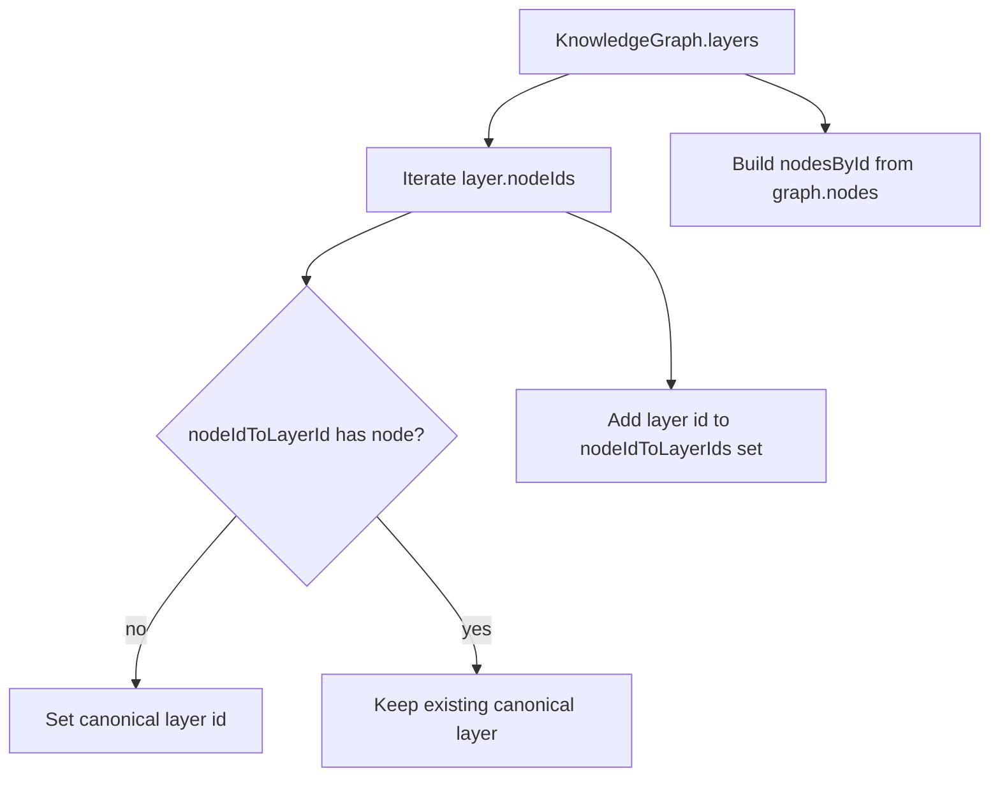

### Practical effect

This design prevents a subtle regression where filtering would incorrectly hide nodes that belong to multiple layers if only the first layer were considered.

---

## State model

### Core graph and navigation state

- `graph`: current `KnowledgeGraph` or `null`
- `nodesById`: node lookup map
- `nodeIdToLayerId`: canonical node-to-layer map
- `nodeIdToLayerIds`: full node-to-layer membership map
- `selectedNodeId`: currently selected node
- `navigationLevel`: overview or layer detail
- `activeLayerId`: current layer in layer-detail mode
- `focusNodeId`: node used for focus mode
- `nodeHistory`: bounded navigation history stack

### Search state

- `searchQuery`: current query string
- `searchResults`: current search results
- `searchEngine`: `SearchEngine | null`
- `searchMode`: `fuzzy | semantic`

### Tour state

- `tourActive`
- `currentTourStep`
- `tourHighlightedNodeIds`
- `tourFitPending`

### UI state

- `codeViewerOpen`
- `codeViewerNodeId`
- `codeViewerExpanded`
- `filterPanelOpen`
- `exportMenuOpen`
- `pathFinderOpen`
- `persona`
- `detailLevel`
- `showFunctionsInClassView`
- `reactFlowInstance`

### Diff and analysis state

- `diffMode`
- `changedNodeIds`
- `affectedNodeIds`
- `layoutIssues`

### Container and layout state

- `expandedContainers`
- `pendingFocusContainer`
- `containerLayoutCache`
- `containerSizeMemory`
- `stage1Tick`

### Domain view state

- `viewMode`
- `isKnowledgeGraph`
- `domainGraph`
- `activeDomainId`

---

## Action groups

## 1) Graph loading and replacement

### `setGraph(graph)`

Replaces the current graph and rebuilds all graph-dependent state:

- creates a new `SearchEngine` from `graph.nodes`
- re-runs the current search query if present
- rebuilds node/layer indexes
- resets navigation and selection state
- resets container caches and layout memory
- clears layout issues
- preserves domain view only if a domain graph is already loaded

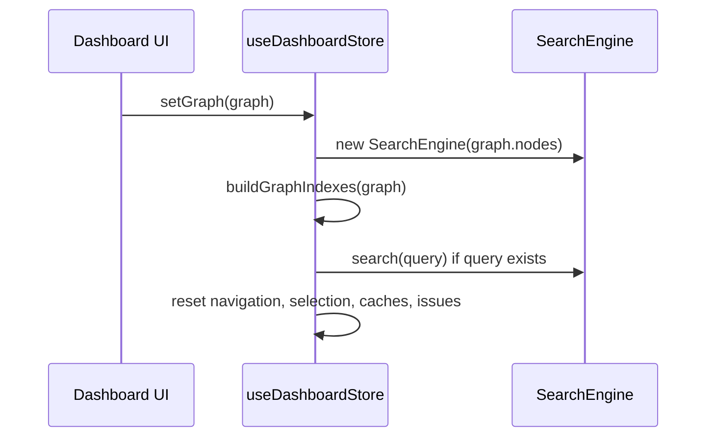

### Important behavior

If the store is already in domain mode and `domainGraph` exists, `setGraph` keeps `viewMode = "domain"`; otherwise it resets to structural mode.

---

## 2) Node selection and navigation

### `selectNode(nodeId)`

Updates the selected node and pushes the previous selection into history when navigating to a different node.

### `navigateToNode(nodeId)`

Delegates to `navigateToNodeInLayer(nodeId)`.

### `navigateToNodeInLayer(nodeId)`

Navigates to a node and, if the node belongs to a layer, switches to layer-detail mode and activates that layer.

Behavior summary:

- if the node has a layer, set:
  - `navigationLevel = "layer-detail"`
  - `activeLayerId = layerId`
  - `selectedNodeId = nodeId`
  - clear focus and code viewer state
- otherwise only update selection and history

### `navigateToHistoryIndex(index)`

Jumps to a prior node in the history stack and restores layer-detail mode if the target node belongs to a layer.

### `goBackNode()`

Pops the most recent history entry and navigates back to it.

### `drillIntoLayer(layerId)`

Enters a specific layer directly and clears selection, focus, code viewer state, and layer-scoped layout caches.

### `navigateToOverview()`

Returns to overview mode and clears layer-scoped UI state.

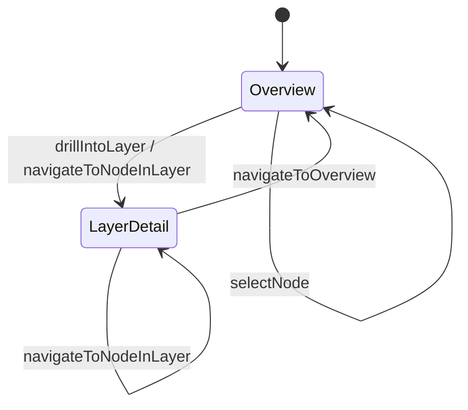

### History behavior

The history stack is bounded by `MAX_HISTORY = 50` to prevent unbounded growth.

---

## 3) Focus mode

### `setFocusNode(nodeId)`

Enables focus mode by setting both `focusNodeId` and `selectedNodeId`.

This action also clears container caches because focus mode changes the visible node set to the focused node plus its 1-hop neighborhood.

---

## 4) Search

### `setSearchMode(mode)`

Stores the selected search mode. The current implementation still uses the fuzzy engine for both modes.

### `setSearchQuery(query)`

Runs search against the current `SearchEngine` when the query is non-empty.

Behavior:

- empty query → clear results
- no engine → clear results
- non-empty query → search and store results

### Search engine integration

The store uses `SearchEngine` from the core search module, which performs fuzzy matching over graph nodes.

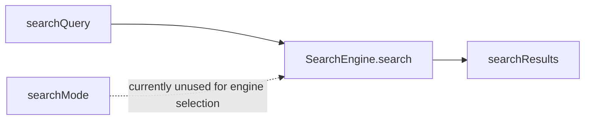

### Note on semantic mode

`searchMode` already supports `semantic`, but the store currently routes both modes through the same fuzzy engine. This leaves room for future integration with semantic search when embeddings are available.

---

## 5) Persona and detail level

### `setPersona(persona)`

Updates the dashboard persona and clears layout caches because persona changes can affect visible node types.

### `setDetailLevel(level)`

Switches between file-level and class-level detail.

When changing detail level, the store:

- resets `showFunctionsInClassView` to `false`
- clears layout caches and expanded containers
- clears pending focus container

### `toggleShowFunctionsInClassView()`

Toggles function visibility in class view and invalidates layout caches.

### `nodeTypeFilters`

A separate category toggle map used by the UI for coarse node-type filtering:

- `code`
- `config`
- `docs`
- `infra`
- `data`
- `domain`
- `knowledge`

### `toggleNodeTypeFilter(category)`

Flips a category toggle and clears layout caches because visible container membership may change.

---

## 6) Code viewer

### `openCodeViewer(nodeId)`
### `closeCodeViewer()`
### `expandCodeViewer()`
### `collapseCodeViewer()`

These actions manage the code viewer panel state independently from graph selection.

---

## 7) Diff overlay

### `setDiffOverlay(changed, affected)`

Enables diff mode and stores changed and affected node IDs.

### `toggleDiffMode()`

Flips diff mode on or off.

### `clearDiffOverlay()`

Disables diff mode and clears both node ID sets.

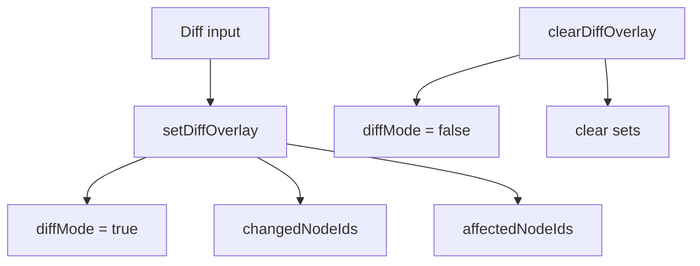

---

## 8) Panels and auxiliary UI

### `toggleFilterPanel()`

Opens or closes the filter panel and closes the export menu.

### `toggleExportMenu()`

Opens or closes the export menu and closes the filter panel.

### `togglePathFinder()`

Toggles the path finder panel.

### `setReactFlowInstance(instance)`

Stores the current React Flow instance for graph interactions.

---

## 9) Filters

### `setFilters(newFilters)`

Merges partial filter updates into the current filter state.

### `resetFilters()`

Restores all filters to their defaults.

### `hasActiveFilters()`

Returns `true` when any filter deviates from the default state.

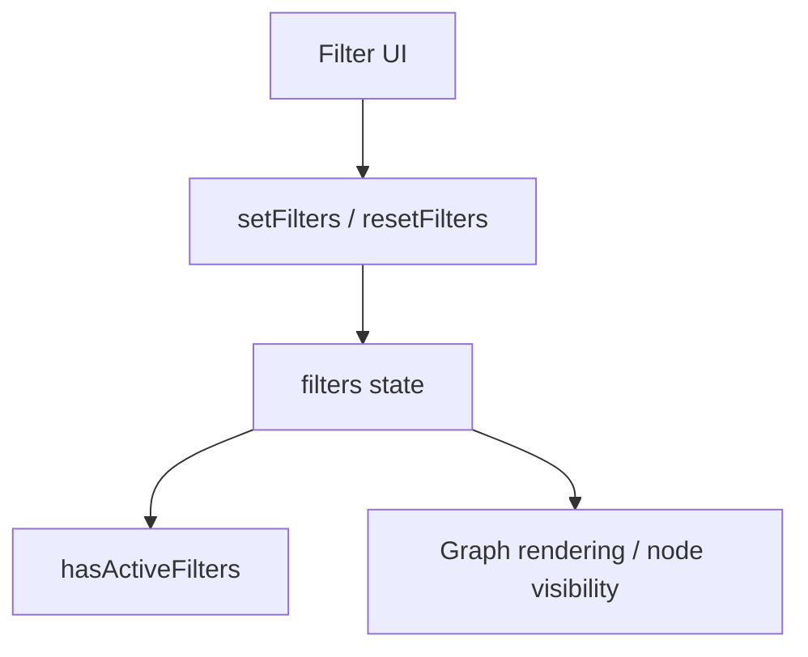

### Filter defaults

- all node types enabled
- all complexities enabled
- no layer restriction
- all edge categories enabled

---

## 10) Tour playback

### `startTour()`

Starts the graph tour if one exists.

Steps:

1. sort tour steps by `order`
2. highlight the first step’s nodes
3. navigate to the layer containing the first highlighted node, if available
4. reset layer-scoped caches if the active layer changes

### `stopTour()`

Stops the tour and clears step state.

### `setTourStep(step)`

Moves directly to a specific tour step.

### `nextTourStep()` / `prevTourStep()`

Advance or rewind the tour by one step.

### Tour helper behavior

- `getSortedTour(graph)` ensures tour steps are always processed in order
- `navigateTourToLayer(...)` maps the first highlighted node to a canonical layer
- `layerResetIfChanged(...)` clears layer-scoped caches when the tour crosses layers

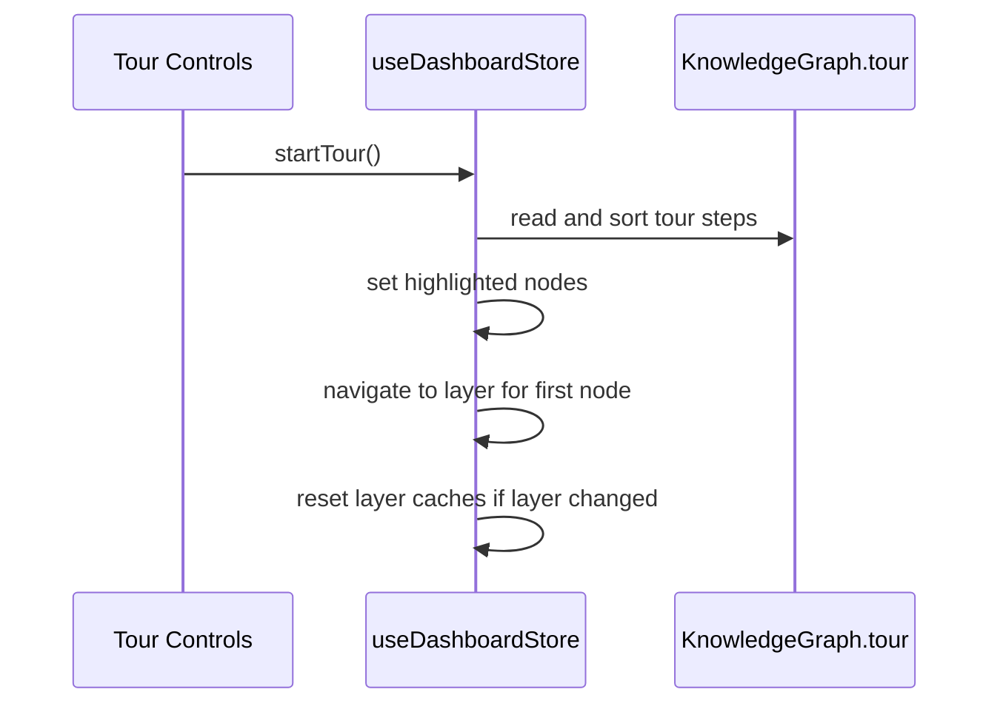

### Why layer resets matter

Container IDs can collide across layers. When a tour step moves to a different layer, stale container layout caches must be cleared so the next layer’s Stage 2 layout is recomputed correctly.

---

## 11) View mode and domain navigation

### `viewMode`

Controls the top-level dashboard mode:

- `structural`
- `domain`
- `knowledge`

### `isKnowledgeGraph`

A separate flag indicating whether the loaded graph should be treated as a knowledge graph.

### `domainGraph`

Stores a domain-specific graph when the dashboard is in domain mode.

### `activeDomainId`

Tracks the currently selected domain.

### `setDomainGraph(graph)`

Stores the domain graph.

### `setIsKnowledgeGraph(value)`

Sets the knowledge-graph flag.

### `setViewMode(mode)`

Switches view mode and clears selection, focus, and code viewer state.

### `navigateToDomain(domainId)`

Switches to domain mode, sets the active domain, clears focus, and preserves navigation history.

### `clearActiveDomain()`

Clears the active domain and selection/focus state.

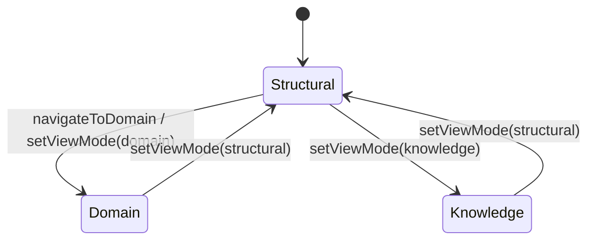

---

## 12) Container expansion and layout caching

### `expandedContainers`

Tracks which containers are expanded in the graph view.

### `toggleContainer(containerId)`

Expands or collapses a container. When expanding, it also sets `pendingFocusContainer` so the viewport can lock onto the newly expanded container.

### `expandContainer(containerId)`

Expands a container if it is not already expanded.

### `collapseContainer(containerId)`

Collapses a container if it is expanded.

### `collapseAllContainers()`

Collapses every container.

### `pendingFocusContainer`

A transient marker used by the graph view to focus the viewport after a manual expansion.

### `tourFitPending`

Indicates that tour-fit layout is waiting for highlighted nodes to materialize.

### `containerLayoutCache`

Caches child positions and actual container size for previously computed layouts.

### `containerSizeMemory`

Stores the last known size for each container.

### `setContainerLayout(containerId, childPositions, actualSize)`

Stores layout results in both caches.

### `clearContainerLayouts()`

Clears layout caches and collapses state that depends on them.

### `stage1Tick`

A monotonic counter used to force Stage 1 layout recomputation.

### `bumpStage1Tick()`

Increments the tick.

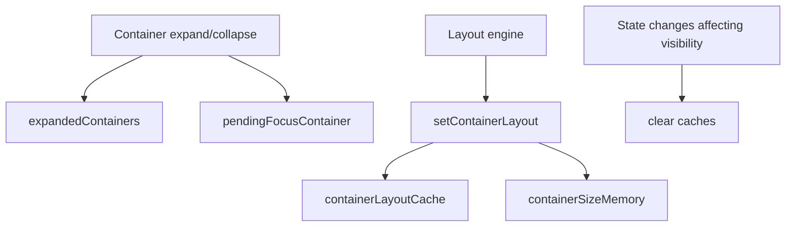

### Cache invalidation triggers

The store clears container caches when state changes can alter visible children or layout geometry, including:

- graph replacement
- layer changes
- focus mode changes
- persona changes
- detail level changes
- function visibility toggles
- node type filter changes
- tour layer transitions

This prevents stale positions from being reused for a different visible node set.

---

## 13) Layout issues

### `layoutIssues`

Stores `GraphIssue` entries produced during layout repair or validation.

### `appendLayoutIssues(issues)`

Appends new issues while deduplicating by `level + message`.

### `clearLayoutIssues()`

Clears all layout issues.

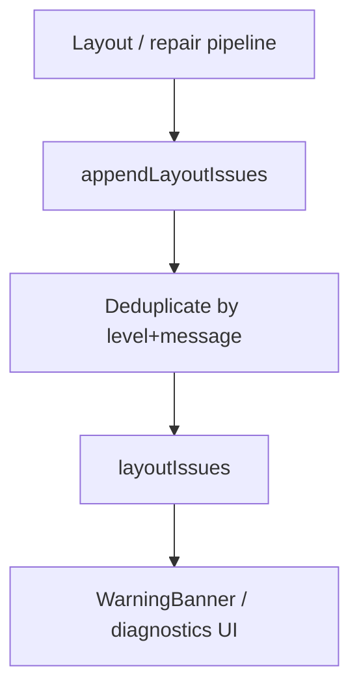

### Issue semantics

`GraphIssue.level` can be:

- `auto-corrected`
- `dropped`
- `fatal`

The store does not interpret these beyond accumulation and deduplication; presentation is handled by the UI.

---

## Component interaction summary

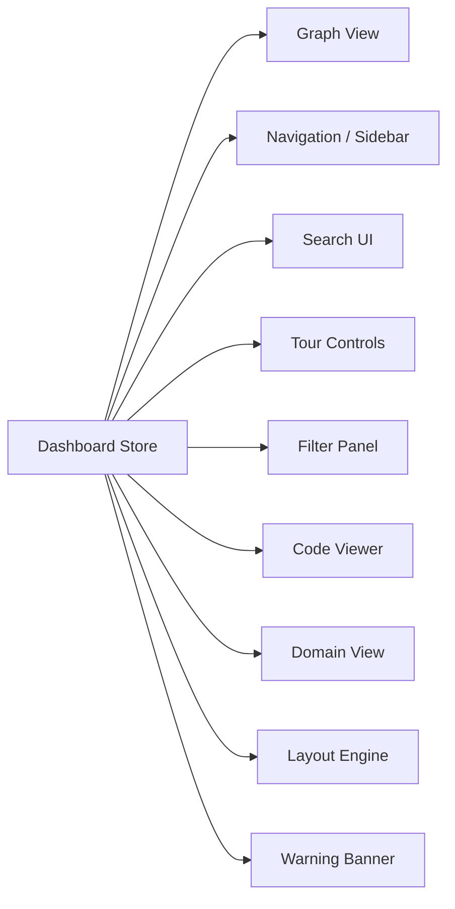

### Typical interaction patterns

- **Graph view** reads selection, expansion, layout caches, and active layer state.
- **Sidebar/navigation** reads history, selected node, and layer navigation state.
- **Search UI** updates query and consumes search results.
- **Tour controls** drive step changes and highlighted nodes.
- **Filter panel** updates filter sets and node category toggles.
- **Layout engine** writes container layout results and layout issues.
- **Domain view** switches `viewMode` and uses `domainGraph` / `activeDomainId`.

---

## Design notes and invariants

### 1. Graph replacement is a reset boundary

`setGraph` intentionally resets most transient UI state. This ensures a newly loaded graph does not inherit stale selection, layout, or tour state.

### 2. Layer membership is dual-tracked

The store distinguishes between canonical navigation layer and full membership for filtering correctness.

### 3. Layout caches are aggressively invalidated

Any state change that can alter visible children or container geometry clears caches to avoid rendering stale layouts.

### 4. Tour transitions are layer-aware

Tour steps can cross layers, so the store resets layer-scoped caches when the active layer changes.

### 5. UI panels are mutually exclusive where appropriate

Filter and export menus close each other to reduce overlapping UI states.

### 6. History is bounded

Navigation history is capped at 50 entries to keep memory usage predictable.

---

## Related modules

- [core_schema_and_types.md](core_schema_and_types.md) for `KnowledgeGraph`, `GraphNode`, `TourStep`, and `GraphIssue`
- [core_search.md](core_search.md) for `SearchEngine` and `SearchResult`
- [dashboard_graph_view.md](dashboard_graph_view.md) for how store state drives graph rendering and container layout
- [dashboard_state_and_ui-theme.md](dashboard_state_and_ui-theme.md) for theme state and presets
- [dashboard_state_and_ui-i18n.md](dashboard_state_and_ui-i18n.md) for localization context
- [dashboard_state_and_ui-keyboard-shortcuts.md](dashboard_state_and_ui-keyboard-shortcuts.md) for shortcut definitions and actions
- [dashboard_state_and_ui-shortcuts-help.md](dashboard_state_and_ui-shortcuts-help.md) for shortcut help UI

---

## Quick reference: main actions

| Area | Actions |
|---|---|
| Graph loading | `setGraph`, `setDomainGraph`, `setIsKnowledgeGraph` |
| Navigation | `selectNode`, `navigateToNode`, `navigateToNodeInLayer`, `navigateToHistoryIndex`, `goBackNode`, `drillIntoLayer`, `navigateToOverview`, `navigateToDomain`, `clearActiveDomain` |
| Search | `setSearchMode`, `setSearchQuery` |
| Focus | `setFocusNode` |
| UI panels | `toggleFilterPanel`, `toggleExportMenu`, `togglePathFinder` |
| Viewer | `openCodeViewer`, `closeCodeViewer`, `expandCodeViewer`, `collapseCodeViewer` |
| Filters | `setFilters`, `resetFilters`, `hasActiveFilters`, `toggleNodeTypeFilter` |
| Tours | `startTour`, `stopTour`, `setTourStep`, `nextTourStep`, `prevTourStep` |
| Containers | `toggleContainer`, `expandContainer`, `collapseContainer`, `collapseAllContainers`, `setContainerLayout`, `clearContainerLayouts` |
| Layout diagnostics | `appendLayoutIssues`, `clearLayoutIssues` |
| Misc | `setPersona`, `setDetailLevel`, `toggleShowFunctionsInClassView`, `setReactFlowInstance`, `bumpStage1Tick`, `setPendingFocusContainer`, `setTourFitPending` |
