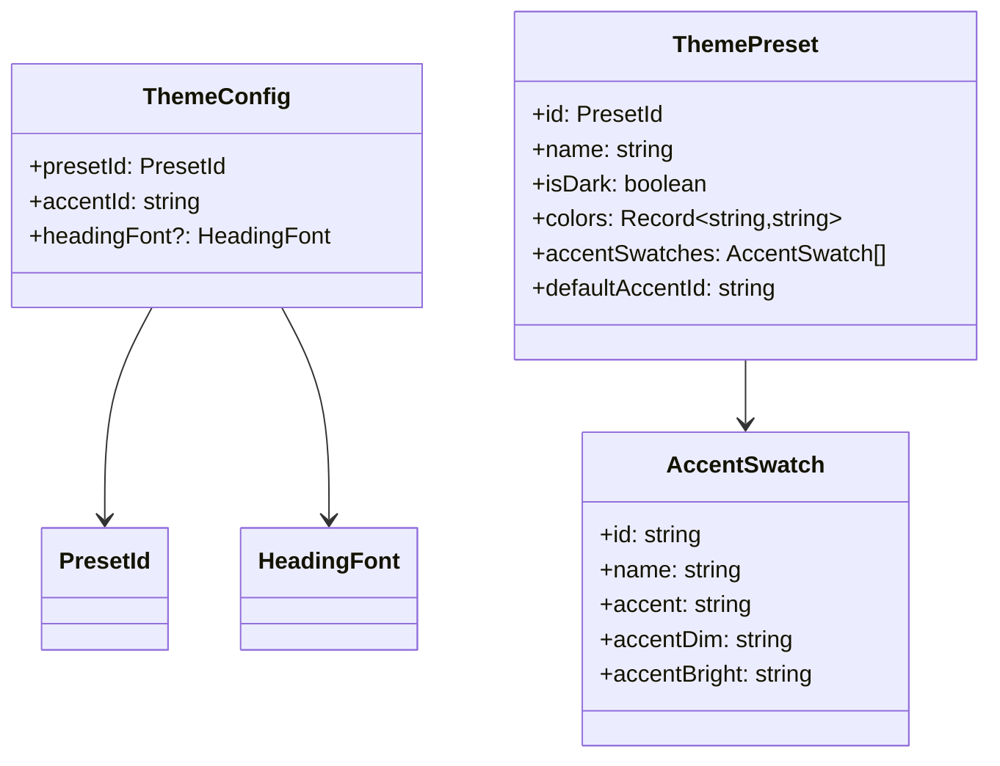

# dashboard_state_and_ui-theme-types

## Introduction

This companion document covers the theme data model used by the dashboard theme context. It defines the preset catalog shape, accent swatches, and persisted theme configuration.

For runtime behavior and persistence, see [dashboard_state_and_ui-theme](dashboard_state_and_ui-theme.md).

---

## Types

### `PresetId`
A string union identifying the available theme presets:

- `dark-gold`
- `dark-ocean`
- `dark-forest`
- `dark-rose`
- `light-minimal`

### `AccentSwatch`
Represents a selectable accent variant.

**Fields**
- `id: string`
- `name: string`
- `accent: string`
- `accentDim: string`
- `accentBright: string`

### `ThemePreset`
Describes a complete theme preset.

**Fields**
- `id: PresetId`
- `name: string`
- `isDark: boolean`
- `colors: Record<string, string>`
- `accentSwatches: AccentSwatch[]`
- `defaultAccentId: string`

### `HeadingFont`
Optional heading font override.

Allowed values:
- `serif`
- `sans`
- `mono`

### `ThemeConfig`
Persisted user theme selection.

**Fields**
- `presetId: PresetId`
- `accentId: string`
- `headingFont?: HeadingFont`

### `DEFAULT_THEME_CONFIG`
Default fallback configuration used when no stored preference or metadata is available.

```ts
{
  presetId: "dark-gold",
  accentId: "gold"
}
```

---

## Type relationships



---

## Notes

- `ThemeConfig` is intentionally compact because it is persisted in browser storage.
- `ThemePreset` is richer and is typically sourced from the preset catalog.
- `accentId` should always correspond to one of the preset’s `accentSwatches`.
