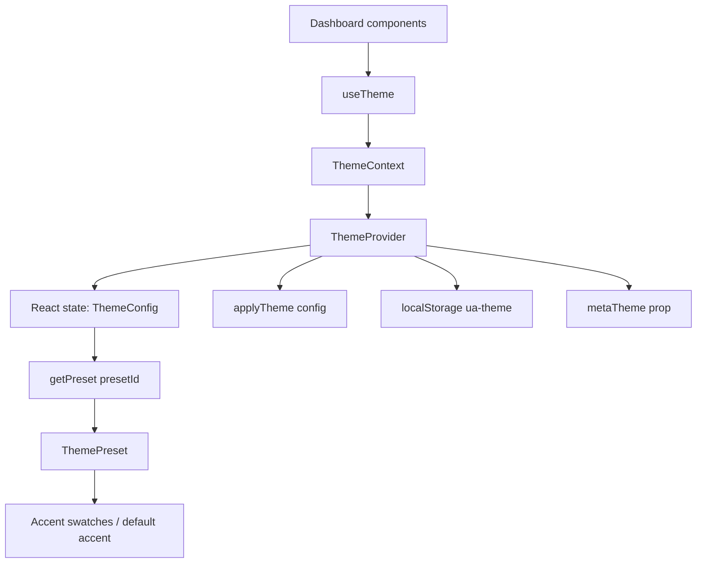
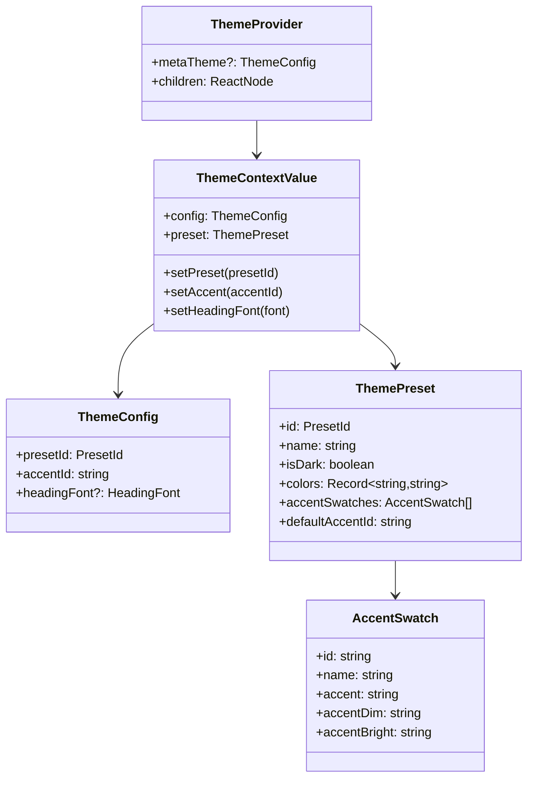
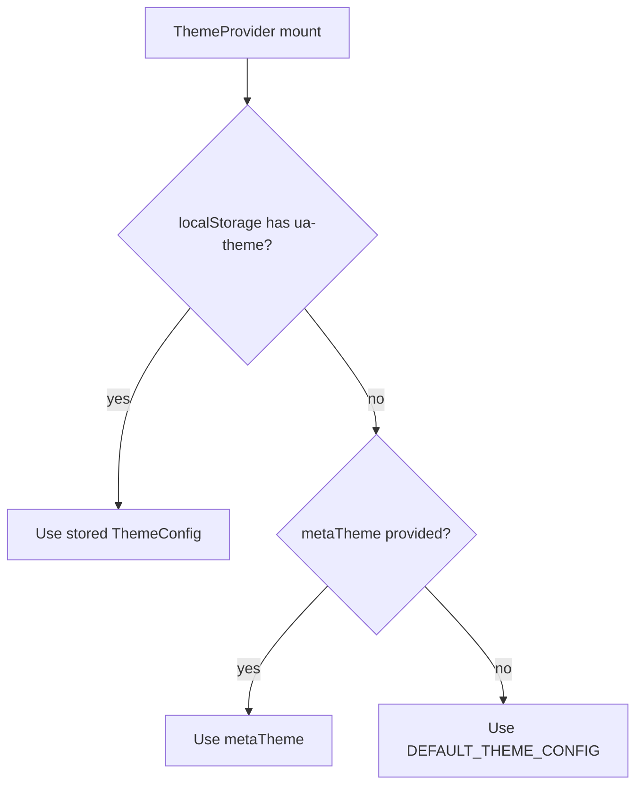
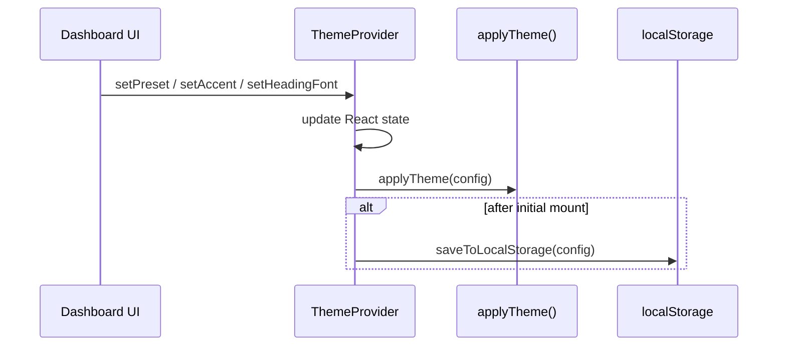
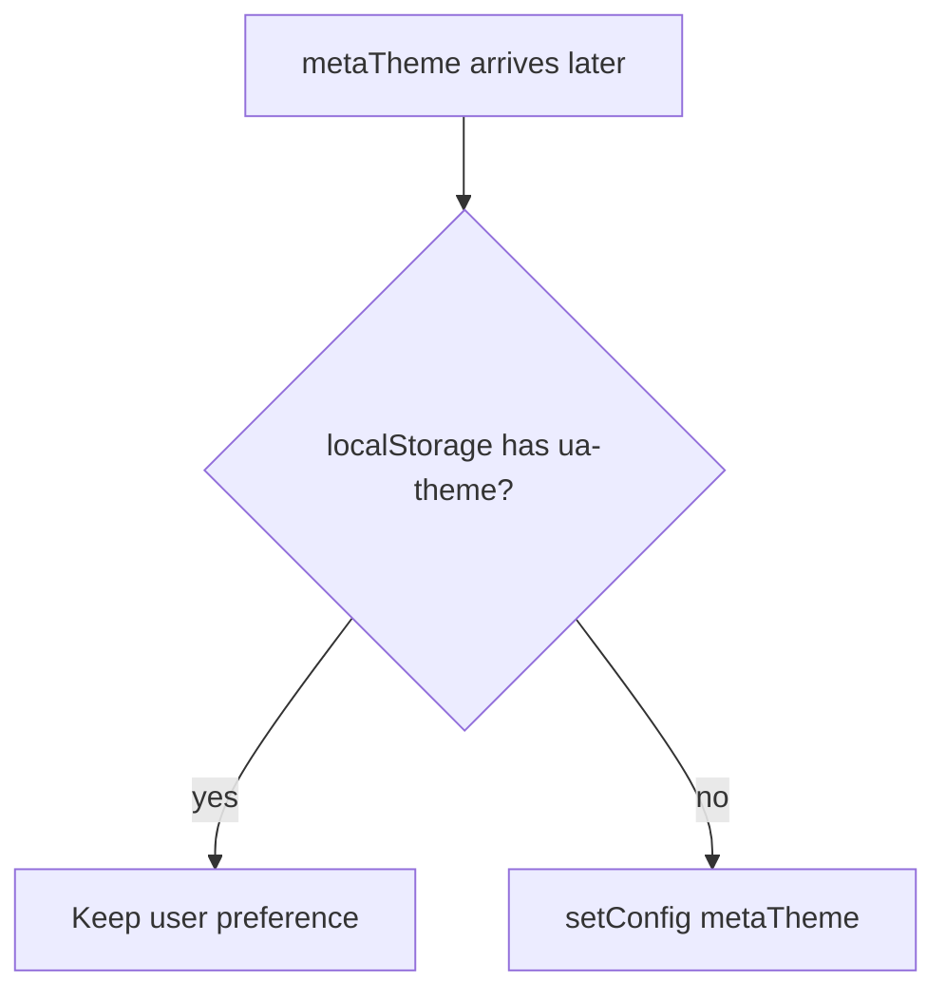
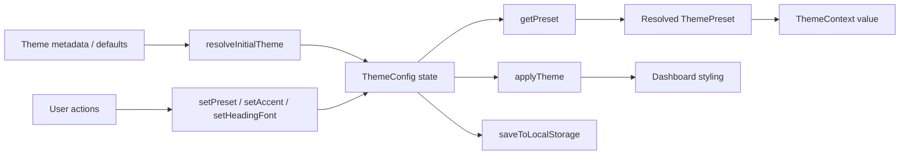
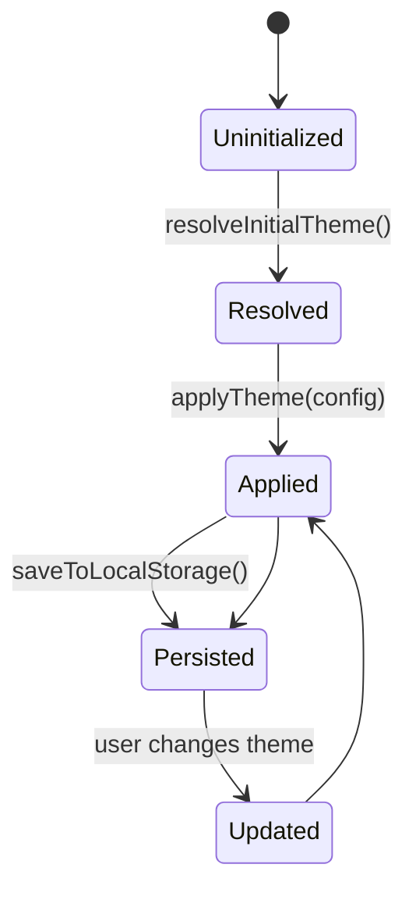

# dashboard_state_and_ui-theme

## Introduction

The `dashboard_state_and_ui-theme` module owns the dashboard’s visual theme state and the React context used to read and update it. It is responsible for:

- selecting the active theme preset
- tracking the active accent swatch and heading font
- resolving the initial theme from local storage, metadata, or defaults
- applying the theme to the UI through the theme engine
- exposing a safe hook for dashboard components to consume theme state

This module is intentionally small, but it sits at a critical boundary between persisted user preferences, asynchronously loaded project metadata, and the dashboard’s runtime styling. For broader dashboard state concerns, see [dashboard_state_and_ui-store](dashboard_state_and_ui-store.md). For keyboard and localization concerns, see [dashboard_state_and_ui.md](dashboard_state_and_ui.md) and its child modules.

---

## Module responsibilities

### 1. Theme state ownership
The module stores the current `ThemeConfig` in React state and exposes mutation helpers:

- `setPreset(presetId)`
- `setAccent(accentId)`
- `setHeadingFont(font)`

### 2. Theme resolution
Initial theme selection follows this precedence:

1. persisted user preference from `localStorage`
2. `metaTheme` passed into `ThemeProvider`
3. `DEFAULT_THEME_CONFIG`

### 3. Theme application
Whenever the config changes, the module delegates to `applyTheme(config)` to update the dashboard styling layer.

### 4. Context access
The `useTheme()` hook provides typed access to the current theme context and enforces usage inside a `ThemeProvider`.

---

## Core types

The theme model is defined in [dashboard_state_and_ui-theme-types](dashboard_state_and_ui-theme-types.md) (see also the source module `themes/types.ts`).

### `ThemeConfig`
Represents the user-selected theme state:

- `presetId`: identifies the active preset
- `accentId`: identifies the active accent swatch within the preset
- `headingFont?`: optional heading font override

### `ThemePreset`
Describes a preset available to the dashboard:

- `id`, `name`, `isDark`
- `colors`: CSS token map used by the theme engine
- `accentSwatches`: available accent choices
- `defaultAccentId`: fallback accent when a preset is selected

### `AccentSwatch`
Represents a selectable accent variant with:

- `id`, `name`
- `accent`, `accentDim`, `accentBright`

---

## Architecture overview

### Key architectural points

- `ThemeProvider` is the single source of truth for dashboard theme state.
- `ThemeContext` exposes both the raw config and the resolved preset.
- `getPreset()` converts a `presetId` into a full preset definition.
- `applyTheme()` is the side-effect boundary that writes theme values into the UI layer.
- `localStorage` persistence is used only for user preference retention, not as the canonical runtime state.

---

## Component relationships

---

## Runtime behavior

### Initial theme resolution
`ThemeProvider` initializes state using `resolveInitialTheme(metaTheme)`.

### Theme updates
When the config changes, the provider performs two actions:

1. calls `applyTheme(config)` to update the dashboard styling
2. persists the config to `localStorage` after the first render

### Late-arriving metadata
If `metaTheme` is fetched asynchronously after mount, the provider will adopt it only when no stored preference exists.

---

## Public API

### `ThemeProvider`
Wraps dashboard content and provides theme state to descendants.

**Props**
- `metaTheme?: ThemeConfig | null`
- `children: ReactNode`

**Behavior**
- resolves initial theme
- applies theme side effects
- persists user changes
- updates when metadata arrives and no preference exists

### `useTheme()`
Returns the current `ThemeContextValue`.

**Throws**
- `Error("useTheme must be used within ThemeProvider")` if called outside the provider tree.

---

## Data flow

---

## Dependencies

### Internal dependencies
- [dashboard_state_and_ui-theme-types](dashboard_state_and_ui-theme-types.md) for `ThemeConfig`, `ThemePreset`, `AccentSwatch`, `PresetId`, `HeadingFont`, and `DEFAULT_THEME_CONFIG`
- `presets.ts` for `getPreset(presetId)`
- `theme-engine.ts` for `applyTheme(config)`

### Related dashboard modules
- [dashboard_state_and_ui-store](dashboard_state_and_ui-store.md) for non-theme dashboard state
- [dashboard_state_and_ui-i18n](dashboard_state_and_ui-i18n.md) for localization context
- [dashboard_state_and_ui-keyboard-shortcuts](dashboard_state_and_ui-keyboard-shortcuts.md) for shortcut definitions
- [dashboard_state_and_ui-shortcuts-help](dashboard_state_and_ui-shortcuts-help.md) for shortcut UI
- [dashboard_graph_view](dashboard_graph_view.md) for graph rendering components that consume dashboard styling

### External runtime dependencies
- React context/state hooks: `createContext`, `useState`, `useEffect`, `useCallback`, `useContext`, `useRef`
- browser `localStorage`

---

## Implementation notes

### Persistence strategy
The module stores the full `ThemeConfig` under the `ua-theme` key. This keeps the persisted format simple and allows the provider to restore the exact user preference on reload.

### Accent selection behavior
Selecting a preset resets the accent to that preset’s `defaultAccentId`. This prevents invalid accent combinations when switching between presets with different swatch sets.

### Heading font updates
`setHeadingFont()` only updates the font override and preserves the current preset and accent.

### Safety and resilience
- JSON parsing is wrapped in `try/catch`
- storage write failures are ignored gracefully
- `useTheme()` fails fast when used outside the provider

---

## Process flow summary

---

## Maintenance considerations

- Keep `ThemeConfig` backward compatible if persisted values need to survive upgrades.
- Update `resolveInitialTheme()` if the precedence rules change.
- Ensure new presets define a valid `defaultAccentId` and matching accent swatches.
- If theme application expands beyond CSS variables, keep `applyTheme()` as the single side-effect boundary.

---

## See also

- [dashboard_state_and_ui-store](dashboard_state_and_ui-store.md)
- [dashboard_state_and_ui-i18n](dashboard_state_and_ui-i18n.md)
- [dashboard_graph_view](dashboard_graph_view.md)
- [core_schema_and_types](core_schema_and_types.md) for shared graph and theme-related types
