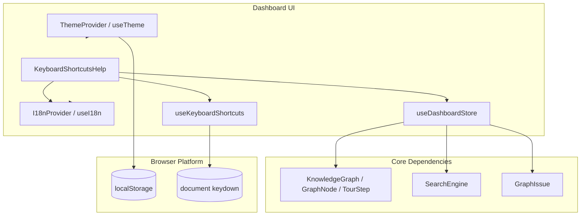
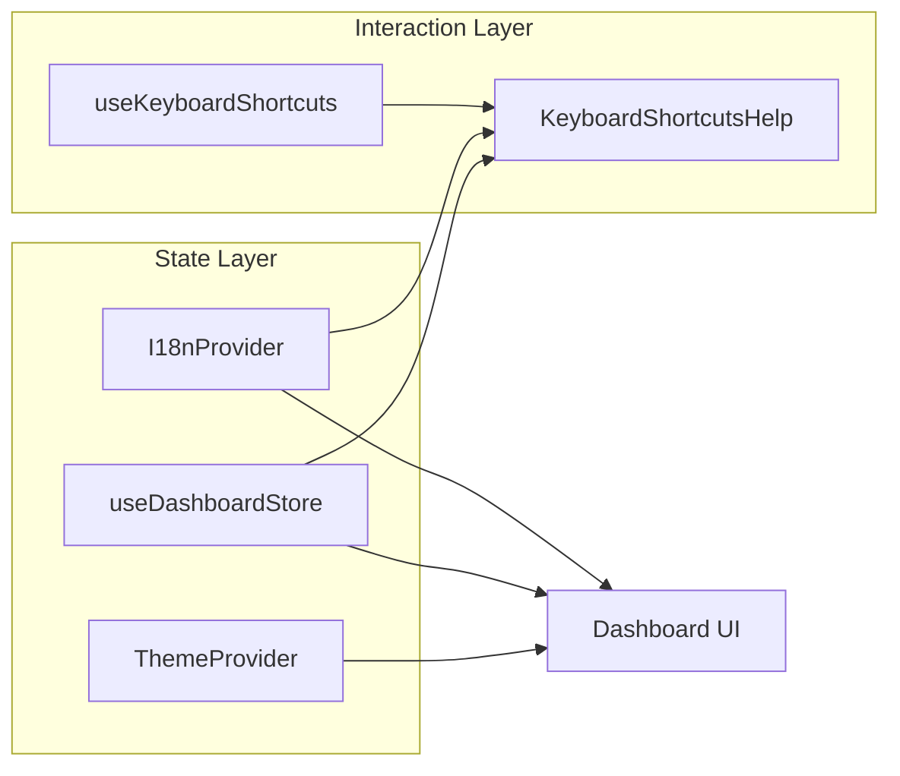
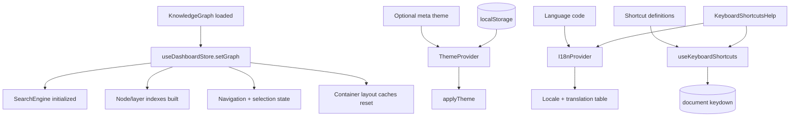

# dashboard_state_and_ui

## Purpose

The `dashboard_state_and_ui` module provides the dashboard’s shared UI state, theming, localization, and keyboard shortcut infrastructure. It acts as the coordination layer between interactive dashboard components and the underlying graph/search data model.

This module is responsible for:

- storing dashboard UI state in a central store
- providing theme configuration and persistence
- exposing localization context for translated UI strings
- handling keyboard shortcut registration and display
- supporting modal/help UI for shortcut discovery

It is a UI-facing module, but it depends heavily on the core graph model and search engine from `@understand-anything/core`.

---

## Architecture overview

### High-level responsibilities

- **Store**: centralizes graph selection, navigation, filters, tour state, view mode, container layout caches, and layout issues.
- **Theme context**: resolves the active theme from local storage, metadata, or defaults and applies it to the document.
- **I18n context**: resolves locale and translation tables for dashboard UI text.
- **Keyboard shortcut hook**: binds global shortcuts and formats shortcut labels for display.
- **Shortcut help component**: renders a localized modal listing available shortcuts.

---

## Component relationships

---

## Sub-modules

This module is split into the following sub-module documentation files:

- [dashboard_state_and_ui-store.md](dashboard_state_and_ui-store.md) — Zustand dashboard store, navigation, filters, tours, view modes, and layout caches.
- [dashboard_state_and_ui-theme.md](dashboard_state_and_ui-theme.md) — theme configuration, persistence, and application.
- [dashboard_state_and_ui-i18n.md](dashboard_state_and_ui-i18n.md) — locale resolution and translation context.
- [dashboard_state_and_ui-keyboard-shortcuts.md](dashboard_state_and_ui-keyboard-shortcuts.md) — shortcut registration, filtering, and formatting.
- [dashboard_state_and_ui-shortcuts-help.md](dashboard_state_and_ui-shortcuts-help.md) — localized shortcut help modal.

---

## How this module fits into the dashboard

The dashboard uses this module as the shared runtime state and UI services layer:

- graph views read from `useDashboardStore` to determine selection, filters, active layer, and layout state
- theme-aware components consume `useTheme` to style the interface consistently
- localized components consume `useI18n` for translated labels and hints
- global keyboard shortcuts are registered through `useKeyboardShortcuts`
- the shortcut help modal uses both localization and shortcut formatting utilities

---

## Dependency notes

### Core dependencies

The store depends on core graph and search types:

- `KnowledgeGraph`, `GraphNode`, `TourStep` from `@understand-anything/core/types`
- `SearchEngine` and `SearchResult` from `@understand-anything/core/search`
- `GraphIssue` from `@understand-anything/core/schema`

### Browser/runtime dependencies

- `localStorage` for theme persistence
- `document.addEventListener("keydown", ...)` for shortcut handling
- React context and hooks for provider-based state

---

## Data flow summary

---

## Related modules

For graph visualization and layout behavior, see:

- [dashboard_graph_view.md](dashboard_graph_view.md)
- [dashboard_layout_utils.md](dashboard_layout_utils.md)

For core graph analysis and schema types, see:

- [core_analysis.md](core_analysis.md)
- [core_schema_and_types.md](core_schema_and_types.md)
