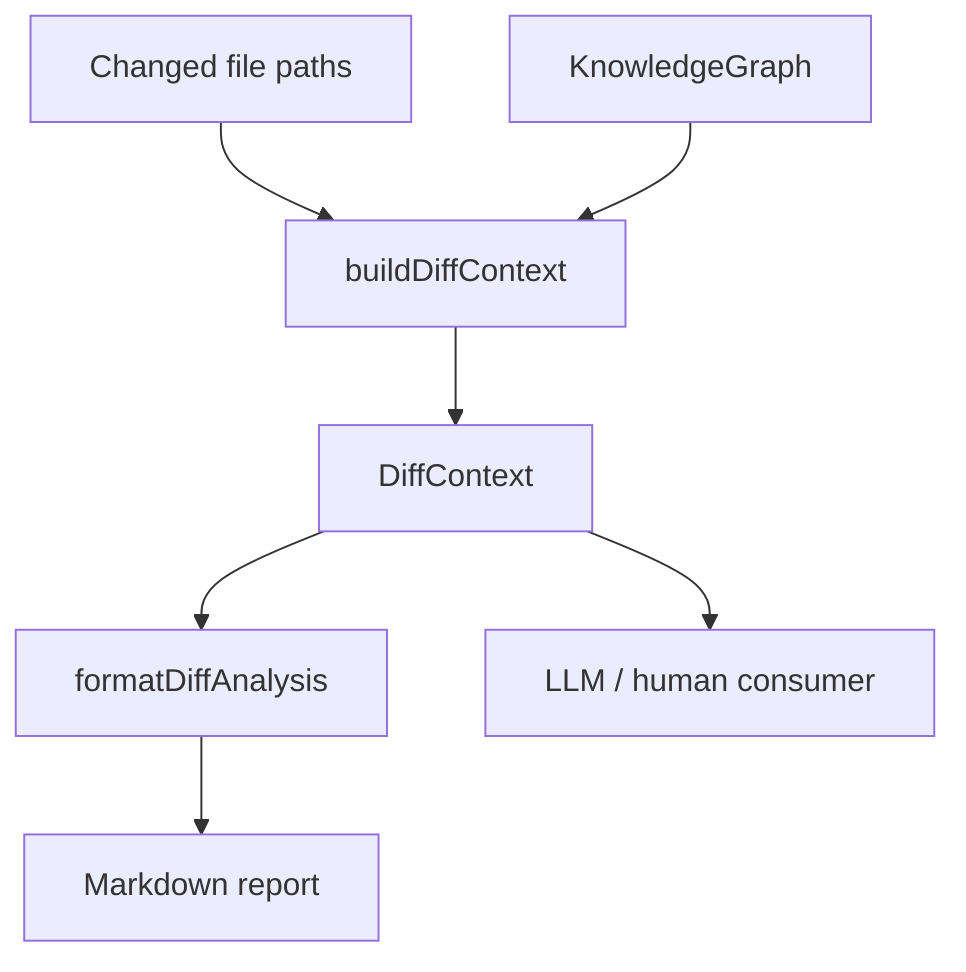
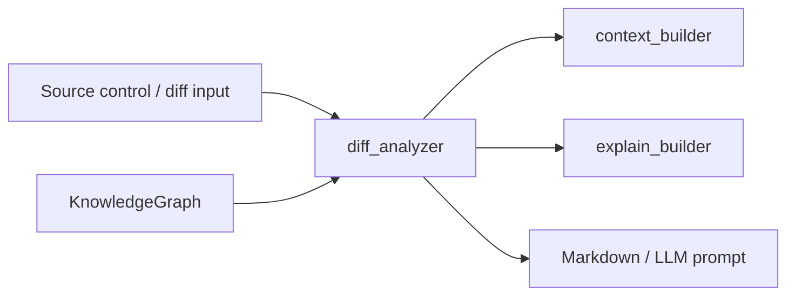
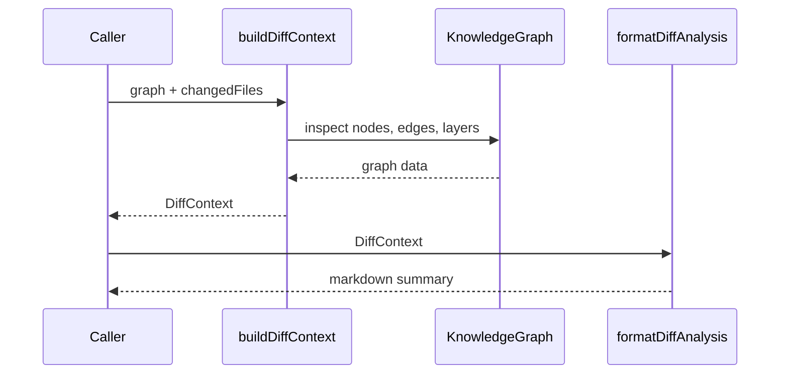
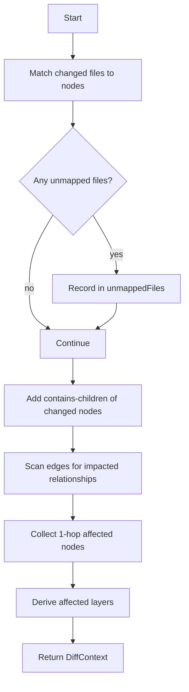
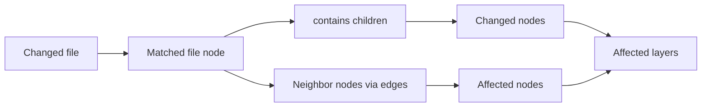
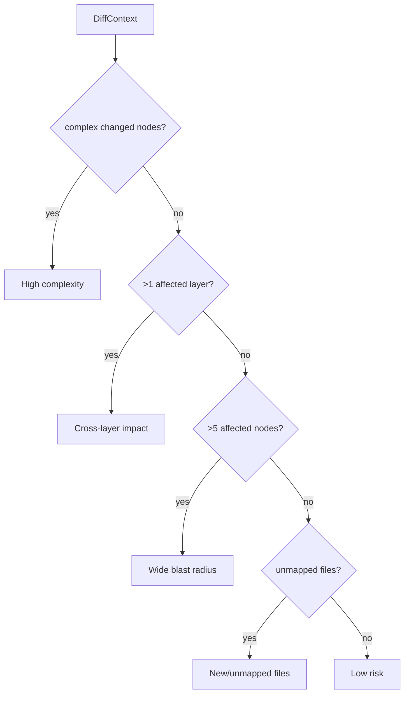
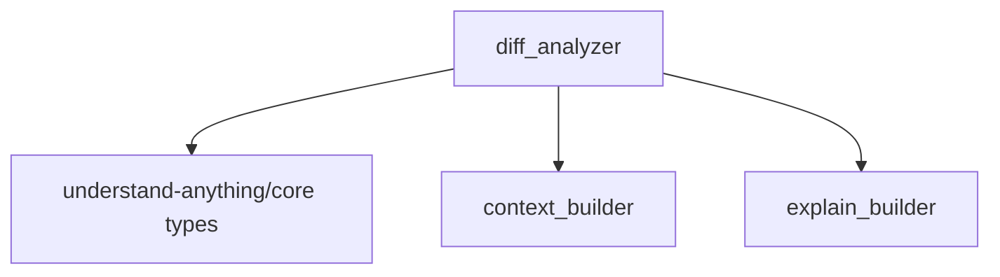

# diff_analyzer module

The `diff_analyzer` module builds a change-impact context from a project knowledge graph and a list of modified file paths. It maps file-level changes to graph nodes, expands the impact to nearby nodes, edges, and layers, and formats the result as markdown for humans or LLMs.

This module is intentionally small, but it sits at an important boundary between source-control change detection and graph-based reasoning. For related context builders, see [context_builder.md](context_builder.md) and [explain_builder.md](explain_builder.md).

## Purpose

`diff_analyzer` answers three questions:

1. Which knowledge-graph nodes correspond to the changed files?
2. What other nodes, edges, and layers may be affected by those changes?
3. How should that impact be summarized for downstream consumers?

The module exposes:

- `DiffContext`: a structured result describing the change impact
- `buildDiffContext(...)`: computes the impact from a `KnowledgeGraph` and changed file list
- `formatDiffAnalysis(...)`: renders the context as markdown

---

## Core responsibilities

### 1) File-to-node mapping

The analyzer scans the graph nodes and matches each changed file path against `node.filePath`.

If a file does not map to any node, it is recorded in `unmappedFiles` so callers can detect newly added files, renamed files, or graph coverage gaps.

### 2) Change expansion

Once changed nodes are identified, the analyzer expands the impact in two ways:

- It includes `contains` children of changed file nodes
- It collects 1-hop neighboring nodes connected by any edge

This produces a practical “blast radius” around the change rather than a strict file-only diff.

### 3) Layer impact detection

The analyzer checks which architectural layers contain either:

- changed nodes
- affected nodes

Those layers are returned in `affectedLayers` so higher-level tooling can reason about cross-layer impact.

### 4) Markdown reporting

`formatDiffAnalysis` converts the structured context into a readable report with sections for:

- changed components
- affected components
- affected layers
- impacted relationships
- unmapped files
- risk assessment

---

## Public API

### `DiffContext`

```ts
interface DiffContext {
  projectName: string;
  changedFiles: string[];
  changedNodes: GraphNode[];
  affectedNodes: GraphNode[];
  impactedEdges: GraphEdge[];
  affectedLayers: Layer[];
  unmappedFiles: string[];
}
```

#### Field semantics

- `projectName`: copied from `graph.project.name`
- `changedFiles`: the original input file paths
- `changedNodes`: graph nodes directly mapped from changed files, plus `contains` descendants of those nodes
- `affectedNodes`: 1-hop neighbors of changed nodes, excluding nodes already marked as changed
- `impactedEdges`: all edges touching changed nodes
- `affectedLayers`: layers containing any changed or affected node
- `unmappedFiles`: changed files that could not be matched to any node

### `buildDiffContext(graph, changedFiles)`

Builds a `DiffContext` from a `KnowledgeGraph`.

#### Inputs

- `graph: KnowledgeGraph`
- `changedFiles: string[]`

#### Output

A fully populated `DiffContext`.

#### Behavior summary

1. Match changed file paths to nodes by `node.filePath`
2. Add `contains` children of matched nodes
3. Collect impacted edges and neighboring nodes
4. Derive affected layers from impacted node IDs
5. Return the assembled context

### `formatDiffAnalysis(ctx)`

Formats a `DiffContext` as markdown.

#### Output sections

- `# Diff Analysis: <project>`
- `## Changed Components`
- `## Affected Components`
- `## Affected Layers`
- `## Impacted Relationships` (only when present)
- `## Unmapped Files` (only when present)
- `## Risk Assessment`

---

## Architecture



### Module position in the system



`diff_analyzer` depends on the shared graph model from `@understand-anything/core` and complements the other app-level context builders.

---

## Data flow



### Internal processing flow



---

## Impact model

The analyzer uses a simple graph-neighborhood model:

- **Direct impact**: nodes whose `filePath` matches a changed file
- **Structural expansion**: `contains` descendants of changed nodes
- **Adjacent impact**: nodes connected by any edge to changed nodes
- **Architectural impact**: layers containing changed or adjacent nodes

This makes the output useful for code review, release notes, and LLM-assisted explanations.

### Relationship handling



---

## Risk assessment logic

`formatDiffAnalysis` adds a lightweight heuristic summary based on the context:

- **High complexity** if any changed node has `complexity === "complex"`
- **Cross-layer impact** if more than one unique layer is affected
- **Wide blast radius** if more than five affected nodes are found
- **New/unmapped files** if any changed files were not mapped to graph nodes
- **Low risk** if none of the above conditions are triggered



These heuristics are intentionally simple and should be treated as advisory rather than authoritative.

---

## Dependencies

### External dependency

- `@understand-anything/core`
  - `KnowledgeGraph`
  - `GraphNode`
  - `GraphEdge`
  - `Layer`

### Related modules

- [context_builder.md](context_builder.md): builds broader chat-oriented context from graph data
- [explain_builder.md](explain_builder.md): builds node/path explanation context
- Core graph and analysis types are defined in the shared core documentation for the graph model



---

## Implementation notes

### `contains` edge expansion

The analyzer treats `contains` edges specially. If a changed node is a container or parent node, its contained children are also marked as changed. This helps ensure that file-level changes to a module or directory-level node propagate to its internal structure.

### One-hop neighborhood only

The analyzer does not recursively traverse the graph beyond one hop for affected nodes. This keeps the output focused and avoids over-reporting downstream impact.

### Layer derivation

Layers are selected by checking whether any node in a layer intersects with the union of changed and affected node IDs. This means a layer can be marked affected even if only one node in that layer is directly touched.

### Markdown formatting caveat

The current implementation emits an em dash in the changed-component lines. If rendered incorrectly in some environments, verify the source encoding or downstream markdown renderer.

---

## Example usage

```ts
import { buildDiffContext, formatDiffAnalysis } from "./diff-analyzer";

const ctx = buildDiffContext(graph, [
  "src/services/user.ts",
  "src/routes/auth.ts",
]);

console.log(formatDiffAnalysis(ctx));
```

### Example output shape

```md
# Diff Analysis: My Project

## Changed Components
- **UserService** (service) — Handles user lifecycle
  - File: `src/services/user.ts`
  - Complexity: complex

## Affected Components
These components are connected to changed code and may need attention:
- **AuthController** (controller) — Handles authentication requests

## Affected Layers
- **Application**: Business logic and orchestration

## Impacted Relationships
- node-a --[calls]--> node-b

## Risk Assessment
- **High complexity**: 1 complex component(s) changed: UserService
- **Cross-layer impact**: Changes span 2 architectural layers
```

---

## Operational considerations

### When to use

Use `diff_analyzer` when you need:

- a concise impact summary for code review
- a graph-aware explanation of a change set
- a markdown artifact for LLM prompting or reporting

### When not to rely on it alone

Do not treat the output as a full static-analysis engine. It is best used as a first-pass impact estimator, especially when:

- the graph is incomplete
- file paths have changed without re-analysis
- edge semantics require deeper traversal than one hop

### Handling unmapped files

Unmapped files are a signal that the knowledge graph may be stale or incomplete. In practice, callers may want to trigger re-indexing or graph regeneration when this list is non-empty.

---

## Related documentation

- [context_builder.md](context_builder.md)
- [explain_builder.md](explain_builder.md)
- Shared graph model documentation in the core module docs
