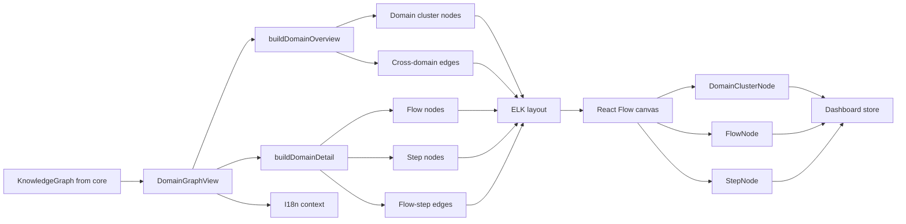
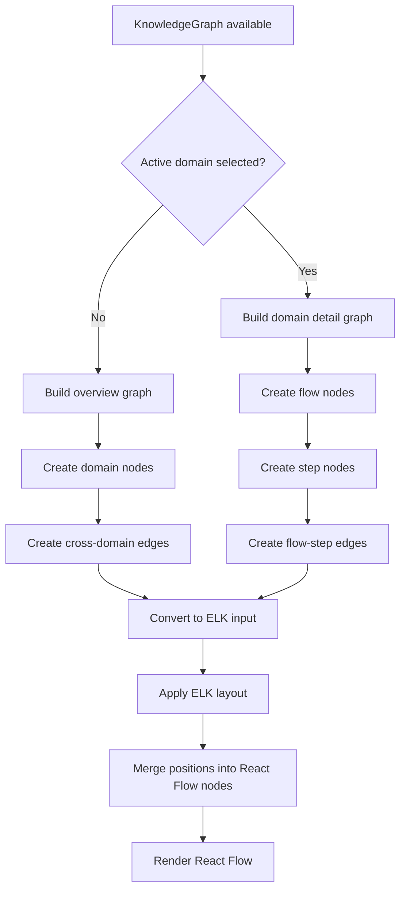
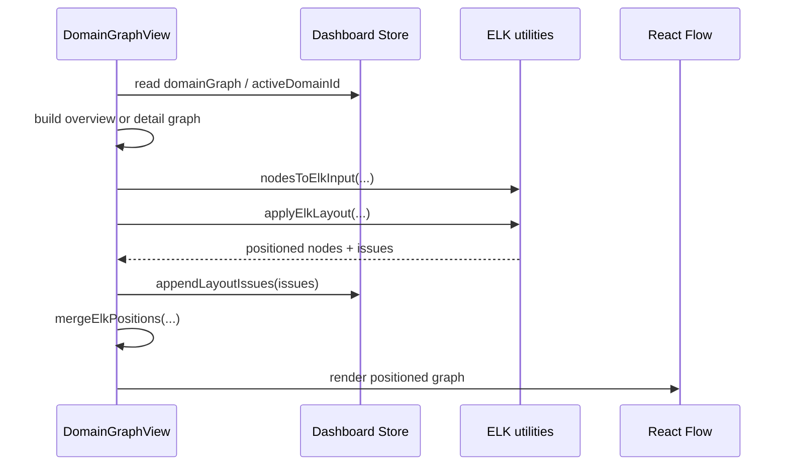
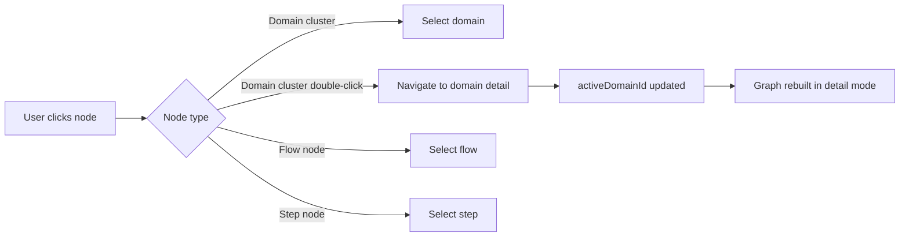
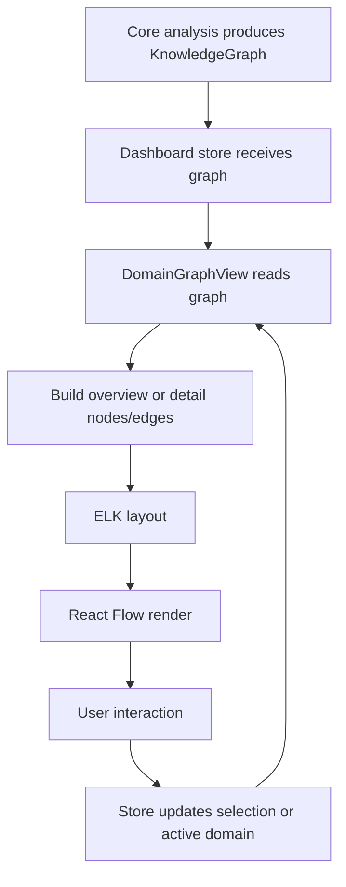

# Domain Graph Overview

The `domain_graph_overview` module renders the dashboard’s domain-level knowledge graph and lets users switch between a high-level domain map and a focused domain detail view. It transforms the shared `KnowledgeGraph` model into React Flow nodes and edges, applies ELK-based layout, and coordinates selection/navigation through the dashboard store.

This document covers the module’s purpose, structure, data flow, and how it connects to the rest of the dashboard and core graph model.

## Purpose and responsibilities

`domain_graph_overview` is the dashboard presentation layer for domain graphs. It is responsible for:

- Rendering domain clusters as interactive graph nodes
- Switching between overview mode and per-domain detail mode
- Displaying flows inside a domain and steps inside a flow
- Visualizing cross-domain relationships
- Applying layout and surfacing layout issues
- Integrating with dashboard state, selection, and navigation

It does **not** build the underlying knowledge graph. That work is handled by the core analysis pipeline and the shared graph types defined in the core package.

## Module composition

### Main component

- `DomainGraphView.tsx`
  - Entry point for the graph UI
  - Builds the React Flow graph from `KnowledgeGraph`
  - Chooses overview vs detail mode
  - Runs ELK layout and renders the graph canvas

### Node components

- `DomainClusterNode.tsx`
  - Renders a domain cluster in overview mode
  - Supports selection and double-click navigation into a domain

- `FlowNode.tsx`
  - Renders a flow inside a selected domain
  - Shows entry point, summary, and step count

- `StepNode.tsx`
  - Renders an individual step inside a flow
  - Shows ordering, summary, and file path

## External dependencies

This module depends on several shared dashboard and core concepts:

- `KnowledgeGraph` and `GraphNode` from the core shared types module
- Dashboard store for selection, active domain state, and layout issue reporting
- I18n context for localized UI labels
- Layout utilities for converting React Flow nodes into ELK input and merging positions back
- ELK layout execution for graph positioning
- React Flow for graph rendering and interaction primitives

For the underlying type definitions, see [core_schema_and_types.md](core_schema_and_types.md).
For dashboard state management, see [dashboard_state_and_ui.md](dashboard_state_and_ui.md).
For layout helpers, see [dashboard_layout_utils.md](dashboard_layout_utils.md).

## Architecture overview

## Data model and graph transformation

The module consumes a `KnowledgeGraph`, which contains nodes and edges representing the analyzed project. It then derives a smaller, view-specific graph.

### Overview mode

When no domain is active:

- Filter graph nodes to `type === "domain"`
- Count `contains_flow` edges per domain
- Create one React Flow node per domain
- Create one React Flow edge per `cross_domain` relationship

Each domain node is enriched with:

- `label`: domain name
- `summary`: domain summary
- `entities`: domain entities from `domainMeta`
- `flowCount`: number of flows contained in the domain
- `businessRules`: domain business rules from `domainMeta`
- `domainId`: node id

### Detail mode

When a domain is active:

- Find all flows contained by the selected domain
- Find all steps belonging to those flows
- Build flow nodes and step nodes
- Build `flow_step` edges between flows and steps

Each flow node is enriched with:

- `label`
- `summary`
- `entryPoint`
- `entryType`
- `stepCount`
- `flowId`

Each step node is enriched with:

- `label`
- `summary`
- `filePath`
- `stepId`
- `order`

## Process flow

## Layout pipeline

The component uses a two-stage layout process:

1. Build structural nodes, edges, and size hints synchronously
2. Run ELK asynchronously to compute positions
3. Merge computed positions back into the React Flow nodes
4. Store any layout issues in the dashboard store

## Component interaction

### DomainGraphView

`DomainGraphView` is the public wrapper that provides `ReactFlowProvider` and renders the inner graph view.

Responsibilities:

- Read graph state from the dashboard store
- Decide whether to render overview or detail mode
- Trigger layout computation when the graph changes
- Render the React Flow canvas and controls
- Show a fallback message when no domain graph exists

### DomainClusterNode

Used in overview mode.

Behavior:

- Click: select the domain node
- Double-click: navigate into the selected domain
- Displays entities and flow count
- Uses handles on both sides to support graph edges

### FlowNode

Used in detail mode.

Behavior:

- Click: select the flow node
- Displays entry point, summary, and step count
- Uses handles for flow-step connections

### StepNode

Used in detail mode.

Behavior:

- Click: select the step node
- Displays step order, summary, and file path
- Uses handles for graph connectivity

## Interaction model

## State dependencies

The module relies on dashboard state for:

- `domainGraph`: the current knowledge graph to visualize
- `activeDomainId`: determines overview vs detail mode
- `selectedNodeId`: controls node highlighting
- `navigateToDomain(domainId)`: enters domain detail mode
- `clearActiveDomain()`: returns to overview mode
- `selectNode(nodeId)`: updates selection state
- `appendLayoutIssues(issues)`: surfaces layout warnings

This means the graph view is not self-contained; it is a presentation layer over shared dashboard state.

## Rendering behavior

### Empty state

If `domainGraph` is missing, the component renders a centered message prompting the user to run `/understand-domain`.

### Overview mode UI

- Shows domain clusters only
- Displays cross-domain edges as dashed animated links
- Includes a minimap, controls, and dotted background

### Detail mode UI

- Shows a back button in the top-left corner
- Displays flows and steps for the selected domain
- Uses the same React Flow canvas and layout pipeline

## Data flow summary

## Relationship to other modules

### Core schema and types

The graph view depends on the shared graph model and node metadata. It expects the core analysis layer to provide a `KnowledgeGraph` with domain, flow, and step nodes plus relationship edges.

See [core_schema_and_types.md](core_schema_and_types.md).

### Dashboard state and UI

The graph view reads and writes dashboard state for selection, navigation, and layout warnings.

See [dashboard_state_and_ui.md](dashboard_state_and_ui.md).

### Dashboard layout utilities

The graph view delegates layout conversion and positioning to shared utilities.

See [dashboard_layout_utils.md](dashboard_layout_utils.md).

## Implementation notes

- The component memoizes the structural graph build to avoid unnecessary recomputation.
- ELK layout is run in an effect because it is asynchronous.
- A cancellation flag prevents stale layout results from updating state after unmount or rebuild.
- Node dimensions are stored in a `Map` and passed to the layout utilities so ELK can size clusters correctly.
- Cross-domain edges are styled differently from flow-step edges to make the overview/detail distinction visually clear.

## Extensibility considerations

When extending this module:

- Add new node types by updating `nodeTypes` and providing a matching React Flow node component
- Extend the graph-building functions to include new edge types or metadata
- Keep layout size hints in sync with node component dimensions
- Preserve the overview/detail split so the graph remains readable at both scales
- Route warnings and layout issues through the dashboard store rather than local component state

## Summary

`domain_graph_overview` is the dashboard’s interactive visualization layer for domain graphs. It converts the shared knowledge graph into a navigable React Flow experience, supports both overview and detail exploration, and integrates tightly with dashboard state and ELK-based layout.
