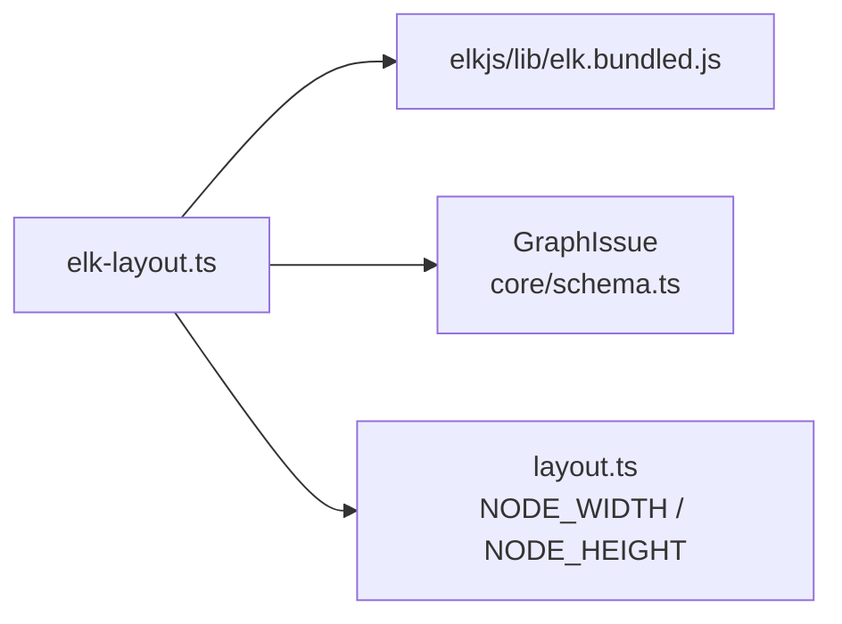
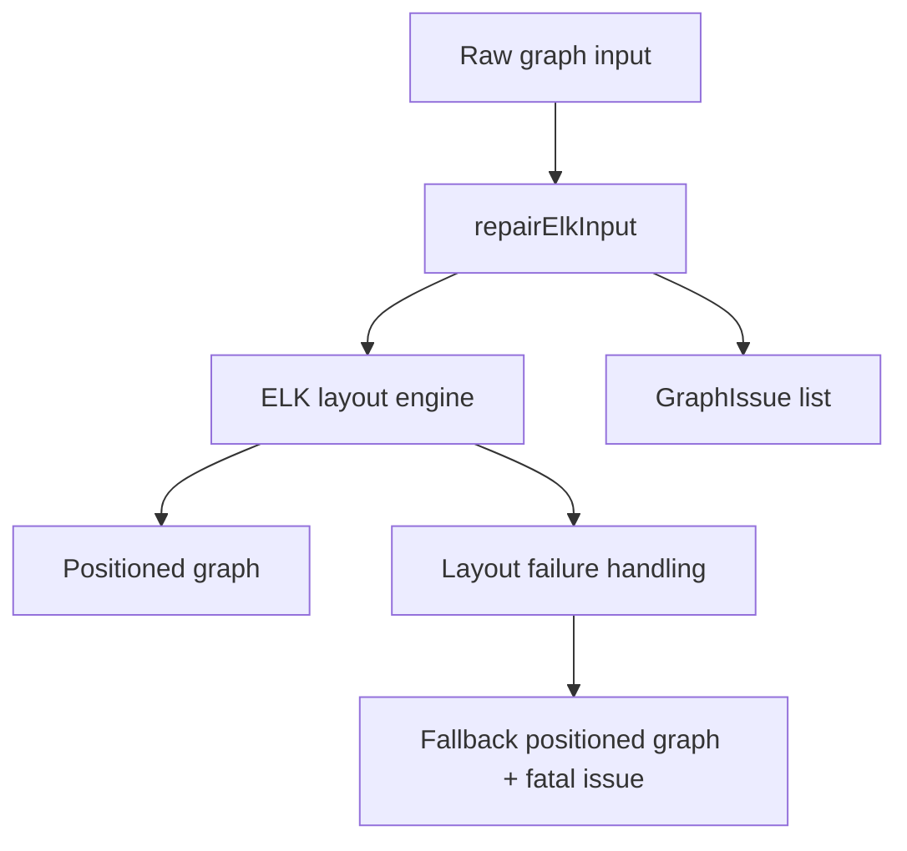
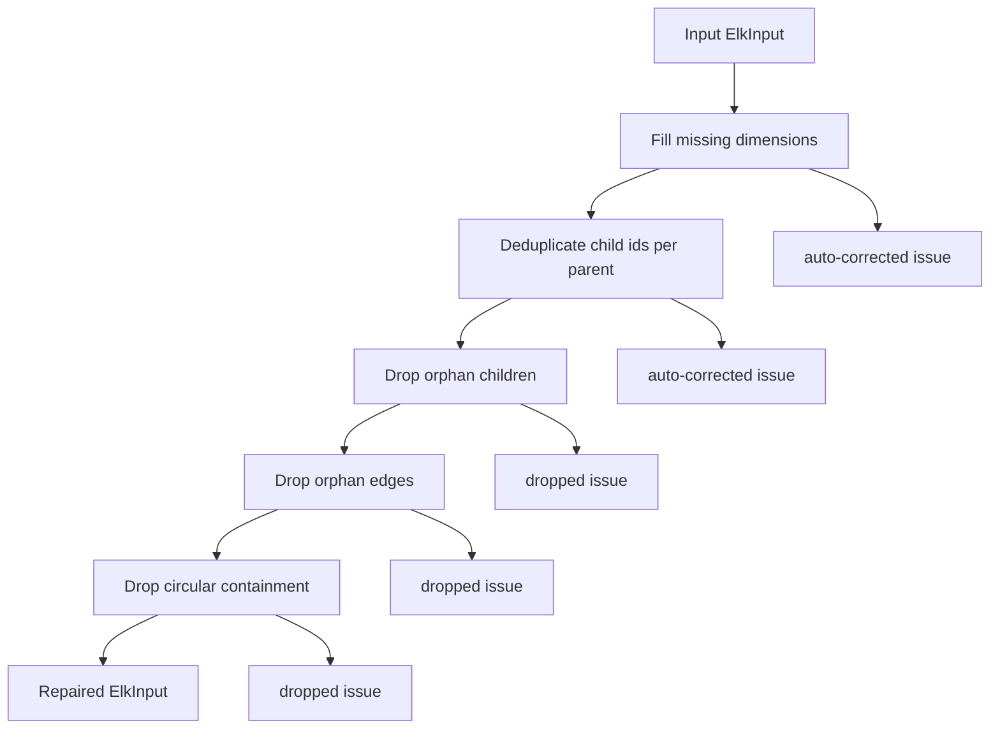
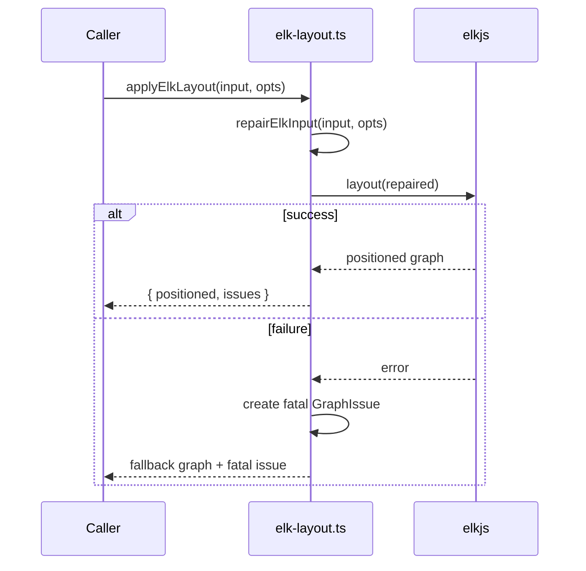
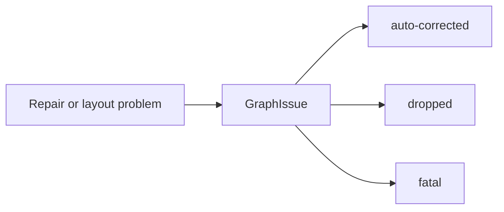
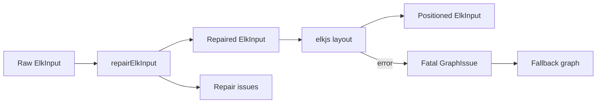
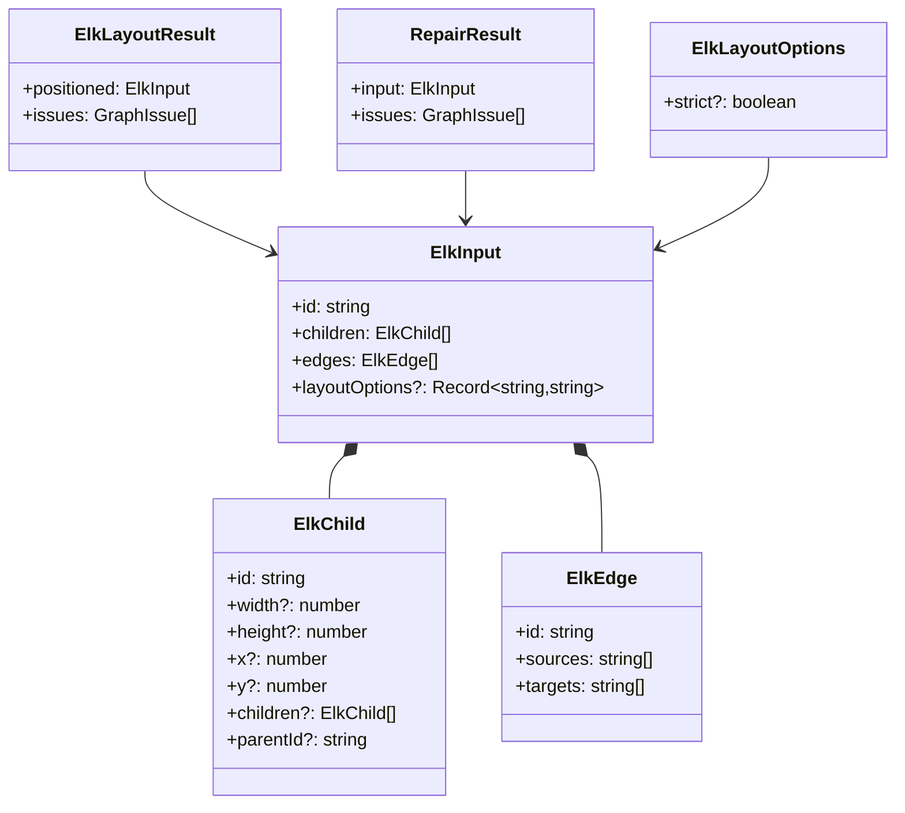
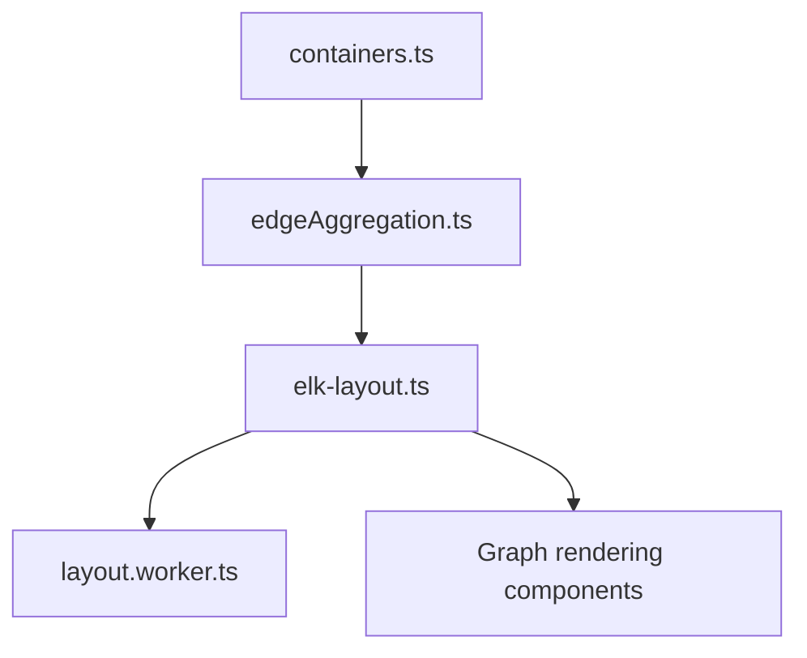

# elk-layout

`elk-layout` is the dashboard’s ELK-based graph layout adapter. It prepares graph data for `elkjs`, repairs malformed inputs, runs the layout engine, and returns positioned nodes together with structured issues that explain any corrections or drops made along the way.

This module sits in the dashboard layout pipeline and is designed to be collision-consistent with the older force/dagre layout utilities by reusing the same default node dimensions from [`layout.md`](layout.md).

## Purpose

The module solves three problems:

1. Normalize graph input so ELK can process it safely.
2. Preserve layout stability by filling missing dimensions with shared defaults.
3. Surface recoverable and fatal layout problems as `GraphIssue` records instead of failing silently.

## Core types

### `ElkChild`
Represents a node in the ELK tree.

- `id`: unique node identifier
- `width`, `height`: optional on input, required for layout
- `x`, `y`: populated by ELK after layout
- `children`: nested child nodes for containment hierarchies
- `parentId`: optional reference used during repair

### `ElkEdge`
Represents a directed edge.

- `id`: edge identifier
- `sources`: source node ids
- `targets`: target node ids

### `ElkInput`
Top-level layout payload passed to ELK.

- `id`: graph id
- `children`: root-level nodes
- `edges`: graph edges
- `layoutOptions`: optional ELK configuration map

### `ElkLayoutOptions`
Layout execution options.

- `strict?: boolean`

When `strict` is enabled, any repair issue or layout failure is thrown immediately instead of being returned as a recoverable issue.

### `ElkLayoutResult`
Result returned by `applyElkLayout`.

- `positioned`: the repaired and positioned graph
- `issues`: accumulated `GraphIssue` entries from repair and layout execution

### `RepairOptions`
Internal repair options used by `repairElkInput`.

- `strict?: boolean`

### `RepairResult`
Internal repair result.

- `input`: repaired ELK input
- `issues`: issues generated during repair

## Dependencies



### Dependency notes

- Uses `ELK` from `elkjs` as the layout engine.
- Imports `GraphIssue` from the core schema module for standardized issue reporting.
- Reuses `NODE_WIDTH` and `NODE_HEIGHT` from [`layout.md`](layout.md) to keep fallback sizing aligned with other dashboard layout strategies.

## Architecture overview



The module is intentionally split into two phases:

1. **Repair phase**: sanitize the graph so ELK receives a valid, consistent structure.
2. **Layout phase**: invoke ELK and convert success/failure into a predictable result shape.

## Repair pipeline

`repairElkInput` performs a deterministic sequence of validations and corrections.



### 1. Fill missing dimensions

Any node missing `width` or `height` receives default values from `layout.ts`.

Why this matters:

- ELK requires dimensions to compute positions.
- Shared defaults keep the ELK layout visually compatible with the dashboard’s other layout systems.

Issue emitted:

- `level: "auto-corrected"`
- `category: "elk-missing-dimensions"`

### 2. Deduplicate child ids per parent

Within each sibling list, duplicate `id` values are removed after the first occurrence.

Important detail:

- Deduplication is scoped to each parent’s child array, not globally.
- Nested children are processed recursively.

Issue emitted:

- `level: "auto-corrected"`
- `category: "elk-duplicate-id"`

### 3. Drop orphan children

Children whose `parentId` references a node id that does not exist in the graph are removed from the root-level child list.

Issue emitted:

- `level: "dropped"`
- `category: "elk-orphan-parent"`

### 4. Drop orphan edges

Edges are retained only if every source and target id exists in the node set.

Issue emitted:

- `level: "dropped"`
- `category: "elk-orphan-edge"`

### 5. Drop circular containment

The module builds a parent map and removes nodes that participate in containment cycles.

Issue emitted:

- `level: "dropped"`
- `category: "elk-containment-cycle"`

## Layout execution

`applyElkLayout` is the public async entry point.



### Success path

On success, the module returns:

- the ELK-positioned graph
- all repair issues collected before layout

### Failure path

If ELK throws:

- in non-strict mode, the module returns a fallback graph with empty `children` and `edges`, plus a fatal issue
- in strict mode, the original error is rethrown

Fatal issue details:

- `level: "fatal"`
- `category: "elk-layout-failed"`
- message includes the underlying error text and a dashboard bug hint

## Issue model

The module reports problems using [`GraphIssue`](core_schema_and_types.md).



### Issue levels

- **auto-corrected**: input was repaired without removing graph elements
- **dropped**: graph elements were removed to preserve validity
- **fatal**: layout could not be completed

## Data flow



## Component relationships



## Integration with the dashboard layout stack

This module is one of several layout utilities in the dashboard.

- [`layout.md`](layout.md): shared node sizing and force-layout primitives
- [`layout.worker.md`](layout.worker.md): worker-based layout execution and messaging
- [`containers.md`](containers.md): container derivation used before edge aggregation and layout
- [`edgeAggregation.md`](edgeAggregation.md): edge bucketing and aggregation before graph layout



## Operational notes

### Strict mode

Use strict mode when layout correctness is more important than resilience.

- repair issues throw immediately
- ELK failures throw immediately
- useful in tests and debugging

### Non-strict mode

Use non-strict mode in production UI flows.

- graph is repaired where possible
- invalid pieces are dropped
- layout failures degrade gracefully with a fatal issue

### Collision consistency

The fallback dimensions are intentionally shared with the force-layout utilities. This prevents nodes from changing size semantics when switching between layout engines.

## Error handling summary

| Condition | Behavior in non-strict mode | Behavior in strict mode |
|---|---|---|
| Missing node dimensions | Fill defaults, emit auto-corrected issue | Throw |
| Duplicate sibling ids | Remove duplicates, emit auto-corrected issue | Throw |
| Orphan child | Drop child, emit dropped issue | Throw |
| Orphan edge | Drop edge, emit dropped issue | Throw |
| Containment cycle | Drop cyclic node(s), emit dropped issue | Throw |
| ELK runtime failure | Return fallback graph + fatal issue | Throw |

## Practical usage

```ts
import { applyElkLayout } from "./utils/elk-layout";

const result = await applyElkLayout({
  id: "graph",
  children: [
    { id: "a", width: 180, height: 80 },
    { id: "b", width: 180, height: 80 },
  ],
  edges: [
    { id: "e1", sources: ["a"], targets: ["b"] },
  ],
});

console.log(result.positioned.children);
console.log(result.issues);
```

## Related documentation

- [`layout.md`](layout.md)
- [`layout.worker.md`](layout.worker.md)
- [`containers.md`](containers.md)
- [`edgeAggregation.md`](edgeAggregation.md)
- [`core_schema_and_types.md`](core_schema_and_types.md)
