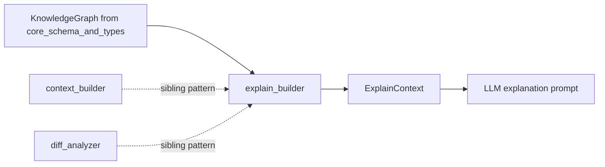
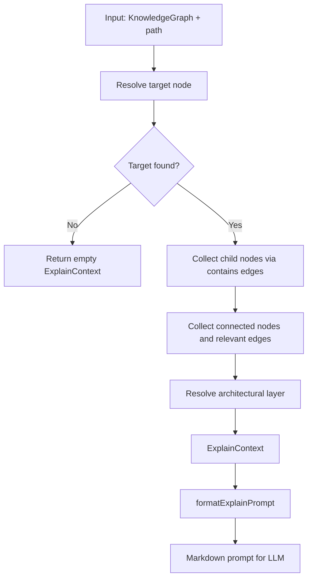
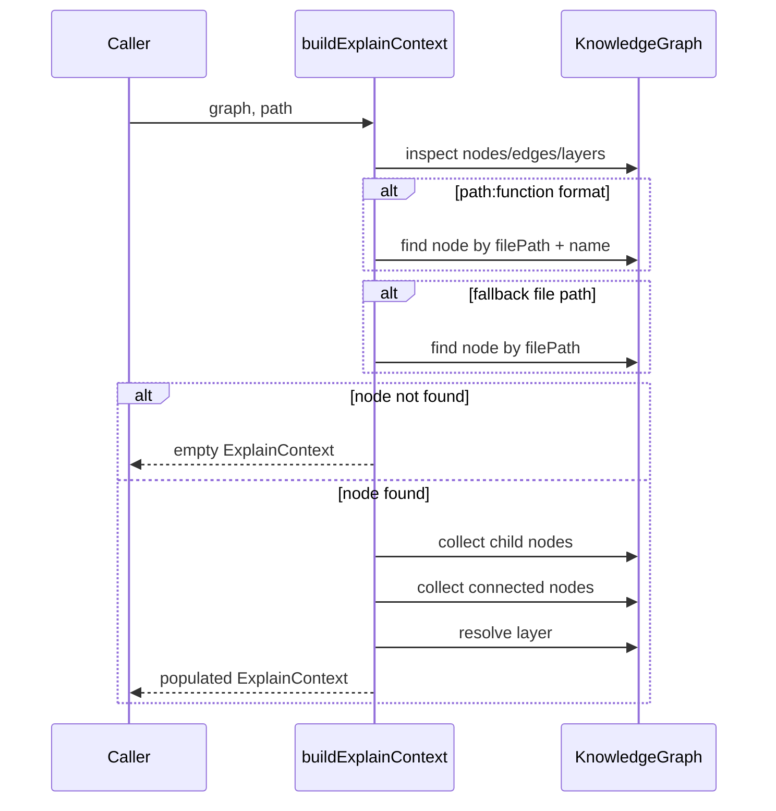
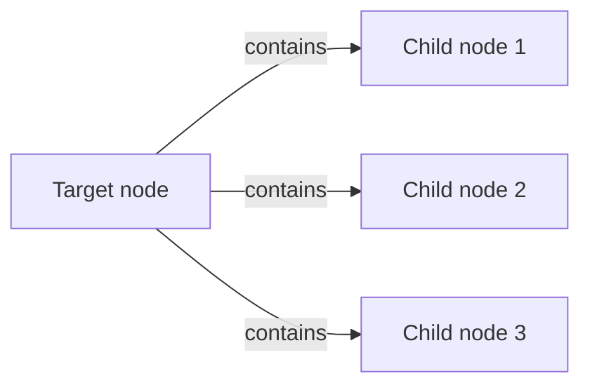
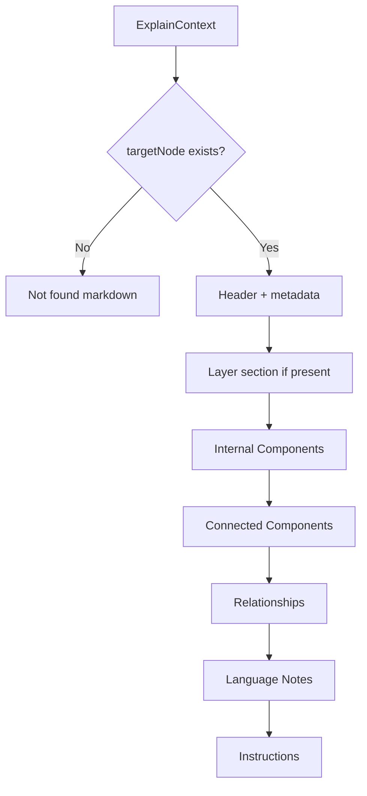
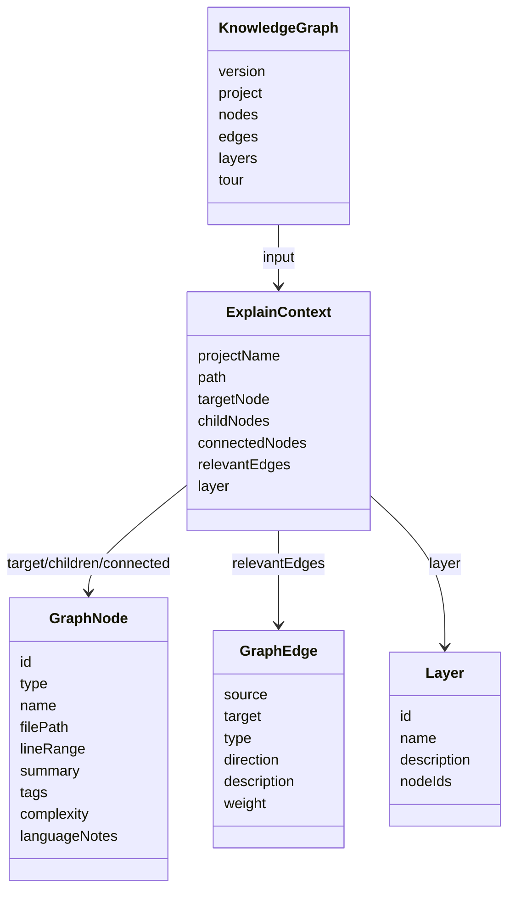
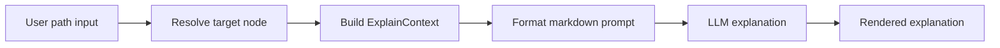

# explain_builder

`explain_builder` builds a focused explanation context for a single code element in a `KnowledgeGraph`, then formats that context into an LLM-friendly prompt. It is the bridge between the analyzed graph model and the assistant’s “deep dive” explanation workflow.

This module is intentionally small, but it sits at an important boundary: it translates graph structure into a narrative-ready prompt that can be consumed by the explanation layer of the application.

## Purpose

The module answers one question:

> “Given a file path or `file:function` reference, what surrounding graph context should an LLM see in order to explain this component well?”

It does this in two steps:

1. **Build an `ExplainContext`** from the graph.
2. **Format that context** into a structured markdown prompt.

---

## Module overview

### Core responsibilities

- Resolve a target node from a file path or `path:function` identifier.
- Collect immediate structural context around that node.
- Include architectural layer information when available.
- Produce a markdown prompt that guides an LLM to explain the component.

### Public API

- `buildExplainContext(graph, path)`
- `formatExplainPrompt(ctx)`
- `ExplainContext`

---

## Dependencies and placement in the system

`explain_builder` depends on the shared graph model from the core package:

- [`core_schema_and_types`](core_schema_and_types.md) for `KnowledgeGraph`, `GraphNode`, `GraphEdge`, and `Layer`

It is conceptually parallel to the other app-level context builders:

- [`context_builder`](context_builder.md) for general chat context
- [`diff_analyzer`](diff_analyzer.md) for change-impact context

### Relationship to other modules



---

## Data model

### `ExplainContext`

`ExplainContext` is the intermediate structure used by the module.

```ts
interface ExplainContext {
  projectName: string;
  path: string;
  targetNode: GraphNode | null;
  childNodes: GraphNode[];
  connectedNodes: GraphNode[];
  relevantEdges: GraphEdge[];
  layer: Layer | null;
}
```

### Field meaning

- **projectName**: Name of the analyzed project.
- **path**: The original lookup string provided by the caller.
- **targetNode**: The resolved node, or `null` if no match exists.
- **childNodes**: Nodes directly contained by the target via `contains` edges.
- **connectedNodes**: One-hop neighboring nodes excluding the target and its children.
- **relevantEdges**: All edges touching the target or its children.
- **layer**: The architectural layer containing the target node, if any.

---

## Architecture

The module is organized as a simple two-stage pipeline.



### Why this shape?

The module keeps graph traversal logic separate from prompt formatting so that:

- the context can be reused or tested independently,
- prompt formatting remains deterministic,
- future explanation styles can reuse the same context.

---

## `buildExplainContext(graph, path)`

This function resolves a target node and gathers the surrounding graph neighborhood.

### Resolution strategy

The function supports two lookup forms:

1. **File path**: `src/auth.ts`
2. **File + symbol**: `src/auth.ts:login`

It first tries to interpret the input as `path:function`, then falls back to a plain file-path match.



### Target node lookup details

```ts
const colonIdx = path.lastIndexOf(":");
if (colonIdx > 0 && !path.includes("://")) {
  const filePath = path.slice(0, colonIdx);
  const funcName = path.slice(colonIdx + 1);
  targetNode = nodes.find((n) => n.filePath === filePath && n.name === funcName) ?? null;
}
```

#### Notes

- The `lastIndexOf(":")` approach allows file paths containing earlier colons to still be handled reasonably.
- The `!path.includes("://")` guard avoids treating URLs as `path:function` references.
- Matching is based on `filePath` and `name`, so the symbol name must match exactly.

### Child node collection

Child nodes are defined as nodes that are the target of a `contains` edge originating from the target node.



Implementation-wise, the function scans all nodes and checks whether a `contains` edge exists from the target to each candidate node.

### Connected node collection

Connected nodes are the one-hop neighbors of the target and its children, excluding the target itself and the child set.

This means the explanation prompt includes:

- direct structural contents,
- immediate external relationships,
- but not the entire transitive graph.

### Relevant edges

`relevantEdges` includes every edge where either endpoint is the target or one of its child nodes.

This gives the LLM enough relationship context to explain:

- dependencies,
- calls,
- references,
- containment,
- and other graph relationships.

### Layer resolution

The function finds the first layer whose `nodeIds` contains the target node ID.

This is used to provide architectural framing in the final prompt.

---

## `formatExplainPrompt(ctx)`

This function converts an `ExplainContext` into a markdown prompt.

### Output behavior

There are two major branches:

1. **Target not found** → return a “Component Not Found” message.
2. **Target found** → return a structured deep-dive prompt.



### Prompt structure

When a target exists, the prompt includes:

- **Title**: `Deep Dive: <node name>`
- **Metadata**: type, complexity, file, line range
- **Summary**: node summary
- **Architectural layer**: if available
- **Internal components**: child nodes
- **Connected components**: neighboring nodes
- **Relationships**: non-containment edges touching the local subgraph
- **Language notes**: if present
- **Instructions**: explicit explanation goals for the LLM

### Relationship formatting

Containment edges are intentionally skipped in the relationships section because they are already represented by the “Internal Components” section.

This avoids redundant prompt content and keeps the explanation focused on meaningful interactions.

---

## Component interaction model



### How the pieces fit together

- `KnowledgeGraph` provides the raw analysis data.
- `buildExplainContext` extracts a local subgraph around the requested path.
- `formatExplainPrompt` turns that subgraph into a structured explanation request.
- The LLM receives the prompt and generates the human-readable explanation.

---

## Data flow



### Data flow details

1. The caller supplies a path string.
2. The module resolves the corresponding graph node.
3. It gathers nearby nodes and edges.
4. It optionally attaches layer metadata.
5. It formats everything into a prompt optimized for explanation generation.

---

## Design decisions

### 1. Local neighborhood instead of full graph

The module intentionally limits context to the target node, its children, and its immediate neighbors. This keeps prompts:

- smaller,
- more relevant,
- and less noisy.

### 2. Dual lookup mode

Supporting both `filePath` and `filePath:symbol` makes the module useful for both file-level and function-level explanations.

### 3. Prompt-first formatting

The output is markdown with explicit headings and instructions. This makes the prompt easy for LLMs to parse and also easy to inspect during debugging.

### 4. Layer-aware explanations

Including the architectural layer helps the assistant explain not just what the component does, but where it fits in the system.

---

## Error and fallback behavior

If the target cannot be resolved, the module does not throw. Instead, it returns a valid `ExplainContext` with empty collections and `targetNode: null`.

This is important because it allows the caller to render a graceful “not found” explanation prompt rather than failing the entire workflow.

### Not found prompt example

```md
# Component Not Found

The path "src/auth.ts" was not found in the knowledge graph for MyProject.
```

---

## Practical usage

Typical usage pattern:

```ts
const ctx = buildExplainContext(graph, "src/auth.ts:login");
const prompt = formatExplainPrompt(ctx);
```

The caller can then send `prompt` to the LLM explanation pipeline.

---

## Related documentation

- [`core_schema_and_types`](core_schema_and_types.md) — shared graph and layer types
- [`context_builder`](context_builder.md) — general chat context construction
- [`diff_analyzer`](diff_analyzer.md) — change-impact context construction

---

## Summary

`explain_builder` is the explanation-oriented context builder for the application. It resolves a target node from the knowledge graph, gathers the most relevant surrounding structure, and formats that information into a concise but rich prompt for LLM-based deep dives.

Its main strengths are:

- simple and deterministic graph traversal,
- support for file and symbol references,
- architectural layer awareness,
- and prompt formatting tailored for explanation workflows.
