# fingerprint_and_change_analysis

This module provides the core change-detection pipeline for the knowledge graph system. It fingerprints source files, compares old and new snapshots, classifies changes as cosmetic or structural, and feeds that result into update-decision logic that determines whether the graph should be skipped, partially refreshed, or rebuilt.

It is the bridge between language-aware structural analysis (`PluginRegistry` + `StructuralAnalysis`) and higher-level update orchestration (`classifyUpdate`).

## Purpose

The module answers three questions:

1. **What does a file look like structurally?**
   - Capture stable signatures for functions, classes, imports, and exports.
2. **What changed since the last snapshot?**
   - Compare fingerprints and separate cosmetic edits from structural edits.
3. **How much of the system must be refreshed?**
   - Convert change analysis into an update decision for downstream graph rebuilds.

## Core responsibilities

- Build file fingerprints from content and structural analysis.
- Persist project-wide fingerprint snapshots.
- Compare fingerprints across revisions.
- Detect new, deleted, unchanged, cosmetic-only, and structurally changed files.
- Classify the required update scope for the graph pipeline.

## Related modules

- [core_schema_and_types](core_schema_and_types.md) — shared graph and analysis types, including `StructuralAnalysis`.
- [core_plugin_system](core_plugin_system.md) — plugin discovery and registry used to obtain structural analysis.
- [core_language_support](core_language_support.md) — language detection and analyzers used by `PluginRegistry`.
- [core_analysis](core_analysis.md) — downstream consumers of structural changes for graph and architecture analysis.
- [staleness_and_graph_merging](staleness_and_graph_merging.md) — complementary logic for deciding whether graph data is stale.

---

## Architecture overview

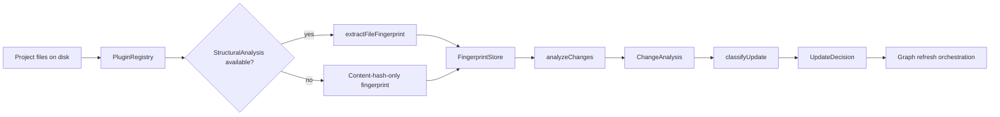

### What each stage does

- **PluginRegistry** resolves the correct analyzer for a file based on language.
- **extractFileFingerprint** converts structural analysis into a stable signature.
- **buildFingerprintStore** creates a snapshot for a project at a specific commit.
- **analyzeChanges** compares current files against the stored snapshot.
- **classifyUpdate** turns the change summary into an operational decision.

---

## Component model

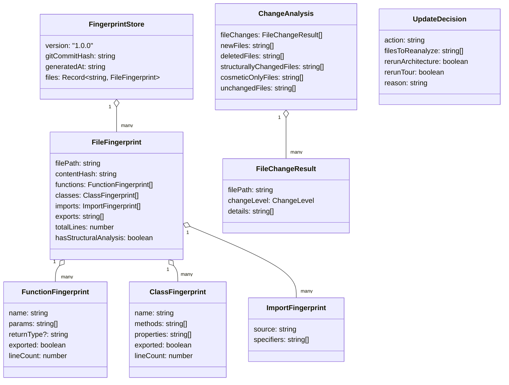

---

## Data flow

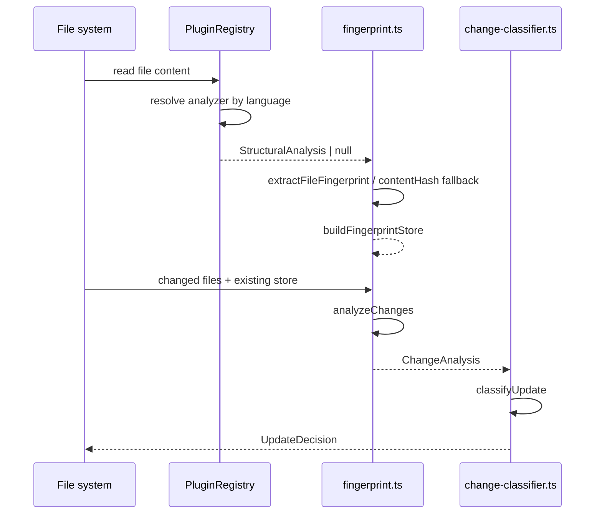

---

## Fingerprint model

### `FunctionFingerprint`

Captures the stable API surface of a function:

- `name`
- `params`
- `returnType`
- `exported`
- `lineCount`

This is intentionally signature-oriented. Internal implementation details are not stored.

### `ClassFingerprint`

Captures the stable API surface of a class:

- `name`
- `methods`
- `properties`
- `exported`
- `lineCount`

### `ImportFingerprint`

Captures dependency shape:

- `source`
- `specifiers`

### `FileFingerprint`

Represents the structural snapshot of a file:

- content hash for exact equality checks
- function/class/import/export signatures
- total line count
- whether structural analysis was available

### `FingerprintStore`

Represents a project-wide snapshot:

- schema version (`1.0.0`)
- git commit hash
- generation timestamp
- file fingerprint map

---

## Fingerprint extraction

### `contentHash(content)`

Computes a SHA-256 hash of the file content.

Use cases:

- fast equality check
- fallback when structural analysis is unavailable
- baseline for change detection

### `extractFileFingerprint(filePath, content, analysis)`

Builds a `FileFingerprint` from a `StructuralAnalysis` object.

#### Behavior

- hashes the full file content
- maps analyzed functions into `FunctionFingerprint`
- maps analyzed classes into `ClassFingerprint`
- maps imports into `ImportFingerprint`
- copies export names
- counts total lines
- marks `hasStructuralAnalysis = true`

#### StructuralAnalysis dependency

The function depends on `StructuralAnalysis` from [core_schema_and_types](core_schema_and_types.md). Only the structural elements relevant to graph generation are used.

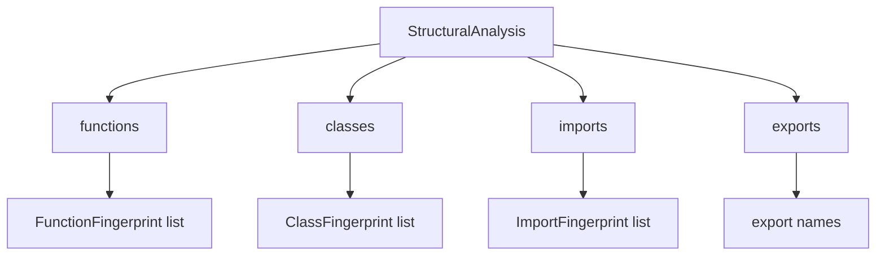

---

## Fingerprint comparison

### `compareFingerprints(oldFp, newFp)`

Compares two file fingerprints and returns a `FileChangeResult`.

### Change levels

- **NONE** — content hash is identical
- **COSMETIC** — content changed, but structural signatures are unchanged
- **STRUCTURAL** — signature-level differences or conservative fallback

### Comparison strategy

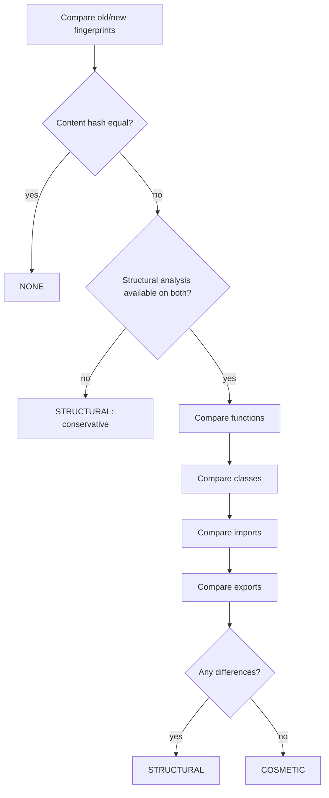

### Function comparison rules

A function is considered structurally changed if any of the following differ:

- function added or removed
- parameter list changed
- return type changed
- export status changed
- line count changes significantly (>50% growth or shrink)

### Class comparison rules

A class is considered structurally changed if any of the following differ:

- class added or removed
- method set changed
- property set changed
- export status changed

### Import/export comparison rules

- imports are normalized by source and sorted specifiers
- exports are compared as sorted name lists
- any difference marks the file as structural

### Conservative fallback

If either fingerprint lacks structural analysis, the comparison returns `STRUCTURAL` when content differs. This avoids false negatives for unsupported file types.

---

## Building a fingerprint store

### `buildFingerprintStore(projectDir, filePaths, registry, gitCommitHash)`

Creates a `FingerprintStore` for a project snapshot.

#### Inputs

- `projectDir`: root directory of the project
- `filePaths`: files to fingerprint
- `registry`: analyzer registry used to obtain structural analysis
- `gitCommitHash`: snapshot identifier

#### Process

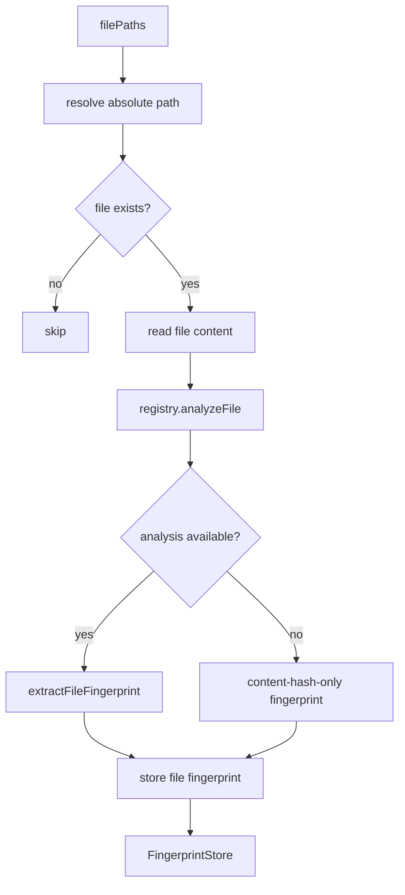

#### Notes

- Missing files are skipped.
- Unsupported files still receive a fingerprint, but only with content hash and line count.
- Unsupported files are treated conservatively in later comparisons.

---

## Change analysis

### `analyzeChanges(projectDir, changedFiles, existingStore, registry)`

Compares the current state of changed files against an existing fingerprint store.

#### Outputs

- `fileChanges`: per-file change results
- `newFiles`: files not present in the store
- `deletedFiles`: files present in the store but missing now
- `structurallyChangedFiles`: files with structural changes
- `cosmeticOnlyFiles`: files with cosmetic-only changes
- `unchangedFiles`: files with no changes

#### Process flow

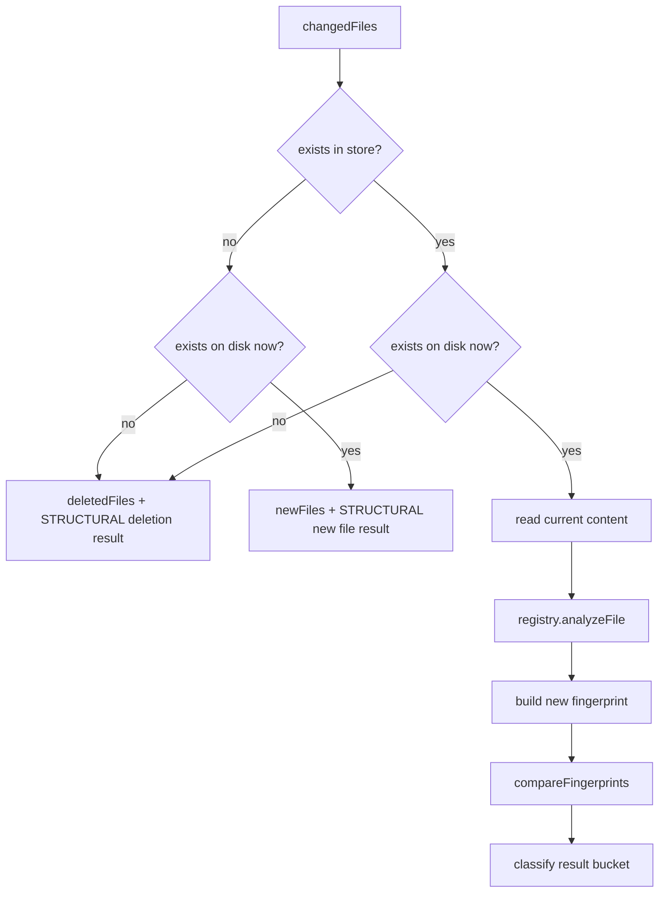

#### Classification buckets

- `NONE` → `unchangedFiles`
- `COSMETIC` → `cosmeticOnlyFiles`
- `STRUCTURAL` → `structurallyChangedFiles`

#### Important behavior

- New files are always structural.
- Deleted files are always structural.
- Unsupported files are compared conservatively.

---

## Update classification

The change-analysis output is consumed by `classifyUpdate` in [core_change_tracking](core_change_tracking.md).

### `UpdateDecision`

Represents the recommended refresh strategy:

- `SKIP`
- `PARTIAL_UPDATE`
- `ARCHITECTURE_UPDATE`
- `FULL_UPDATE`

It also includes:

- `filesToReanalyze`
- `rerunArchitecture`
- `rerunTour`
- `reason`

### `classifyUpdate(analysis, totalFilesInGraph, allKnownFiles)`

Determines the scope of refresh based on structural impact.

#### Decision matrix

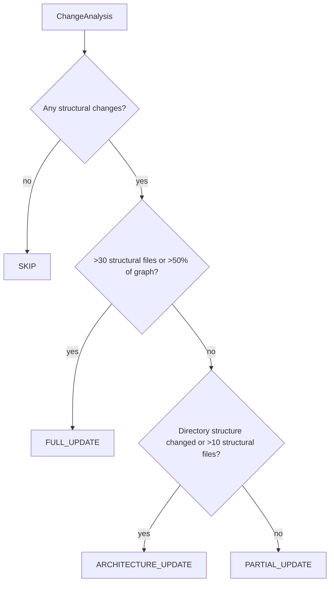

#### Decision rules

- **SKIP**
  - no structural changes
  - cosmetic-only changes are tolerated
- **PARTIAL_UPDATE**
  - localized structural changes
  - no directory-level impact
- **ARCHITECTURE_UPDATE**
  - directory structure changed, or
  - more than 10 structural files changed
- **FULL_UPDATE**
  - more than 30 structural files changed, or
  - more than 50% of the graph changed structurally

### Directory change detection

`detectDirectoryChanges(newFiles, deletedFiles, allKnownFiles)` checks whether new or deleted files introduce/remove top-level directories.

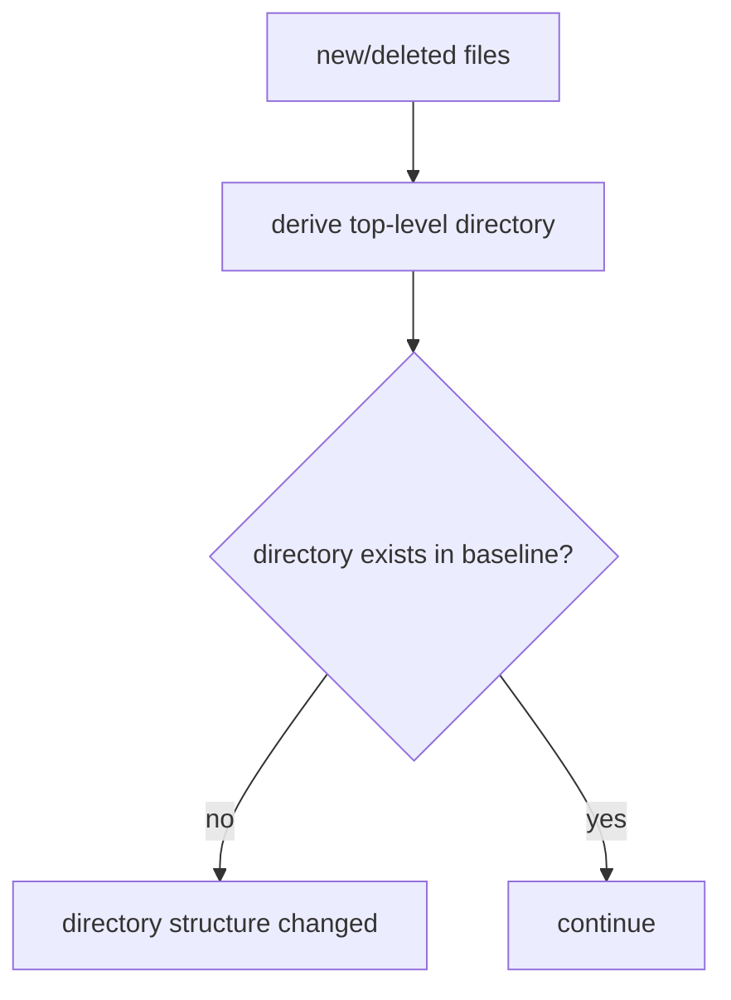

### Summary generation

`summarizeChanges(analysis)` produces a concise human-readable reason such as:

- `2 new, 1 deleted, 4 modified`
- `3 modified`

---

## How this module fits into the system

This module sits between low-level parsing and high-level graph orchestration.

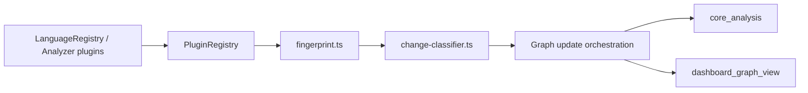

### Integration points

- **Input from analyzers**: structural signatures from language-specific plugins.
- **Output to orchestration**: update decisions that determine whether to rerun architecture and tour generation.
- **Complementary modules**: staleness logic and graph merging can use the same snapshot/change signals.

---

## Design characteristics

### Strengths

- Fast exact-match detection via content hash.
- Structural comparison avoids unnecessary rebuilds.
- Conservative fallback prevents missed changes in unsupported files.
- Clear separation between fingerprinting and update policy.

### Trade-offs

- Structural comparison depends on analyzer quality.
- Line-count heuristics may over-classify large refactors as structural.
- Unsupported files cannot be safely classified as cosmetic.

### Operational assumptions

- File paths are stable relative to `projectDir`.
- `PluginRegistry` can resolve analyzers for supported languages.
- `StructuralAnalysis` is sufficiently accurate to represent API-level changes.

---

## Practical usage pattern

1. Build a fingerprint store for the current project snapshot.
2. On subsequent runs, collect changed files.
3. Run `analyzeChanges` against the stored snapshot.
4. Pass the result to `classifyUpdate`.
5. Reanalyze only the necessary parts of the graph.

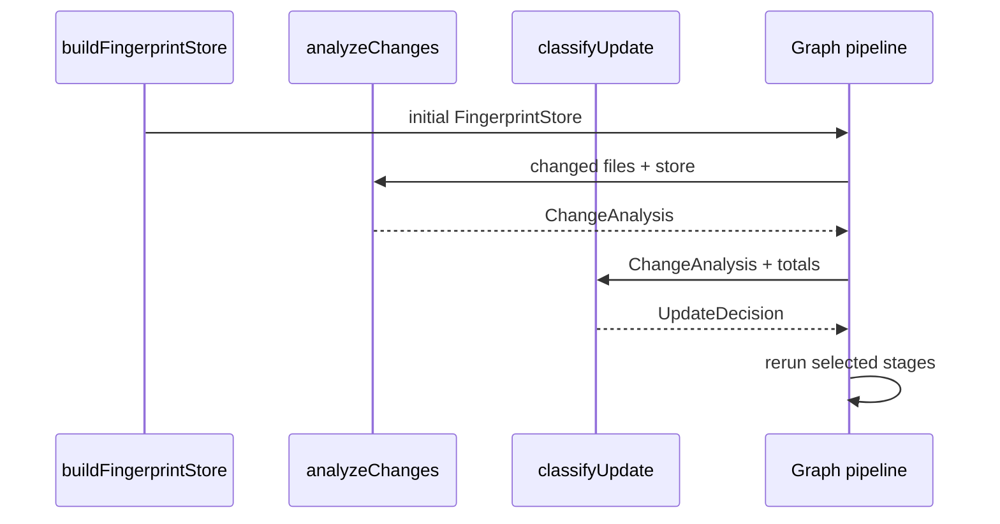

---

## Implementation notes

- `FingerprintStore.version` is fixed at `1.0.0`, which implies snapshot schema compatibility should be managed explicitly.
- `generatedAt` is ISO timestamp metadata for traceability.
- `compareFingerprints` uses normalized comparisons for imports and exports to reduce ordering noise.
- `buildFingerprintStore` and `analyzeChanges` both rely on `PluginRegistry.analyzeFile`.

---

## See also

- [core_schema_and_types](core_schema_and_types.md)
- [core_plugin_system](core_plugin_system.md)
- [core_language_support](core_language_support.md)
- [core_analysis](core_analysis.md)
- [staleness_and_graph_merging](staleness_and_graph_merging.md)
