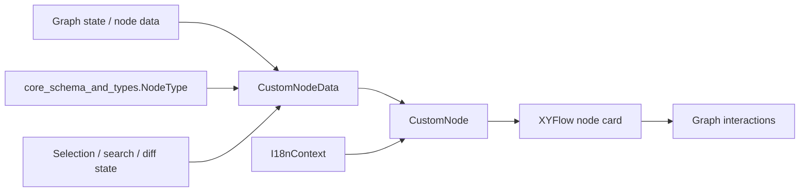
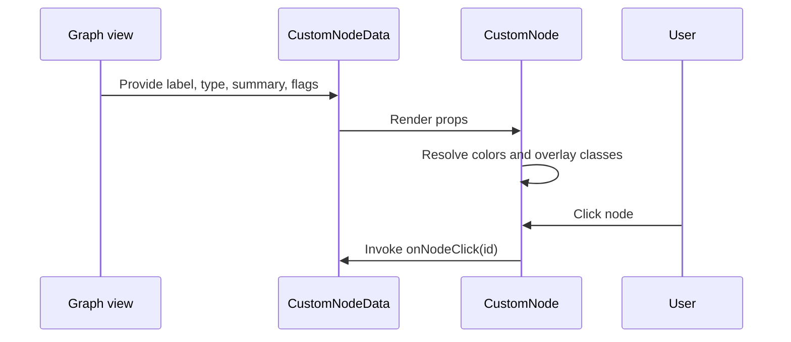
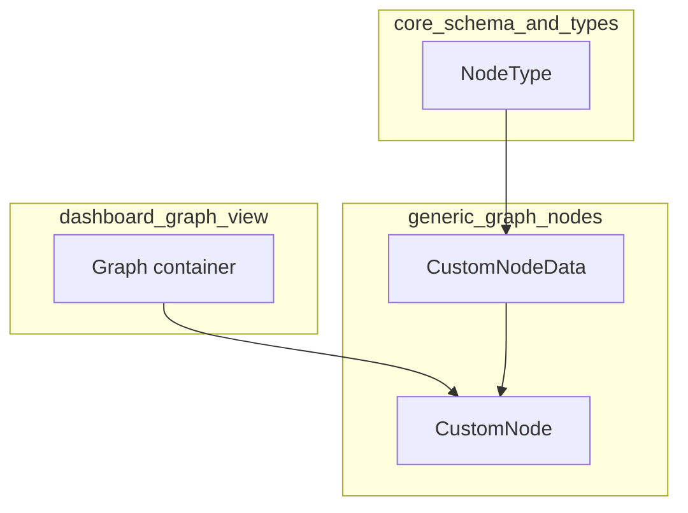
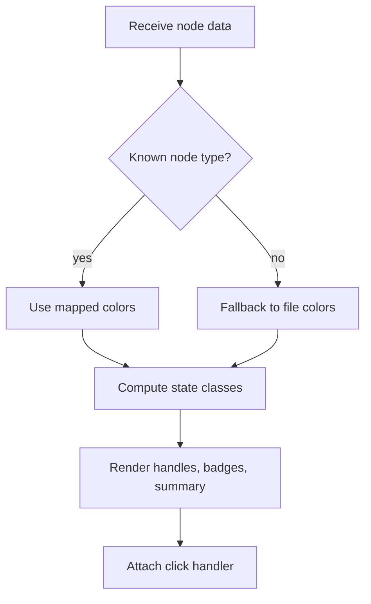

# generic_graph_nodes

The `generic_graph_nodes` module provides the reusable node renderer used by the dashboard graph view for generic, content-rich graph nodes. Its primary responsibility is to render a compact, interactive node card with consistent visual semantics across many node types, while also reflecting search, selection, tour, and diff states.

This module is intentionally narrow: it focuses on presentation and interaction for a single node shape, while higher-level graph composition, layout, clustering, and edge generation are handled by other dashboard modules such as [dashboard_graph_view](dashboard_graph_view.md) and [dashboard_layout_utils](dashboard_layout_utils.md).

## Purpose

`CustomNode` is the default node component for graph nodes that need:

- a label, summary, and type badge
- type-based color coding
- complexity indication
- optional test/tag indicators
- click handling
- visual overlays for search, selection, tour, and diff states

It is designed to work with `@xyflow/react` nodes and is memoized to reduce unnecessary re-renders in large graphs.

## Core component

### `CustomNodeData`

`CustomNodeData` defines the data contract expected by the renderer.

Key fields:

- `label`: display name shown in the node header
- `nodeType`: semantic type used for color and text styling
- `summary`: short descriptive text shown in the body
- `complexity`: complexity label used for secondary styling
- `isHighlighted`: search or focus highlight state
- `searchScore?`: optional relevance score used to vary highlight intensity
- `isSelected`: whether the node is the active selection
- `isTourHighlighted`: whether the node is emphasized by a guided tour
- `isDiffChanged`, `isDiffAffected`, `isDiffFaded`: diff visualization states
- `isNeighbor`: whether the node is adjacent to the selected node
- `isSelectionFaded`: whether the node should be dimmed because another node is selected
- `onNodeClick?`: optional click callback
- `incomingCount?`, `outgoingCount?`: optional relationship counters
- `tags?`: optional metadata tags, such as `tested`

### `CustomFlowNode`

A typed `@xyflow/react` node wrapper:

- `Node<CustomNodeData, "custom">`

This indicates that the dashboard graph uses a custom node type named `custom` for this renderer.

### `CustomNode`

The exported component is a memoized React component that renders:

- a left-side color bar based on `nodeType`
- a top and bottom `Handle` for graph connections
- a type badge
- a complexity badge
- an optional tested indicator
- a truncated title
- a two-line summary

## Visual behavior

The component maps semantic node types to colors and text classes.

### Type-based styling

The module maintains two lookup tables:

- `typeColors`: background accent bar color
- `typeTextColors`: type label text color

These maps are keyed by the shared `NodeType` union from [core_schema_and_types](core_schema_and_types.md).

If an unknown type is encountered in development mode, the component logs a warning and falls back to the `file` palette.

### Complexity styling

`complexityColors` maps complexity labels to text classes:

- `simple`
- `moderate`
- `complex`

### State overlays

The component composes multiple visual states into a single `extraClass` string:

1. Selection state
   - selected nodes get a strong ring and glow
2. Tour state
   - tour-highlighted nodes pulse with a dim accent ring
3. Search highlight state
   - highlight intensity depends on `searchScore`
4. Diff state
   - changed, affected, and faded nodes receive diff-specific styling
5. Selection fading / neighbor emphasis
   - unrelated nodes fade when another node is selected
   - neighbors receive a subtle gold ring

This layered styling model allows the graph to communicate multiple modes of attention without changing the underlying graph structure.

## Interaction model

The node is clickable and forwards its `id` to `data.onNodeClick` when provided.

Connection points are exposed via `Handle` components:

- `Position.Top` as the target handle
- `Position.Bottom` as the source handle

This makes the node compatible with directed graph layouts and edge routing in the dashboard.

## Dependencies and relationships

### Direct dependencies

- `react` for `memo`
- `@xyflow/react` for node rendering and connection handles
- `@understand-anything/core/types` for the shared `NodeType` union
- `../contexts/I18nContext` for localized labels and accessibility text

### Related dashboard modules

- [dashboard_graph_view](dashboard_graph_view.md): consumes `CustomNode` as part of the graph rendering pipeline
- [dashboard_layout_utils](dashboard_layout_utils.md): determines node placement and dimensions that influence how nodes appear in the graph
- [dashboard_state_and_ui](dashboard_state_and_ui.md): provides selection, search, tour, and theme state that typically drives the flags passed into `CustomNodeData`
- [core_schema_and_types](core_schema_and_types.md): defines the shared graph and node type system used across the application

## Architecture

## Data flow

## Component interaction

## Process flow

## Implementation notes

- The component is memoized with `React.memo` to reduce render churn in large graphs.
- The `nodeType` field is typed as `string` in `CustomNodeData`, but the renderer expects values compatible with the shared `NodeType` union.
- The `tested` tag is rendered as a small dot with localized accessibility text.
- The title is truncated to keep node cards compact.
- The component uses CSS utility classes and CSS variables for theme-aware styling.

## Extensibility

When adding new node types:

1. Update the shared `NodeType` union in [core_schema_and_types](core_schema_and_types.md).
2. Add matching entries to `typeColors` and `typeTextColors`.
3. Ensure upstream graph builders populate `CustomNodeData.nodeType` consistently.
4. Add any new state flags to the data contract only if the graph view needs to render them directly.

When adding new visual states:

- prefer composing additional flags into `CustomNodeData`
- keep the renderer stateless and driven by props
- avoid duplicating graph logic that belongs in the graph view or store

## See also

- [dashboard_graph_view](dashboard_graph_view.md)
- [dashboard_layout_utils](dashboard_layout_utils.md)
- [dashboard_state_and_ui](dashboard_state_and_ui.md)
- [core_schema_and_types](core_schema_and_types.md)
