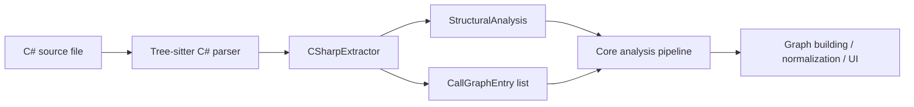
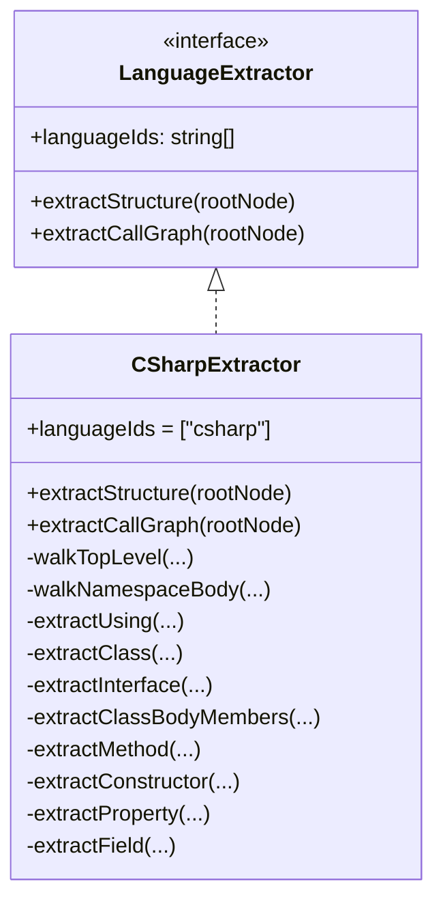
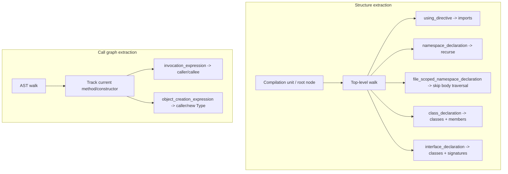
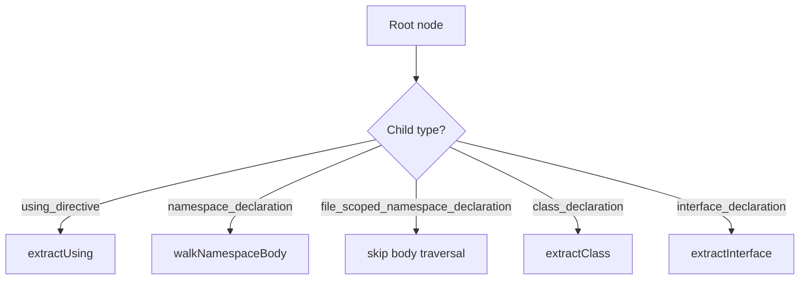
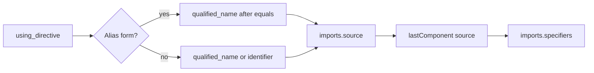
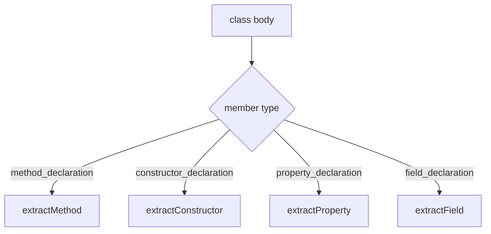
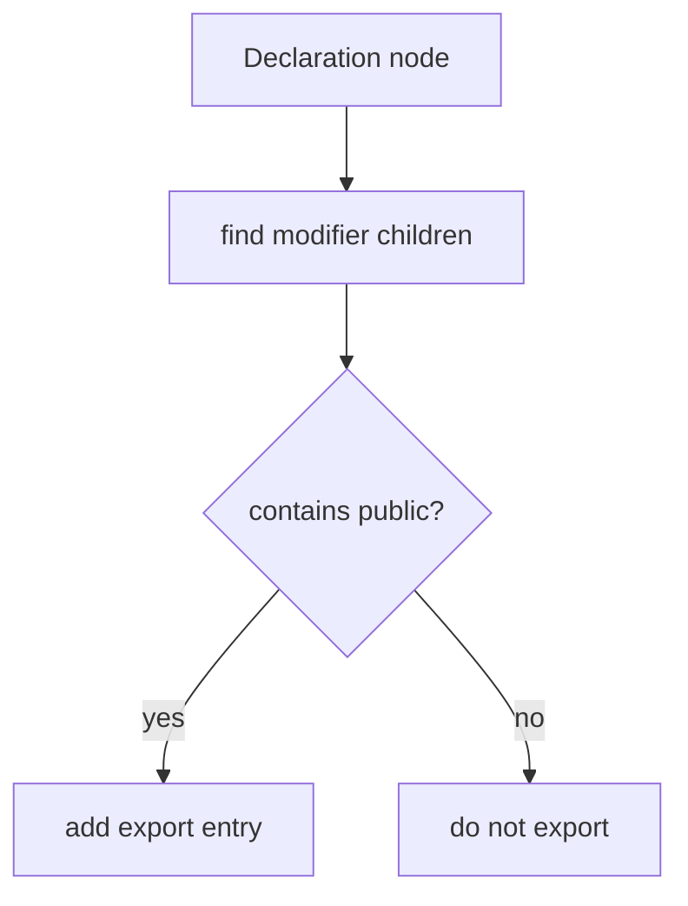
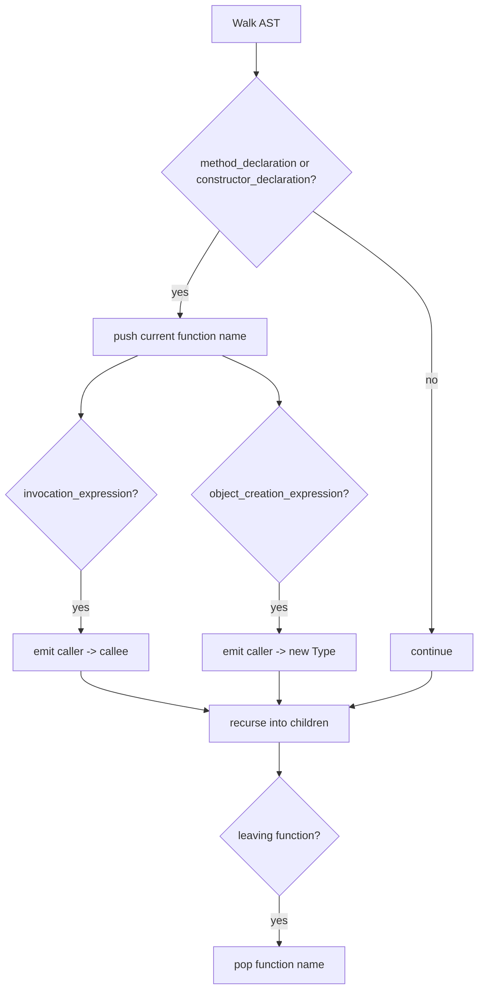
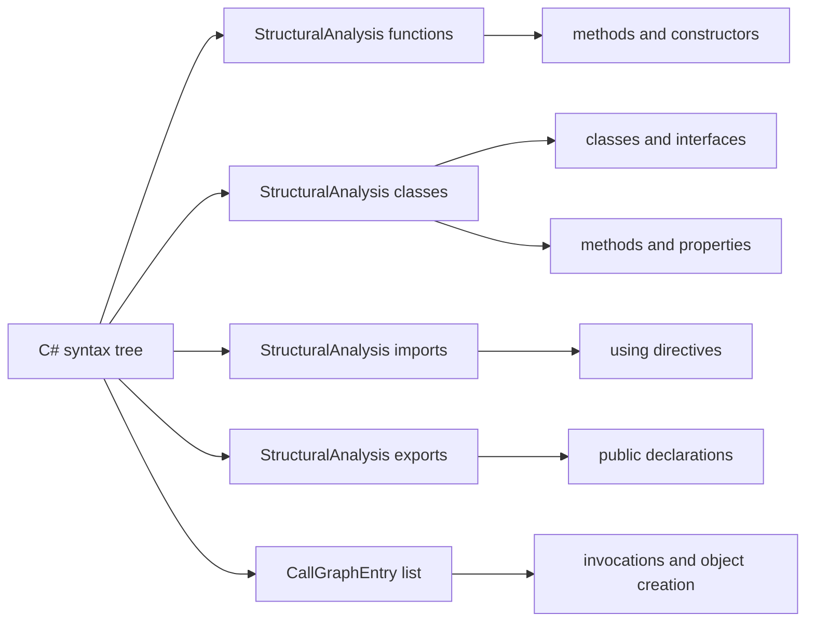

# language_extractors-csharp

## Introduction

The `language_extractors-csharp` module provides the C#-specific implementation of the shared `LanguageExtractor` interface used by the core analysis pipeline. Its job is to translate a Tree-sitter C# syntax tree into two primary outputs:

- **Structural analysis**: functions, classes, imports, and exports
- **Call graph entries**: caller → callee relationships discovered from method bodies

This extractor is intentionally lightweight and syntax-driven. It does not perform semantic resolution, type checking, or symbol binding. Instead, it relies on Tree-sitter node kinds and field names to identify declarations and invocations in C# source files.

Related documentation:
- [language_extractors-types](language_extractors-types.md)
- [shared_graph_and_analysis_types](shared_graph_and_analysis_types.md)
- [core_analysis](core_analysis.md)

---

## Module purpose

`CSharpExtractor` adapts C# source code to the common analysis model used across the platform. It is responsible for:

1. Detecting top-level and namespace-scoped declarations
2. Extracting class and interface members
3. Capturing imports from `using` directives
4. Marking public declarations as exports
5. Building a basic intra-file call graph from method bodies

The extractor is designed to work with the Tree-sitter C# grammar, which exposes C# syntax as a tree of nodes such as `class_declaration`, `method_declaration`, `using_directive`, and `invocation_expression`.

---

## Position in the system

The extractor sits inside the core language support layer and is consumed by the broader analysis pipeline.



### Dependencies

`CSharpExtractor` depends on:

- `LanguageExtractor` interface for the shared extractor contract
- `StructuralAnalysis` and `CallGraphEntry` shared types
- `findChild` / `findChildren` helper utilities from `base-extractor.ts`
- Tree-sitter node APIs such as `childForFieldName`, `child`, `childCount`, `text`, and position metadata

It does **not** depend on higher-level analysis modules such as graph normalization or LLM analysis. Those modules consume the extractor output later in the pipeline.

---

## Architecture overview



### Core responsibilities by output



---

## Public API

### `languageIds`

```ts
readonly languageIds = ["csharp"];
```

This identifies the extractor as the handler for C# language configurations.

### `extractStructure(rootNode: TreeSitterNode): StructuralAnalysis`

Returns a `StructuralAnalysis` object containing:

- `functions`
- `classes`
- `imports`
- `exports`

### `extractCallGraph(rootNode: TreeSitterNode): CallGraphEntry[]`

Returns a list of call graph edges discovered by walking the AST and tracking the current enclosing function or constructor.

---

## Structural extraction behavior

### 1) Top-level traversal

`extractStructure()` delegates to `walkTopLevel()`, which scans the root node’s direct children.

Handled node types:

- `using_directive` → import extraction
- `namespace_declaration` → recurse into namespace body
- `file_scoped_namespace_declaration` → recognized but not recursed into, because declarations are siblings at the root
- `class_declaration` → class extraction
- `interface_declaration` → interface extraction



### 2) Namespace traversal

C# supports both block-scoped and file-scoped namespaces. The extractor handles block-scoped namespaces by recursing into the namespace body (`declaration_list`) and scanning for nested declarations.

Nested namespaces are supported recursively.

### 3) Import extraction

`using_directive` nodes are converted into `imports` entries.

Behavior:

- `using System;` → source `System`, specifier `System`
- `using System.Collections.Generic;` → source `System.Collections.Generic`, specifier `Generic`
- `using Alias = Some.Namespace;` → source `Some.Namespace`, specifier `Namespace`

The extractor uses the last dotted component as the import specifier.



### 4) Class extraction

For each `class_declaration`:

- Reads the class name from the `name` field
- Scans the body for members
- Records the class line range
- Marks the class as exported if it has a `public` modifier

Class members are collected into:

- `methods`
- `properties`

### 5) Interface extraction

For each `interface_declaration`:

- Reads the interface name from the `name` field
- Collects method signatures from `method_declaration` nodes
- Collects properties from `property_declaration` nodes
- Records the interface as a class-like entry in `classes`
- Marks the interface as exported if it has a `public` modifier

Interfaces are intentionally mapped into the same `classes` array as classes, because the shared structural model treats both as type containers.

### 6) Class body member extraction

Inside a class body, the extractor handles:

- `method_declaration`
- `constructor_declaration`
- `property_declaration`
- `field_declaration`



### 7) Methods

`extractMethod()` captures:

- method name
- parameter names
- return type
- line range

It also adds the method name to the containing class/interface `methods` list and to the global `functions` list.

Return type extraction uses the `returns` field from the Tree-sitter node.

### 8) Constructors

Constructors are treated as functions in the shared model.

Captured data:

- constructor name
- parameter names
- line range

Constructors do not have a return type.

### 9) Properties and fields

Both properties and fields are added to the containing type’s `properties` list.

This is a deliberate simplification in the shared model:

- `property_declaration` → property name
- `field_declaration` → variable declarator identifiers

For fields, the extractor walks through `variable_declaration` and then each `variable_declarator`.

---

## Export detection

Exports are determined by the presence of the `public` modifier.

The extractor checks modifiers on:

- classes
- interfaces
- methods
- constructors
- properties
- fields



### Modifier handling detail

C# Tree-sitter emits modifiers as separate `modifier` nodes, unlike some other languages that group modifiers into a single container. The helper `hasModifier()` scans all `modifier` nodes and checks their children for the target keyword.

---

## Call graph extraction

`extractCallGraph()` performs a full AST walk and tracks the current enclosing method or constructor using a stack.

### Supported call patterns

1. **Method invocations**
   - `FetchFromDb(limit)`
   - `Console.WriteLine(msg)`

2. **Object creation**
   - `new Foo()`
   - `new List<string>()`

### Call graph process



### Caller tracking

The extractor only emits call graph entries when it is currently inside a method or constructor. This prevents top-level or unrelated AST nodes from being treated as call sites.

### Callee naming

- For `invocation_expression`, the callee is the text of the `function` field
- For `object_creation_expression`, the callee is prefixed with `new ` and uses the type name

### Line numbers

Each call graph entry includes the 1-based source line number derived from `node.startPosition.row + 1`.

---

## Data model mapping

The extractor maps C# syntax into the shared analysis schema as follows:



### StructuralAnalysis fields used

From [shared_graph_and_analysis_types](shared_graph_and_analysis_types.md):

- `functions`: `{ name, lineRange, params, returnType? }`
- `classes`: `{ name, lineRange, methods, properties }`
- `imports`: `{ source, specifiers, lineNumber }`
- `exports`: `{ name, lineNumber, isDefault? }`

### CallGraphEntry fields used

- `caller`
- `callee`
- `lineNumber`

---

## Implementation notes

### Tree-sitter assumptions

The extractor assumes the C# grammar exposes:

- `name` fields for declarations
- `parameters` fields for methods and constructors
- `returns` field for method return types
- `body` fields for class/interface/namespace bodies
- `function` field for invocation expressions

### Simplifications and trade-offs

- Interfaces are stored in the same `classes` collection as classes
- Fields are stored in the `properties` list
- Only `public` is treated as export-worthy
- No semantic resolution is performed for imports, method calls, or type references
- Call graph extraction is intra-file and syntax-based only

### Limitations

- Overloaded methods are identified only by name, not signature
- Nested/local functions are not explicitly modeled
- Static analysis does not resolve whether a callee is a local method, external API, or extension method
- File-scoped namespaces are recognized but not traversed as a nested body because declarations remain at the root level

---

## Example output shape

```ts
{
  functions: [
    { name: "Run", lineRange: [10, 18], params: ["args"], returnType: "void" },
    { name: "Worker", lineRange: [22, 25], params: ["config"] }
  ],
  classes: [
    { name: "Program", lineRange: [1, 30], methods: ["Run", "Worker"], properties: ["Name"] }
  ],
  imports: [
    { source: "System.Collections.Generic", specifiers: ["Generic"], lineNumber: 1 }
  ],
  exports: [
    { name: "Program", lineNumber: 3 },
    { name: "Run", lineNumber: 10 }
  ]
}
```

```ts
[
  { caller: "Run", callee: "FetchFromDb", lineNumber: 14 },
  { caller: "Run", callee: "new Worker", lineNumber: 15 },
  { caller: "Worker", callee: "Console.WriteLine", lineNumber: 24 }
]
```

---

## Related modules

- [language_extractors-types](language_extractors-types.md) — shared extractor interface
- [shared_graph_and_analysis_types](shared_graph_and_analysis_types.md) — common structural and call graph types
- [core_analysis](core_analysis.md) — broader analysis pipeline that consumes extractor output
- [core_plugin_system](core_plugin_system.md) — plugin discovery and registry concepts

---

## Summary

`language_extractors-csharp` is the C# adapter for the core analysis system. It converts Tree-sitter C# syntax into the shared structural model and a basic call graph, enabling downstream graph building, normalization, and visualization components to work with C# projects in the same way they work with other supported languages.
