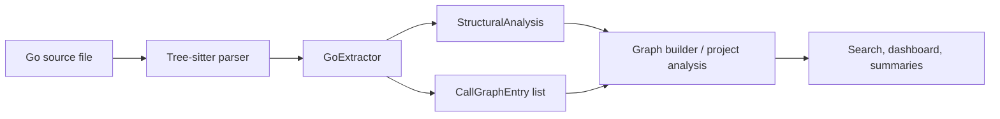
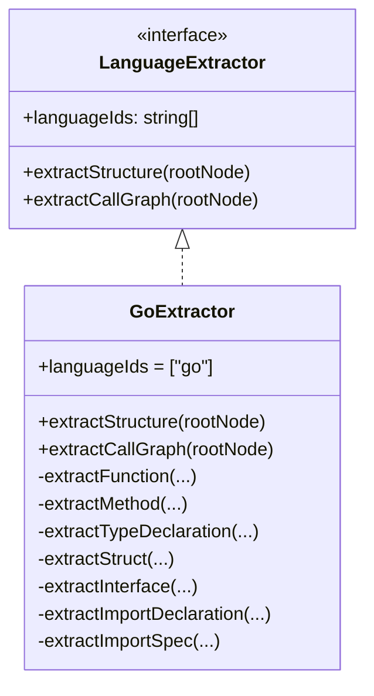
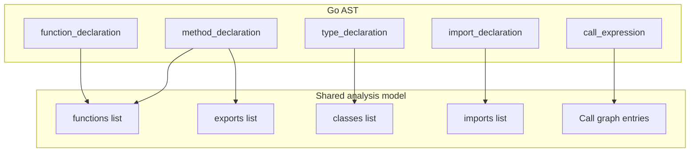
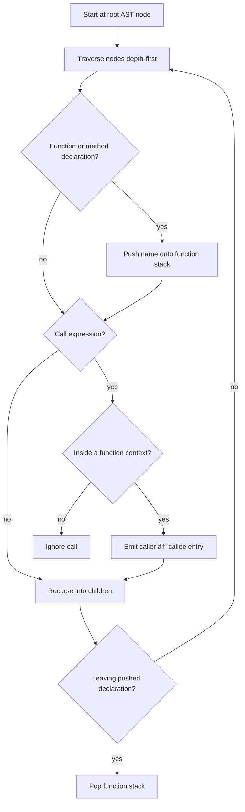
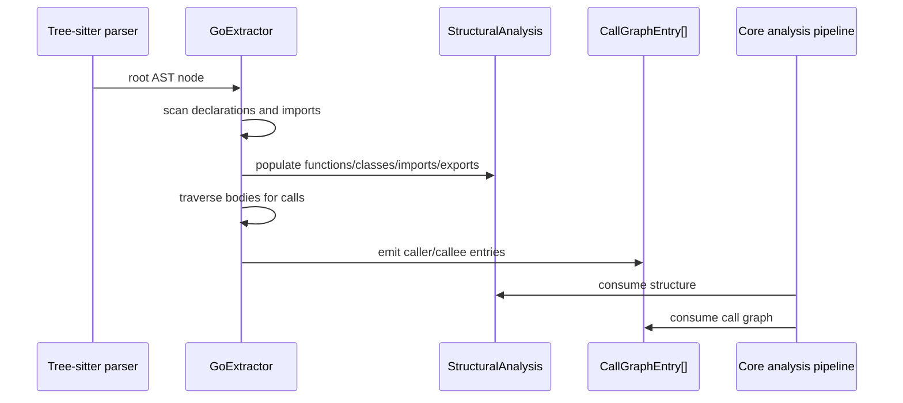

# language_extractors-go

This module provides the Go-specific language extractor used by the core analysis pipeline. It converts a Go Tree-sitter AST into the shared structural analysis model and a lightweight call graph, enabling downstream features such as graph building, project summaries, search, and dashboard visualization.

For the shared extractor contract and common AST helpers, see [language_extractors-types](language_extractors-types.md) and the base extractor utilities in [core_language_support](core_language_support.md).

## Purpose

`GoExtractor` is responsible for understanding Go source files well enough to identify:

- top-level functions
- methods with receivers
- structs and interfaces
- imports
- exported symbols
- caller → callee relationships inside function and method bodies

It follows Go conventions rather than relying on explicit access modifiers:

- exported names start with an uppercase letter
- methods are associated with their receiver type
- structs and interfaces are both represented as `classes` in the shared analysis model

## Module placement in the system

This extractor is one implementation of the shared `LanguageExtractor` interface. It is discovered and used by the language registry / plugin system when the analyzed file is identified as Go.

## Dependencies

### Direct dependencies

- `StructuralAnalysis` and `CallGraphEntry` from [core_schema_and_types](core_schema_and_types.md)
- `LanguageExtractor` and `TreeSitterNode` from [language_extractors-types](language_extractors-types.md)
- `findChild` and `findChildren` from the shared base extractor helpers

### Indirect dependencies

The output of this module feeds into broader analysis components such as:

- [core_analysis](core_analysis.md) for graph construction and higher-level project understanding
- [core_search](core_search.md) for indexing and retrieval
- [dashboard_graph_view](dashboard_graph_view.md) for visualization of extracted structure

## Core responsibilities

### 1. Structural extraction

`extractStructure(rootNode)` walks the root AST node and collects:

- `functions`: function and method declarations
- `classes`: structs and interfaces
- `imports`: import declarations and aliases
- `exports`: exported functions, methods, and types

### 2. Call graph extraction

`extractCallGraph(rootNode)` traverses the AST and records call expressions found inside function and method bodies.

### 3. Go-specific normalization

The extractor maps Go language concepts into the shared analysis schema:

- `struct_type` → class-like entry with properties and methods
- `interface_type` → class-like entry with method signatures
- receiver methods → functions plus class method membership
- exported symbols → entries in `exports`

## Architecture

## Data model mapping

## Structural extraction behavior

### Functions

For each `function_declaration`, the extractor records:

- function name
- source line range
- parameter names
- return type text, if present

Exported functions are detected by capitalization of the first character.

### Methods

For each `method_declaration`, the extractor:

- records the method as a function entry
- extracts receiver type from the receiver parameter list
- groups methods by receiver type
- later attaches those methods to the matching class entry
- marks exported methods using the same capitalization rule

### Structs

For each `type_declaration` whose type is `struct_type`, the extractor:

- records the type name and line range
- collects field identifiers as properties
- initializes an empty methods array, which is populated later from receiver matching
- marks exported structs by capitalization

### Interfaces

For each `type_declaration` whose type is `interface_type`, the extractor:

- records the interface name and line range
- collects method names from `method_elem` nodes
- stores them directly in the class-like `methods` array
- leaves `properties` empty
- marks exported interfaces by capitalization

### Imports

The extractor supports both:

- grouped imports: `import (...)`
- single imports: `import "fmt"`

For each import spec it records:

- `source`: unquoted import path
- `specifiers`: alias if present, otherwise the last path segment
- `lineNumber`

## Call graph extraction behavior

`extractCallGraph(rootNode)` performs a depth-first traversal of the AST while maintaining a stack of the current function or method context.

When it encounters a `call_expression`, it emits a `CallGraphEntry` with:

- `caller`: current function/method name from the stack
- `callee`: text of the called function expression
- `lineNumber`: source line of the call

### Call graph process flow

## Helper functions

### `extractParams(paramsNode)`

Extracts parameter names from a Go `parameter_list`.

Important details:

- supports multiple names sharing one type, such as `a, b int`
- skips unnamed parameters, which are common in interface method signatures
- returns only visible parameter names, not types

### `extractResultType(node)`

Reads the `result` field from a function or method declaration.

It preserves the raw Tree-sitter text, which means it can represent:

- single return types, such as `error`
- pointer returns, such as `*Server`
- multiple returns, such as `(string, error)`

### `extractReceiverType(receiverNode)`

Extracts the receiver type name from a method receiver list.

Examples:

- `(s *Server)` → `Server`
- `(s Server)` → `Server`

The pointer marker is intentionally removed so methods can be attached to the underlying struct/interface name.

### `isExported(name)`

Determines whether a symbol is exported using Go’s capitalization convention.

- uppercase first letter → exported
- lowercase first letter → unexported

## Component interaction

## Output contract

### `extractStructure`

Returns a `StructuralAnalysis` object with:

- `functions`
- `classes`
- `imports`
- `exports`

### `extractCallGraph`

Returns an array of `CallGraphEntry` objects.

## Design notes

### Why structs and interfaces are both treated as classes

The shared analysis model uses a single `classes` collection for type-like declarations. This keeps the downstream graph and UI layers language-agnostic while still preserving useful Go semantics through the `methods` and `properties` fields.

### Why methods are stored twice

Methods are:

1. recorded as standalone function-like entries
2. attached to their receiver type in the corresponding class entry

This supports both:

- function-centric views
- type-centric views

### Why call graph extraction is name-based

The extractor records the callee as raw AST text rather than resolving symbols. This keeps the implementation lightweight and language-agnostic, while leaving deeper resolution to later analysis stages.

## Limitations

- Call graph extraction does not resolve package-qualified calls, method dispatch, or imported symbol aliases beyond raw text capture.
- Receiver matching is based on the receiver type name only; pointer and non-pointer receivers are normalized to the same base type.
- Interface methods are captured as signatures only; parameter and return details are not expanded into the shared model.
- Anonymous functions are not treated as separate call graph scopes.

## Related documentation

- [language_extractors-types](language_extractors-types.md) — shared extractor interface and AST node types
- [core_schema_and_types](core_schema_and_types.md) — shared analysis data structures
- [core_analysis](core_analysis.md) — how extracted structure is turned into project-level analysis
- [dashboard_graph_view](dashboard_graph_view.md) — visualization of the resulting graph
- [core_search](core_search.md) — search layers that may consume extracted symbols
