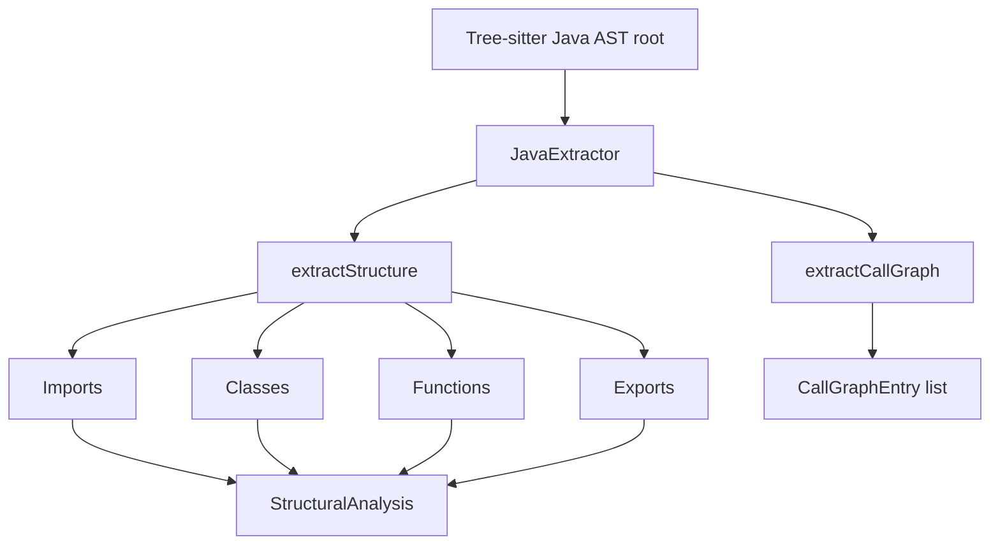
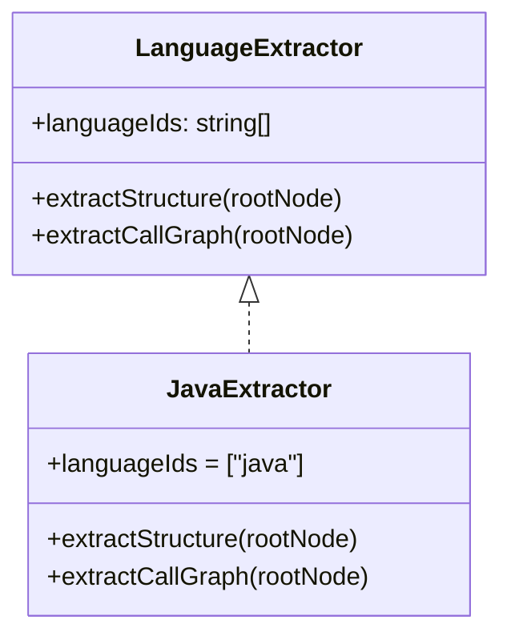
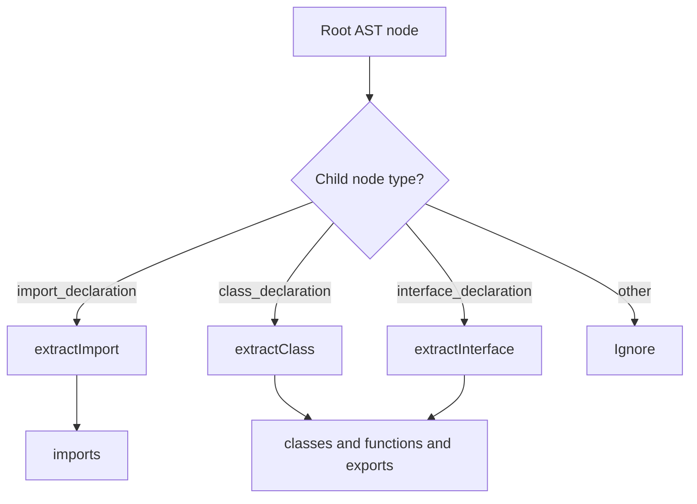
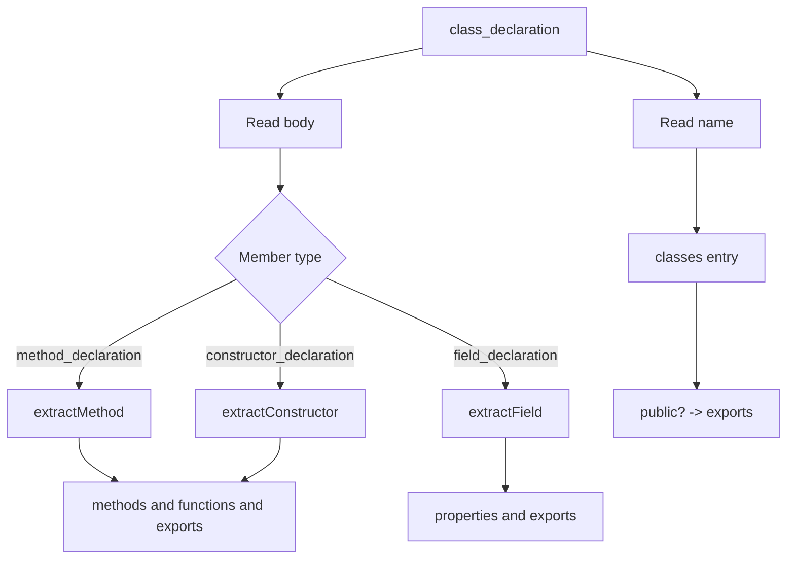
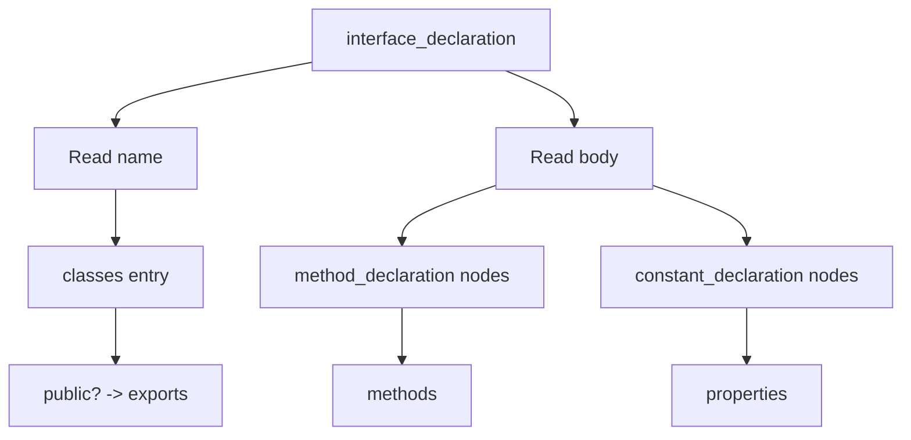
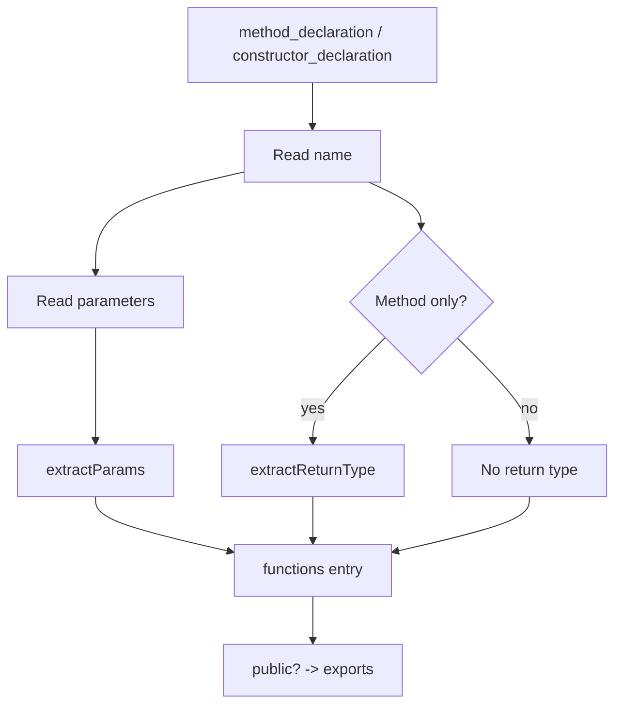
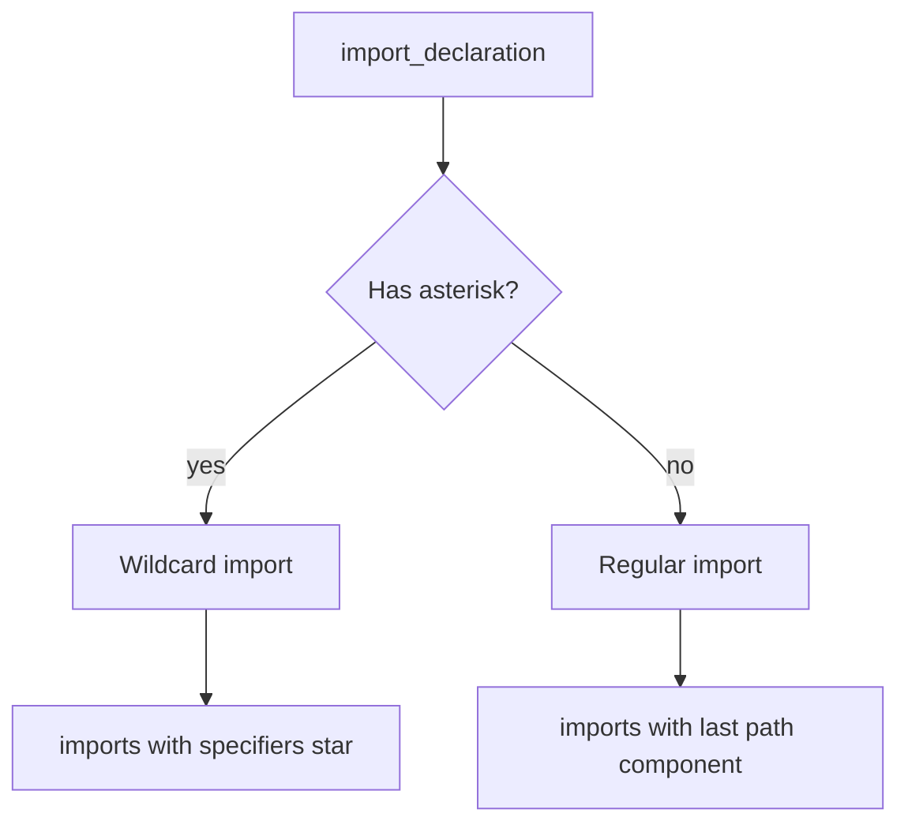
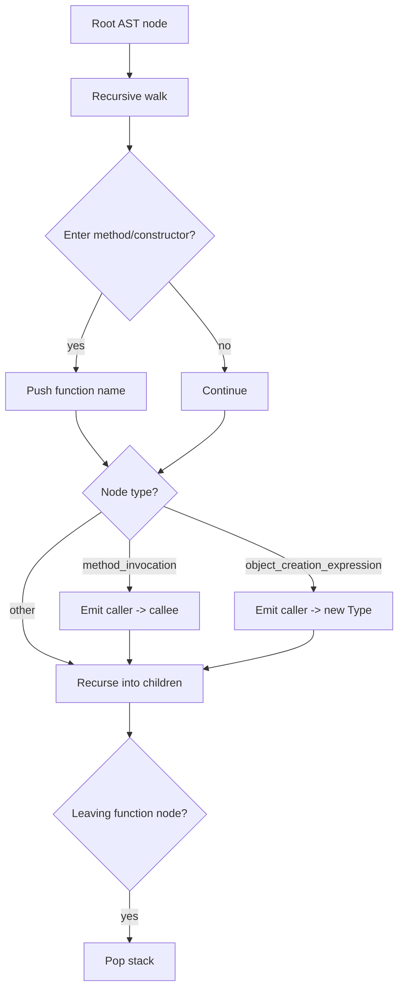
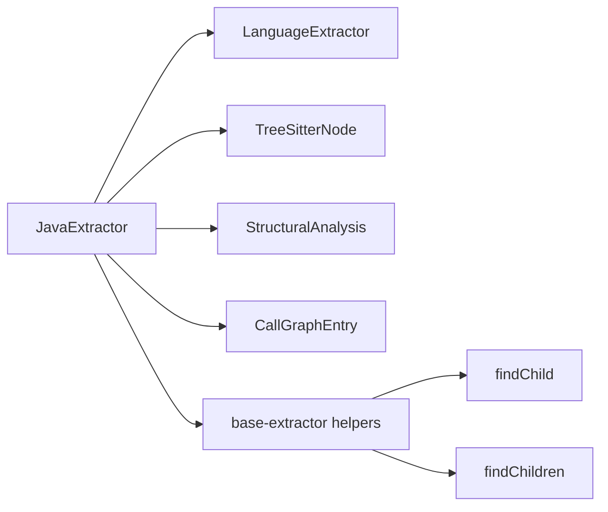
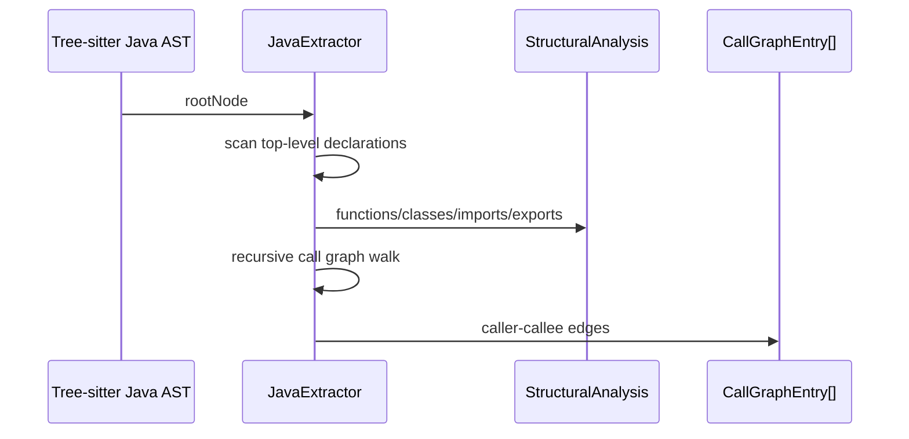

# language_extractors-java

## Introduction

The `language_extractors-java` module provides the Java-specific Tree-sitter extractor used by the core analysis pipeline to turn Java source code into two key outputs:

1. **Structural analysis** — functions, classes, imports, and exports
2. **Call graph extraction** — caller → callee relationships inside methods and constructors

It implements the shared `LanguageExtractor` contract from [`language_extractors-types`](language_extractors-types.md) and is consumed by the broader language support layer described in [`core_language_support`](core_language_support.md).

---

## Purpose and responsibilities

The Java extractor is responsible for interpreting the Java AST produced by Tree-sitter and mapping it into the shared analysis model defined in [`core_schema_and_types`](core_schema_and_types.md).

### What it extracts

- **Classes** from `class_declaration`
- **Interfaces** from `interface_declaration`
- **Methods** from `method_declaration`
- **Constructors** from `constructor_declaration`
- **Fields** from `field_declaration`
- **Imports** from `import_declaration`
- **Call graph edges** from `method_invocation` and `object_creation_expression`
- **Exports** based on the `public` modifier

### Java-specific modeling choices

The extractor intentionally normalizes Java constructs into the shared analysis schema:

- Classes and interfaces are both represented as entries in `StructuralAnalysis.classes`
- Constructors are represented in `StructuralAnalysis.functions` even though they do not have return types
- Methods are recorded both:
  - in the containing class/interface `methods` list, and
  - in `StructuralAnalysis.functions`
- Public visibility is used as the export signal
- Interface constants are treated as properties

---

## Module architecture



The module is intentionally small and self-contained. Most of its logic is implemented directly in `java-extractor.ts`, with a few shared helper functions imported from [`language_extractors-types`](language_extractors-types.md) and the base extractor utilities.

---

## Core component: `JavaExtractor`

### Interface implementation

`JavaExtractor` implements the shared `LanguageExtractor` interface:

- `languageIds = ["java"]`
- `extractStructure(rootNode)`
- `extractCallGraph(rootNode)`

This makes it discoverable by the plugin system and eligible for Java files during analysis.

### High-level behavior



---

## Structural extraction flow

`extractStructure()` scans only the top-level children of the Java compilation unit and dispatches based on node type.

### Supported top-level node types

- `import_declaration`
- `class_declaration`
- `interface_declaration`

### Process flow



### Output mapping

| Java AST construct | StructuralAnalysis target | Notes |
|---|---|---|
| `import_declaration` | `imports` | Handles wildcard and regular imports |
| `class_declaration` | `classes`, `functions`, `exports` | Methods, constructors, and fields are collected from the body |
| `interface_declaration` | `classes`, `exports` | Interface methods are signatures only; constants become properties |

---

## Class extraction

`extractClass()` reads the class name, scans the class body, and records:

- method names
- field names
- function entries for methods and constructors
- export entry if the class is `public`

### Class body traversal



### Class record shape

Each class entry contains:

- `name`
- `lineRange`
- `methods`
- `properties`

### Notes

- `lineRange` is derived from Tree-sitter positions and is 1-based
- The extractor does not attempt semantic resolution of inheritance, generics, or nested types
- Only direct body members are considered

---

## Interface extraction

`extractInterface()` treats interfaces similarly to classes, but with Java interface semantics:

- `method_declaration` nodes are treated as method signatures
- `constant_declaration` nodes are treated as properties
- `public` interfaces are exported

### Interface-specific flow



### Why interfaces are stored in `classes`

The shared `StructuralAnalysis` schema does not have a dedicated interface collection. To keep downstream consumers simple, interfaces are normalized into the same `classes` array as classes.

---

## Function extraction

Methods and constructors are both recorded in `StructuralAnalysis.functions`.

### Methods

`extractMethod()` captures:

- method name
- parameter names
- return type
- source line range
- export status if `public`

### Constructors

`extractConstructor()` captures:

- constructor name
- parameter names
- source line range
- export status if `public`

Constructors do not include a return type.

### Parameter extraction

The helper `extractParams()` reads:

- `formal_parameter` nodes
- `spread_parameter` nodes for varargs such as `String... args`

### Return type extraction

`extractReturnType()` reads the `type` field from `method_declaration`.

### Function extraction flow



---

## Import extraction

`extractImport()` handles Java import declarations and distinguishes between:

- **regular imports**: `import java.util.List;`
- **wildcard imports**: `import java.util.*;`

### Import mapping rules

- `source` is the full dotted path
- `specifiers` is either:
  - the last path component for regular imports, or
  - `[*]` for wildcard imports

### Example mapping

| Java import | `source` | `specifiers` |
|---|---|---|
| `import java.util.List;` | `java.util.List` | `List` |
| `import java.util.*;` | `java.util` | `*` |

### Import extraction flow



---

## Call graph extraction

`extractCallGraph()` walks the full AST recursively and records call relationships only when inside a method or constructor body.

### Supported call sources

- `method_invocation`
- `object_creation_expression`

### Caller tracking

The extractor maintains a stack of active function names while traversing the tree:

- entering a `method_declaration` or `constructor_declaration` pushes the current function name
- leaving the node pops it
- call edges are emitted using the top of the stack as the caller

### Call graph flow



### Callee naming rules

#### Method invocations

`extractMethodInvocationName()` returns:

- `fetchFromDb` for `fetchFromDb(limit)`
- `System.out.println` for `System.out.println(msg)`

#### Object creation

Object creation is represented as:

- `new Foo`
- `new com.example.Bar` if the type text is qualified

### Important limitation

The call graph is **syntactic**, not semantic:

- it does not resolve overloads
- it does not resolve imports or types
- it does not distinguish local methods from external methods with the same name

---

## Helper functions

### `extractParams(paramsNode)`

Extracts parameter names from:

- `formal_parameter`
- `spread_parameter`

Returns an ordered list of parameter names.

### `extractReturnType(node)`

Reads the `type` field from a method declaration and returns its text.

### `hasModifier(node, modifier)`

Checks whether a node has a `modifiers` child containing the requested keyword, such as `public`.

### `extractScopedIdentifierPath(node)`

Returns the full dotted text of a `scoped_identifier` node.

### `lastComponent(path)`

Returns the final segment of a dotted path, used for regular import specifiers.

---

## Dependencies and relationships



### Internal dependencies

- [`language_extractors-types`](language_extractors-types.md) for the extractor contract
- [`core_schema_and_types`](core_schema_and_types.md) for `StructuralAnalysis` and `CallGraphEntry`
- base extractor helpers for AST child lookup

### External system placement

The Java extractor sits inside the core language support layer and is typically invoked by the plugin registry and language registry infrastructure described in [`core_plugin_system`](core_plugin_system.md) and [`core_language_support`](core_language_support.md).

---

## Data flow summary



---

## Integration notes

### Downstream consumers

The output of this extractor is consumed by higher-level analysis and visualization layers, including graph building and dashboard views. Those modules are documented separately in:

- [`core_analysis`](core_analysis.md)
- [`core_schema_and_types`](core_schema_and_types.md)
- [`dashboard_graph_view`](dashboard_graph_view.md)

### Expected AST shape

This extractor assumes Tree-sitter Java node names and field names such as:

- `class_declaration`
- `interface_declaration`
- `method_declaration`
- `constructor_declaration`
- `field_declaration`
- `import_declaration`
- `formal_parameter`
- `spread_parameter`
- `scoped_identifier`

If the parser grammar changes, this module may need updates to remain compatible.

---

## Practical behavior examples

### Example: class with methods and fields

Input conceptually like:

```java
public class UserService {
  private String name;

  public UserService(String name) { ... }
  public String getName() { ... }
}
```

Produces:

- `classes`: `UserService` with methods `UserService`, `getName`, properties `name`
- `functions`: constructor `UserService`, method `getName`
- `exports`: `UserService`, `UserService`, `getName` depending on public declarations

### Example: call graph

```java
public void run() {
  fetchFromDb(10);
  System.out.println("done");
  new Worker();
}
```

Produces call edges such as:

- `run -> fetchFromDb`
- `run -> System.out.println`
- `run -> new Worker`

---

## Limitations and implementation considerations

- Only top-level declarations are used for structural extraction
- Nested classes or interfaces are not explicitly traversed as separate top-level entries
- Visibility detection is limited to the presence of the `public` modifier
- The call graph is based on syntax and does not perform symbol resolution
- Interface methods are treated as class-like members for schema compatibility

---

## Related documentation

- [`language_extractors-types`](language_extractors-types.md)
- [`core_language_support`](core_language_support.md)
- [`core_schema_and_types`](core_schema_and_types.md)
- [`core_analysis`](core_analysis.md)
- [`core_plugin_system`](core_plugin_system.md)
