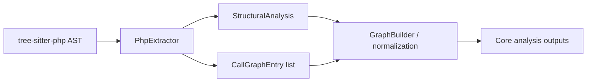
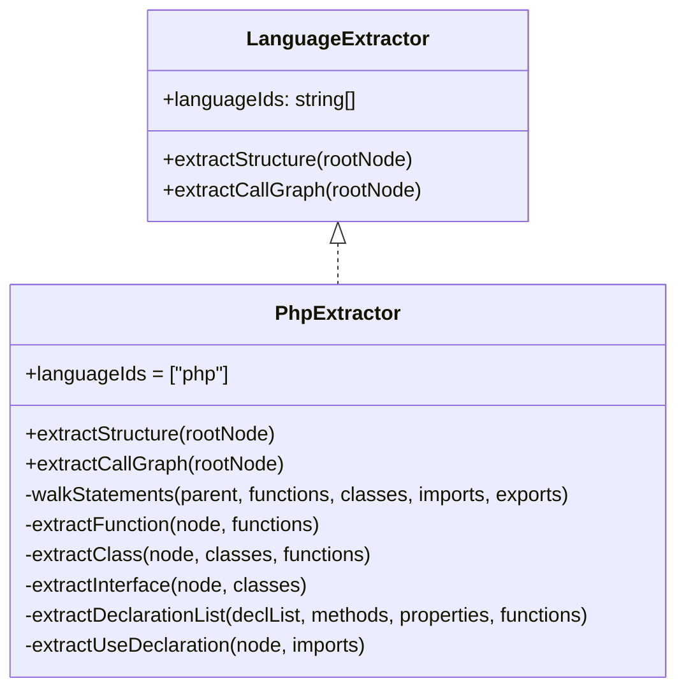
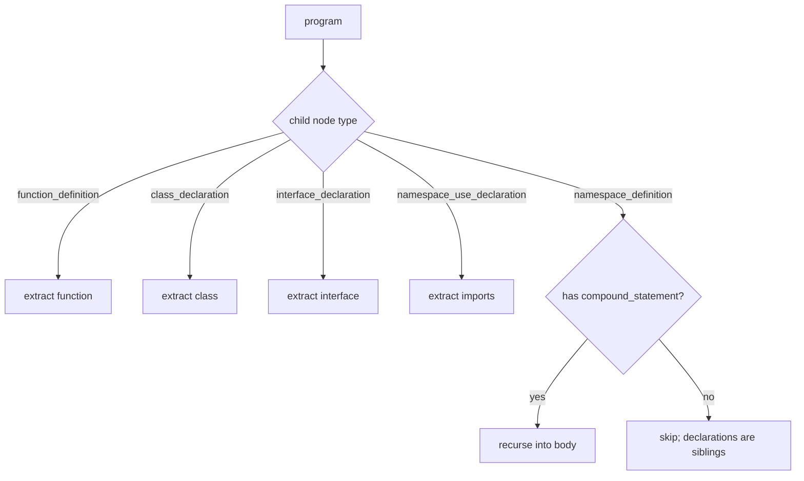
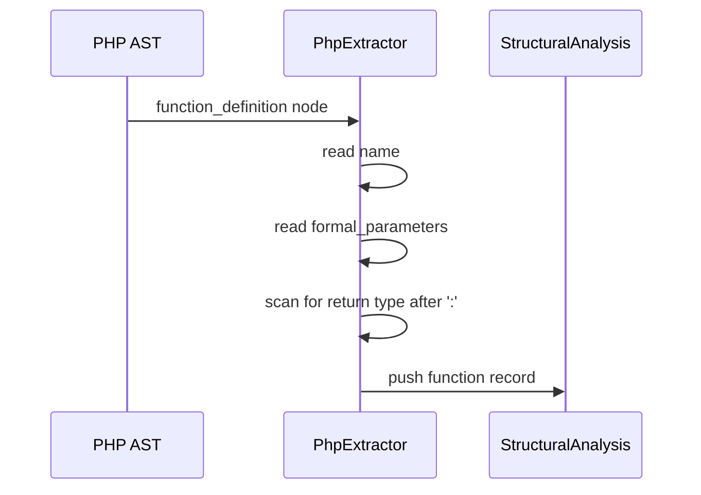
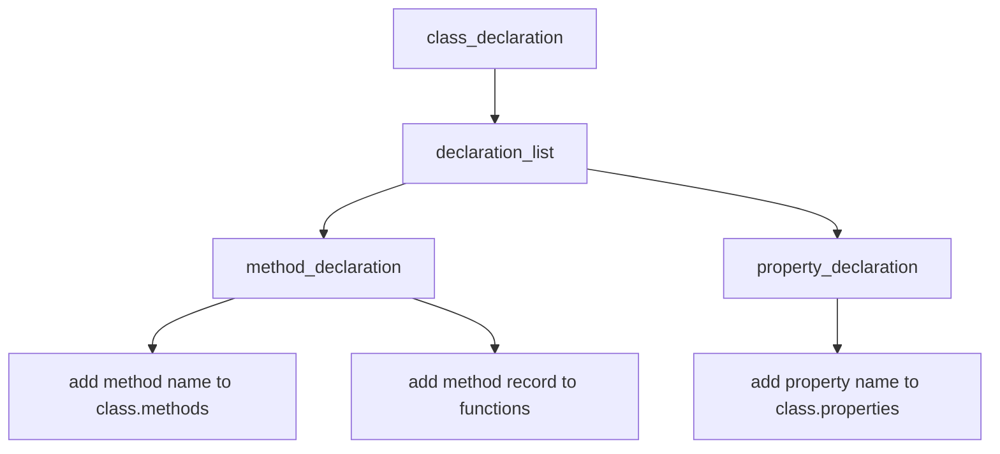
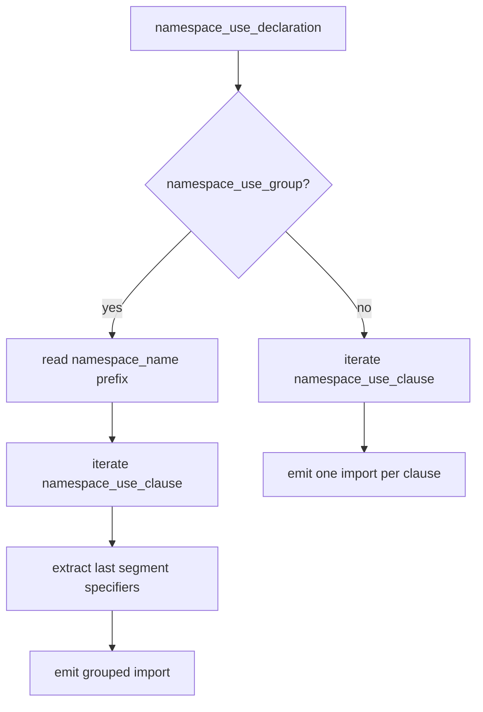
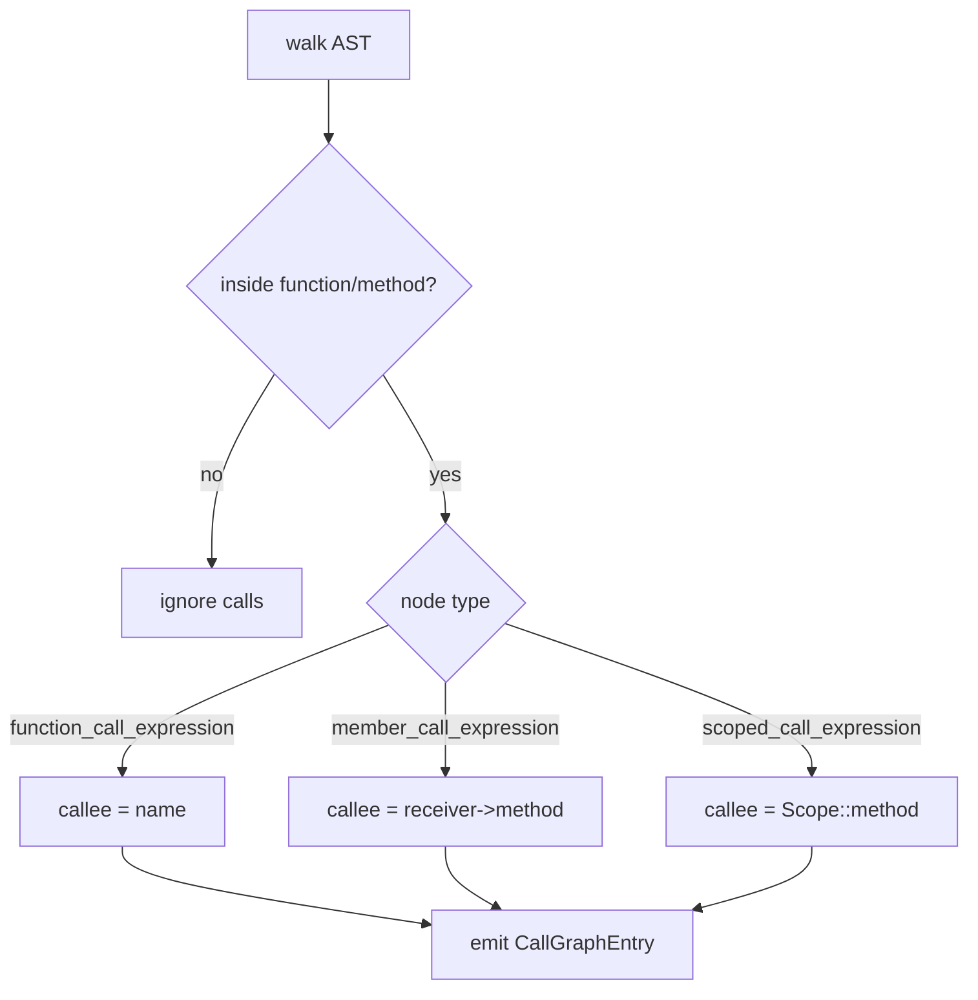
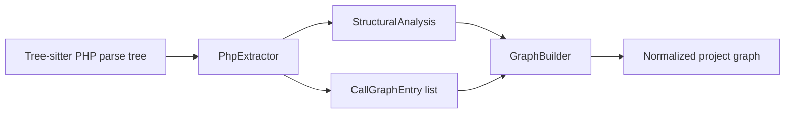
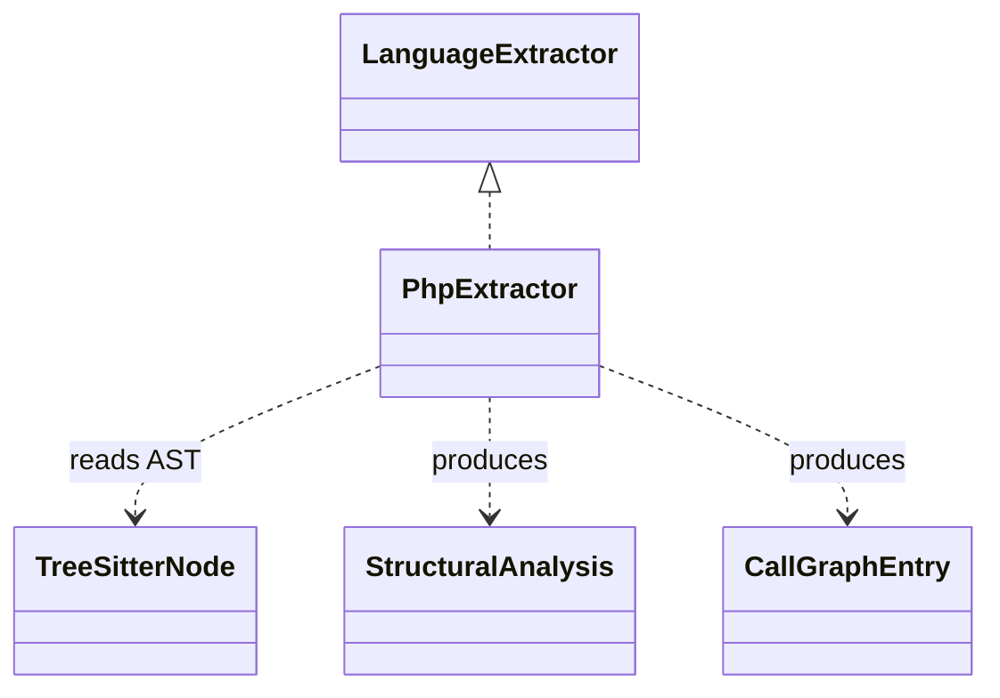

# language_extractors-php

## Introduction

The `language_extractors-php` module provides the PHP-specific implementation of the shared `LanguageExtractor` interface. It converts a tree-sitter PHP AST into the core structural model used by the rest of the system: functions, classes, interfaces, imports, exports, and call graph edges.

This module is intentionally focused on syntax-level extraction. It does not perform semantic resolution, type inference, or framework-specific analysis. Those responsibilities are handled by other core modules such as the language registry, graph builder, and downstream analysis layers.

Related documentation:
- [language_extractors-types](language_extractors-types.md)
- [language_registries](language_registries.md)
- [core_schema_and_types](core_schema_and_types.md)
- [core_analysis](core_analysis.md)

---

## Module purpose

`PhpExtractor` is the PHP adapter for tree-sitter-based code analysis. It is responsible for:

- identifying top-level PHP declarations
- extracting class and interface members
- collecting import statements from `use` declarations
- building a lightweight call graph from function and method bodies
- normalizing PHP-specific syntax into the shared analysis types

The extractor is designed to work with the tree-sitter-php grammar, where the root node is typically a `program` node containing declarations, namespace blocks, and PHP tags.

---

## Position in the system

The extractor sits in the language support layer and is consumed by the plugin and analysis pipeline.



### Responsibilities by layer

- **Language extractor layer**: parses PHP syntax into a shared intermediate representation.
- **Language registry / plugin layer**: selects the correct extractor for `php`.
- **Core analysis layer**: merges extracted data with other files and project-level metadata.

For registry behavior and plugin discovery, see [language_registries](language_registries.md) and [core_plugin_system](core_plugin_system.md).

---

## Public API

### `PhpExtractor`

Implements `LanguageExtractor` and declares support for the `php` language ID.



### Output types

The extractor returns the shared structures defined in `core_schema_and_types`:

- `StructuralAnalysis`
- `CallGraphEntry`

See [core_schema_and_types](core_schema_and_types.md) for the full type definitions.

---

## Structural extraction behavior

`extractStructure(rootNode)` walks the AST and populates four arrays:

- `functions`
- `classes`
- `imports`
- `exports`

### Supported node types

| AST node type | Extracted as |
|---|---|
| `function_definition` | top-level function |
| `class_declaration` | class |
| `interface_declaration` | interface (stored in `classes`) |
| `namespace_use_declaration` | import |
| `namespace_definition` | container for nested declarations |

### Namespace handling

PHP supports both declarative and block-scoped namespaces. This extractor only recurses into block-scoped namespaces that contain a `compound_statement` body.



This behavior ensures declarations inside `namespace Foo { ... }` are discovered, while avoiding duplicate traversal for `namespace Foo;` style files.

---

## Function extraction

Functions are extracted from `function_definition` nodes.

Captured fields:

- `name`
- `lineRange`
- `params`
- `returnType` when available

### Parameter extraction

Parameters are read from `formal_parameters` and then from each `simple_parameter` child. The extractor looks for `variable_name` nodes and records the variable text, including the `$` prefix.

### Return type extraction

The extractor scans siblings after the `:` token and captures one of these return type node kinds:

- `primitive_type`
- `named_type`
- `optional_type`
- `union_type`



### Example mapping

PHP source:

```php
function greet(string $name): string {
    return "Hello " . $name;
}
```

Extracted structure:

- name: `greet`
- params: [`$name`]
- returnType: `string`
- lineRange: start/end lines of the function node

---

## Class extraction

Classes are extracted from `class_declaration` nodes.

Captured fields:

- `name`
- `lineRange`
- `methods`
- `properties`

### Declaration list traversal

The extractor inspects the class `declaration_list` and handles:

- `method_declaration`
- `property_declaration`

Methods are added to both:

1. the class’s `methods` array
2. the top-level `functions` array

This dual representation allows class methods to participate in both structural summaries and call graph analysis.



### Property extraction

Properties are extracted from `property_declaration -> property_element -> variable_name`.

The extractor prefers the inner `name` child when available, and falls back to stripping the leading `$` from the raw variable text.

### Example mapping

PHP source:

```php
class UserService {
    private string $name;

    public function getName(): string {
        return $this->name;
    }
}
```

Extracted structure:

- class name: `UserService`
- methods: [`getName`]
- properties: [`name`]
- functions: includes `getName` as a callable unit

---

## Interface extraction

Interfaces are extracted from `interface_declaration` nodes and stored in the same `classes` collection used for classes.

This is a deliberate modeling choice: the shared `StructuralAnalysis` type does not define a separate interface bucket, so interfaces are represented as class-like declarations with method lists.

Captured fields:

- `name`
- `lineRange`
- `methods`
- `properties` is always empty

Interface methods are collected from `method_declaration` nodes inside the interface `declaration_list`.

---

## Import extraction

Imports are extracted from `namespace_use_declaration` nodes.

The extractor supports:

- simple imports: `use App\Models\User;`
- aliased imports: `use App\Contracts\Repository as Repo;`
- grouped imports: `use App\Models\{User, Post};`

### Simple and aliased imports

For each `namespace_use_clause`, the extractor reconstructs the fully qualified name and stores:

- `source`: the imported FQN
- `specifiers`: the last segment of the FQN
- `lineNumber`

### Grouped imports

For grouped imports, the extractor reconstructs the prefix and each clause, then emits a single import record with a grouped `source` string and a list of specifiers.



### Notes on alias handling

The current implementation records the imported source and the final symbol name, but it does not preserve alias names separately in the `specifiers` array. Consumers that need alias-aware import resolution should use a higher-level resolver or extend the shared import model.

See [core_schema_and_types](core_schema_and_types.md) for the `ImportResolution` and related shared types.

---

## Export extraction

PHP has no explicit export syntax comparable to ES modules. This extractor therefore treats the following as exports:

- top-level functions
- classes
- interfaces

Each export record includes:

- `name`
- `lineNumber`

This is a pragmatic convention used by the broader analysis pipeline to identify public entry points in PHP codebases.

---

## Call graph extraction

`extractCallGraph(rootNode)` traverses the AST and records caller → callee relationships.

### Caller tracking

The extractor maintains a stack of enclosing function or method names while walking the tree. When it enters a `function_definition` or `method_declaration`, it pushes the current name; when it exits, it pops it.

### Supported call expressions

The extractor recognizes:

- `function_call_expression`
- `member_call_expression`
- `scoped_call_expression`

### Call forms

| Expression type | Example | Recorded callee |
|---|---|---|
| `function_call_expression` | `strtoupper($x)` | `strtoupper` |
| `member_call_expression` | `$this->fetchFromDb($id)` | `$this->fetchFromDb` |
| `scoped_call_expression` | `Bar::staticMethod()` | `Bar::staticMethod` |



### Important limitation

The call graph is syntactic, not semantic. It does not resolve:

- imported aliases
- inherited methods
- dynamic method names
- variable function calls
- framework routing or dependency injection

For project-level graph merging and normalization, see [core_analysis](core_analysis.md).

---

## Data flow



The extractor is the first language-specific stage in the pipeline. It produces a normalized intermediate representation that downstream modules can merge, validate, and visualize.

---

## Component relationships



### Internal helper functions

The module uses small AST navigation helpers from `base-extractor`:

- `findChild(node, type)`
- `findChildren(node, type)`

These helpers keep the extractor implementation concise and consistent with other language extractors.

See [language_extractors-types](language_extractors-types.md) for the shared extractor contract.

---

## Design decisions and trade-offs

### Why interfaces are stored in `classes`

The shared structural model does not define a dedicated interface collection. Storing interfaces in `classes` keeps the output shape stable across languages and avoids widening the core schema.

### Why methods are duplicated into `functions`

Methods are both class members and callable units. Recording them in `functions` enables:

- unified function summaries
- call graph correlation
- consistent downstream indexing

### Why imports are simplified

The extractor records import sources and final symbol names, but not full alias metadata. This keeps the structure lightweight and language-agnostic, while leaving room for richer resolution in later stages.

---

## Limitations

- Does not resolve namespaces semantically.
- Does not distinguish public/private/protected visibility in the output.
- Does not capture traits, enums, constants, or anonymous functions.
- Does not model interface inheritance or class inheritance relationships.
- Does not preserve import aliases as first-class data.
- Call graph extraction is limited to direct syntactic call expressions.

These limitations are acceptable for the module’s role as a structural extractor, but they may matter for advanced code intelligence features.

---

## Integration points

This module is typically used by the broader plugin and analysis pipeline:

- **Language registry** selects `PhpExtractor` for `php` files.
- **Plugin registry** loads the extractor as part of the language support system.
- **Graph builder** consumes the extracted structure and call graph.
- **Normalization** may later merge or prune edges.

For those stages, refer to:

- [language_registries](language_registries.md)
- [core_plugin_system](core_plugin_system.md)
- [core_analysis](core_analysis.md)
- [core_schema_and_types](core_schema_and_types.md)

---

## Summary

`language_extractors-php` is the PHP syntax adapter for the analysis pipeline. It translates tree-sitter PHP AST nodes into the shared structural and call graph types used across the system. Its implementation is intentionally lightweight, deterministic, and focused on the subset of PHP constructs needed for project-wide code understanding.
