# language_extractors-python

## Introduction

The `language_extractors-python` module provides the Python-specific Tree-sitter extractor used by the core analysis pipeline to derive structural metadata and call relationships from Python source files. It implements the shared `LanguageExtractor` contract and translates Python AST nodes into the common `StructuralAnalysis` and `CallGraphEntry` shapes consumed by downstream analysis, graph-building, and UI layers.

This module is intentionally focused on Python syntax and conventions: it recognizes top-level functions and classes as exports, extracts imports in both `import` and `from ... import ...` forms, captures class methods and typed class properties, and builds a lightweight intra-file call graph.

Related documentation:
- [language_extractors-types](language_extractors-types.md) for the shared extractor interface and AST node abstractions.
- [core_schema_and_types](core_schema_and_types.md) for the shared analysis data structures.
- [core_analysis](core_analysis.md) for how extracted structure feeds later analysis stages.

---

## Module purpose

`PythonExtractor` is responsible for converting a Python Tree-sitter syntax tree into normalized analysis output:

- **Structural analysis**: functions, classes, imports, exports
- **Call graph extraction**: caller → callee relationships within the file

The extractor is designed to be conservative and syntax-driven. It does not attempt semantic resolution, type inference, or cross-file symbol linking. Those responsibilities belong to later stages in the system.

---

## Architecture overview

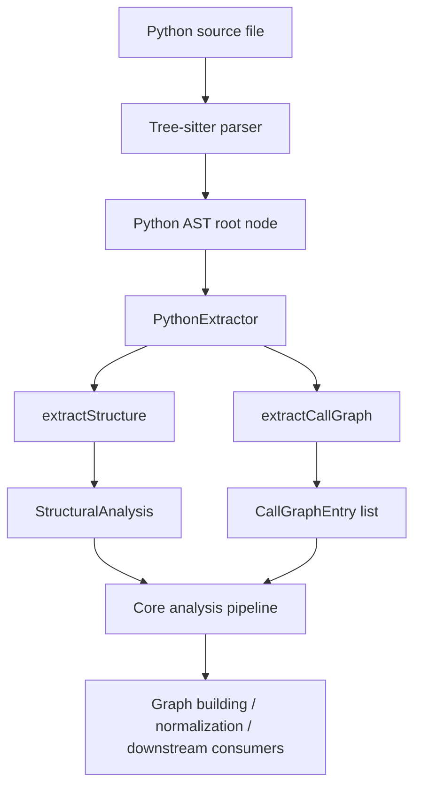

### Key responsibilities

| Responsibility | Output | Notes |
|---|---|---|
| Function extraction | `StructuralAnalysis.functions` | Captures name, line range, parameters, return type |
| Class extraction | `StructuralAnalysis.classes` | Captures name, line range, methods, properties |
| Import extraction | `StructuralAnalysis.imports` | Handles direct, aliased, and `from` imports |
| Export extraction | `StructuralAnalysis.exports` | Treats top-level functions/classes as exports |
| Call graph extraction | `CallGraphEntry[]` | Records calls inside function bodies |

---

## Dependencies and relationships

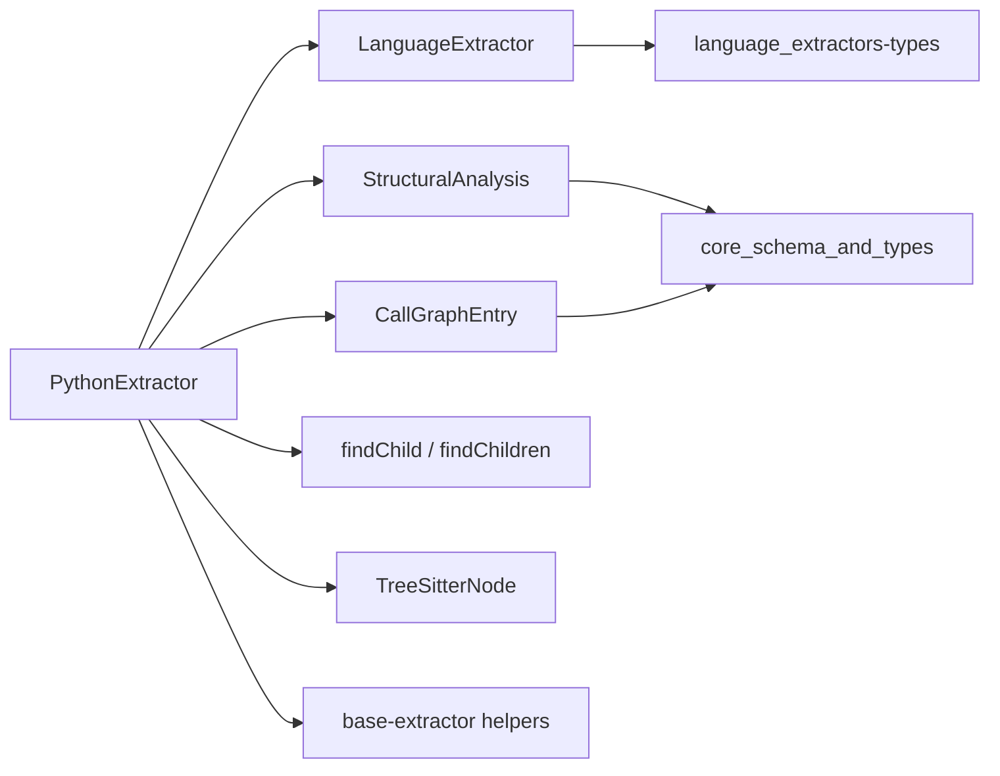

### Internal dependencies

- **`LanguageExtractor`**: the interface implemented by `PythonExtractor`.
- **`TreeSitterNode`**: the AST node abstraction used throughout extraction.
- **`findChild` / `findChildren`**: helper utilities for locating child nodes by type.
- **`StructuralAnalysis`**: shared output schema for structural metadata.
- **`CallGraphEntry`**: shared output schema for call graph edges.

### External module relationships

This module is typically consumed by the broader core analysis pipeline, which may then pass the extracted data into:

- graph construction and normalization stages in [core_analysis](core_analysis.md)
- change tracking and fingerprinting in [core_change_tracking](core_change_tracking.md)
- search and indexing workflows in [core_search](core_search.md)

---

## Public API

### `PythonExtractor`

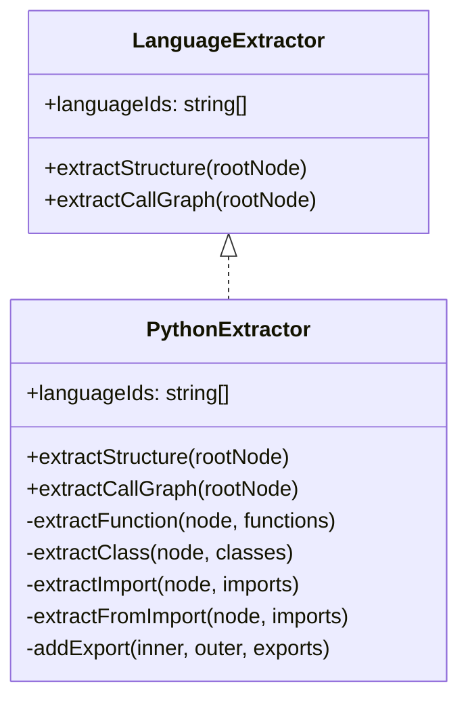

#### `languageIds`

- Value: `['python']`
- Purpose: identifies the extractor as handling Python language configurations.

#### `extractStructure(rootNode: TreeSitterNode): StructuralAnalysis`

Traverses the root AST node and extracts:

- top-level functions
- top-level classes
- import statements
- exports

#### `extractCallGraph(rootNode: TreeSitterNode): CallGraphEntry[]`

Walks the AST recursively and records call expressions found inside function bodies.

---

## Structural extraction behavior

### 1) Top-level traversal

`extractStructure()` iterates over the root node’s direct children only. For each child:

1. If the node is a `decorated_definition`, it is unwrapped to its inner definition.
2. The extractor checks whether the resulting node is a function, class, or import.
3. Functions and classes are also added to exports when they appear at the top level.

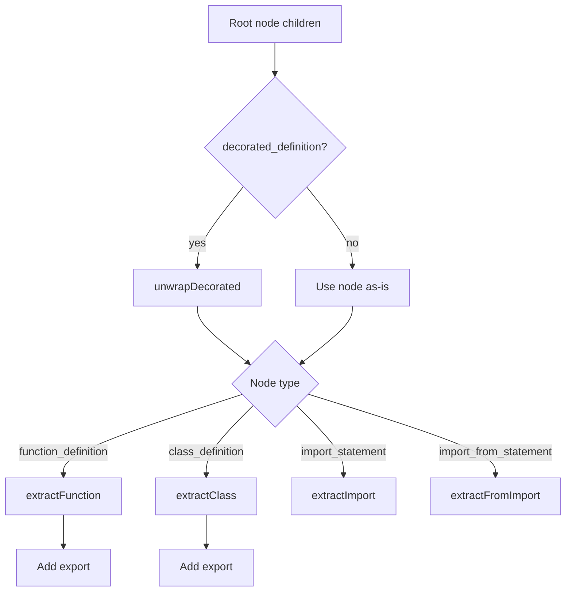

### 2) Function extraction

For each `function_definition`, the extractor records:

- function name
- line range
- parameter list
- return type annotation, if present

#### Parameter handling

The helper `extractParams()` supports several Python parameter node shapes:

- `identifier`
- `typed_parameter`
- `default_parameter`
- `typed_default_parameter`
- `list_splat_pattern` for `*args`
- `dictionary_splat_pattern` for `**kwargs`

It also intentionally skips implicit instance/class parameters:

- `self`
- `cls`

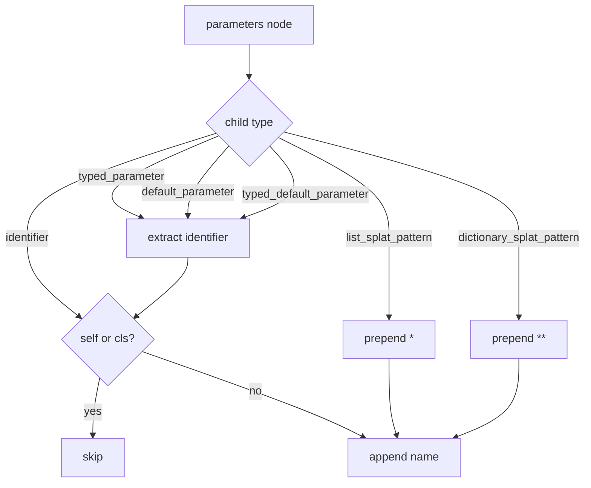

#### Return type handling

`extractReturnType()` reads the `return_type` field from the function node and returns its text when present.

### 3) Class extraction

For each `class_definition`, the extractor records:

- class name
- line range
- method names
- class-level typed properties

#### Method detection

A class member is treated as a method when it is:

- a `function_definition`, or
- a `decorated_definition` wrapping a `function_definition`

#### Property detection

The extractor looks for `expression_statement` members containing an `assignment` with:

- a `type` child, and
- an `identifier` child

This captures typed class attributes such as:

- `name: str`
- `value: int = 0`

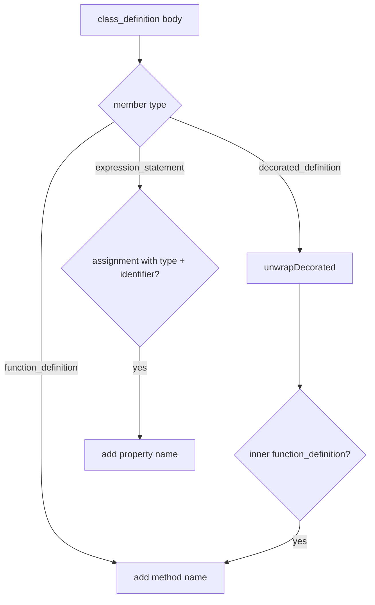

### 4) Import extraction

#### `import_statement`

Handles forms such as:

- `import os`
- `import os.path`
- `import os, sys`
- `import numpy as np`

The extractor collects:

- dotted names as sources/specifiers
- aliased imports with alias names when present

#### `import_from_statement`

Handles forms such as:

- `from pathlib import Path`
- `from typing import Optional, List`
- `from os import *`
- `from foo import bar as baz`

The extractor collects:

- module name as `source`
- imported names or aliases as `specifiers`
- wildcard imports as `*`

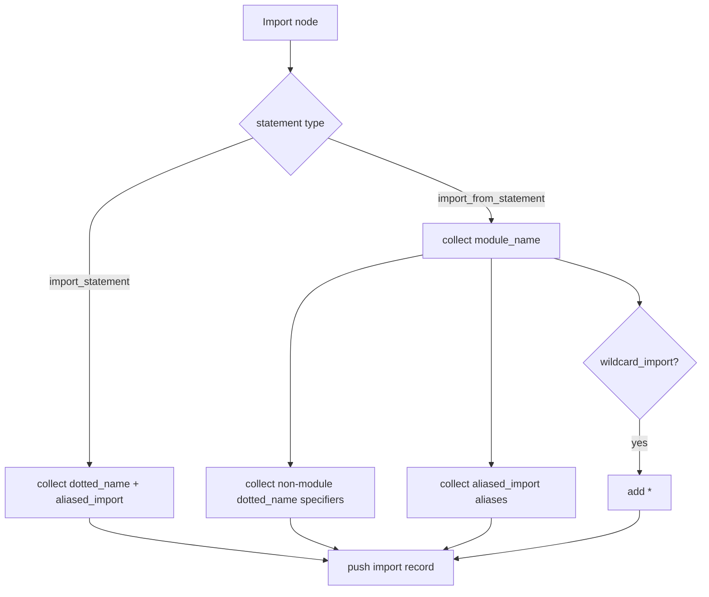

### 5) Export extraction

Python has no formal export syntax. This extractor therefore treats:

- top-level functions
- top-level classes

as exports.

Exports are recorded with the outer node’s starting line number.

---

## Call graph extraction behavior

`extractCallGraph()` performs a recursive walk of the AST and maintains a stack of active function definitions.

### How it works

1. When entering a `function_definition`, the function name is pushed onto the stack.
2. When a `call` node is encountered and the stack is non-empty, a `CallGraphEntry` is emitted.
3. The callee is taken from the first child that is either:
   - `identifier`, or
   - `attribute`
4. After traversing the function body, the function name is popped.

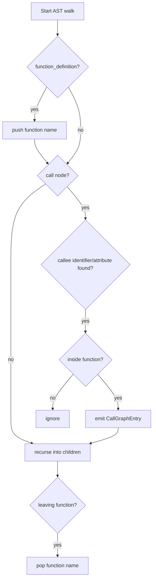

### Important limitation

This call graph is **lexical and local**:

- It records calls only when they occur inside a function definition.
- It does not resolve imports, aliases, methods on instances, or fully qualified symbols.
- It uses the current innermost function name as the caller.

This makes it lightweight and fast, but not semantically complete.

---

## Data model mapping

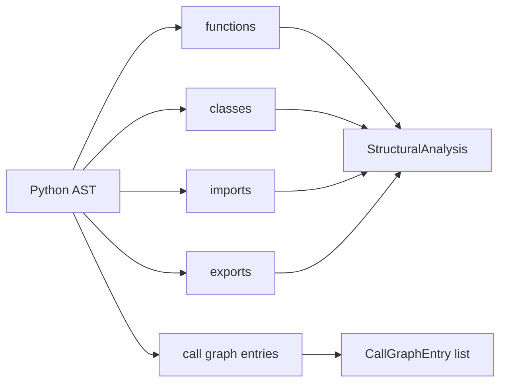

### StructuralAnalysis output fields

- `functions`: array of `{ name, lineRange, params, returnType? }`
- `classes`: array of `{ name, lineRange, methods, properties }`
- `imports`: array of `{ source, specifiers, lineNumber }`
- `exports`: array of `{ name, lineNumber, isDefault? }`

### CallGraphEntry output fields

- `caller`: current function name
- `callee`: call target text
- `lineNumber`: 1-based source line number

---

## Process flow summary

```mermaid
sequenceDiagram
  participant Parser as Tree-sitter Parser
  participant PX as PythonExtractor
  participant SA as StructuralAnalysis
  participant CG as CallGraphEntry[]

  Parser->>PX: root AST node
  PX->>PX: traverse top-level children
  PX->>SA: collect functions/classes/imports/exports
  PX->>PX: recursively walk AST for calls
  PX->>CG: emit caller→callee entries
  PX-->>Parser: analysis results
```

---

## Design notes and implementation details

### Decorated definitions

Python decorators wrap functions and classes in `decorated_definition` nodes. The extractor unwraps these nodes so decorated declarations are still recognized as normal functions/classes.

### Why `self` and `cls` are skipped

These are conventional implicit receivers in Python methods and are not usually meaningful as explicit parameters in structural summaries.

### Why class properties are limited to typed assignments

The extractor only records class-level assignments that include a type annotation. This keeps the output aligned with explicit structural declarations and avoids over-reporting arbitrary assignments.

### Why exports are inferred

Because Python lacks a formal export list, the extractor uses a pragmatic convention: top-level functions and classes are considered exported symbols.

---

## Integration points in the wider system

The Python extractor is one of several language-specific extractors in [language_extractors-types](language_extractors-types.md). Its output is typically consumed by the core analysis pipeline, which may then:

- build and normalize graphs in [core_analysis](core_analysis.md)
- validate graph structures using [core_schema_and_types](core_schema_and_types.md)
- feed search/indexing workflows in [core_search](core_search.md)
- support change detection and staleness analysis in [core_change_tracking](core_change_tracking.md)

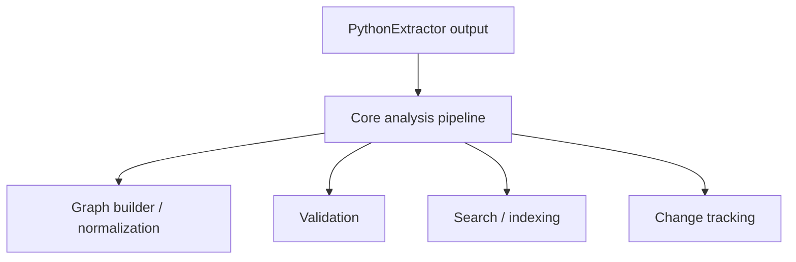

---

## Practical examples

### Example: function extraction

For:

```python
def greet(name: str, times=1) -> str:
    return name * times
```

The extractor records:

- name: `greet`
- params: `['name', 'times']`
- returnType: `str`
- lineRange: function span

### Example: class extraction

For:

```python
class User:
    role: str

    def login(self):
        pass
```

The extractor records:

- class name: `User`
- methods: `['login']`
- properties: `['role']`

### Example: imports

For:

```python
from typing import Optional, List as TList
import os.path
```

The extractor records import entries for the module and specifiers it can identify syntactically.

---

## Limitations

- Does not resolve symbols across files.
- Does not distinguish instance methods, static methods, or class methods beyond their syntax.
- Call graph entries are based on textual callee nodes and may include unresolved attributes.
- Only top-level functions and classes are exported.
- Class properties are only detected when they are typed assignments.

---

## Related modules

- [language_extractors-types](language_extractors-types.md)
- [language_extractors-typescript](language_extractors-typescript.md)
- [language_extractors-java](language_extractors-java.md)
- [language_extractors-go](language_extractors-go.md)
- [core_schema_and_types](core_schema_and_types.md)
- [core_analysis](core_analysis.md)
