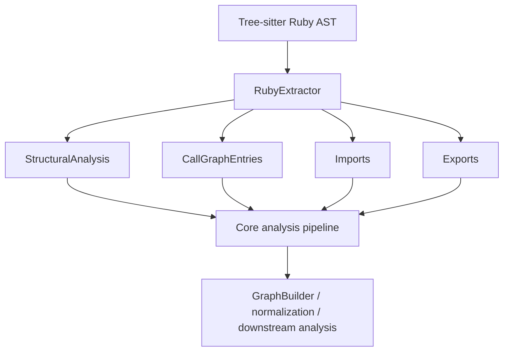
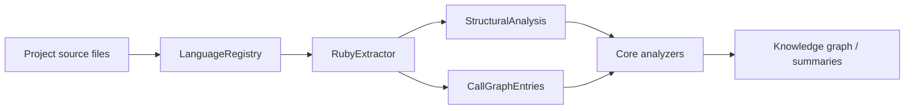
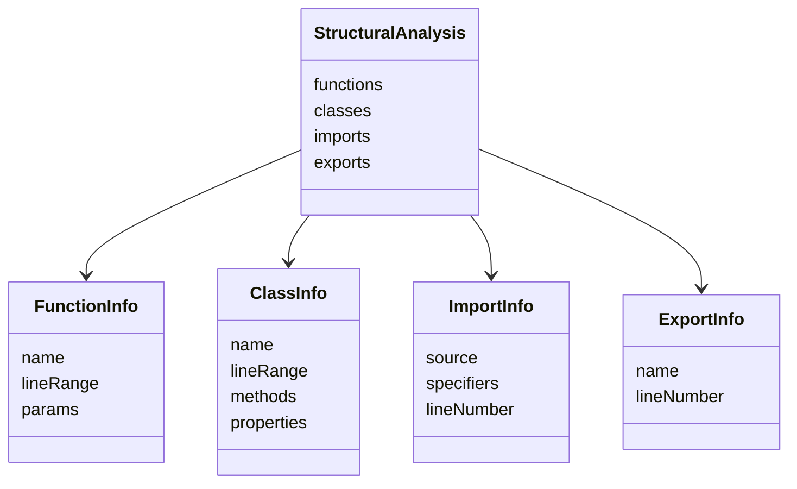
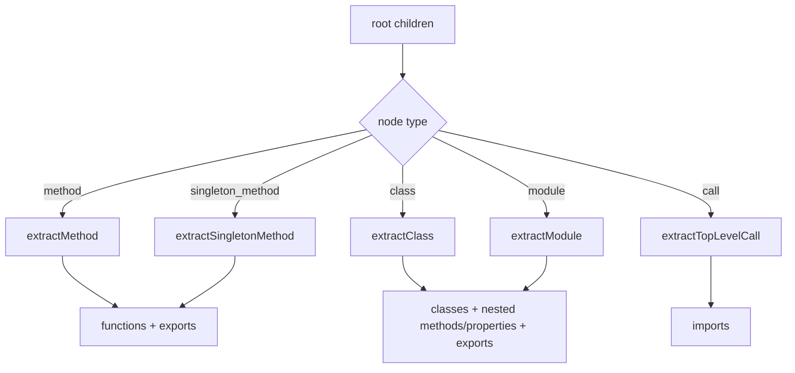
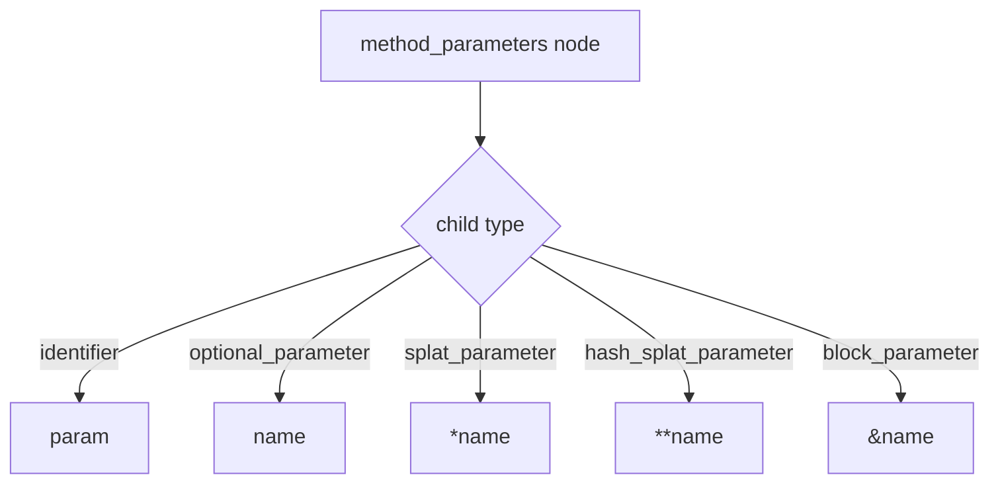
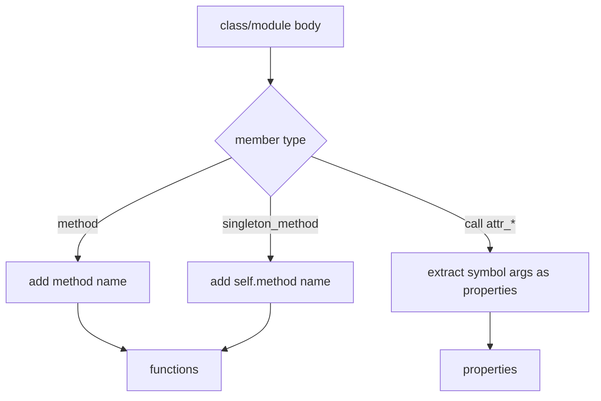
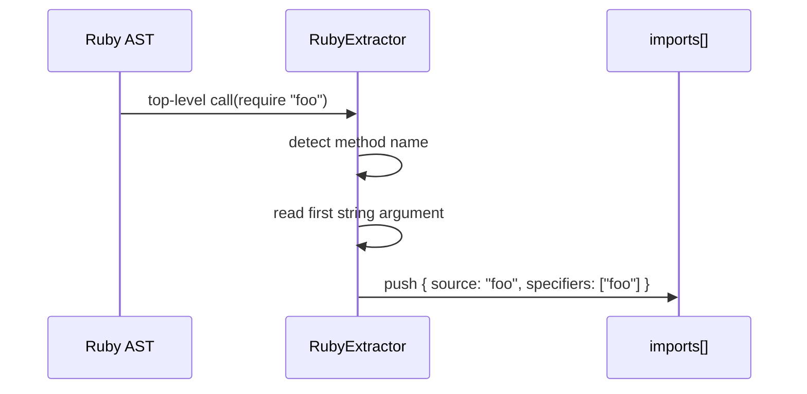
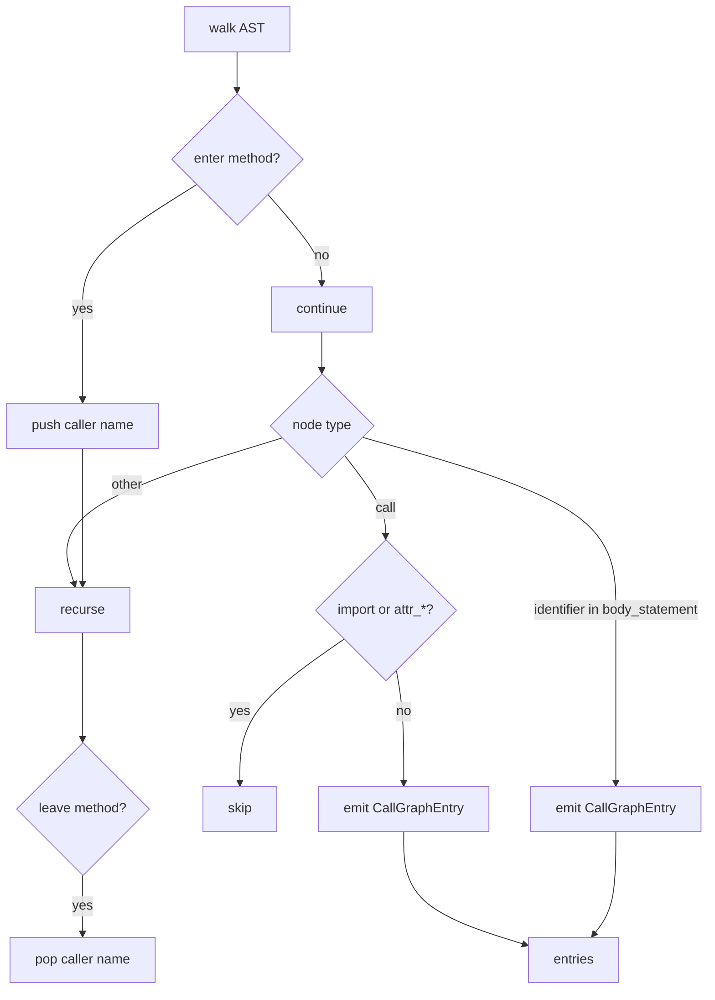
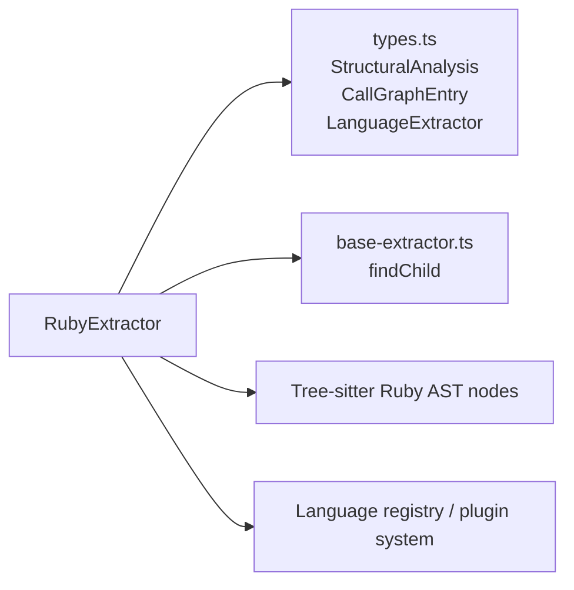
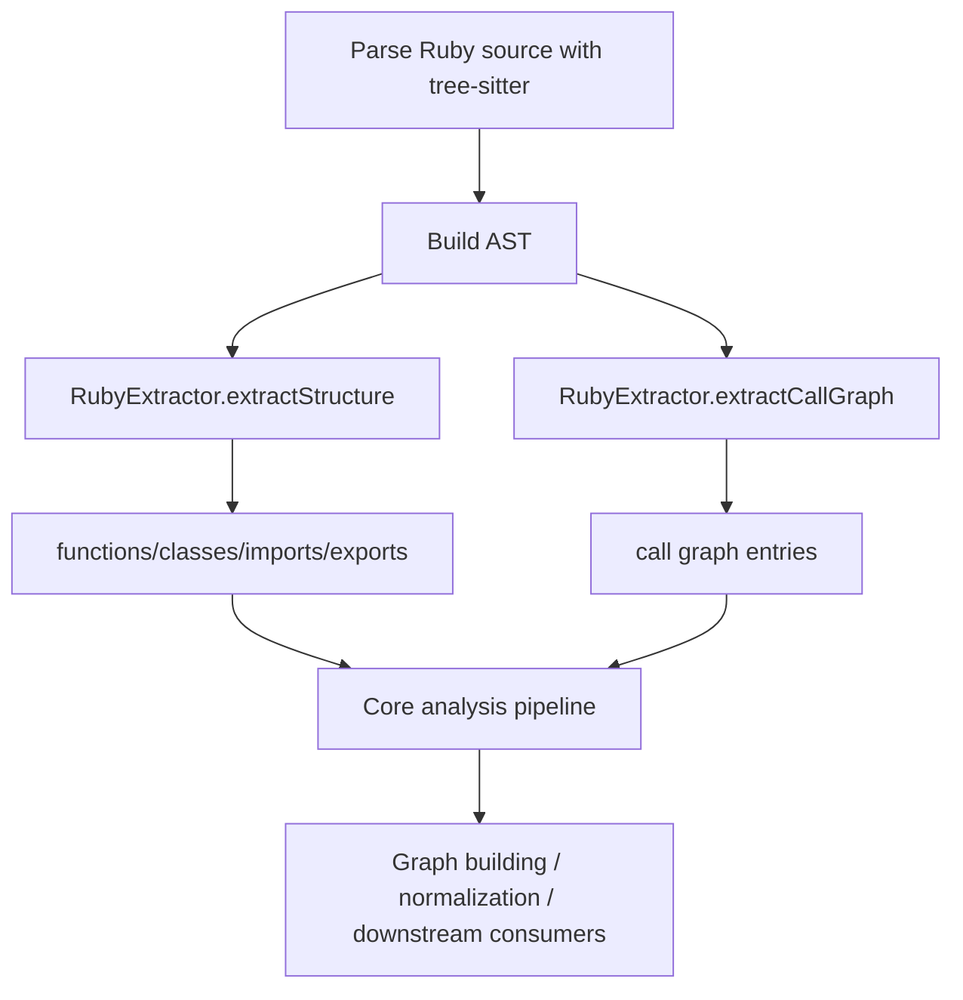

# language_extractors-ruby

## Introduction

The `language_extractors-ruby` module provides Ruby-specific source analysis for the core language extraction pipeline. It converts Ruby tree-sitter syntax trees into the shared structural model used by the rest of the system, including functions, classes/modules, imports, exports, and call graph edges.

This module is intentionally focused on Ruby semantics that differ from other languages, such as `require`-based imports, `attr_*` macros, singleton methods (`def self.foo`), and Ruby’s permissive top-level export model.

For the shared extractor contract and common extractor patterns, see [language_extractors-types](language_extractors-types.md). For broader language registration and selection, see [language_registries](language_registries.md).

---

## Purpose and responsibilities

`RubyExtractor` is responsible for:

- Parsing Ruby tree-sitter nodes into the shared `StructuralAnalysis` shape
- Extracting top-level and nested definitions:
  - instance methods
  - singleton methods
  - classes
  - modules
- Detecting Ruby imports via `require` and `require_relative`
- Detecting class properties declared through `attr_accessor`, `attr_reader`, and `attr_writer`
- Building intra-file call graph edges from method bodies
- Treating top-level Ruby definitions as exports, since Ruby does not have a formal export syntax

The extractor is designed to be used by the core analysis pipeline alongside other language extractors in [language_extractors](language_extractors.md).

---

## Core component

### `RubyExtractor`

`RubyExtractor` implements the shared `LanguageExtractor` interface and exposes Ruby support through:

- `languageIds = ["ruby"]`
- `extractStructure(rootNode)`
- `extractCallGraph(rootNode)`

It relies on tree-sitter node shapes and field names to identify Ruby constructs.

---

## Architecture overview

### How it fits into the system

`RubyExtractor` is one implementation in the core language support layer. The extractor is selected through the language registry and then used by the analysis pipeline to produce normalized project knowledge.

Related modules:

- [language_registries](language_registries.md)
- [core_analysis](core_analysis.md)
- [core_schema_and_types](core_schema_and_types.md)

---

## Data model produced by the extractor

### Structural analysis output

`extractStructure()` returns a `StructuralAnalysis` object with these Ruby-populated sections:

- `functions`: all discovered methods and singleton methods
- `classes`: Ruby classes and modules
- `imports`: top-level `require` / `require_relative` statements
- `exports`: top-level definitions treated as exported symbols

### Call graph output

`extractCallGraph()` returns `CallGraphEntry[]`, where each entry records:

- `caller`: current method context
- `callee`: invoked method or receiver-qualified call
- `lineNumber`: source line of the call

---

## Extraction behavior

### 1) Top-level definitions

The extractor scans only the root node’s direct children for structural extraction.

It recognizes these top-level node types:

- `method`
- `singleton_method`
- `class`
- `module`
- `call`

#### Methods

For `method` nodes:

- the method name is read from the `name` field
- parameters are extracted from the `parameters` field
- the method is added to `functions`
- the method is also added to `exports`

#### Singleton methods

For `singleton_method` nodes:

- the method name is prefixed with `self.`
- parameters are extracted the same way as regular methods
- the method is added to `functions`
- the method is also added to `exports`

#### Classes and modules

For both `class` and `module` nodes:

- the name is read from the `name` field
- the body is scanned for methods and `attr_*` macros
- the node is added to `classes`
- the class/module name is added to `exports`

Ruby modules are intentionally represented in the same `classes` collection because they behave like named containers for methods and constants in the shared model.

---

### 2) Parameter extraction

`extractParams()` handles Ruby method parameter node variants:

- `identifier` → plain parameter name
- `optional_parameter` → parameter name without default value
- `splat_parameter` → prefixed with `*`
- `hash_splat_parameter` → prefixed with `**`
- `block_parameter` → prefixed with `&`

This preserves Ruby’s parameter semantics in a compact string form.

---

### 3) Class and module body scanning

`extractClassBody()` scans the body of a class or module and collects:

- nested `method` definitions
- nested `singleton_method` definitions
- `attr_accessor`, `attr_reader`, `attr_writer` calls

Methods discovered inside the body are added both to:

- the enclosing class/module’s `methods` list
- the global `functions` list

Properties are derived from symbol arguments passed to `attr_*` macros.

#### `attr_*` property extraction

The extractor recognizes:

- `attr_accessor`
- `attr_reader`
- `attr_writer`

It reads `simple_symbol` arguments such as `:name` and stores them as `name`.

---

### 4) Import extraction

Ruby imports are handled specially because they are expressed as method calls rather than language-level import statements.

The extractor treats top-level calls to:

- `require`
- `require_relative`

as imports.

The first string argument is used as the import source.

#### String handling

`getStringContent()` prefers the `string_content` child node and falls back to stripping surrounding quotes if needed.

---

### 5) Call graph extraction

`extractCallGraph()` walks the full AST and tracks the current method context using a stack.

It records call edges for:

- regular `call` nodes inside methods
- bare identifier calls inside `body_statement` nodes, which Ruby often uses for zero-argument method calls

It skips:

- `require` / `require_relative`
- `attr_accessor` / `attr_reader` / `attr_writer`

#### Caller naming rules

- regular methods use their method name
- singleton methods use `self.<name>`

#### Callee naming rules

- receiver-qualified calls become `receiver.method`
- unqualified calls remain as the method name

---

## Dependency map

`RubyExtractor` depends on a small set of shared core abstractions and helper utilities.

### Direct dependencies

- `../../types.js`
  - `StructuralAnalysis`
  - `CallGraphEntry`
- `./types.js`
  - `LanguageExtractor`
  - `TreeSitterNode`
- `./base-extractor.js`
  - `findChild()`

### Indirect system dependencies

- [core_plugin_system](core_plugin_system.md) for extractor registration and discovery
- [core_language_support](core_language_support.md) for language selection and extractor orchestration
- [core_schema_and_types](core_schema_and_types.md) for shared graph and analysis types

---

## Ruby-specific design decisions

### Modules are treated like classes

Ruby modules are stored in the same `classes` collection as classes. This keeps the shared structural model simple while still preserving named containers with methods and properties.

### Top-level definitions are exported

Because Ruby lacks explicit export syntax, the extractor marks top-level classes, modules, methods, and singleton methods as exports.

### Singleton methods are namespaced with `self.`

This makes class-level methods distinguishable from instance methods in downstream analysis.

### Bare identifier calls are treated as call graph edges

Ruby often parses zero-argument method invocations as identifiers inside method bodies. The extractor explicitly converts these into call graph entries when inside a function context.

---

## Process flow summary

---

## Integration notes

### When to use this module

Use `RubyExtractor` when analyzing Ruby source files in the core analysis pipeline. It is the language-specific adapter that translates Ruby syntax into the shared analysis model.

### What it does not do

This module does not:

- resolve imports to filesystem paths
- normalize graph edges
- perform semantic LLM analysis
- validate the final graph schema

Those responsibilities belong to other core modules such as [core_analysis](core_analysis.md), [core_change_tracking](core_change_tracking.md), and [core_schema_and_types](core_schema_and_types.md).

---

## Related documentation

- [language_extractors](language_extractors.md)
- [language_extractors-types](language_extractors-types.md)
- [language_registries](language_registries.md)
- [core_language_support](core_language_support.md)
- [core_analysis](core_analysis.md)
- [core_schema_and_types](core_schema_and_types.md)
