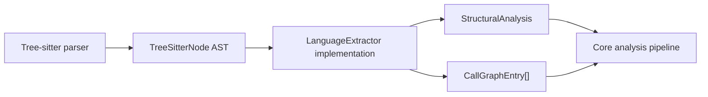
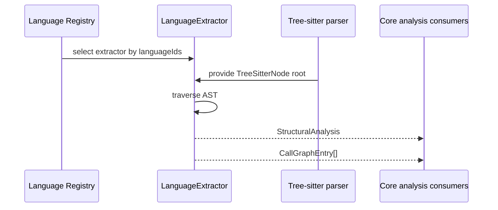
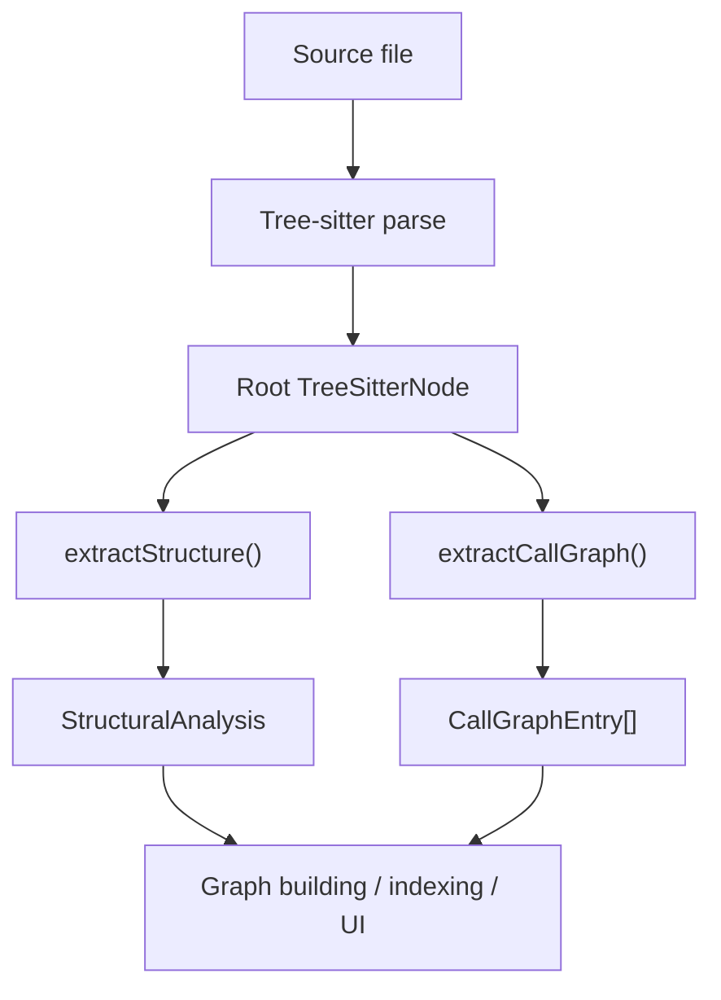

# language_extractors-types

This module defines the shared contract for all language-specific extractors in the core plugin system. It is intentionally small: it does not implement parsing itself, but standardizes how extractor plugins convert a Tree-sitter AST into the common structural and call-graph data used by the rest of the platform.

## Purpose

`language_extractors-types` provides the `LanguageExtractor` interface and the `TreeSitterNode` type alias. Together, they establish the minimum API every language extractor must implement so the core analysis pipeline can treat Python, TypeScript, Java, Go, and other language plugins uniformly.

## Core responsibilities

- Define the extractor plugin contract.
- Re-export the Tree-sitter node type used by extractor implementations.
- Bridge language-specific AST traversal with shared analysis types.
- Support both structural extraction and call-graph extraction.

## Public API

### `TreeSitterNode`

```ts
export type TreeSitterNode = import("web-tree-sitter").Node;
```

A convenience alias for the Tree-sitter AST node type. Extractor implementations use this type when traversing parsed syntax trees.

### `LanguageExtractor`

```ts
export interface LanguageExtractor {
  languageIds: string[];
  extractStructure(rootNode: TreeSitterNode): StructuralAnalysis;
  extractCallGraph(rootNode: TreeSitterNode): CallGraphEntry[];
}
```

#### Fields and methods

- `languageIds`: The language identifiers handled by the extractor. These must match the corresponding `LanguageConfig.id` values used elsewhere in the language registry.
- `extractStructure(rootNode)`: Produces a normalized `StructuralAnalysis` object from the AST root.
- `extractCallGraph(rootNode)`: Produces caller → callee relationships as `CallGraphEntry[]`.

## Output types

The interface depends on shared types from [`core_schema_and_types`](core_schema_and_types.md):

- [`StructuralAnalysis`](core_schema_and_types.md) — normalized structural metadata such as functions, classes, imports, exports, and optional non-code sections.
- [`CallGraphEntry`](core_schema_and_types.md) — a single call relationship with `caller`, `callee`, and `lineNumber`.

## Architecture



The extractor contract sits between language parsing and the shared analysis model. Each language plugin is responsible for AST traversal, while downstream systems consume the normalized results.

## Component interaction



## Data flow



## Relationship to other modules

This module is part of the broader language support layer. For implementation details and concrete language behavior, see:

- [`language_extractors-typescript`](language_extractors-typescript.md)
- [`language_extractors-python`](language_extractors-python.md)
- [`language_extractors-java`](language_extractors-java.md)
- [`language_extractors-go`](language_extractors-go.md)
- [`language_extractors-csharp`](language_extractors-csharp.md)
- [`language_extractors-cpp`](language_extractors-cpp.md)
- [`language_extractors-php`](language_extractors-php.md)
- [`language_extractors-ruby`](language_extractors-ruby.md)
- [`language_extractors-rust`](language_extractors-rust.md)

For registry and discovery behavior, refer to:

- [`language_registries`](language_registries.md)
- [`core_plugin_system`](core_plugin_system.md)

For the shared analysis model consumed by extractors, refer to:

- [`core_schema_and_types`](core_schema_and_types.md)

## Implementation notes

- The interface is intentionally minimal to keep language plugins interchangeable.
- `languageIds` enables one extractor to support multiple related language identifiers if needed.
- `extractStructure` and `extractCallGraph` are separate so consumers can use structural metadata independently from call-graph generation.
- The module does not prescribe how AST traversal is performed; that is left to each language-specific extractor.

## Typical usage

```ts
function analyzeFile(extractor: LanguageExtractor, rootNode: TreeSitterNode) {
  const structure = extractor.extractStructure(rootNode);
  const calls = extractor.extractCallGraph(rootNode);
  return { structure, calls };
}
```

## Summary

`language_extractors-types` is the shared type boundary for all language extractors. It ensures every extractor plugin exposes a consistent API for turning Tree-sitter syntax trees into the normalized structural and call-graph data used throughout the system.
