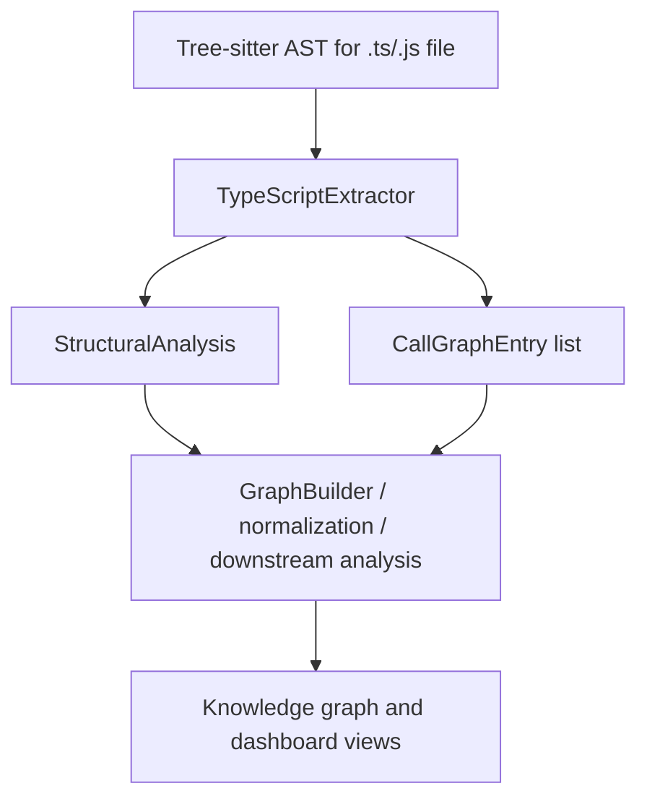
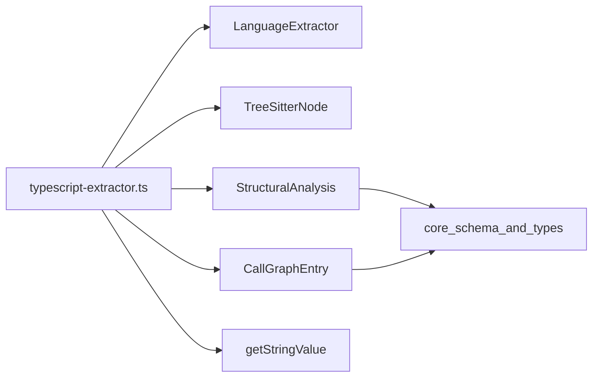
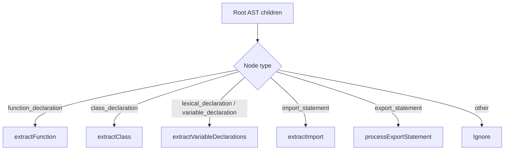
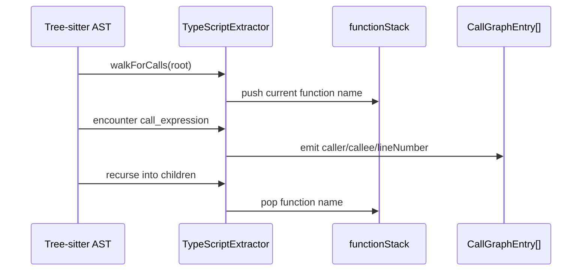
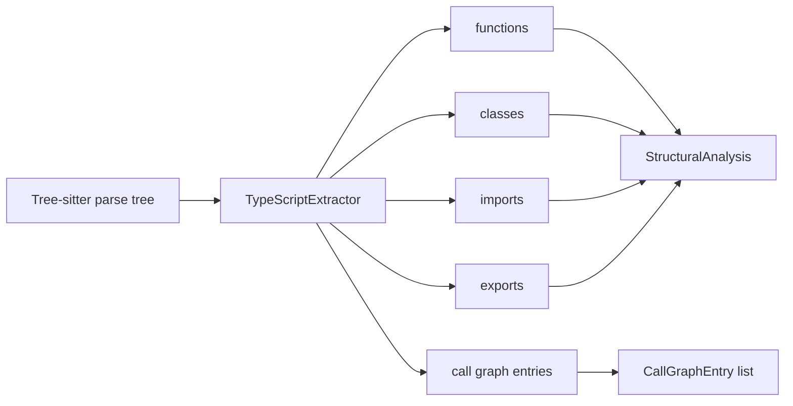
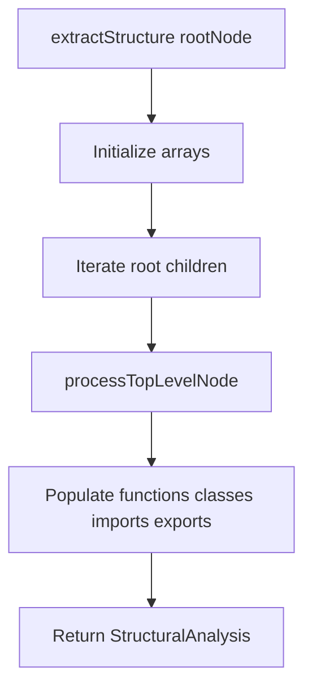
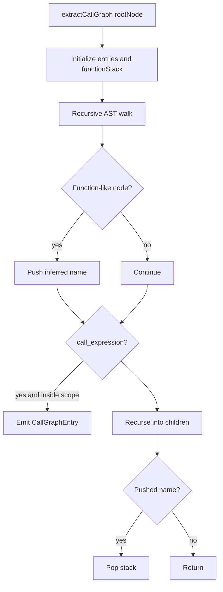

# TypeScript Language Extractor

This module implements the TypeScript/JavaScript language extractor used by the core analysis pipeline. It converts a Tree-sitter AST into two primary outputs:

- **Structural analysis**: functions, classes, imports, and exports
- **Call graph entries**: caller → callee relationships with source line numbers

It is the concrete implementation of the shared [`LanguageExtractor`](language_extractors-types.md) interface and is used whenever the analyzer processes files whose language ID is `typescript` or `javascript`.

---

## Purpose and responsibilities

The `TypeScriptExtractor` is responsible for extracting lightweight source-code structure from TypeScript and JavaScript files without performing semantic type checking. It focuses on syntax-level patterns that are stable across common Tree-sitter ASTs.

### What it extracts

- Top-level function declarations
- Variable-declared functions and arrow functions
- Class declarations, methods, and properties
- Import statements and import specifiers
- Export statements, including default exports
- Call expressions nested inside function-like scopes

### What it does not do

- It does not resolve symbols across files
- It does not infer types beyond explicit return annotations
- It does not build a full semantic call graph
- It does not analyze non-code artifacts such as markdown or configuration files

For broader analysis concepts, see:

- [`core_schema_and_types`](core_schema_and_types.md)
- [`core_analysis`](core_analysis.md)
- [`core_plugin_system`](core_plugin_system.md)

---

## Module placement in the system



The extractor sits in the language-support layer and feeds the core analysis pipeline with normalized source structure.

---

## Dependencies

### Direct dependencies

- [`LanguageExtractor`](language_extractors-types.md) interface
- [`TreeSitterNode`](language_extractors-types.md) AST node abstraction
- [`StructuralAnalysis`](core_schema_and_types.md)
- [`CallGraphEntry`](core_schema_and_types.md)
- `getStringValue()` from [`base-extractor`](language_extractors-types.md)

### Related modules

- [`language_extractors-types`](language_extractors-types.md) — shared extractor contract
- [`core_schema_and_types`](core_schema_and_types.md) — output data shapes
- [`core_analysis`](core_analysis.md) — downstream consumers of extracted structure
- [`core_plugin_system`](core_plugin_system.md) — how extractors are discovered and registered



---

## Public API

### `TypeScriptExtractor`

```ts
class TypeScriptExtractor implements LanguageExtractor
```

#### Supported language IDs

```ts
readonly languageIds = ["typescript", "javascript"];
```

This means the same extractor handles both TypeScript and JavaScript ASTs, which is practical because the Tree-sitter grammars share many node shapes.

#### Methods

- `extractStructure(rootNode: TreeSitterNode): StructuralAnalysis`
- `extractCallGraph(rootNode: TreeSitterNode): CallGraphEntry[]`

---

## Structural extraction behavior

The extractor scans only the root node’s direct children for top-level declarations and statements.

### Top-level node handling



### Extracted structures

#### Functions

A function entry is created for:

- `function_declaration`
- variable declarators whose value is:
  - `arrow_function`
  - `function_expression`
  - `function`

Captured fields:

- `name`
- `lineRange` from start/end positions
- `params`
- `returnType` when explicitly annotated

#### Classes

A class entry is created for `class_declaration` nodes.

Captured fields:

- `name`
- `lineRange`
- `methods`
- `properties`

The extractor inspects the class body and collects:

- `method_definition` names as methods
- `public_field_definition` and `property_definition` names as properties

#### Imports

For `import_statement`, the extractor records:

- `source` from the string literal module path
- `specifiers` from default, named, and namespace imports
- `lineNumber`

#### Exports

For `export_statement`, the extractor records:

- named exports
- default exports
- exported declarations
- re-export specifiers from `export_clause`

It uses an internal `exportedNames` set to avoid duplicate export entries.

---

## Call graph extraction behavior

The call graph extractor performs a recursive AST walk and tracks the current function-like scope using a stack.

### Function-like scopes recognized

- `function_declaration`
- `method_definition`
- `arrow_function`
- `function_expression`

### Call detection

When a `call_expression` is encountered inside a tracked function-like scope, the extractor emits a `CallGraphEntry`:

- `caller`: the current function name on the stack
- `callee`: the call expression’s function text
- `lineNumber`: 1-based source line number



### Important limitation

The call graph is **syntactic**, not semantic:

- `callee` is taken from the raw AST text of the function node
- method calls, property accesses, and imported aliases are not resolved to canonical symbols
- anonymous functions are only tracked when they can be named from their parent variable declarator

---

## Internal helper functions

### `extractParams(paramsNode)`

Extracts parameter names from a `formal_parameters` node.

Supported parameter shapes:

- `required_parameter`
- `optional_parameter`
- bare `identifier` parameters
- `rest_pattern` / `rest_element`

Behavior notes:

- Prefers `pattern` or `name` fields when available
- Falls back to the first `identifier` child if needed
- Prefixes rest parameters with `...`

### `extractReturnType(node)`

Reads the `return_type` field from a function-like node.

- Only returns explicit type annotations
- Strips the leading `:` when present
- Returns `undefined` if no annotation exists

### `extractImportSpecifiers(importClause)`

Collects import specifiers from an `import_clause`.

Supported forms:

- named imports: `{ foo, bar as baz }`
- namespace imports: `* as ns`
- default imports: `foo`

### `processExportStatement(...)`

Handles export declarations and ensures exported names are deduplicated.

It supports:

- exported function declarations
- exported class declarations
- exported variable declarations
- export clauses with aliases
- anonymous default function exports

---

## Data flow



The extractor produces two independent outputs:

1. `StructuralAnalysis` for file-level structure
2. `CallGraphEntry[]` for intra-file call relationships

These outputs are later consumed by graph-building and analysis modules.

---

## Component interaction details

### `extractStructure()`



### `extractCallGraph()`



---

## Output shape examples

### Structural analysis example

```ts
{
  functions: [
    {
      name: "sum",
      lineRange: [1, 5],
      params: ["a", "b"],
      returnType: "number"
    }
  ],
  classes: [
    {
      name: "Calculator",
      lineRange: [7, 20],
      methods: ["add"],
      properties: ["precision"]
    }
  ],
  imports: [
    {
      source: "./math",
      specifiers: ["add", "multiply as mul"],
      lineNumber: 1
    }
  ],
  exports: [
    {
      name: "sum",
      lineNumber: 1,
      isDefault: false
    }
  ]
}
```

### Call graph example

```ts
[
  {
    caller: "sum",
    callee: "add",
    lineNumber: 3
  }
]
```

---

## Design considerations

### Why this extractor is syntax-first

The core analysis pipeline is designed to work across many languages and repositories. A syntax-first extractor:

- is fast
- avoids requiring type resolution
- works well with partial or incomplete code
- keeps the extractor consistent with other language plugins

### Why TypeScript and JavaScript share one extractor

Tree-sitter’s AST shapes for these languages overlap heavily. Sharing one extractor reduces duplication while still supporting both language IDs.

### Why exports are deduplicated

Export statements can reference the same symbol multiple times through different syntactic forms. The `exportedNames` set prevents duplicate entries in the final analysis.

---

## Limitations and edge cases

- Nested functions are not added to `StructuralAnalysis.functions` unless they appear as top-level declarations or variable initializers.
- Call graph entries only capture calls inside named function-like scopes.
- Anonymous arrow functions assigned to complex expressions may not receive a caller name.
- Some Tree-sitter grammar variants may use slightly different node names; the extractor relies on the expected TypeScript/JavaScript grammar shapes.
- Re-export patterns and advanced module syntax are only partially represented.

---

## Related documentation

- [`language_extractors-types`](language_extractors-types.md)
- [`core_schema_and_types`](core_schema_and_types.md)
- [`core_analysis`](core_analysis.md)
- [`core_plugin_system`](core_plugin_system.md)
- [`core_language_support`](core_language_support.md)

---

## Summary

`TypeScriptExtractor` is the core syntax-level extractor for TypeScript and JavaScript files. It translates Tree-sitter AST nodes into the shared structural and call-graph formats used by the rest of the system, enabling downstream graph construction, analysis, and visualization.
