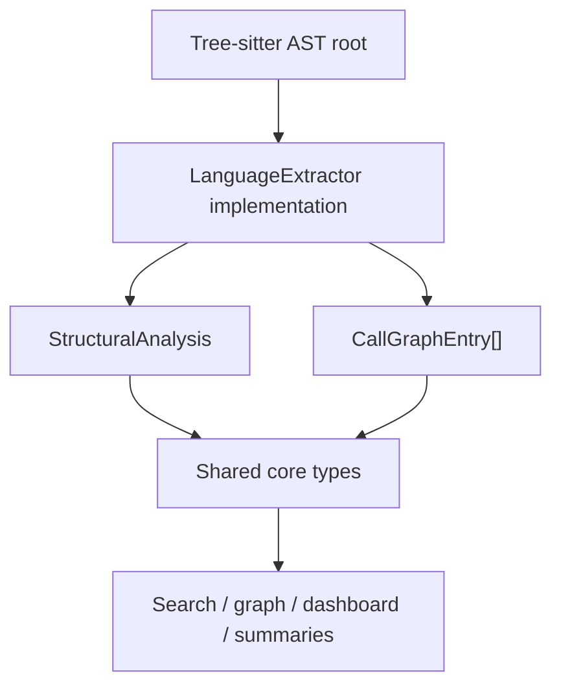
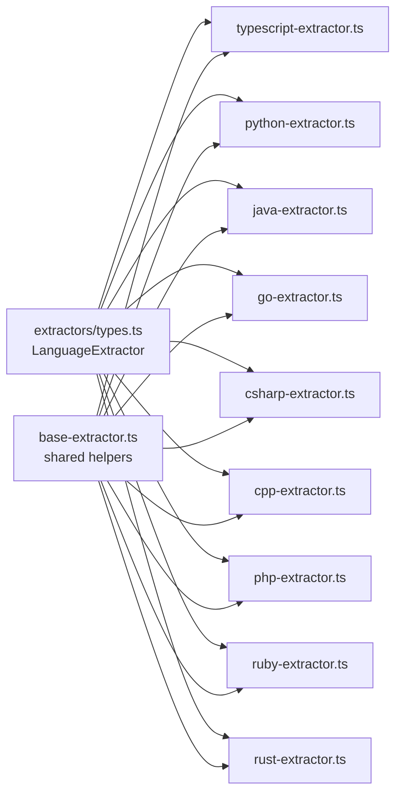
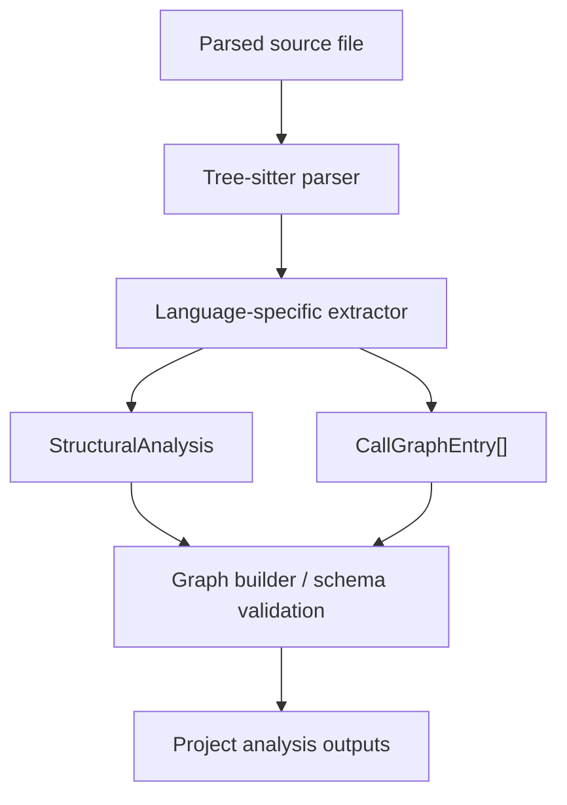

# language_extractors

## Purpose
The `language_extractors` module provides tree-sitter-based language adapters that convert language-specific ASTs into the shared analysis model used by the core system. Each extractor normalizes source code into common structures for:

- functions and methods
- classes, structs, interfaces, traits, modules
- imports and dependencies
- exports and visibility
- call graph edges

These extractors are the bridge between parsed syntax trees and the rest of the analysis pipeline.

## Architecture Overview

### Component Relationships

## High-Level Functionality

### Shared contract
- [`types.ts`](language_extractors-types.md) defines the `LanguageExtractor` interface.
- Every extractor implements:
  - `languageIds`: supported language identifiers
  - `extractStructure(rootNode)`: structural metadata extraction
  - `extractCallGraph(rootNode)`: caller-to-callee relationships

### Language-specific extractors
- [`typescript-extractor.ts`](language_extractors-typescript.md): TypeScript and JavaScript support, including exports and mixed function forms.
- [`python-extractor.ts`](language_extractors-python.md): Python functions, classes, imports, decorators, and top-level exports.
- [`java-extractor.ts`](language_extractors-java.md): Java classes, interfaces, imports, visibility-based exports, and call graphs.
- [`go-extractor.ts`](language_extractors-go.md): Go functions, methods, structs, interfaces, imports, and capitalization-based exports.
- [`csharp-extractor.ts`](language_extractors-csharp.md): C# classes, interfaces, namespaces, using directives, and modifier-based exports.
- [`cpp-extractor.ts`](language_extractors-cpp.md): C/C++ classes, structs, namespaces, includes, and method association.
- [`php-extractor.ts`](language_extractors-php.md): PHP functions, classes, interfaces, namespaces, use statements, and call graphs.
- [`ruby-extractor.ts`](language_extractors-ruby.md): Ruby classes, modules, methods, singleton methods, require imports, and attr_* properties.
- [`rust-extractor.ts`](language_extractors-rust.md): Rust functions, structs, enums, traits, impl blocks, use declarations, and pub exports.

## Data Flow

## Notes on Design
- Extractors intentionally map different language constructs into a shared schema, even when the source language has no direct equivalent.
- Export rules are language-specific and often based on conventions rather than explicit syntax.
- Call graph extraction is heuristic and AST-shape dependent, but consistent enough for cross-language analysis.

## Related Modules
- Core shared types and schemas: [`core_schema_and_types`](core_schema_and_types.md)
- Graph analysis pipeline: [`core_analysis`](core_analysis.md)
- Plugin system and discovery: [`core_plugin_system`](core_plugin_system.md)
- Language registries: [`language_registries`](language_registries.md)
