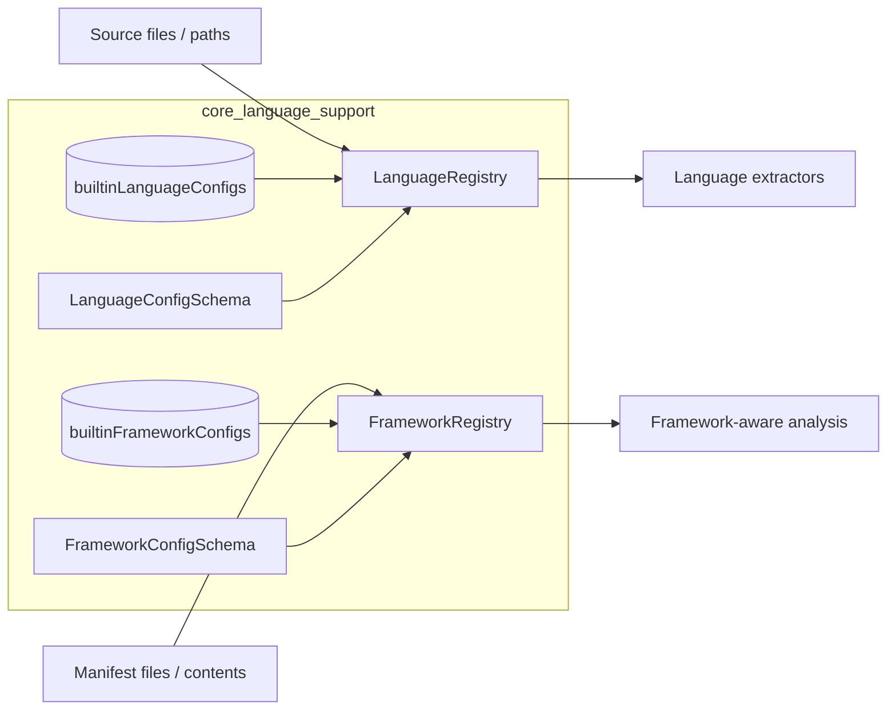
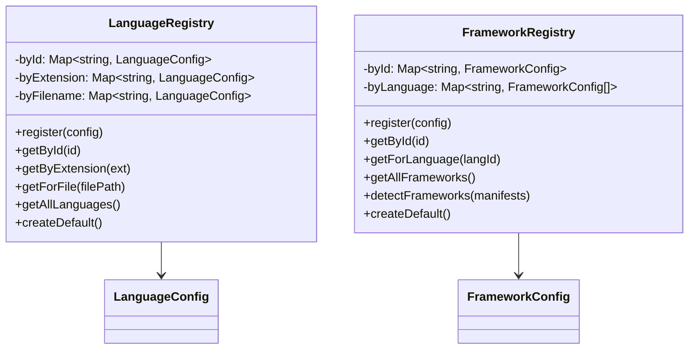
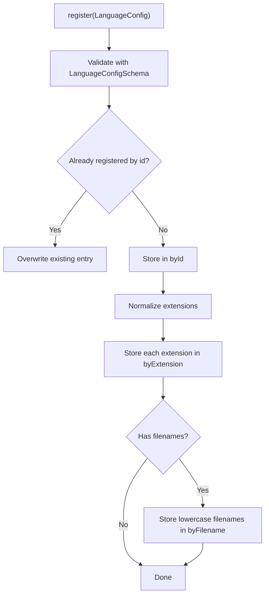
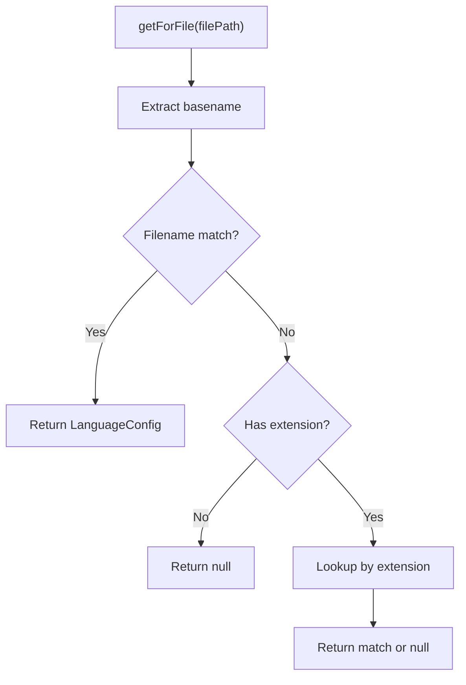
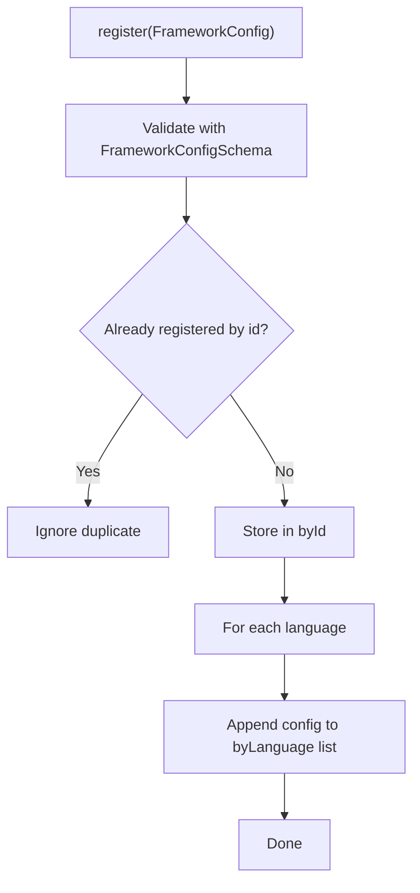
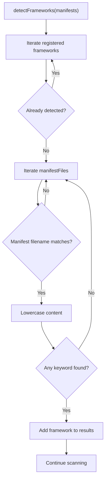
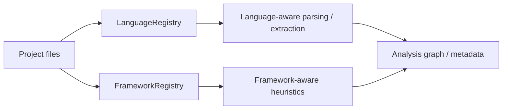

# Language Registries

The `language_registries` module provides the core lookup and detection services used by the analysis pipeline to map files and manifests to their corresponding language and framework metadata. It contains two small but central registries:

- `LanguageRegistry` for resolving a file path, extension, or language id to a `LanguageConfig`
- `FrameworkRegistry` for resolving manifest contents to a `FrameworkConfig`

These registries are foundational for downstream analyzers, extractors, and graph-building logic because they normalize the project’s source files into language-aware and framework-aware inputs.

## Overview

At a high level, the module acts as a catalog layer:

- **LanguageRegistry** answers: “What language is this file?”
- **FrameworkRegistry** answers: “What framework(s) does this project appear to use?”

Both registries are populated from built-in configuration lists and can also accept additional runtime registrations.

## Module responsibilities

### LanguageRegistry

`LanguageRegistry` maintains three indexes over `LanguageConfig` objects:

- by language id
- by file extension
- by exact filename

It supports:

- registering language definitions
- resolving a language by id
- resolving a language by extension
- resolving a language for a full file path
- enumerating all registered languages
- creating a default registry from built-in configs

### FrameworkRegistry

`FrameworkRegistry` maintains two indexes over `FrameworkConfig` objects:

- by framework id
- by supported language

It supports:

- registering framework definitions
- resolving a framework by id
- resolving frameworks for a language
- enumerating all registered frameworks
- detecting frameworks from manifest file contents
- creating a default registry from built-in configs

---

## Architecture

### Design notes

- The registries are intentionally lightweight and in-memory.
- Validation is performed at registration time using schemas, which prevents malformed configs from entering the system.
- Lookup structures are optimized for common access patterns:
  - exact id lookup
  - extension lookup
  - filename lookup
  - manifest keyword detection

---

## Component relationships

---

## LanguageRegistry

### Purpose

`LanguageRegistry` provides deterministic language resolution for files and identifiers. It is designed to support both:

- **explicit lookup** by language id
- **implicit lookup** by file path or extension

This makes it useful for file classification before parsing, extraction, or analysis.

### Internal indexes

#### `byId`
Maps a language id to its `LanguageConfig`.

#### `byExtension`
Maps normalized extensions such as `.ts` or `.py` to a `LanguageConfig`.

#### `byFilename`
Maps exact filenames such as `Makefile` or `docker-compose.yml` to a `LanguageConfig`.

### Registration flow

### Lookup behavior

#### `getById(id)`
Returns the registered language config for the given id, or `null` if not found.

#### `getByExtension(ext)`
Normalizes the extension to ensure it starts with a dot and is lowercase before lookup.

Examples:

- `ts` → `.ts`
- `.TS` → `.ts`
- `.py` → `.py`

#### `getForFile(filePath)`
Resolves a language from a file path using the following priority:

1. exact filename match on the basename
2. extension match on the last path segment
3. `null` if no match exists

This priority is important for special files whose names are more meaningful than their extensions.

### Default registry

`LanguageRegistry.createDefault()` constructs a registry and registers all built-in language configs.

Use this when the application needs standard language support without custom configuration.

---

## FrameworkRegistry

### Purpose

`FrameworkRegistry` provides framework detection and lookup based on framework metadata and manifest contents. It is especially useful for identifying project ecosystems such as web frameworks, backend frameworks, or language-specific stacks.

### Internal indexes

#### `byId`
Maps framework ids to `FrameworkConfig` objects.

#### `byLanguage`
Maps a language id to all frameworks associated with that language.

This supports queries such as “what frameworks are relevant for Python?”

### Registration flow

### Lookup behavior

#### `getById(id)`
Returns a framework config by id, or `null` if not found.

#### `getForLanguage(langId)`
Returns all frameworks associated with a language id.

This is useful when a language-specific extractor or analyzer wants to tailor behavior based on the project’s framework ecosystem.

#### `getAllFrameworks()`
Returns all registered framework configs.

### Framework detection from manifests

`detectFrameworks(manifests)` inspects manifest file contents and returns the frameworks whose detection rules match.

#### Detection algorithm

1. Iterate through registered frameworks.
2. Skip frameworks already detected.
3. For each framework, inspect its configured `manifestFiles`.
4. Find a matching manifest entry by:
   - exact filename, or
   - path ending with `/<manifestFile>`
5. Convert the manifest content to lowercase.
6. Check whether any `detectionKeywords` appear in the content.
7. If a keyword matches, add the framework to the result set.

### Detection characteristics

- **Filename-based matching**: only manifest files explicitly listed in the config are considered.
- **Keyword-based matching**: detection is content-driven, not just filename-driven.
- **Deduplication**: each framework is returned at most once.
- **Case-insensitive matching**: both content and keywords are compared in lowercase.

### Default registry

`FrameworkRegistry.createDefault()` constructs a registry and registers all built-in framework configs.

---

## Data flow in the analysis pipeline

### Typical usage sequence

1. The system scans project files.
2. `LanguageRegistry` classifies source files.
3. `FrameworkRegistry` inspects manifests for framework signals.
4. Downstream analyzers use the resolved language/framework metadata to guide parsing, extraction, and graph construction.

---

## Integration points

This module is commonly consumed by other core language-support components, especially:

- [language_extractors](language_extractors.md) for selecting the correct extractor implementation
- [core_analysis](core_analysis.md) for language-aware project analysis
- [core_config_parsers](core_config_parsers.md) for manifest and configuration file interpretation
- [core_schema_and_types](core_schema_and_types.md) for shared config and graph-related types

If you are working on file classification or framework detection, start here before moving into extractor or analyzer implementations.

---

## Implementation details and caveats

### Extension normalization

`LanguageRegistry` normalizes extensions during registration and lookup so callers can pass either `ts` or `.ts`.

### Filename precedence

`getForFile()` checks exact filenames before extensions. This avoids misclassifying files like `Makefile`, `Dockerfile`, or `docker-compose.yml`.

### Duplicate handling differences

- `LanguageRegistry` does not explicitly guard against duplicate ids; later registrations can replace earlier entries in the maps.
- `FrameworkRegistry` explicitly ignores duplicate ids during registration.

### Manifest matching limitations

`detectFrameworks()` uses simple substring matching against manifest contents. This is fast and easy to maintain, but it may produce false positives if keywords are too generic.

---

## Related documentation

- [core_language_support](core_language_support.md)
- [language_extractors](language_extractors.md)
- [core_analysis](core_analysis.md)
- [core_schema_and_types](core_schema_and_types.md)
- [core_config_parsers](core_config_parsers.md)

---

## Summary

The `language_registries` module is a compact but essential part of the core language-support layer. It centralizes language and framework resolution, enabling the rest of the system to make consistent decisions about how to parse files, detect ecosystems, and route analysis work.
