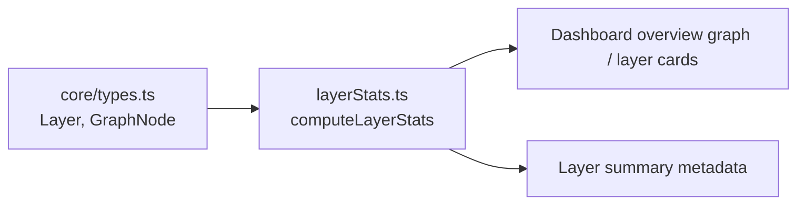
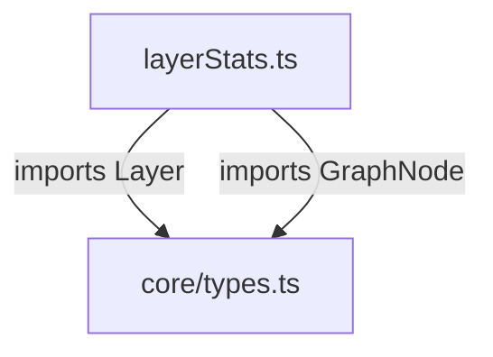
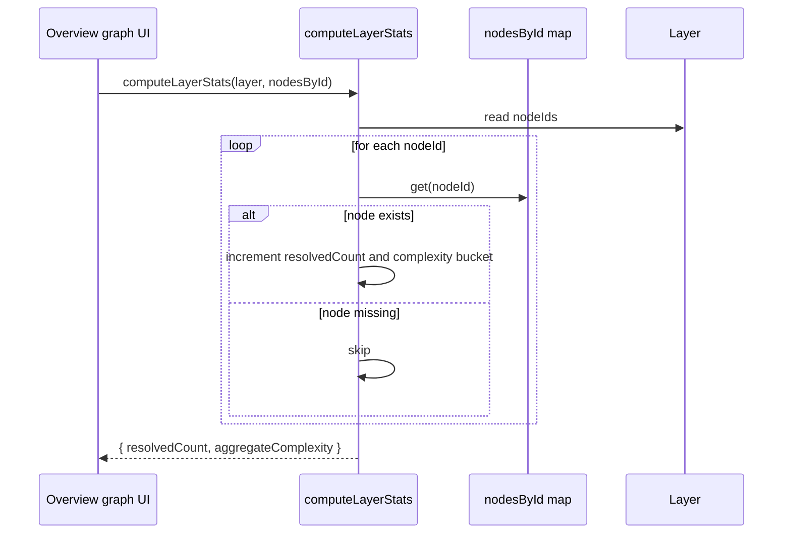
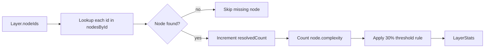
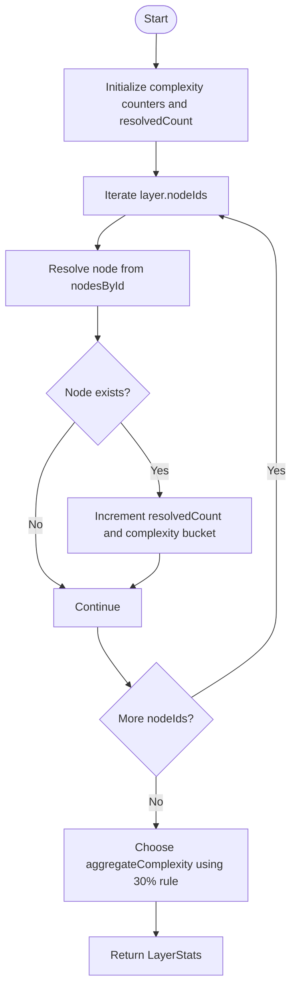

# layerStats

`layerStats` is a small dashboard utility that summarizes the composition of a graph layer for the overview UI. It converts a layer’s `nodeIds` into two pieces of metadata:

- how many of those IDs actually resolve to nodes in the current graph
- a single aggregate complexity label for the layer card

The module exists primarily to make layer rendering fast and predictable in large graphs. It replaces an earlier approach that repeatedly scanned the full node list for every layer.

## Purpose

When the dashboard renders an overview graph, each layer needs a compact summary so the UI can display a meaningful cluster card without traversing the entire graph repeatedly. `computeLayerStats` performs that summary in linear time relative to the number of nodes referenced by the layer.

This module is intentionally narrow in scope:

- it does not build layers
- it does not validate graph structure
- it does not aggregate edges
- it only computes layer-level statistics from already-built graph data

## Core types

### `Complexity`

```ts
export type Complexity = "simple" | "moderate" | "complex";
```

A local alias for the three complexity buckets used throughout the dashboard graph model.

### `LayerStats`

```ts
export interface LayerStats {
  resolvedCount: number;
  aggregateComplexity: Complexity;
}
```

Fields:

- `resolvedCount`: number of `layer.nodeIds` entries that matched a node in `nodesById`
- `aggregateComplexity`: the label used by the layer card to represent the layer’s overall complexity

## Main API

### `computeLayerStats(layer, nodesById)`

```ts
export function computeLayerStats(
  layer: Layer,
  nodesById: Map<string, GraphNode>,
): LayerStats
```

Computes a summary for a single layer.

#### Inputs

- `layer`: a `Layer` from the core graph model
- `nodesById`: a lookup map from node ID to `GraphNode`

#### Output

Returns a `LayerStats` object containing:

- `resolvedCount`
- `aggregateComplexity`

#### Algorithm

1. Initialize counters for `simple`, `moderate`, and `complex`
2. Iterate over `layer.nodeIds`
3. For each ID, look up the node in `nodesById`
4. Skip missing nodes
5. Count the node’s `complexity`
6. Compute the aggregate label using a 30% threshold rule

#### Aggregate complexity rule

The layer is labeled according to the first complexity bucket that exceeds 30% of the resolved nodes:

- if `complex` nodes are more than 30% of resolved nodes, label the layer `complex`
- otherwise, if `moderate` nodes are more than 30% of resolved nodes, label the layer `moderate`
- otherwise, label the layer `simple`

This preserves the prior cluster-card behavior referenced in the source comment.

## Architecture and relationships

`layerStats` sits in the dashboard utility layer and depends on the shared graph types from the core package.



### Dependency view



### Component interaction



## Data flow



## Process flow



## Performance characteristics

The implementation is optimized for dashboard rendering:

- **Time complexity:** `O(layer.nodeIds.length)`
- **Space complexity:** `O(1)` beyond the input map and layer data

This is a significant improvement over the previous pattern described in the source comment, which scanned all graph nodes for each layer and became expensive on large projects.

## Behavioral notes

### Missing node IDs

If a `layer.nodeIds` entry does not exist in `nodesById`, it is ignored. This means:

- `resolvedCount` may be smaller than `layer.nodeIds.length`
- aggregate complexity is based only on resolved nodes

### Threshold edge cases

The threshold uses a strict `>` comparison against `resolved * 0.3`.

Implications:

- exactly 30% does **not** qualify
- ties or evenly distributed complexity values fall through to `simple` unless `moderate` or `complex` exceeds the threshold

### Empty or unresolved layers

If no nodes resolve, all counts remain zero and the function returns:

- `resolvedCount: 0`
- `aggregateComplexity: "simple"`

## How this module fits into the system

`layerStats` is part of the dashboard’s layout and visualization pipeline. It consumes graph data produced elsewhere in the system and provides compact metadata for rendering layer clusters.

For the broader graph-building and layer-generation pipeline, see:

- [dashboard_graph_view.md](dashboard_graph_view.md)
- [dashboard_layout_utils.md](dashboard_layout_utils.md)
- [core_schema_and_types.md](core_schema_and_types.md)

For related dashboard utilities that operate on the same graph model, see:

- [containers.md](containers.md)
- [edgeAggregation.md](edgeAggregation.md)
- [layout.md](layout.md)

## Practical usage example

```ts
import { computeLayerStats } from "./layerStats";

const stats = computeLayerStats(layer, nodesById);

if (stats.aggregateComplexity === "complex") {
  // render a more prominent cluster card
}
```

## Summary

`layerStats` is a focused helper for deriving layer summary metadata efficiently. Its main value is performance: it avoids repeated full-graph scans while preserving the dashboard’s existing complexity labeling behavior.
