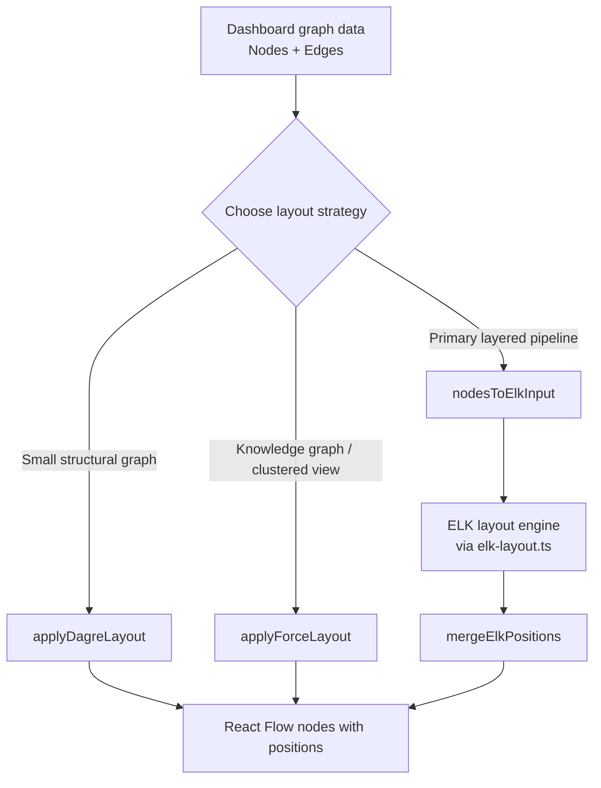
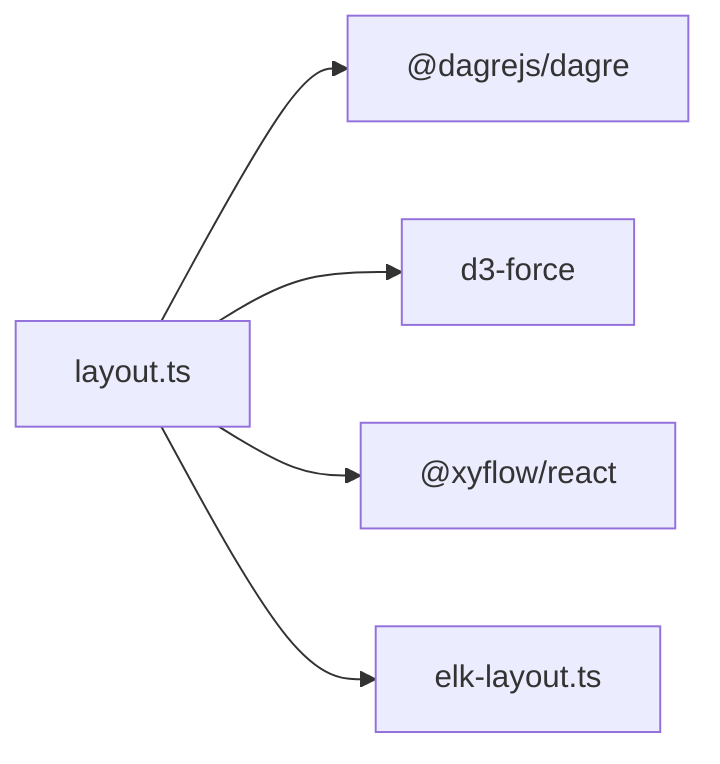
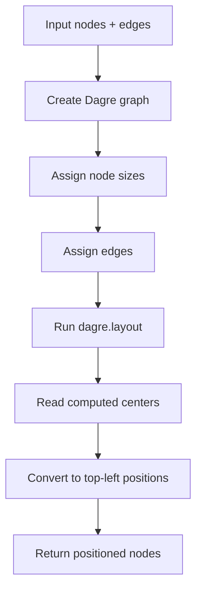
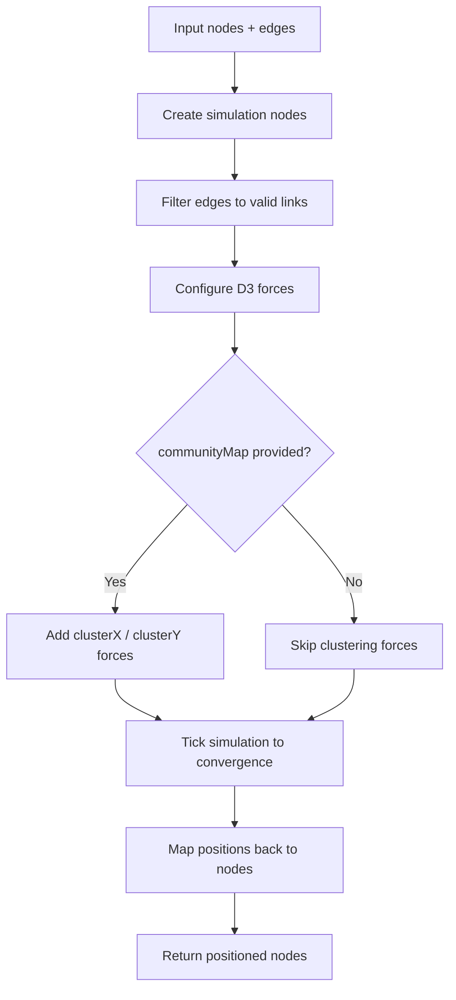
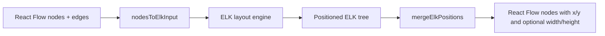
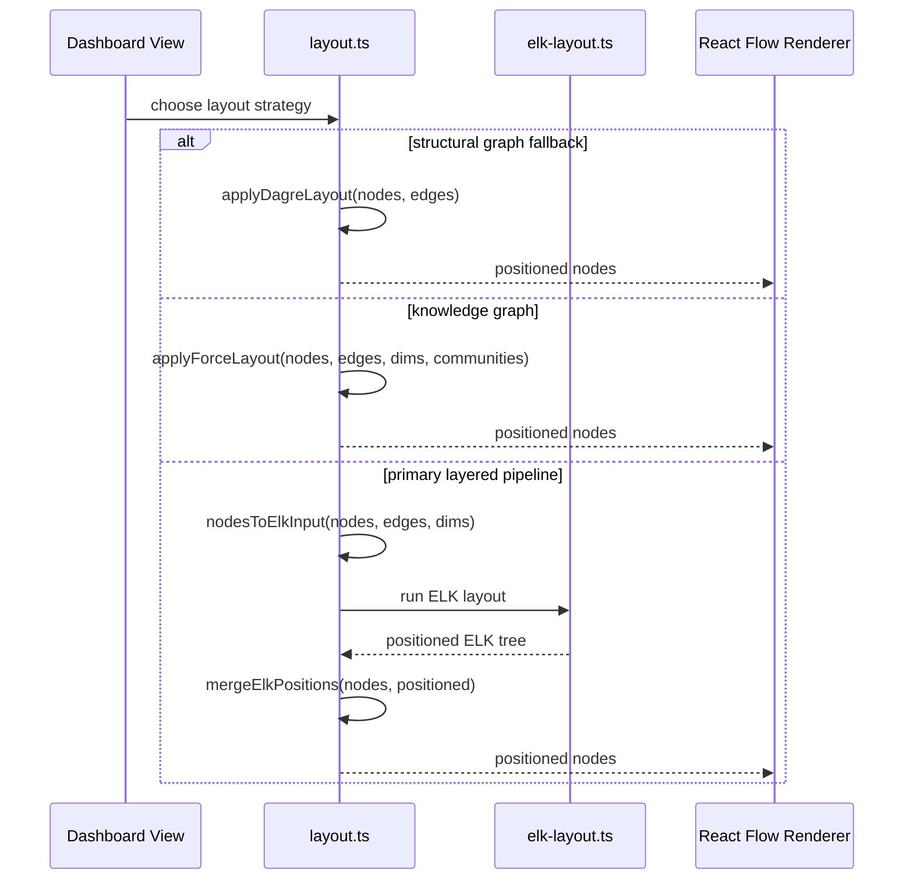

# Layout Module

The `layout` module provides the dashboard’s graph positioning utilities. It is responsible for turning abstract graph nodes and edges into screen coordinates that can be rendered by the dashboard’s React Flow-based views.

This module currently serves as a compatibility and utility layer around three layout strategies:

- **Dagre layout** for small or fallback structural graphs
- **Force-directed layout** for knowledge graphs and community-clustered views
- **ELK integration helpers** for the dashboard’s primary layered layout pipeline

For broader context, see also:
- [dashboard_graph_view.md](dashboard_graph_view.md)
- [dashboard_layout_utils.md](dashboard_layout_utils.md)
- [dashboard_state_and_ui.md](dashboard_state_and_ui.md)

---

## Purpose and Responsibilities

The module’s main job is to bridge graph data structures and layout engines:

1. Accept `Node[]` and `Edge[]` inputs from the dashboard graph model.
2. Apply a layout algorithm appropriate for the graph type and size.
3. Convert computed coordinates back into React Flow node positions.
4. Preserve node dimensions where needed so downstream layout stages can refine sizing.

It also defines shared sizing constants used by multiple layout paths.

---

## Core Exports

### Layout constants

- `NODE_WIDTH = 280`
- `NODE_HEIGHT = 120`
- `LAYER_CLUSTER_WIDTH = 320`
- `LAYER_CLUSTER_HEIGHT = 180`
- `PORTAL_NODE_WIDTH = 240`
- `PORTAL_NODE_HEIGHT = 80`

These values provide default dimensions when a node-specific size is not available.

### Layout functions

- `applyDagreLayout(...)`
- `applyForceLayout(...)`
- `nodesToElkInput(...)`
- `mergeElkPositions(...)`

### Internal type

- `ForceNode`

`ForceNode` extends D3’s `SimulationNodeDatum` with:
- `id: string`
- optional `community?: number`

---

## Architecture Overview

---

## Dependency Map

### External dependencies

- **`@dagrejs/dagre`**: synchronous layered graph layout for fallback/small graphs
- **`d3-force`**: force simulation for knowledge graph placement
- **`@xyflow/react`**: node and edge types used by the dashboard renderer
- **`./elk-layout`**: ELK input/output types and the downstream ELK layout pipeline

---

## Layout Strategies

### 1) Dagre layout

`applyDagreLayout` is a synchronous helper for small graphs and fallback scenarios.

#### Behavior

- Builds a Dagre graph from the provided nodes and edges
- Uses default node dimensions unless overridden by `nodeDimensions`
- Adjusts spacing based on graph size:
  - smaller graphs: tighter spacing
  - larger graphs: increased spacing to reduce overlap
- Runs Dagre layout synchronously
- Converts Dagre center coordinates into top-left React Flow positions

#### Important notes

- The function is marked **deprecated**.
- The dashboard’s structural views now use **ELK** as the primary layout engine.
- Dagre remains as a temporary fallback in case ELK regresses.

#### Process flow

#### Spacing rules

- `nodes.length > 50` triggers larger default spacing
- `spacingOverrides` can explicitly set:
  - `nodesep`
  - `ranksep`

---

### 2) Force-directed layout

`applyForceLayout` is used for knowledge graphs and other views where organic clustering is preferable to strict layering.

#### Behavior

- Creates simulation nodes with random initial positions
- Filters edges to only include links between known nodes
- Applies D3 forces:
  - `forceLink` for connectivity
  - `forceManyBody` for repulsion
  - `forceCenter` to keep the graph centered
  - `forceCollide` to prevent overlap
- Optionally adds community clustering forces when a `communityMap` is provided
- Runs the simulation synchronously for a bounded number of ticks
- Converts simulation coordinates back into React Flow positions

#### Community clustering

If a `communityMap` is supplied, nodes are grouped around evenly spaced points on a circle.
This is useful for visually separating layers, categories, or communities in knowledge graphs.

#### Process flow

#### Size-aware tuning

The force model adapts to graph size:

- Larger graphs use stronger repulsion and longer link distances
- Collision radius is derived from node dimensions when available
- Tick count is bounded between 100 and 300 to keep runtime predictable

---

### 3) ELK input and position merging

The module also provides helpers for the ELK-based layout pipeline.

#### `nodesToElkInput(...)`

Converts React Flow nodes and edges into an ELK-compatible tree structure.

Responsibilities:

- Creates a root ELK graph with default layout options
- Maps each node to an ELK child with width and height
- Maps each edge to ELK source/target arrays
- Allows layout option overrides

#### `mergeElkPositions(...)`

Merges ELK-computed coordinates back into the original node list.

Responsibilities:

- Builds a lookup table from ELK children
- Copies `x` and `y` positions into the corresponding nodes
- Preserves `width` and `height` when ELK returns them
- Leaves nodes unchanged when no ELK position exists

This helper is especially important for multi-stage layout flows where container nodes may need their visible size updated after a later layout pass.

#### ELK data flow

---

## Component Interaction

---

## Data Model Notes

### Node dimensions

Several functions accept a `Map<string, { width: number; height: number }>`.
This allows the layout engine to respect actual rendered sizes instead of relying only on defaults.

### Coordinate conventions

- Dagre and D3 produce center-based or simulation-based coordinates
- React Flow expects top-left positions
- The module converts between these conventions when returning nodes

### Edge handling

- Dagre uses source/target pairs directly
- D3 force layout filters out edges whose endpoints are not present in the node set
- ELK edges are converted to `sources[]` and `targets[]`

---

## When to Use Each Function

| Function | Best for | Notes |
|---|---|---|
| `applyDagreLayout` | Small structural graphs, temporary fallback | Deprecated; ELK is preferred |
| `applyForceLayout` | Knowledge graphs, community-based visualizations | Organic layout with clustering support |
| `nodesToElkInput` | Preparing data for ELK | Used by the primary dashboard layout pipeline |
| `mergeElkPositions` | Applying ELK results back to React Flow nodes | Preserves dimensions when available |

---

## Integration with the Dashboard

This module is typically consumed by dashboard graph views that need to render:

- domain graphs
- layered container graphs
- portal/navigation structures
- knowledge graph visualizations

It does not own graph construction, filtering, or semantic analysis. Those responsibilities live in other modules such as:

- [dashboard_graph_view.md](dashboard_graph_view.md)
- [dashboard_layout_utils.md](dashboard_layout_utils.md)
- [core_schema_and_types.md](core_schema_and_types.md)

---

## Operational Characteristics

### Synchronous execution

All exported layout helpers run synchronously from the caller’s perspective.
This makes them easy to use in UI code, but large graphs may still be computationally expensive.

### Deterministic vs. non-deterministic behavior

- `applyDagreLayout` is mostly deterministic for a fixed graph and spacing configuration
- `applyForceLayout` starts from random initial positions, so repeated runs may differ slightly
- ELK-based layouts are generally more stable than force layouts for structural views

### Performance considerations

- Dagre is suitable for smaller graphs and fallback usage
- Force layout is bounded by tick count to avoid runaway runtime
- ELK is the preferred engine for the dashboard’s structural layouts

---

## Maintenance Notes

- `applyDagreLayout` should be removed once the ELK migration is fully validated.
- If node sizing changes in the dashboard, update the constants here and verify downstream layout consumers.
- If new graph categories require clustering, extend `applyForceLayout` or the upstream community assignment logic.
- Keep `nodesToElkInput` aligned with the ELK schema expected by `elk-layout.ts`.

---

## Related Documentation

- [dashboard_graph_view.md](dashboard_graph_view.md)
- [dashboard_layout_utils.md](dashboard_layout_utils.md)
- [dashboard_state_and_ui.md](dashboard_state_and_ui.md)
- [core_schema_and_types.md](core_schema_and_types.md)
