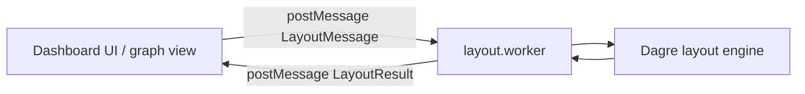
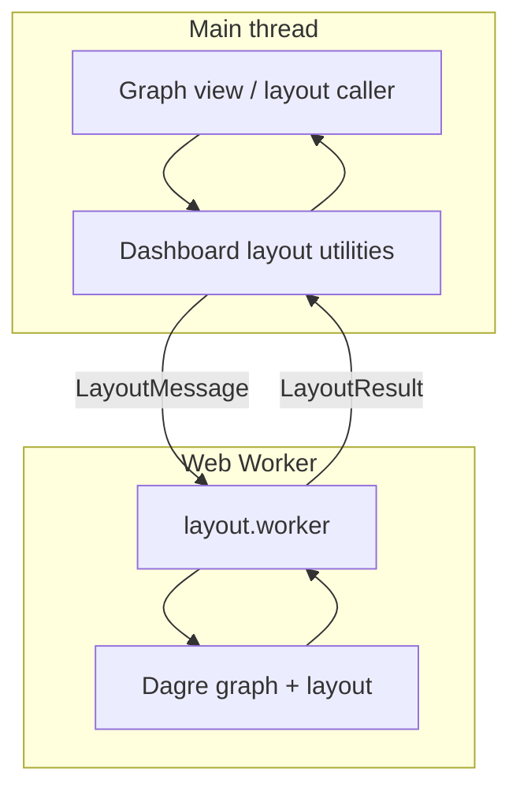
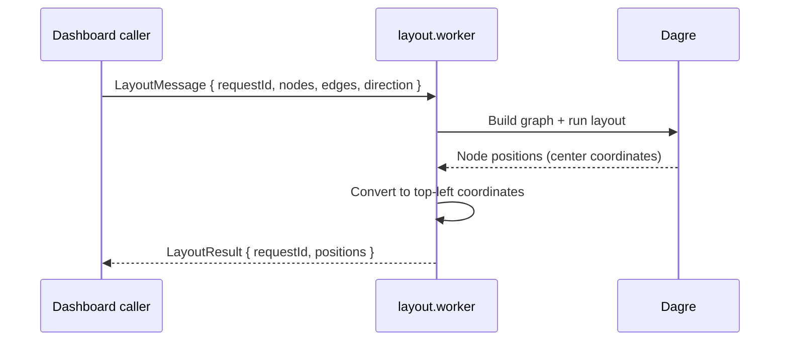
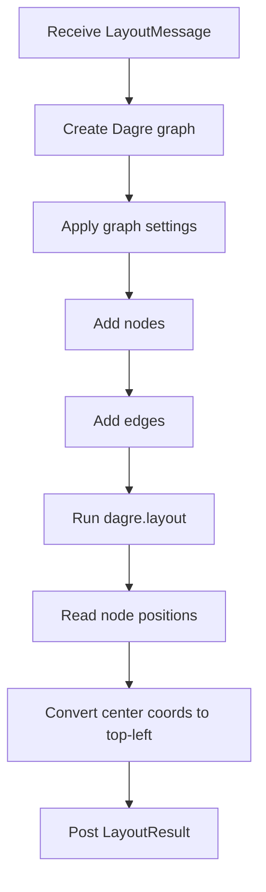
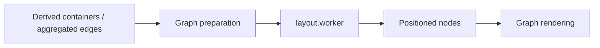

# layout.worker module

The `layout.worker` module is a small, focused Web Worker used by the dashboard to compute graph node positions off the main UI thread. It receives a batch of nodes and edges, runs Dagre layout, and returns absolute top-left coordinates for each node. This keeps graph rendering responsive while layout calculations are performed asynchronously.

For related dashboard layout utilities, see [dashboard_layout_utils](dashboard_layout_utils.md), especially [elk-layout](elk-layout.md) and [layout](layout.md).

## Purpose

This worker exists to:

- isolate layout computation from the main thread
- convert graph structure into positioned nodes for rendering
- support directional layouts (`TB` and `LR`)
- provide request/response correlation via `requestId`

It is intentionally minimal: it does not validate graph correctness, aggregate edges, or derive containers. Those responsibilities live in other dashboard utilities such as [elk-layout](elk-layout.md), [containers](containers.md), and [edgeAggregation](edgeAggregation.md).

## Core API

### `LayoutMessage`

Message payload sent to the worker.

```ts
export interface LayoutMessage {
  requestId: number;
  nodes: Array<{ id: string; width: number; height: number }>;
  edges: Array<{ source: string; target: string }>;
  direction: "TB" | "LR";
}
```

#### Fields

- `requestId`: Correlates the response with the originating layout request.
- `nodes`: Node geometry input used by Dagre.
  - `id`: Unique node identifier.
  - `width`, `height`: Node dimensions used to compute layout.
- `edges`: Directed edges between nodes.
  - `source`: Source node id.
  - `target`: Target node id.
- `direction`: Layout direction.
  - `TB`: top-to-bottom
  - `LR`: left-to-right

### `LayoutResult`

Message payload returned by the worker.

```ts
export interface LayoutResult {
  requestId: number;
  positions: Record<string, { x: number; y: number }>;
}
```

#### Fields

- `requestId`: Echoed from the request.
- `positions`: Map of node id to top-left coordinates.

## Runtime behavior

The worker listens for `message` events and performs the following steps:

1. Read `requestId`, `nodes`, `edges`, and `direction` from the incoming message.
2. Create a Dagre graph.
3. Configure graph spacing and direction.
4. Add all nodes with their dimensions.
5. Add all directed edges.
6. Run Dagre layout.
7. Convert Dagre center-based coordinates into top-left coordinates.
8. Post the result back to the caller.

## Architecture



### Component responsibilities



## Data flow



## Layout algorithm details

### Graph configuration

The worker configures Dagre with fixed spacing values:

- `nodesep: 60`
- `ranksep: 80`
- `marginx: 20`
- `marginy: 20`

The `rankdir` is set from `direction`:

- `TB` for vertical flow
- `LR` for horizontal flow

### Coordinate conversion

Dagre returns node positions as centers. The worker converts them to top-left coordinates for easier rendering in the dashboard:

```ts
positions[node.id] = pos
  ? { x: pos.x - node.width / 2, y: pos.y - node.height / 2 }
  : { x: 0, y: 0 };
```

This means downstream renderers can place nodes directly using the returned `x` and `y` values.

## Process flow



## Dependencies

### External dependency

- `@dagrejs/dagre`: Graph layout engine used to compute node positions.

### Internal module relationships

This worker is part of the dashboard layout pipeline and is typically consumed by utilities in [dashboard_layout_utils](dashboard_layout_utils.md).

Relevant neighboring modules:

- [layout](layout.md): shared layout-related types and helpers, including `ForceNode`
- [elk-layout](elk-layout.md): higher-level ELK-based layout and repair utilities
- [containers](containers.md): derives container structures used before layout
- [edgeAggregation](edgeAggregation.md): aggregates edges for container/layer-aware graph building
- [layerStats](layerStats.md): computes layer metrics that may influence layout decisions

## Relationship to the broader dashboard graph pipeline



In practice, the worker is the final positioning step after the graph has already been normalized into a renderable structure.

## Error handling and edge cases

The worker has intentionally lightweight behavior:

- If a node cannot be found in Dagre after layout, it falls back to `{ x: 0, y: 0 }`.
- It does not validate whether edges reference missing nodes.
- It does not report layout issues separately from the position map.
- It assumes the caller provides valid dimensions for each node.

Because of this, callers should ensure graph preparation is complete before sending a message.

## Implementation notes

- The worker uses `self.onmessage`, so it is designed to run in a worker context rather than in the main browser thread.
- `requestId` is essential when multiple layout requests may be in flight.
- The response uses `satisfies LayoutResult` to ensure the posted object matches the expected shape.

## When to use this module

Use `layout.worker` when you need:

- fast, asynchronous graph layout
- simple Dagre-based positioning
- a worker-friendly API for dashboard graph rendering

Prefer higher-level utilities such as [elk-layout](elk-layout.md) when you need:

- layout repair or validation
- richer graph issue reporting
- ELK-specific hierarchical layout behavior

## Summary

`layout.worker` is the dashboard’s lightweight Dagre layout executor. It accepts a graph description, computes positions off-thread, and returns coordinates keyed by node id. Its simplicity makes it a reliable final step in the dashboard graph rendering pipeline.
