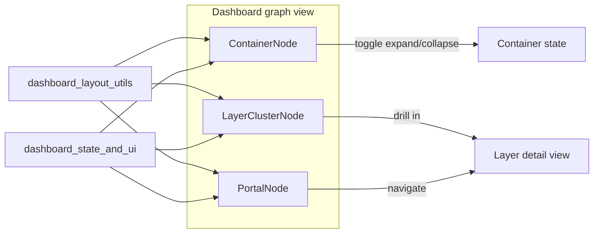
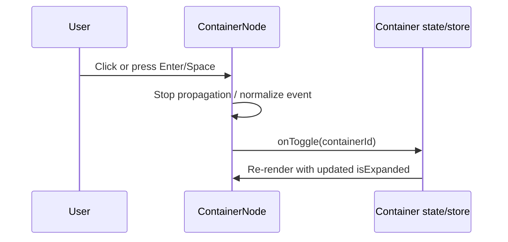
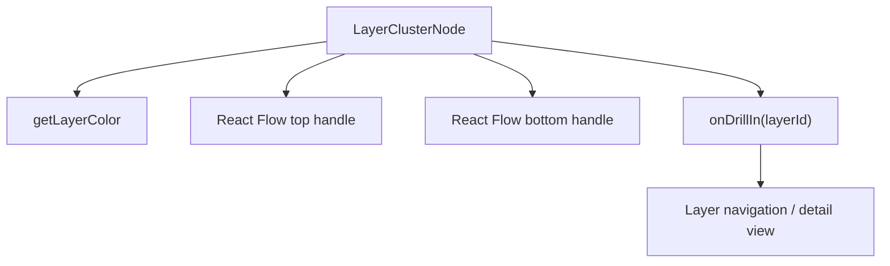
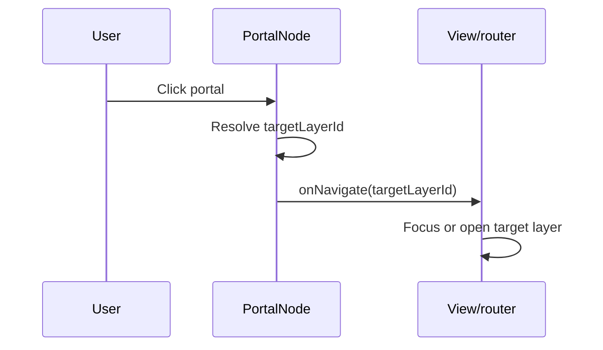
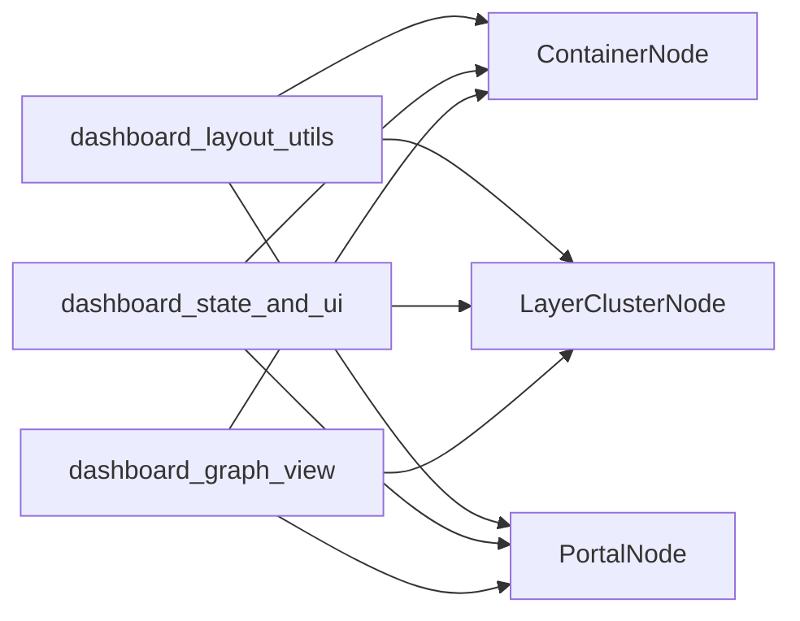
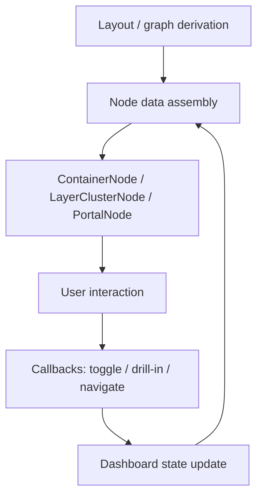

# layout_and_navigation_nodes

This module contains the dashboard graph nodes responsible for **layout, grouping, and navigation affordances** in the visual graph. These nodes do not represent raw code entities themselves; instead, they provide higher-level interaction surfaces that help users expand/collapse containers, drill into layers, and jump across layer boundaries.

Related documentation:
- [dashboard_graph_view](dashboard_graph_view.md) — overall graph composition and node usage
- [dashboard_layout_utils](dashboard_layout_utils.md) — layout computation and container derivation
- [dashboard_state_and_ui](dashboard_state_and_ui.md) — shared UI state, filters, and interaction context

## Purpose

The module defines three React Flow node types:

- **ContainerNode** — a collapsible grouping node for folders or communities
- **LayerClusterNode** — a summary node for a layer cluster with metadata and drill-in behavior
- **PortalNode** — a navigation node that represents cross-layer connections and jump targets

Together, these nodes provide the structural scaffolding for the dashboard graph:

- grouping many graph elements into navigable containers
- summarizing layers into compact, clickable cards
- exposing portal-like edges between layers for fast traversal

## Component overview

## Architecture

### 1) ContainerNode

`ContainerNode` renders a clickable container frame that can be expanded or collapsed. It is used for hierarchical grouping, typically around folders or derived communities.

#### Data contract

`ContainerNodeData` includes:

- `containerId` — stable identifier for the container
- `name` — display name, with `~` treated as the root marker
- `childCount` — number of contained items
- `strategy` — grouping strategy (`folder` or `community`)
- `colorIndex` — index used to derive layer color styling
- `isExpanded` — whether the container is currently expanded
- `hasSearchHits` / `searchHitCount` — search highlighting metadata
- `isDiffAffected` — indicates the container is affected by a diff/change set
- `isFocusedViaChild` — highlights containers that contain the current focus
- `onToggle(containerId)` — callback invoked when the node is activated

#### Behavior

- Uses `getLayerColor(colorIndex)` for label styling.
- Adjusts border color and width based on expansion, focus, and diff state.
- Supports mouse and keyboard activation (`Enter` / `Space`).
- Stops event propagation before toggling so graph-level handlers do not interfere.
- Displays search hit badges when relevant.

#### Interaction flow

### 2) LayerClusterNode

`LayerClusterNode` renders a compact summary card for a layer. It is designed for overview navigation rather than detailed inspection.

#### Data contract

`LayerClusterData` includes:

- `layerId` — identifier used for drill-in navigation
- `layerName` — display name
- `layerDescription` — short descriptive summary
- `fileCount` — number of files in the layer
- `aggregateComplexity` — complexity label (`simple`, `moderate`, `complex`)
- `layerColorIndex` — color palette index
- `searchMatchCount` — optional search result count
- `onDrillIn(layerId)` — callback for opening the layer

#### Behavior

- Renders a left accent bar using the layer color.
- Uses React Flow handles at the top and bottom to participate in graph routing.
- Shows complexity and search-match badges.
- Invokes `onDrillIn(layerId)` when clicked.
- Presents a hover hint to indicate navigability.

#### Component interaction

### 3) PortalNode

`PortalNode` represents a navigational portal to another layer. It is visually distinct from `LayerClusterNode` and is intended to communicate cross-layer connectivity.

#### Data contract

`PortalNodeData` includes:

- `targetLayerId` — destination layer identifier
- `targetLayerName` — destination display name
- `connectionCount` — number of connections represented by the portal
- `layerColorIndex` — color palette index
- `onNavigate(layerId)` — callback for navigation

#### Behavior

- Uses a dashed border to distinguish portal semantics from regular clusters.
- Displays a compact destination label and connection count.
- Uses top and bottom React Flow handles to connect into the graph.
- Invokes `onNavigate(targetLayerId)` when clicked.

#### Navigation flow

## Dependencies and relationships

### Internal dependencies

All three nodes depend on shared dashboard styling and color utilities:

- `getLayerColor` from `LayerLegend` for consistent layer-based color mapping
- `@xyflow/react` for node typing, handles, and positioning
- React `memo` to reduce unnecessary re-renders

### External system dependencies

These nodes are typically driven by data prepared elsewhere in the dashboard pipeline:

- **Layout derivation** from [dashboard_layout_utils](dashboard_layout_utils.md)
- **Graph composition** from [dashboard_graph_view](dashboard_graph_view.md)
- **UI state and filters** from [dashboard_state_and_ui](dashboard_state_and_ui.md)

## Data flow

The module is primarily presentational, but it participates in a broader data flow:

1. Layout and graph utilities compute node placement and grouping.
2. The dashboard graph view maps those results into React Flow nodes.
3. Each node receives a typed `data` payload with callbacks and display metadata.
4. User interaction triggers callbacks that update dashboard state or navigate to another graph scope.
5. The graph re-renders with updated expansion, focus, search, or diff state.

## Design notes

- **Accessibility**: `ContainerNode` includes keyboard activation and ARIA state (`aria-expanded`, `aria-label`).
- **Visual hierarchy**: each node uses distinct framing to communicate intent:
  - container = expandable frame
  - layer cluster = summary card
  - portal = dashed navigation card
- **Performance**: all components are memoized to avoid unnecessary rerenders in large graphs.
- **Consistency**: color selection is centralized through `getLayerColor` so nodes remain visually aligned with the rest of the dashboard.

## How this module fits into the system

This module sits at the boundary between **graph data** and **interactive visualization**. It does not compute graph structure itself; instead, it renders the structural concepts produced by the layout pipeline and exposes user actions back to the dashboard state layer.

In practice:

- layout utilities decide *where* nodes appear
- graph view decides *which* nodes appear
- this module decides *how those nodes behave and look*

## See also

- [dashboard_graph_view](dashboard_graph_view.md)
- [dashboard_layout_utils](dashboard_layout_utils.md)
- [dashboard_state_and_ui](dashboard_state_and_ui.md)
