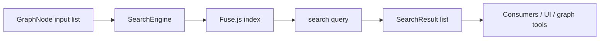
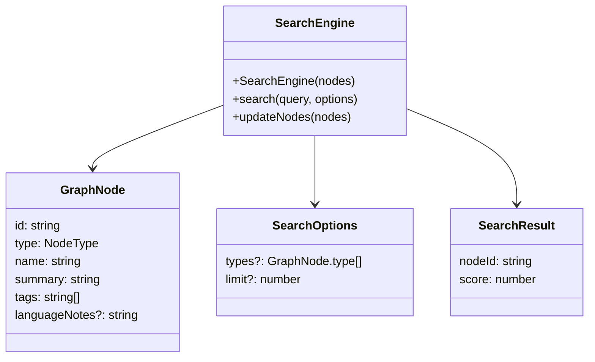
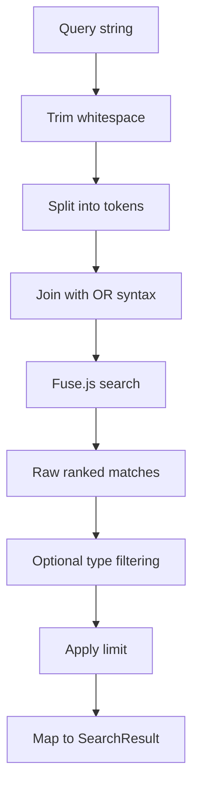
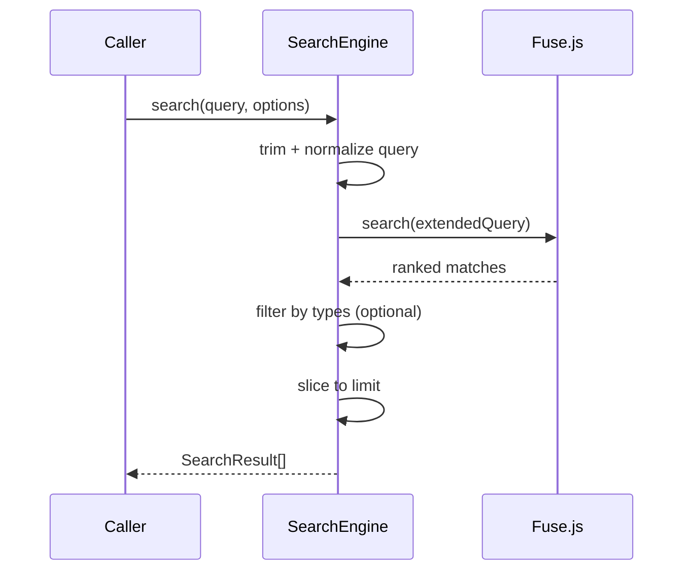
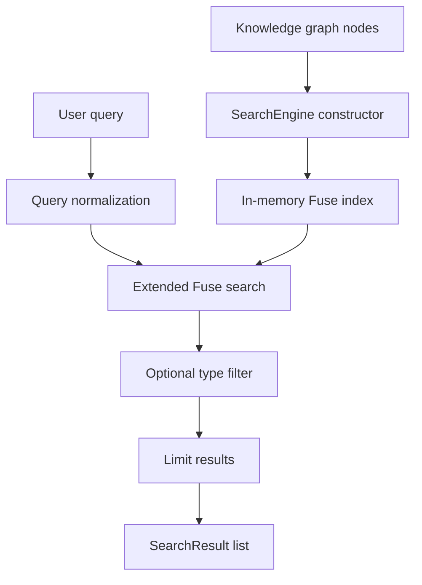
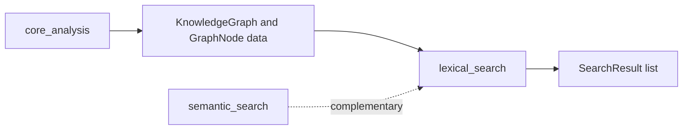

# lexical_search

The `lexical_search` module provides fast, fuzzy, text-based lookup over the project knowledge graph. It is the primary search layer for finding graph nodes by name, tags, summaries, and language notes, with optional filtering by node type and result limiting.

This module is intentionally lightweight: it wraps [`fuse.js`](https://fusejs.io/) around the core graph node model and exposes a small API for constructing, querying, and refreshing the search index.

## Purpose

`lexical_search` is used when the system needs **keyword-oriented retrieval** rather than semantic embedding search. Typical use cases include:

- locating nodes by partial names or abbreviations
- searching across tags and summaries
- narrowing results to specific node types
- refreshing search results after the graph changes

For semantic retrieval, see [semantic_search.md](semantic_search.md). For the graph data model used by search, see [core_schema_and_types.md](core_schema_and_types.md).

---

## Public API

### `SearchResult`

Represents a single search hit.

```ts
interface SearchResult {
  nodeId: string;
  score: number; // 0 = perfect match, 1 = worst match
}
```

#### Fields

- `nodeId`: the matched graph node identifier
- `score`: Fuse score normalized to the module’s result format

Lower scores indicate better matches.

### `SearchOptions`

Controls query execution.

```ts
interface SearchOptions {
  types?: GraphNode["type"][];
  limit?: number;
}
```

#### Fields

- `types`: optional allow-list of node types to include in the final results
- `limit`: maximum number of results to return; defaults to `50`

### `SearchEngine`

The main search service.

```ts
class SearchEngine {
  constructor(nodes: GraphNode[])
  search(query: string, options?: SearchOptions): SearchResult[]
  updateNodes(nodes: GraphNode[]): void
}
```

---

## Architecture

`SearchEngine` maintains an in-memory Fuse index over `GraphNode` records. The engine is rebuilt whenever the node set changes.



### Component relationships



---

## Search behavior

### Indexed fields

The engine searches across these `GraphNode` fields:

- `name` with the highest weight
- `tags`
- `summary`
- `languageNotes`



### Fuse configuration

The module uses the following Fuse settings:

- `keys`
  - `name` weight `0.4`
  - `tags` weight `0.3`
  - `summary` weight `0.2`
  - `languageNotes` weight `0.1`
- `threshold: 0.4`
- `includeScore: true`
- `ignoreLocation: true`
- `useExtendedSearch: true`

These settings favor name matches while still allowing broader discovery through tags and descriptive text.

### Extended query handling

Before searching, the query is normalized as follows:

1. leading/trailing whitespace is removed
2. the query is split on whitespace
3. tokens are joined using `|` to create an OR-style extended search expression

Example:

- input: `auth contrl`
- transformed query: `auth | contrl`

This makes the search more forgiving for partial or misspelled terms.

---

## Filtering and ranking

After Fuse returns raw matches, `SearchEngine` applies optional filtering:

- if `options.types` is provided, only nodes whose `type` is in the allow-list are kept
- results are truncated to `options.limit` or `50` by default

The final output preserves Fuse ranking order.



---

## Updating the index

`updateNodes(nodes)` replaces the current node set and rebuilds the Fuse index.


This is the mechanism used when the underlying graph changes and the search index must stay in sync.

---

## Data flow



---

## Integration with the wider system

`lexical_search` sits in the core search layer and is typically used alongside graph-building and analysis modules:

- graph construction and metadata enrichment come from [core_analysis.md](core_analysis.md)
- graph node definitions come from [core_schema_and_types.md](core_schema_and_types.md)
- semantic retrieval is handled by [semantic_search.md](semantic_search.md)

In practice, the search engine consumes the graph produced by analysis pipelines and exposes a fast lookup path for UI and tooling.



---

## Implementation notes

- The engine is **in-memory** and optimized for interactive use.
- Search is **fuzzy**, not exact.
- The module does not mutate graph nodes; it only indexes and queries them.
- `score` is passed through from Fuse and should be interpreted as a relative ranking signal.

---

## When to use this module

Use `lexical_search` when you need:

- fast keyword lookup
- partial matching on names or tags
- simple filtering by node type
- deterministic, lightweight search behavior

Prefer semantic search when the query is conceptual or natural-language oriented.

---

## Related documentation

- [core_schema_and_types.md](core_schema_and_types.md)
- [core_analysis.md](core_analysis.md)
- [semantic_search.md](semantic_search.md)
