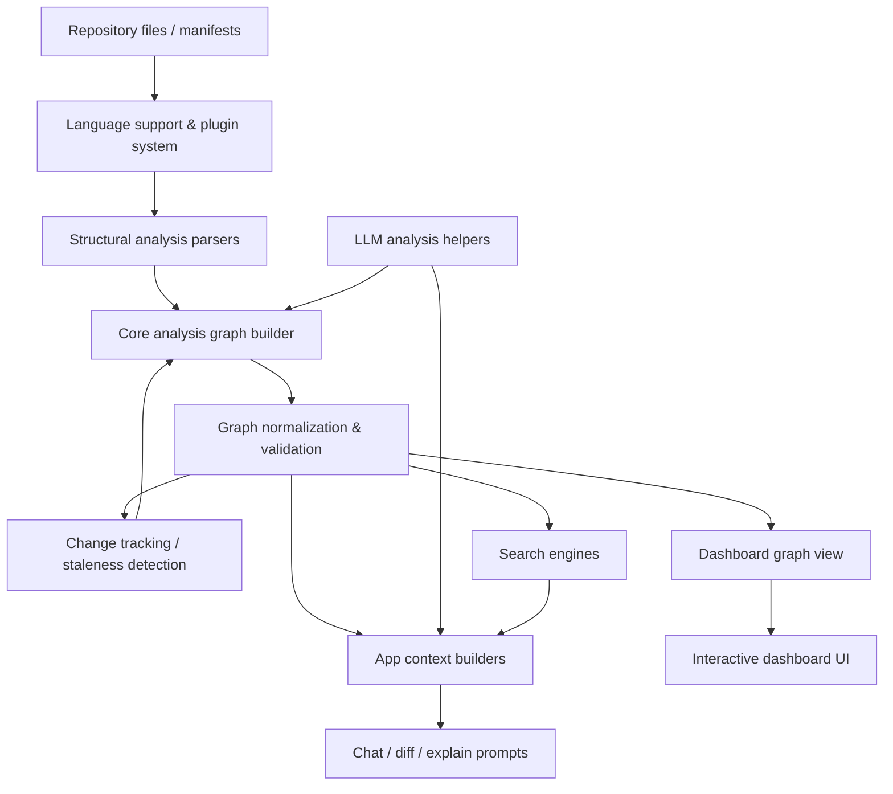
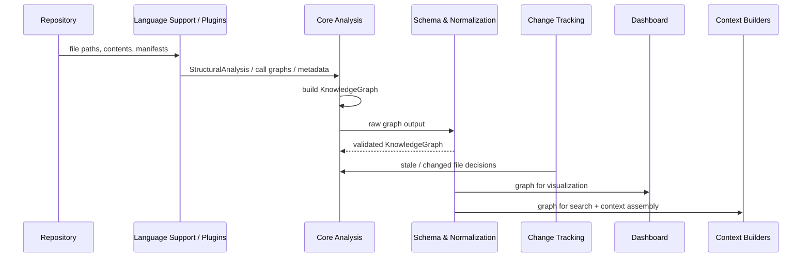
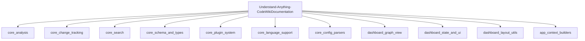

# Understand-Anything-CodeWikiDocumentation

## Purpose

`Understand-Anything-CodeWikiDocumentation` documents the architecture and core modules of the **Understand Anything** plugin ecosystem. The repository focuses on how source code and configuration files are analyzed into a shared knowledge graph, normalized, searched, visualized, and transformed into LLM-friendly application contexts.

At a high level, the system:

- parses source and non-code files into structural analysis data
- builds and normalizes a canonical `KnowledgeGraph`
- detects changes and decides what needs re-analysis
- supports lexical and semantic search over graph nodes
- renders graph views in the dashboard
- assembles chat, diff, and explain contexts for downstream LLM workflows

---

## End-to-End Architecture

### Pipeline summary

---

## Core Modules Documentation

### 1) `core_schema_and_types`
Defines the canonical graph schema, runtime validation, and shared TypeScript types used across the system.

- Purpose: contract layer for graph data, validation, and shared interfaces
- Key concepts: `KnowledgeGraph`, `GraphNode`, `GraphEdge`, `Layer`, `TourStep`, `ValidationResult`

Docs:
- [core_schema_and_types.md](core_schema_and_types.md)

---

### 2) `core_plugin_system`
Provides plugin discovery, registry, and tree-sitter-based structural analysis for source files.

- Purpose: route files to the correct analyzer plugin
- Key concepts: `PluginRegistry`, `TreeSitterPlugin`, `PluginConfig`
- Role: bridge between language configuration and structural extraction

Docs:
- [core_plugin_system.md](core_plugin_system.md)

---

### 3) `core_language_support`
Handles language and framework resolution plus language-specific AST extraction.

- Purpose: map files/manifests to language and framework metadata
- Key concepts: `LanguageRegistry`, `FrameworkRegistry`, `LanguageExtractor`
- Role: supplies normalized structural inputs to analysis and graph building

Docs:
- [core_language_support.md](core_language_support.md)

---

### 4) `core_config_parsers`
Contains lightweight parsers for configuration, infrastructure, and schema/API files.

- Purpose: extract structural signals from non-code files
- Key concepts: `JSONConfigParser`, `YAMLConfigParser`, `TerraformParser`, `MarkdownParser`, `SQLParser`
- Role: feed structural metadata into graph construction and documentation flows

Docs:
- [core_config_parsers.md](core_config_parsers.md)

---

### 5) `core_analysis`
The analytical backbone of the repository: builds the knowledge graph and enriches it with LLM-assisted analysis, normalization, layer detection, and language lessons.

- Purpose: transform repository content into a structured, canonical knowledge graph
- Key concepts:
  - `GraphBuilder`
  - `LLMFileAnalysis`, `LLMProjectSummary`
  - `normalizeBatchOutput`, `NormalizationStats`
  - `LLMLayerResponse`
  - `LanguageLessonResult`

Docs:
- [core_analysis.md](core_analysis.md)

---

### 6) `core_change_tracking`
Detects repository changes, computes fingerprints, classifies updates, and merges graph updates.

- Purpose: minimize unnecessary re-analysis while staying conservative when structure changes
- Key concepts:
  - `FingerprintStore`
  - `FileFingerprint`, `FunctionFingerprint`, `ClassFingerprint`
  - `ChangeAnalysis`
  - `UpdateDecision`
  - `StalenessResult`

Docs:
- [core_change_tracking.md](core_change_tracking.md)

---

### 7) `core_search`
Provides lexical and semantic search over graph nodes.

- Purpose: retrieve relevant graph entities by text or embedding similarity
- Key concepts:
  - `SearchEngine`
  - `SemanticSearchEngine`
  - `SearchResult`
  - `SearchOptions`, `SemanticSearchOptions`

Docs:
- [core_search.md](core_search.md)

---

### 8) `dashboard_graph_view`
Renders the knowledge graph in the dashboard using React Flow and layout utilities.

- Purpose: visualize domains, flows, steps, containers, and clusters
- Key concepts:
  - `DomainGraphView`
  - `CustomNode`, `ContainerNode`, `LayerClusterNode`, `PortalNode`, `FlowNode`, `StepNode`
- Role: presentation layer over the shared graph model

Docs:
- [dashboard_graph_view.md](dashboard_graph_view.md)

---

### 9) `dashboard_state_and_ui`
Provides dashboard state management, theming, localization, and keyboard shortcut support.

- Purpose: coordinate interactive UI state with graph/search data
- Key concepts:
  - `DashboardStore`
  - `ThemeContextValue`
  - `I18nContextValue`
  - `KeyboardShortcut`
- Role: shared runtime UI services for the dashboard

Docs:
- [dashboard_state_and_ui.md](dashboard_state_and_ui.md)

---

### 10) `dashboard_layout_utils`
Contains graph layout, container derivation, edge aggregation, and ELK layout helpers.

- Purpose: prepare graph data for visual presentation
- Key concepts:
  - `DerivedContainer`, `DeriveResult`
  - `AggregatedContainerEdge`, `LayerEdgeAggregation`
  - `ElkInput`, `ElkLayoutResult`
  - `LayerStats`
- Role: layout and aggregation boundary between core graph data and UI rendering

Docs:
- [dashboard_layout_utils.md](dashboard_layout_utils.md)

---

### 11) `app_context_builders`
Builds structured, LLM-friendly contexts for chat, diff analysis, and explain workflows.

- Purpose: convert a `KnowledgeGraph` into task-specific prompt contexts
- Key concepts:
  - `ChatContext`
  - `DiffContext`
  - `ExplainContext`
- Role: downstream orchestration layer for prompt generation and UI output

Docs:
- [app_context_builders.md](app_context_builders.md)

---

## Repository Structure

### Core module paths

- `understand-anything-plugin/packages/core/src/analyzer`
- `understand-anything-plugin/packages/core/src`
- `understand-anything-plugin/packages/core/src/plugins`
- `understand-anything-plugin/packages/core/src/languages`
- `understand-anything-plugin/packages/core/src/plugins/parsers`
- `understand-anything-plugin/packages/dashboard/src/components`
- `understand-anything-plugin/packages/dashboard/src`
- `understand-anything-plugin/packages/dashboard/src/utils`
- `understand-anything-plugin/src`

---

## Core Module Documentation References

- [core_analysis.md](core_analysis.md)
- [core_change_tracking.md](core_change_tracking.md)
- [core_search.md](core_search.md)
- [core_schema_and_types.md](core_schema_and_types.md)
- [core_plugin_system.md](core_plugin_system.md)
- [core_language_support.md](core_language_support.md)
- [core_config_parsers.md](core_config_parsers.md)
- [dashboard_graph_view.md](dashboard_graph_view.md)
- [dashboard_state_and_ui.md](dashboard_state_and_ui.md)
- [dashboard_layout_utils.md](dashboard_layout_utils.md)
- [app_context_builders.md](app_context_builders.md)