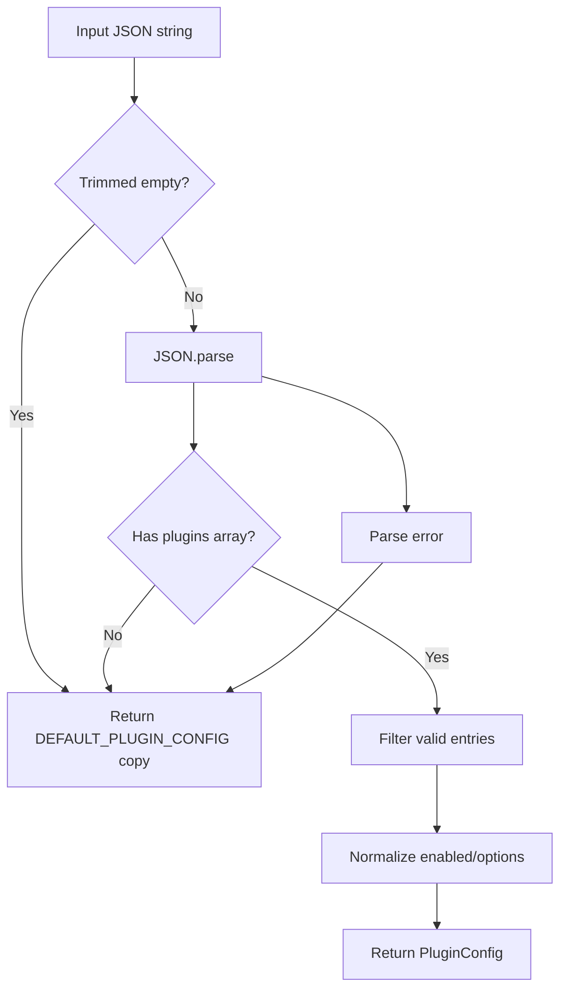
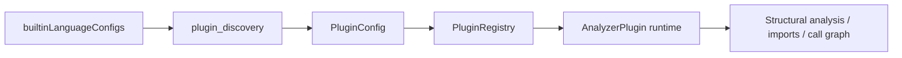
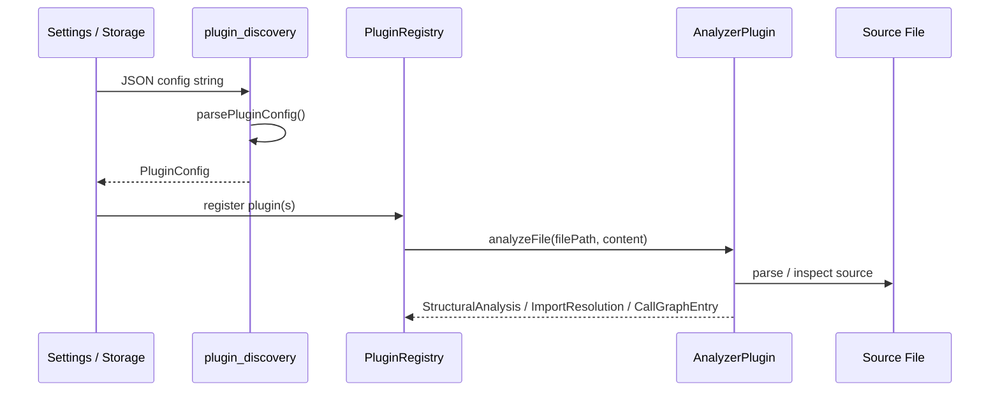
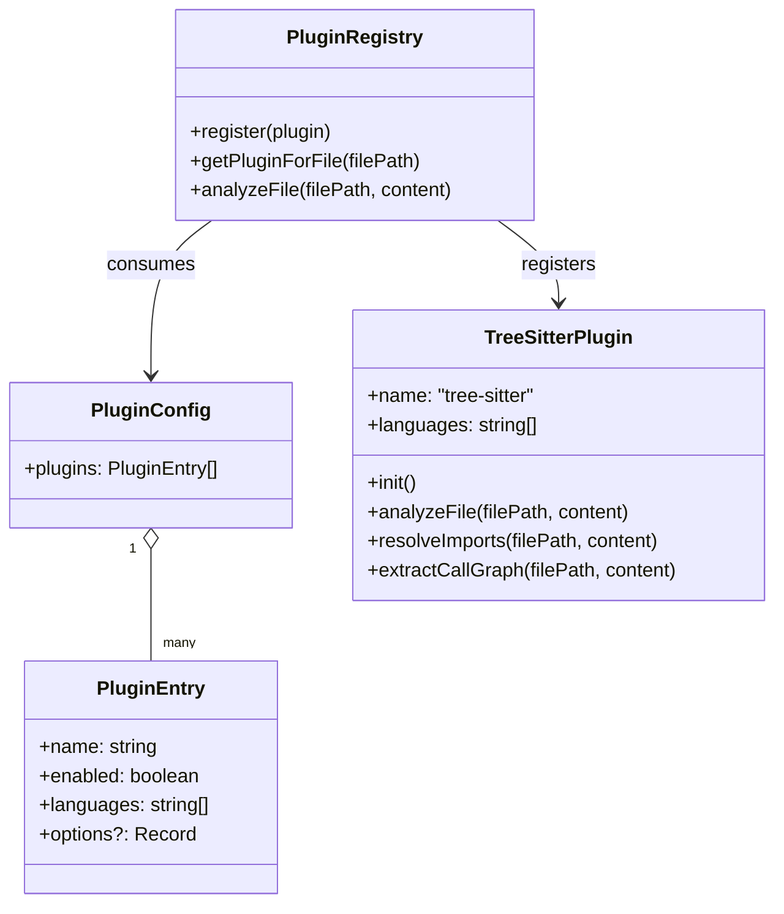

# Plugin Discovery

The `plugin_discovery` module defines how analyzer plugins are described, configured, and serialized for the core analysis pipeline. It is the entry point for turning a JSON plugin configuration into a runtime `PluginConfig`, with a built-in default that enables the Tree-sitter-based structural analyzer for all supported languages.

This module is intentionally small, but it sits at an important boundary: it connects persisted configuration, language support, and the plugin registry used by the rest of the core system.

## Purpose

`plugin_discovery` provides:

- A typed shape for plugin entries and plugin configuration
- A default plugin configuration for the built-in Tree-sitter plugin
- Safe parsing of user-provided JSON into a usable config
- Serialization back to JSON for storage or transport

## Core Types

### `PluginEntry`

Represents one plugin declaration.

| Field | Type | Meaning |
|---|---|---|
| `name` | `string` | Plugin identifier, such as `tree-sitter` |
| `enabled` | `boolean` | Whether the plugin should be active |
| `languages` | `string[]` | Language IDs handled by the plugin |
| `options?` | `Record<string, unknown>` | Optional plugin-specific settings |

### `PluginConfig`

Container for all plugin entries.

```ts
interface PluginConfig {
  plugins: PluginEntry[];
}
```

## Default Configuration

`DEFAULT_PLUGIN_CONFIG` enables the built-in `tree-sitter` plugin and assigns it all languages from the built-in language catalog that have Tree-sitter support.

```ts
export const DEFAULT_PLUGIN_CONFIG: PluginConfig = {
  plugins: [
    {
      name: "tree-sitter",
      enabled: true,
      languages: builtinLanguageConfigs
        .filter((c) => c.treeSitter)
        .map((c) => c.id),
    },
  ],
};
```

### Why this matters

- It gives the system a working structural-analysis plugin out of the box.
- It keeps plugin discovery aligned with the language registry.
- It avoids requiring users to manually enumerate supported languages.

## Parsing and Serialization

### `parsePluginConfig(jsonString: string): PluginConfig`

Parses a JSON string into a `PluginConfig`.

Behavior:

1. Empty or whitespace-only input returns a copy of `DEFAULT_PLUGIN_CONFIG`
2. Invalid JSON returns a copy of `DEFAULT_PLUGIN_CONFIG`
3. JSON without a `plugins` array returns a copy of `DEFAULT_PLUGIN_CONFIG`
4. Each plugin entry is validated loosely:
   - `name` must be a non-empty string
   - `languages` must be a non-empty array
   - `enabled` defaults to `true` if omitted or invalid
   - `options` is preserved if present

### `serializePluginConfig(config: PluginConfig): string`

Serializes a `PluginConfig` to pretty-printed JSON.

This is used when saving configuration back to disk or sending it across boundaries.

## Validation and Fallback Strategy

The parser is intentionally forgiving. Instead of throwing on malformed input, it falls back to the default configuration.



### Design implications

- Prevents configuration errors from breaking analysis startup
- Ensures the system always has at least one usable plugin configuration
- Makes plugin config suitable for user-editable settings files

## Architecture and Relationships

`plugin_discovery` depends on the language catalog to build its default plugin list. The resulting config is typically consumed by the plugin registry and the Tree-sitter plugin.



### Related modules

- [plugin_registry](plugin_registry.md) — registers plugins and routes analysis requests to the correct plugin
- [tree_sitter_plugin](tree_sitter_plugin.md) — built-in plugin enabled by the default config
- [core_language_support](core_language_support.md) — language catalog used to derive supported Tree-sitter languages
- [core_schema_and_types](core_schema_and_types.md) — shared analysis and plugin types used by the registry and plugins

## Runtime Data Flow

The typical flow is:

1. Load plugin config JSON from disk, environment, or UI
2. Parse it with `parsePluginConfig`
3. Register the configured plugins in the `PluginRegistry`
4. Use the registry to resolve the correct plugin for a file
5. Run structural analysis, import resolution, or call-graph extraction



## Component Interaction

### With `PluginRegistry`

`PluginRegistry` stores active plugins and maps file languages to the correct plugin. `plugin_discovery` does not execute plugins itself; it only defines the configuration that determines which plugins are available.

### With `TreeSitterPlugin`

The default config enables `tree-sitter`, which is the core structural-analysis plugin. The plugin itself loads grammars and extractors, while discovery only decides that it should be enabled and which languages it should cover.

### With language support

The default plugin language list is derived from built-in language configs that declare Tree-sitter support. This keeps discovery synchronized with the language registry and avoids stale hard-coded language lists.



## Error Handling

The module uses defensive defaults rather than exceptions for configuration parsing.

| Situation | Result |
|---|---|
| Empty string | Default config |
| Invalid JSON | Default config |
| Missing `plugins` array | Default config |
| Invalid plugin entry | Entry is skipped |
| Missing `enabled` | Defaults to `true` |
| Missing `options` | Omitted |

This behavior is appropriate for user-facing configuration because it favors availability over strict rejection.

## Implementation Notes

- `parsePluginConfig` returns a shallow copy of `DEFAULT_PLUGIN_CONFIG` when falling back, which avoids mutating the exported constant directly.
- Validation is intentionally minimal; it checks only the fields needed to safely construct a `PluginEntry`.
- The module does not instantiate plugins. It only describes them.

## Extending the Module

If you add a new plugin type:

1. Add a new `PluginEntry` with the plugin name and supported languages
2. Update the default config if it should be enabled by default
3. Ensure the `PluginRegistry` knows how to register and route it
4. Document any plugin-specific `options` schema in the plugin’s own module documentation

## See Also

- [plugin_registry](plugin_registry.md)
- [tree_sitter_plugin](tree_sitter_plugin.md)
- [core_language_support](core_language_support.md)
- [core_schema_and_types](core_schema_and_types.md)
