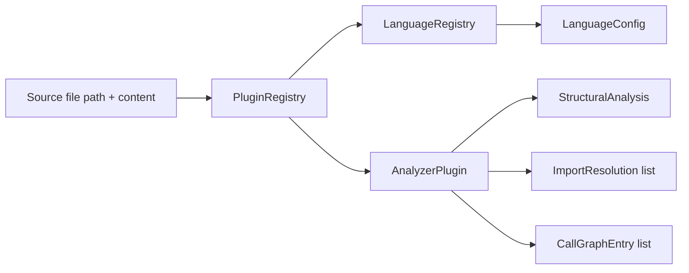
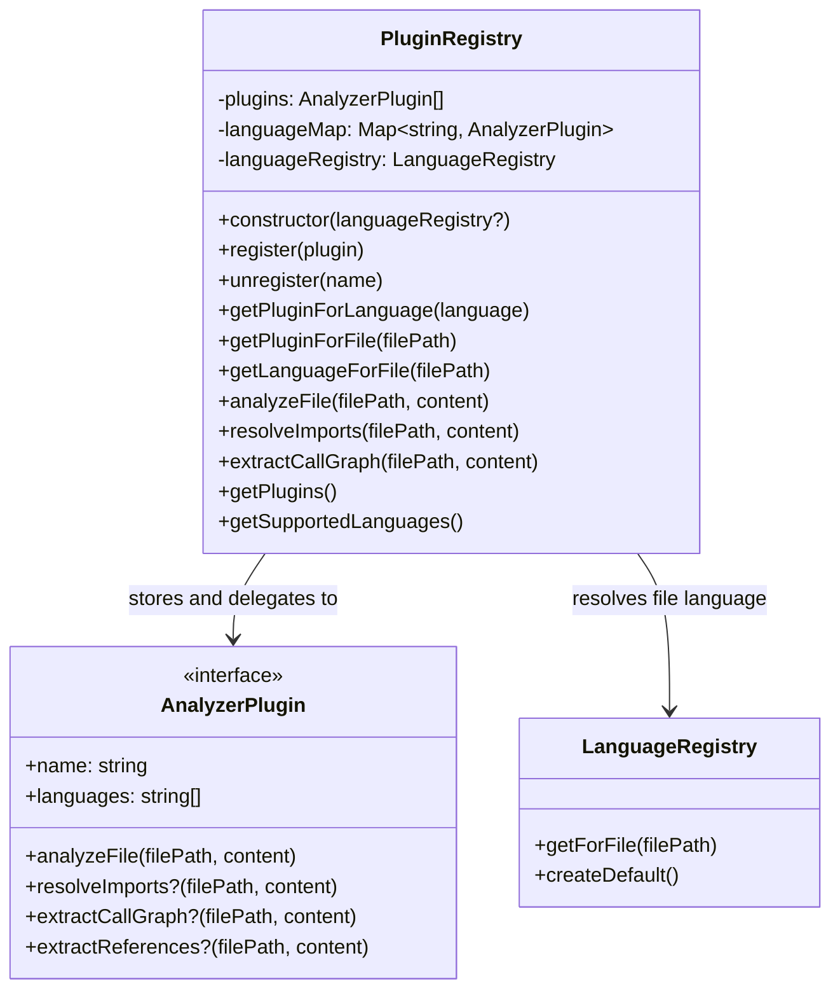
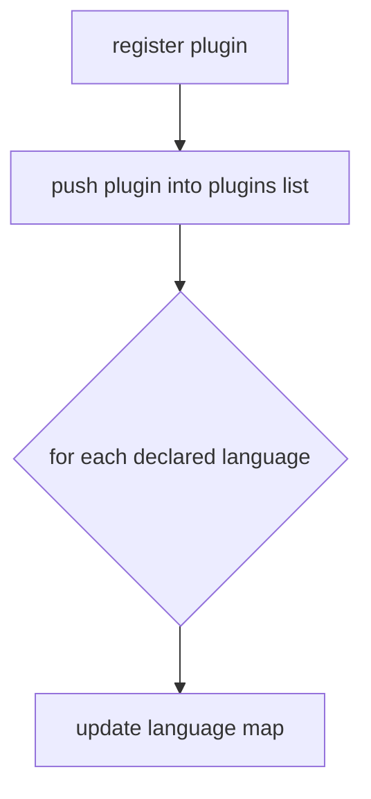
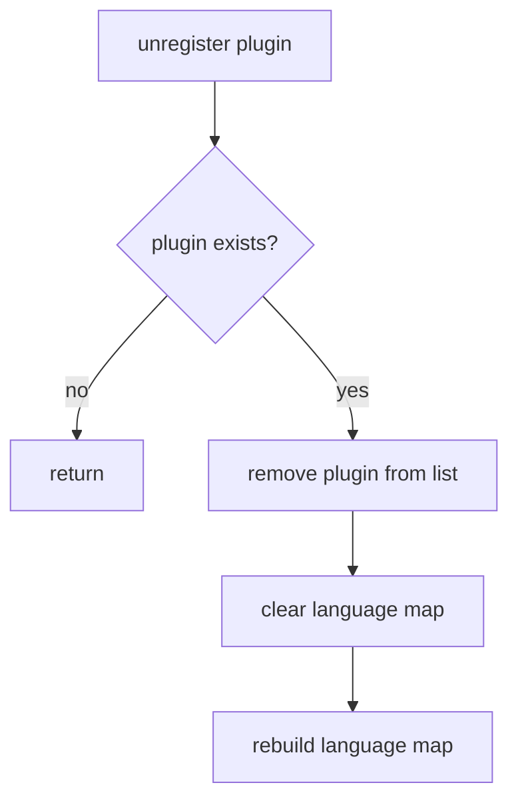
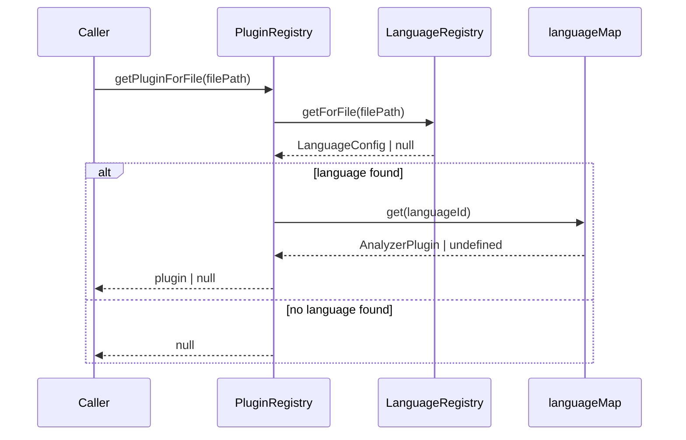
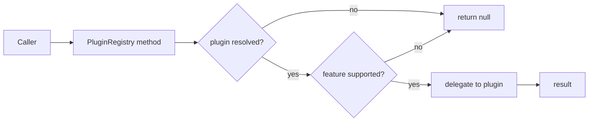
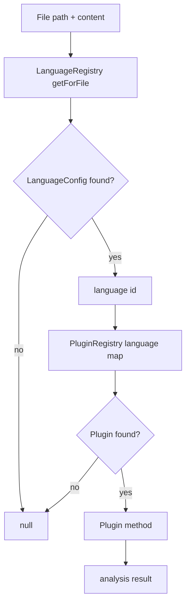
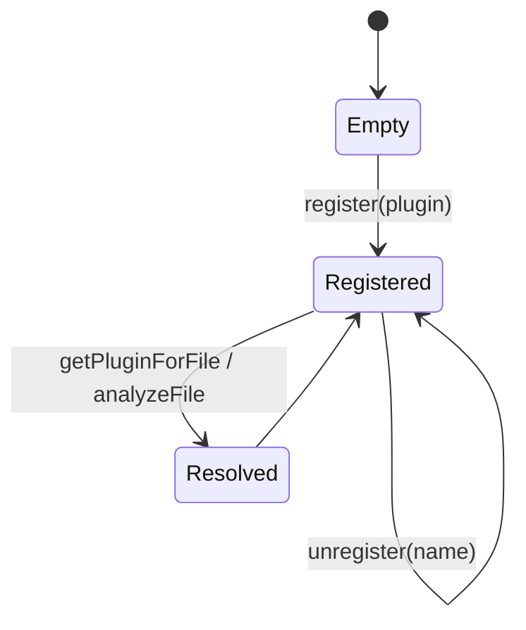

# Plugin Registry

The `plugin_registry` module provides the runtime coordination layer for analyzer plugins. It maps detected languages to concrete `AnalyzerPlugin` implementations, resolves the correct plugin for a file path, and exposes convenience methods for file analysis tasks such as structural analysis, import resolution, and call-graph extraction.

This module is intentionally small, but it sits at the center of the core plugin system: it bridges language detection, plugin registration, and analysis execution.

## Purpose

`PluginRegistry` is responsible for:

- registering and unregistering analyzer plugins
- mapping language identifiers to plugins
- resolving a plugin from a file path via the language registry
- delegating analysis operations to the selected plugin
- exposing the set of registered plugins and supported languages

It does **not** implement parsing or analysis logic itself. That work is delegated to plugins that conform to the shared `AnalyzerPlugin` contract.

## Related modules

- [shared_graph_and_analysis_types](shared_graph_and_analysis_types.md) — shared analysis and graph types, including `AnalyzerPlugin`
- [plugin_discovery](plugin_discovery.md) — plugin configuration and discovery inputs
- [core_language_support](core_language_support.md) — language detection and registry behavior used to resolve files to languages
- [tree_sitter_plugin](tree_sitter_plugin.md) — example plugin implementation pattern

## Architecture

### High-level role in the core plugin system



`PluginRegistry` uses `LanguageRegistry` to determine the language for a file, then selects the matching plugin from its internal language-to-plugin map.

### Internal component relationships



## Dependencies

### Direct dependencies

- `AnalyzerPlugin` from [shared_graph_and_analysis_types](shared_graph_and_analysis_types.md)
- `StructuralAnalysis`, `ImportResolution`, `CallGraphEntry` from [shared_graph_and_analysis_types](shared_graph_and_analysis_types.md)
- `LanguageRegistry` from [core_language_support](core_language_support.md)

### Dependency intent

- `AnalyzerPlugin` defines the contract that all plugins must satisfy.
- `LanguageRegistry` provides file-to-language resolution using extension and filename matching.
- The registry itself remains plugin-agnostic and does not depend on any specific language implementation.

## Core behavior

### 1. Registration

When a plugin is registered, it is appended to the internal plugin list and each language declared by the plugin is mapped to that plugin.



#### Notes

- If multiple plugins claim the same language, the most recently registered plugin wins for that language key.
- The registry does not validate conflicts or warn about overrides.

### 2. Unregistration

`unregister(name)` removes the first plugin with the matching name, then rebuilds the language map from the remaining plugins.



This rebuild ensures the language map stays consistent after removal, especially when multiple plugins may have been registered over time.

### 3. File-to-plugin resolution

`getPluginForFile(filePath)` delegates language detection to `LanguageRegistry.getForFile(filePath)` and then resolves the plugin by language id.



### 4. Delegated analysis operations

The registry exposes convenience methods that forward work to the resolved plugin:

- `analyzeFile(filePath, content)`
- `resolveImports(filePath, content)`
- `extractCallGraph(filePath, content)`

If no plugin is available, or if the plugin does not implement the optional capability, the method returns `null`.



## API reference

### `constructor(languageRegistry?: LanguageRegistry)`

Creates a registry instance.

- If a `LanguageRegistry` is provided, it will be used for file resolution.
- Otherwise, `LanguageRegistry.createDefault()` is used.

### `register(plugin: AnalyzerPlugin): void`

Registers a plugin and maps all of its declared languages to that plugin.

### `unregister(name: string): void`

Removes a plugin by name and rebuilds the language map.

### `getPluginForLanguage(language: string): AnalyzerPlugin | null`

Returns the plugin mapped to a language id, or `null` if none exists.

### `getPluginForFile(filePath: string): AnalyzerPlugin | null`

Resolves the file’s language using `LanguageRegistry`, then returns the matching plugin.

### `getLanguageForFile(filePath: string): string | null`

Returns the detected language id for a file path, or `null` if the file cannot be mapped.

### `analyzeFile(filePath: string, content: string): StructuralAnalysis | null`

Delegates structural analysis to the resolved plugin.

### `resolveImports(filePath: string, content: string): ImportResolution[] | null`

Delegates import resolution to the resolved plugin if supported.

### `extractCallGraph(filePath: string, content: string): CallGraphEntry[] | null`

Delegates call-graph extraction to the resolved plugin if supported.

### `getPlugins(): AnalyzerPlugin[]`

Returns a shallow copy of the registered plugin list.

### `getSupportedLanguages(): string[]`

Returns the list of language ids currently mapped to plugins.

## Data flow



## Interaction with the broader system

### With language support

`PluginRegistry` depends on `LanguageRegistry` rather than hardcoded extension checks. This keeps file resolution centralized and consistent with the rest of the language support layer.

### With plugin discovery

Discovery produces plugin configuration and entries, which can be used by higher-level bootstrapping code to instantiate and register plugins. `PluginRegistry` itself does not parse discovery configuration.

See [plugin_discovery](plugin_discovery.md) for the configuration model.

### With analyzer implementations

Concrete plugins such as `TreeSitterPlugin` implement `AnalyzerPlugin` and are registered here so the rest of the system can invoke them uniformly.

See [tree_sitter_plugin](tree_sitter_plugin.md).

## Design characteristics

### Strengths

- Simple and predictable plugin lookup
- Language resolution is centralized in `LanguageRegistry`
- Supports optional plugin capabilities without forcing all plugins to implement every method
- Returns copies for plugin and language lists to avoid external mutation

### Limitations

- No explicit conflict detection when multiple plugins support the same language
- No lifecycle hooks beyond register/unregister
- No built-in logging or diagnostics for missing plugins

## Example usage

```ts
const registry = new PluginRegistry();
registry.register(myTypeScriptPlugin);
registry.register(myPythonPlugin);

const analysis = registry.analyzeFile("src/app.ts", sourceText);
const imports = registry.resolveImports("src/app.ts", sourceText);
const calls = registry.extractCallGraph("src/app.ts", sourceText);
```

## Process summary



## See also

- [shared_graph_and_analysis_types](shared_graph_and_analysis_types.md)
- [core_language_support](core_language_support.md)
- [plugin_discovery](plugin_discovery.md)
- [tree_sitter_plugin](tree_sitter_plugin.md)
