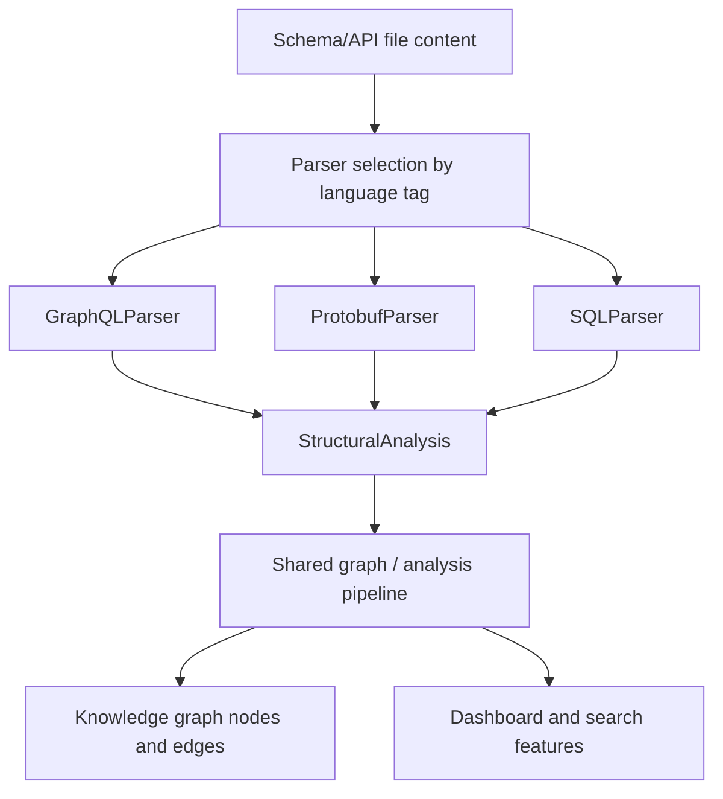
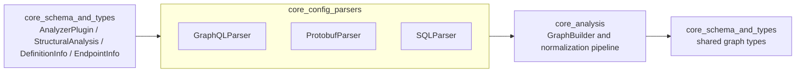
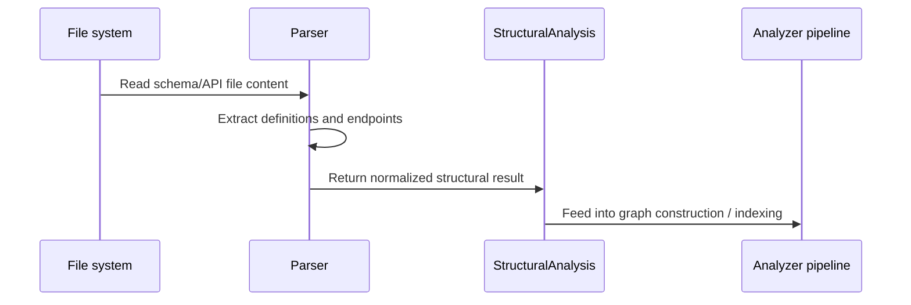
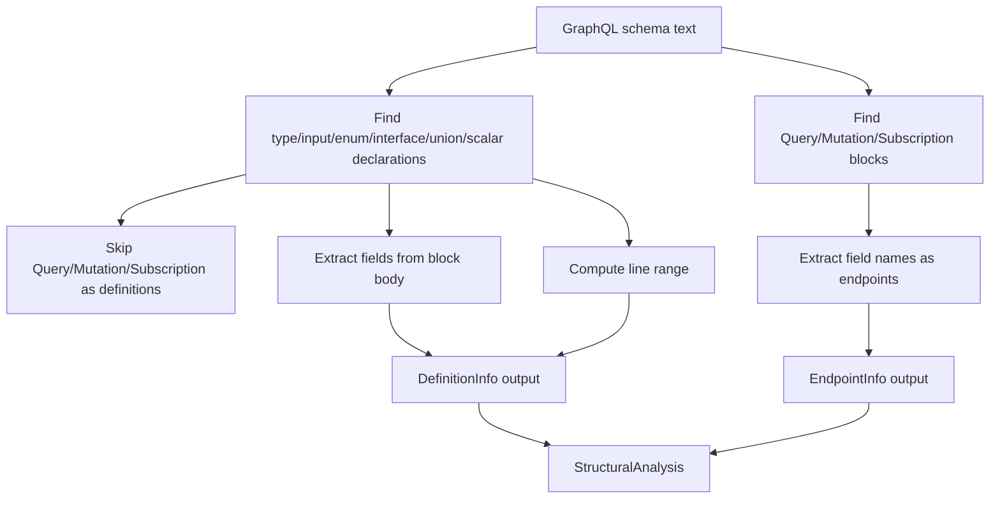
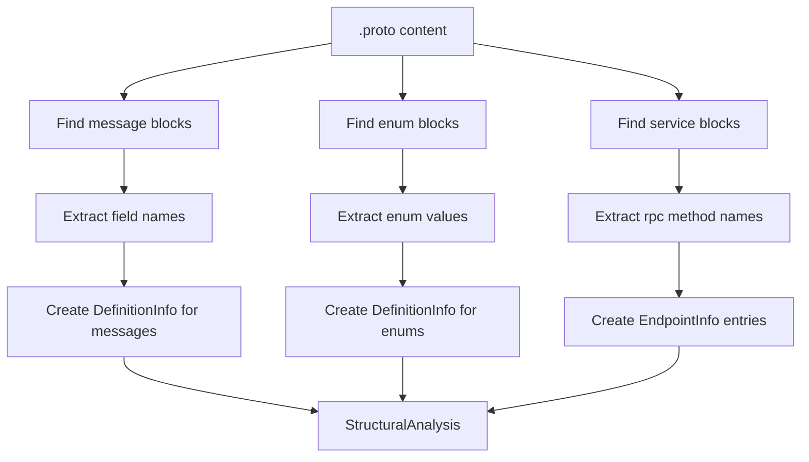
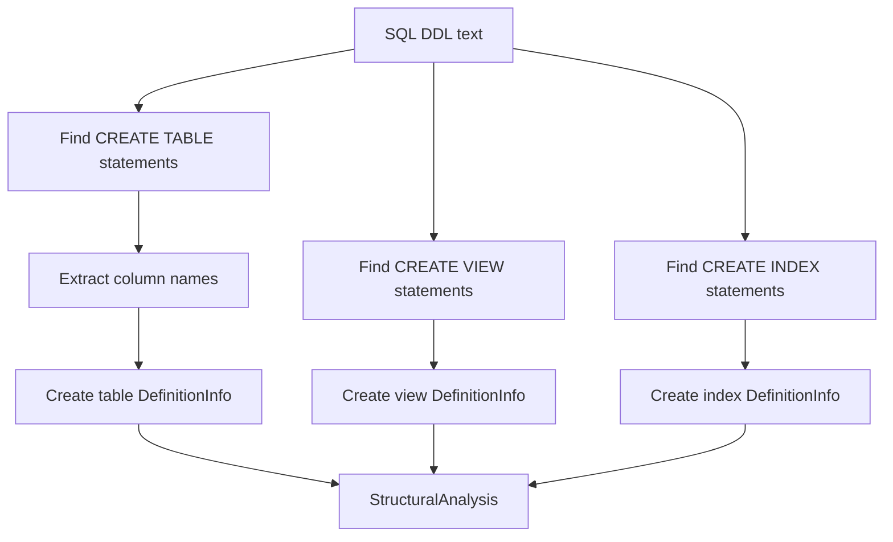
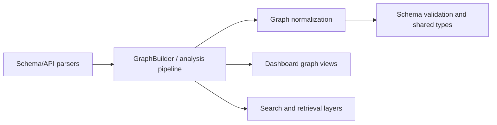

# Schema and API Parsers

This module contains lightweight structural parsers for schema-oriented and API-oriented file formats. It focuses on extracting definitions and callable endpoints from files that are not traditional source code, so the rest of the analysis pipeline can treat them similarly to code artifacts.

The parsers in this module are intentionally heuristic-based. They prioritize broad coverage and low implementation complexity over full language compliance.

## Purpose

The `schema_and_api_parsers` module converts schema files into the shared structural model used across the core analysis system:

- `StructuralAnalysis` for file-level results
- `DefinitionInfo` for named schema objects such as types, messages, tables, and indexes
- `EndpointInfo` for callable operations such as GraphQL fields and gRPC RPC methods

These parsers are used by the analyzer pipeline to enrich the knowledge graph with non-code structure that still behaves like an API contract or schema definition.

## Included parsers

| Parser | File types | Extracted structure |
| --- | --- | --- |
| `GraphQLParser` | `.graphql` | Types, inputs, enums, interfaces, unions, scalars, and root operation fields |
| `ProtobufParser` | `.proto` | Messages, enums, and service RPC methods |
| `SQLParser` | `.sql` | Tables, views, and indexes |

## Shared contract

All three parsers implement the shared `AnalyzerPlugin` interface from [`core_schema_and_types`](core_schema_and_types.md). Each parser exposes:

- `name`: unique plugin identifier
- `languages`: supported language or format tags
- `analyzeFile(filePath, content)`: returns a `StructuralAnalysis` object

The returned analysis follows the same shape as other structural analyzers in the system, which allows downstream components to consume schema artifacts without special-case handling.

## Architecture overview



## Module relationships



## Data flow



## Parser details

### GraphQLParser

`GraphQLParser` handles GraphQL schema files and extracts:

- `type`
- `input`
- `enum`
- `interface`
- `union`
- `scalar`

It also treats root operation types as endpoint containers:

- `Query`
- `Mutation`
- `Subscription`

Each field inside those root blocks becomes an `EndpointInfo` entry.

#### Behavior

- Skips root operation types when building `DefinitionInfo`
- Uses simple brace matching to determine block boundaries
- Extracts field names by line prefix matching
- Does not parse directives, fragments, or inline union members

#### GraphQL parsing flow



#### Example output shape

```ts
{
  functions: [],
  classes: [],
  imports: [],
  exports: [],
  definitions: [
    { name: "User", kind: "type", lineRange: [3, 12], fields: ["id", "name"] }
  ],
  endpoints: [
    { method: "Query", path: "user", lineRange: [15, 15] }
  ]
}
```

### ProtobufParser

`ProtobufParser` handles Protocol Buffer schema files and extracts:

- `message` definitions
- `enum` definitions
- `service` RPC methods as endpoints

#### Behavior

- Extracts message fields using a simplified field declaration regex
- Extracts enum values from the enum body
- Converts RPC methods into endpoint entries using `serviceName.methodName`
- Warns when braces are unbalanced
- Does not handle nested messages, `oneof`, or proto2 extensions

#### Protobuf parsing flow



#### Example output shape

```ts
{
  definitions: [
    { name: "User", kind: "message", lineRange: [2, 10], fields: ["id", "email"] },
    { name: "Status", kind: "enum", lineRange: [12, 18], fields: ["ACTIVE", "DISABLED"] }
  ],
  endpoints: [
    { method: "rpc", path: "UserService.GetUser", lineRange: [22, 22] }
  ]
}
```

### SQLParser

`SQLParser` handles SQL DDL-oriented files and extracts:

- `CREATE TABLE`
- `CREATE VIEW`
- `CREATE INDEX`

#### Behavior

- Supports `IF NOT EXISTS` for tables and indexes
- Supports `OR REPLACE` for views
- Extracts table columns from the parenthesized column list
- Skips constraint-like lines such as `PRIMARY KEY`, `FOREIGN KEY`, `CHECK`, and `CONSTRAINT`
- Does not handle stored procedures, triggers, or schema-qualified names

#### SQL parsing flow



#### Example output shape

```ts
{
  definitions: [
    { name: "users", kind: "table", lineRange: [1, 14], fields: ["id", "email"] },
    { name: "active_users", kind: "view", lineRange: [16, 16], fields: [] },
    { name: "idx_users_email", kind: "index", lineRange: [18, 18], fields: [] }
  ]
}
```

## Component interaction with the wider system



These parsers do not directly build graph edges or perform validation. Instead, they provide structured input that downstream modules can normalize, validate, and render.

## Dependencies

### Direct dependencies

- [`core_schema_and_types`](core_schema_and_types.md)
  - `AnalyzerPlugin`
  - `StructuralAnalysis`
  - `DefinitionInfo`
  - `EndpointInfo`

### Indirect dependencies

- [`core_analysis`](core_analysis.md) for graph construction and normalization
- [`dashboard_graph_view`](dashboard_graph_view.md) for visualization of derived structure
- [`core_search`](core_search.md) if extracted definitions are indexed for retrieval

## Design notes

### Why these parsers are heuristic-based

Schema and API formats often have rich syntax and nested constructs. These parsers intentionally use regex and simple brace scanning because they are:

- fast to execute
- easy to maintain
- sufficient for common project structures
- compatible with the shared structural analysis pipeline

### Trade-offs

The simplified approach means the parsers may miss or misinterpret:

- nested blocks
- multiline declarations with unusual formatting
- comments embedded in declaration bodies
- advanced language-specific features

This is acceptable for the module’s role as a broad structural extractor rather than a full compiler-grade parser.

## Extending the module

When adding a new schema/API parser:

1. Implement `AnalyzerPlugin`
2. Return a `StructuralAnalysis` object with the same top-level shape
3. Populate `definitions` and/or `endpoints` as appropriate
4. Keep parsing logic conservative and line-aware
5. Document unsupported syntax explicitly

## Related documentation

- [`core_schema_and_types`](core_schema_and_types.md)
- [`core_analysis`](core_analysis.md)
- [`core_config_parsers`](core_config_parsers.md)
