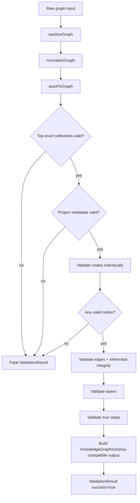
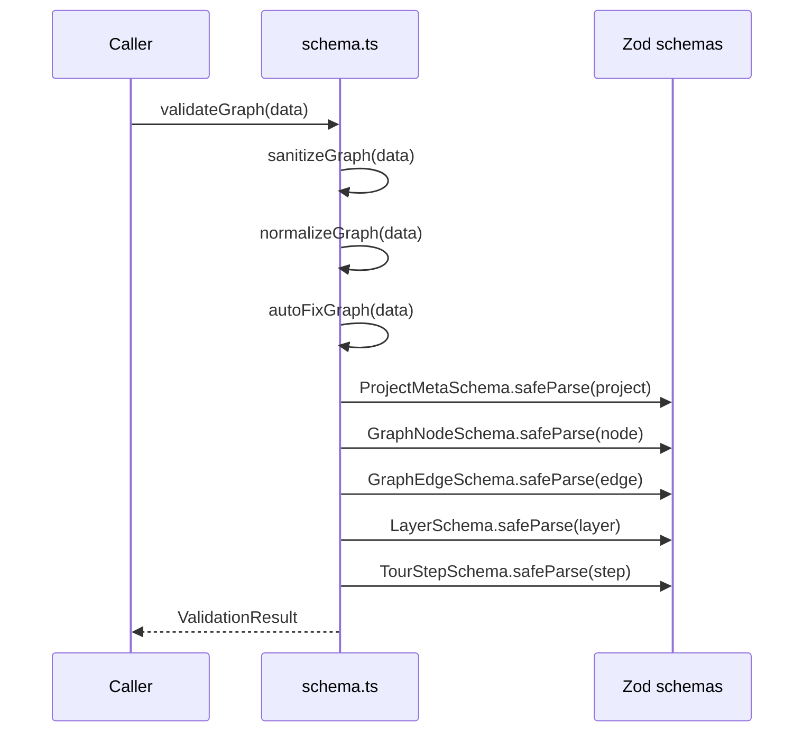
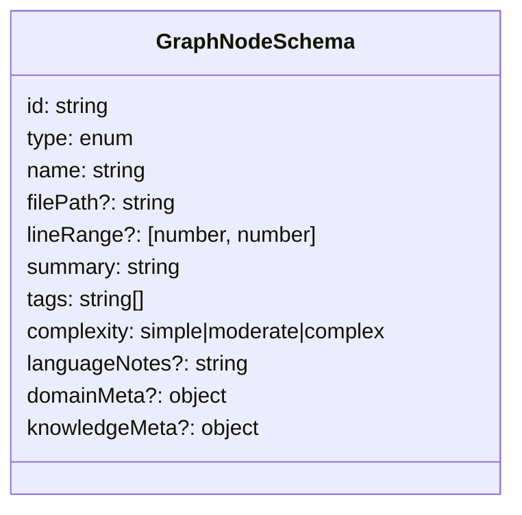
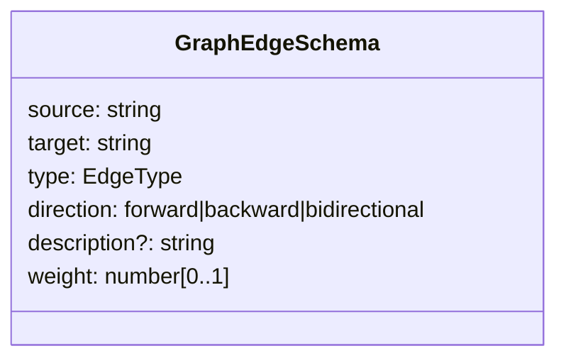
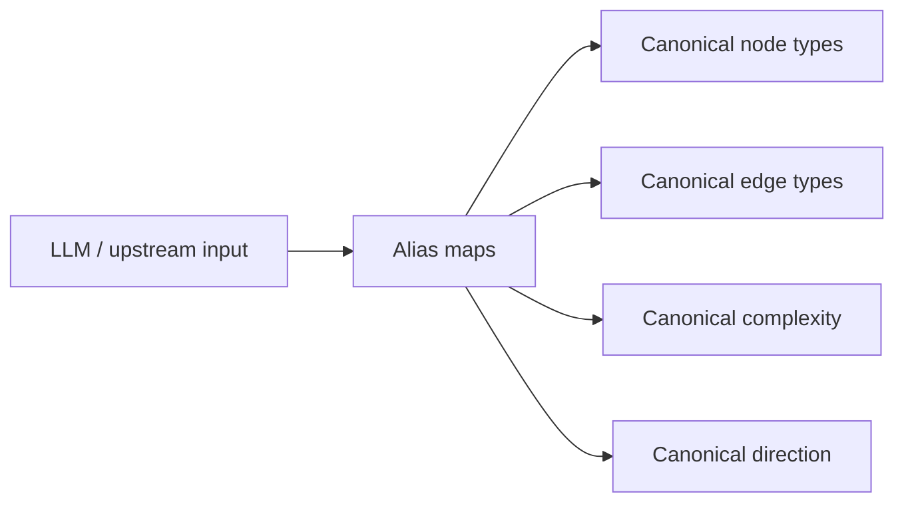
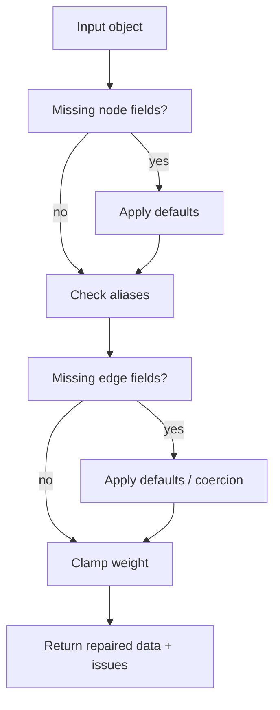
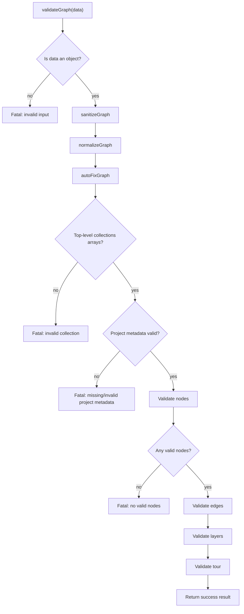
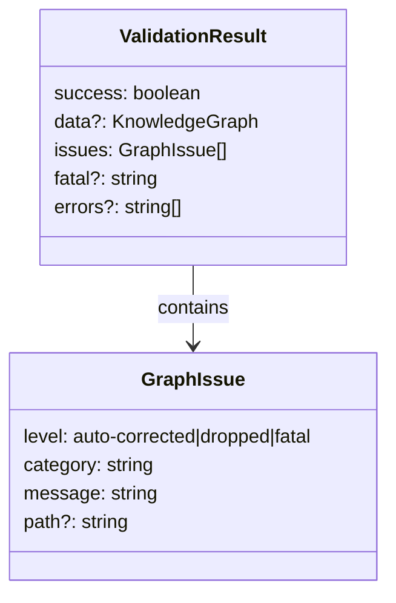
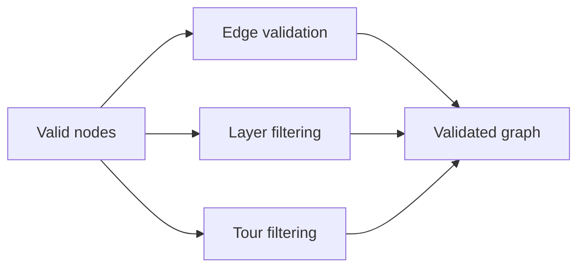
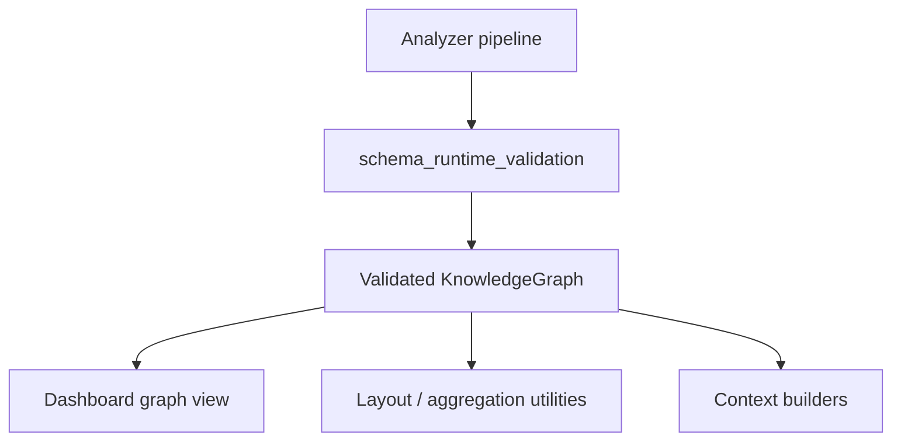

# schema_runtime_validation

This module defines the runtime schema and validation pipeline for knowledge graphs produced by the core analysis system. It is responsible for normalizing loosely structured input, auto-correcting common LLM-generated inconsistencies, validating graph entities and relationships, and returning a structured result that downstream consumers can safely use.

It sits at the boundary between graph generation and graph consumption. For the broader graph model, see [shared_graph_and_analysis_types.md](shared_graph_and_analysis_types.md). For analysis-specific graph construction and normalization behavior, see [analyzer_graph_builder.md](analyzer_graph_builder.md) and [analyzer_normalize_graph.md](analyzer_normalize_graph.md).

## Purpose

The module provides:

- A canonical Zod schema for knowledge graph data
- Alias normalization for node and edge types
- Sanitization of null/invalid optional fields
- Auto-fix logic for common missing or malformed values
- Tiered validation that distinguishes between fatal, dropped, and auto-corrected issues
- A structured validation result for callers that need both machine-readable data and diagnostics

## Core responsibilities

### 1. Canonical schema definition

The module defines the runtime schema for the graph payload:

- `GraphNodeSchema`
- `GraphEdgeSchema`
- `LayerSchema`
- `TourStepSchema`
- `ProjectMetaSchema`
- `KnowledgeGraphSchema`

These schemas enforce the shape of the final validated graph.

### 2. Input normalization and repair

Before validation, the module applies a pipeline of transformations:

1. `sanitizeGraph()` removes nulls from optional fields and lowercases enum-like values.
2. `normalizeGraph()` maps common aliases to canonical node and edge types.
3. `autoFixGraph()` fills in missing defaults, coerces types, and clamps invalid numeric ranges.

### 3. Tiered validation

Validation is intentionally tolerant where possible:

- **Fatal**: input is not an object, malformed top-level collections, missing project metadata, or no valid nodes remain
- **Dropped**: invalid nodes, edges, layers, or tour steps are removed
- **Auto-corrected**: missing fields, aliases, and coercible values are repaired

### 4. Referential integrity

Edges, layers, and tour steps are validated against the surviving node set. Dangling references are removed or filtered.

---

## Architecture



### Validation pipeline overview



---

## Data model

### Graph node schema

`GraphNodeSchema` represents a node in the knowledge graph.

Key fields:

- `id`: stable identifier
- `type`: canonical node type
- `name`: display name
- `filePath`: optional source file path
- `lineRange`: optional source span
- `summary`: human-readable description
- `tags`: classification tags
- `complexity`: `simple | moderate | complex`
- `languageNotes`: optional language-specific notes
- `domainMeta`: optional domain metadata
- `knowledgeMeta`: optional knowledge metadata



### Graph edge schema

`GraphEdgeSchema` represents a directed relationship between two nodes.

Key fields:

- `source`: source node id
- `target`: target node id
- `type`: canonical edge type
- `direction`: `forward | backward | bidirectional`
- `description`: optional explanation
- `weight`: normalized confidence/strength in `[0, 1]`



### Graph container schema

`KnowledgeGraphSchema` combines the full graph payload:

- `version`
- `kind` optional discriminator (`codebase` or `knowledge`)
- `project`
- `nodes`
- `edges`
- `layers`
- `tour`

---

## Alias normalization

The module includes alias maps to reduce friction when upstream generators emit non-canonical labels.

### Node type aliases

Examples:

- `func`, `fn`, `method` → `function`
- `interface`, `struct` → `class`
- `doc`, `readme`, `docs` → `document`
- `route`, `api`, `query`, `mutation` → `endpoint`
- `business_domain` → `domain`
- `note`, `page`, `wiki_page` → `article`

### Edge type aliases

Examples:

- `extends` → `inherits`
- `invokes`, `invoke` → `calls`
- `uses`, `requires` → `depends_on`
- `describes`, `documented_by` → `documents`
- `references` → `cites`
- `written_by`, `created_by` → `authored_by`

### Other aliases

- Complexity: `low` → `simple`, `medium` → `moderate`, `high` → `complex`
- Direction: `to` → `forward`, `from` → `backward`, `both` → `bidirectional`



---

## Sanitization and auto-fix behavior

### `sanitizeGraph(data)`

This function performs non-destructive cleanup:

- Converts `tour` and `layers` from `null`/`undefined` to empty arrays
- Removes `null` from optional node fields like `filePath`, `lineRange`, `languageNotes`
- Lowercases node `type` and `complexity`
- Removes `null` edge descriptions
- Lowercases edge `type` and `direction`
- Removes `null` `languageLesson` from tour steps

### `autoFixGraph(data)`

This function repairs common issues and returns both the repaired data and a list of `GraphIssue` entries.

Auto-fixes include:

- Default node `type` to `file`
- Default node `complexity` to `moderate`
- Default node `tags` to `[]`
- Default node `summary` to `name` or `"No summary"`
- Default edge `type` to `depends_on`
- Default edge `direction` to `forward`
- Default edge `weight` to `0.5`
- Coerce string weights to numbers when possible
- Clamp weights to `[0, 1]`
- Map complexity and direction aliases to canonical values



---

## Validation flow

`validateGraph(data)` is the public entry point.

### Step-by-step behavior

1. Reject non-object input immediately.
2. Sanitize the raw object.
3. Normalize node and edge type aliases.
4. Auto-fix missing fields and coercible values.
5. Reject malformed top-level collections if present and not arrays.
6. Validate project metadata.
7. Validate nodes individually and drop invalid ones.
8. Require at least one valid node.
9. Validate edges and enforce node reference integrity.
10. Validate layers and tour steps, dropping invalid entries and filtering dangling node ids.
11. Return a `ValidationResult` with the final graph and accumulated issues.



---

## Issue model

### `GraphIssue`

`GraphIssue` captures validation diagnostics.

Fields:

- `level`: `auto-corrected | dropped | fatal`
- `category`: machine-readable issue category
- `message`: human-readable explanation
- `path`: optional JSON-like path to the affected field

Common categories include:

- `missing-field`
- `alias`
- `type-coercion`
- `out-of-range`
- `invalid-node`
- `invalid-edge`
- `invalid-layer`
- `invalid-tour-step`
- `invalid-reference`
- `invalid-collection`

### `ValidationResult`

`ValidationResult` is the output of `validateGraph()`.

Fields:

- `success`: whether validation produced a usable graph
- `data`: validated graph when successful
- `issues`: all warnings, corrections, and dropped-item diagnostics
- `fatal`: fatal error message when validation fails
- `errors`: deprecated string list retained for compatibility



---

## Referential integrity rules

The validator enforces consistency after node validation:

- Edges must reference existing node ids in both `source` and `target`
- Layer `nodeIds` are filtered to surviving nodes
- Tour step `nodeIds` are filtered to surviving nodes

This means downstream consumers never need to handle dangling references in a successful result.



---

## Integration with the wider system

This module is the final runtime gate for graph data produced by analysis and enrichment pipelines.

### Upstream producers

- [analyzer_graph_builder.md](analyzer_graph_builder.md): constructs graph-shaped analysis output
- [analyzer_normalize_graph.md](analyzer_normalize_graph.md): performs graph normalization earlier in the pipeline
- [analyzer_llm_analyzer.md](analyzer_llm_analyzer.md): may emit graph-like summaries that need schema enforcement
- [analyzer_layer_detector.md](analyzer_layer_detector.md): contributes layer-related structure
- [analyzer_language_lesson.md](analyzer_language_lesson.md): contributes tour/language lesson content

### Downstream consumers

- [dashboard_graph_view.md](dashboard_graph_view.md): renders validated graph structures
- [dashboard_layout_utils.md](dashboard_layout_utils.md): expects stable node/edge/layer data for layout and aggregation
- [app_context_builders.md](app_context_builders.md): may embed validated graph data into prompts or explanations



---

## Design notes

### Why validation is tolerant

The module is designed for real-world generated data, especially from LLM-assisted workflows. Instead of failing on every inconsistency, it:

- repairs common mistakes automatically
- drops only irrecoverable items
- preserves as much useful structure as possible

### Why aliases are centralized

Centralizing aliases in this module ensures that all callers share the same canonical vocabulary. This reduces drift between analysis, storage, and UI layers.

### Why `errors` is deprecated

`errors` is retained for compatibility with older callers, but `issues` and `fatal` provide richer diagnostics and should be preferred.

---

## Practical usage

```ts
import { validateGraph } from "./schema";

const result = validateGraph(rawGraph);

if (!result.success) {
  console.error(result.fatal);
  console.table(result.issues);
} else {
  renderGraph(result.data);
}
```

### Recommended handling pattern

- Treat `success === false` as non-renderable output
- Inspect `issues` even on success to surface warnings or corrections
- Use `fatal` for user-facing failure messages
- Avoid relying on deprecated `errors`

---

## Related modules

- [shared_graph_and_analysis_types.md](shared_graph_and_analysis_types.md)
- [analyzer_graph_builder.md](analyzer_graph_builder.md)
- [analyzer_normalize_graph.md](analyzer_normalize_graph.md)
- [analyzer_llm_analyzer.md](analyzer_llm_analyzer.md)
- [dashboard_graph_view.md](dashboard_graph_view.md)
- [dashboard_layout_utils.md](dashboard_layout_utils.md)
